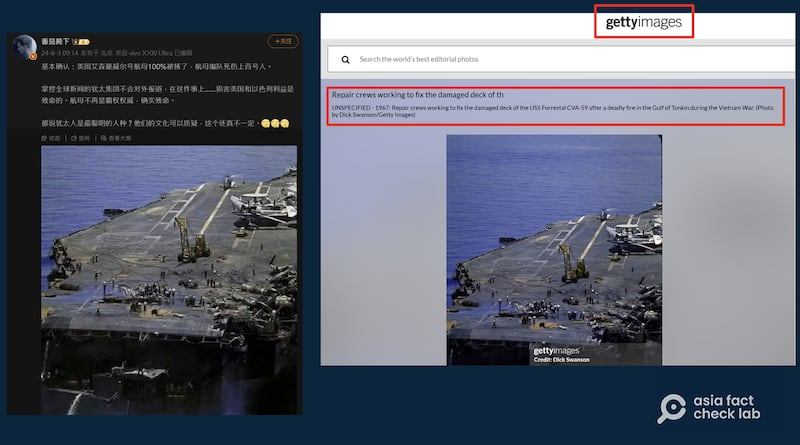
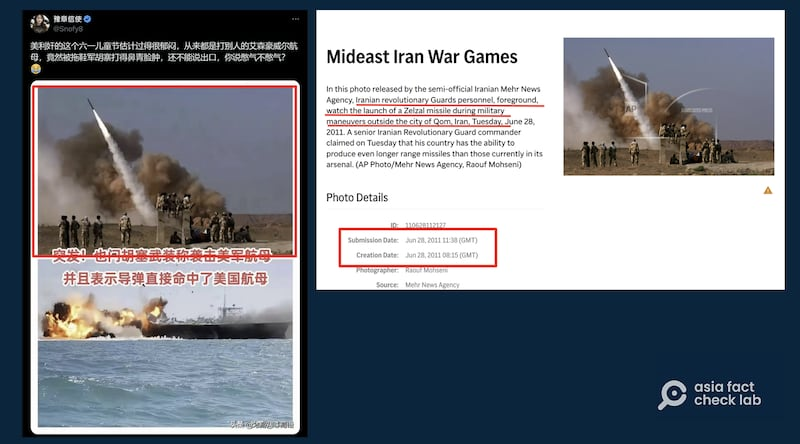
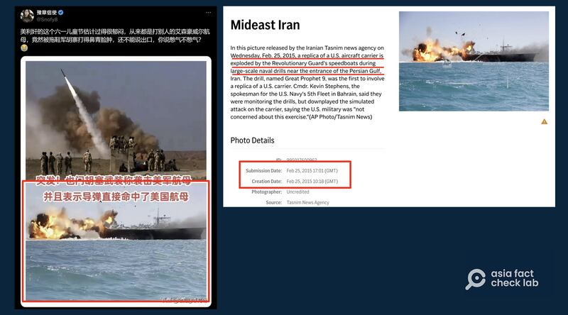
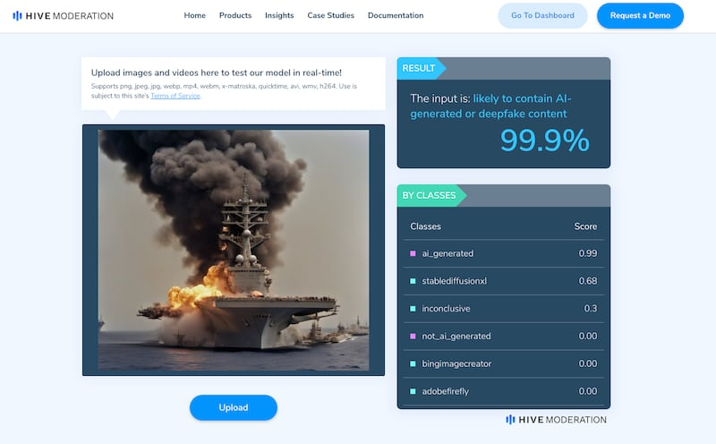
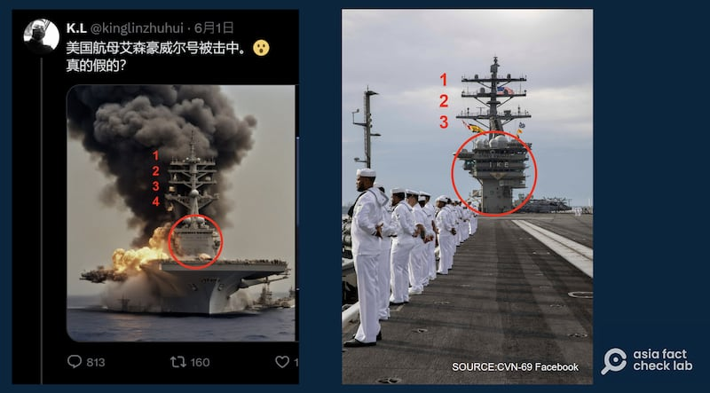
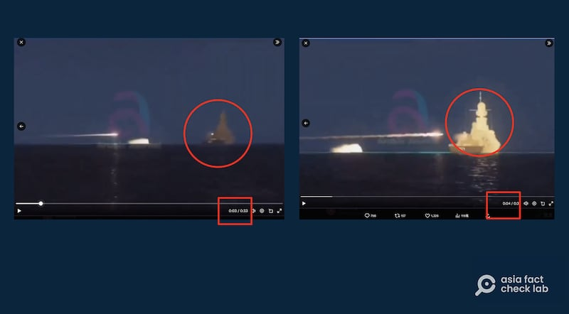

# 事實查覈｜胡塞武裝擊沉美國艾森豪威爾航母？這些影像移花接木

作者：董喆

2024.06.13 15:38 EDT

中國社羣平臺上近期流傳大量胡塞武裝在紅海的軍事行動影像。日前,亞洲事實查覈實驗室已經對美國梅森號被"擊沉"的信息進行了闢謠( [查覈報告](2024-05-29_事實查覈｜網傳視頻顯示胡塞武裝擊沉美軍梅森號驅逐艦？.md)),接著,又有大量艾森豪威爾號航母"遇襲"的信息在各社媒平臺傳播,亞洲事實查覈實驗室對其中影響較廣的照片與視頻進行了查覈。

## 1. 艾森豪威爾航空母艦船尾被炸開花?

查覈結果：錯誤

中國社羣平臺 [搜狐](https://m.sohu.com/a/783189086_121083281/?pvid=000115_3w_a&scm=10001.1140_13-103000-0_8000.0-0.10095.0_1275)、微博以及 [X](https://x.com/Snofy8/status/1797217039049973906)(原推特)上流傳一張受損的航空母艦被維修的照片,多個賬號宣稱這是"艾森豪威爾航空母艦船尾被炸開花",擁有超過95萬粉絲的微博"大V""番茄殿下"更以此 [下定論](https://archive.ph/LvMsy):"基本確認:美國艾森豪威爾號航母100%被揍了,航母編隊死傷上百號人。"

亞洲事實查覈實驗室以圖反搜,在蓋帝圖像有限公司(Getty Images)的圖庫中找到了這張照片的 [詳細資訊](https://www.gettyimages.ca/detail/news-photo/repair-crews-working-to-fix-the-damaged-deck-of-the-uss-news-photo/53369847?adppopup=true)。

網傳航母“被炸開花”照片與原始圖片對比 圖截取自微博、Getty Images圖庫

此張照片是攝影師Dick Swanson於1967年拍攝，背景爲越戰期間，維修人員正在修復美國海軍福萊斯特號航空母艦（USS Forrestal CVA-59）。該艘航母1967年在東京灣準備執行任務時，甲板突然發生爆炸起火，造成137人死亡。

因此，此張照片中的是福萊斯特號航空母艦，而不是艾森豪威爾航空母艦。

## 2. 胡塞武裝看着導彈發射,命中艾森豪威爾航母?

查覈結果：錯誤

X賬號“豫章信使”發佈了一張照片，上圖爲一羣士兵望著飛彈發射，下圖則是一艘船艦遭到襲擊，此賬號稱“艾森豪威爾航母被拖鞋軍打得鼻青臉腫”。

亞洲事實查覈實驗室分別反搜兩張照片，確定兩張照片都與艾森豪威爾航母無關，望着飛彈發射的軍隊也不是胡塞武裝。

首先,"飛彈發射"圖出 [自美聯社圖庫](https://newsroom.ap.org/detail/c8da61796728446b8281d28ebc326d42?ext=true),根據圖片資訊,這張照片由伊朗梅赫爾通訊社(Mehr News Agency)發佈,由攝影師Raouf Mohseni拍攝。照片背景爲2011年6月28日伊朗庫姆市(Qom)外的軍事演習,伊朗革命衛隊人員正在觀看Zelzal導彈發射。

“胡塞武裝看導彈發射”圖實爲伊朗革命衛隊軍事演習照片 圖截取自X、AP圖庫

下圖同樣也出自 [美聯社圖庫](https://newsroom.ap.org/detail/MideastIran/88259d7753314dada0b0d3fc111ad4a3/photo?Query=Iran&mediaType=photo&sortBy=&dateRange=&totalCount=40&currentItemNo=21),此照片由伊朗塔斯尼姆通訊社(Tasnim News)發佈,照片背景爲伊朗革命衛隊在波斯灣進行大規模海軍演習。他們複製了一艘美國航母仿艦並命名爲偉大先知9號(Great Prophet 9),照片即是他們正在摧毀這艘仿艦。

“航母被炸”圖片實爲伊朗軍隊演習中仿艦被炸 圖截取自X、AP圖庫

因此，網傳的艾森豪威爾航母遭摧毀照片爲假，實際上是伊朗革命衛隊在不同年份的軍演照片。

## 3. 艾森豪威爾航母竄出熊熊烈焰?遭擊中畫面曝光?

查覈結果：錯誤

X賬號"K.L"自稱"福清哥",他被中國外交官薛劍、以親中聞名的紐西蘭籍博主安柏然(Andy Boreham)等人關注。"福清哥"6月1日貼出一張 [船艦冒火的照片](https://twitter.com/kinglinzhuhui/status/1796804339878810097)以及飛彈集中船隻的視頻,提問"美國航母艾森豪威爾號被擊中,真的假的?"並在留言處自問自答稱"真實性有9成",此貼文有破百萬次瀏覽。微博上亦有同樣的 [視頻](https://weibo.com/7409682267/5040390566839841)流傳,稱是艾森豪威爾航母遭擊中的現場畫面。

針對船艦冒火的影片，亞洲事實查覈實驗室使用開源AI偵測工具The Hive檢測，即果爲99.9%爲AI生成。

“福清哥”發佈的“森豪威爾號被擊中”照片被鑑定爲“99.9%”由AI生成 圖截取自The Hive界面

同時，我們以艾森豪威爾航母的照片進行比對，船桅處有多處不相符之處。包含船桅橫杆數目不一致、艦島的結構及所處的位置更是完全不相符。

網傳疑似AI生成圖片與艾森豪威爾號照片對比 圖截取自X、艾森豪威爾號臉書官號

另外,針對微博上流傳的影片,亞洲事實查覈實驗室以影片截圖反搜,發現5個月前在美國社羣平臺Reddit就有軍事模擬遊戲Arma3玩家 [發現](https://www.reddit.com/r/GetNoted/comments/19680cn/arma_3_keeps_on_fooling_people/)遊戲影片被作爲戰爭實況,因此由時間序可以判斷,這支影片與胡塞武裝宣稱襲擊艾森豪航母並無關聯。

網傳“艾森豪威爾”號被擊中視頻截圖 圖截取自新浪微博

同時仔細檢視影片細節，可以發現飛彈在0003秒到0004間擊中船隻，但同時船隻的船桅突然增長，並不合理，是遊戲畫面的可能性極高。亞洲事實查覈實驗室去信Arma3母公司Bohemia Interactive Studio請求協助判斷，至截稿前未獲回應。

## 4. 艾森豪威爾號航母實際情況怎樣?

紅海衝突以來,胡塞武裝多次宣稱擊中美國航母,但皆未能出具文字敘述以外的證據,這使得中國社羣平臺網民以各種舊照片、過往新聞影像移花接木,藉此傳播疑美論述,亞洲事實查覈實驗室先前也發佈 [梅森號驅逐艦遭擊沉](2024-05-29_事實查覈｜網傳視頻顯示胡塞武裝擊沉美軍梅森號驅逐艦？.md)以及 [商船遭炸燬](https://www.rfa.org/cantonese/news/factcheck/isreal-12272023144337.html)的查覈報告。

此次事件起因是胡塞武裝發言人於5月31日宣稱，基於英美於30日對葉門沙那地區發動空襲造成死傷，因此胡塞武裝對紅海的艾森豪航母發射多枚導彈，準確擊中目標。不過各大國際通訊社、媒體皆未出現行動的影像，也未有任何資訊透露航母受損情形。

美軍中央司令部5月31日的 [新聞稿](https://www.centcom.mil/MEDIA/PRESS-RELEASES/Press-Release-View/Article/3793906/june-1-red-sea-update/)指出,當天胡塞武裝共計向紅海發射了一套無人機(UAS)以及兩枚反艦彈道導彈 (ASBM),美軍、聯軍及商船都沒有傷亡及損害。同日,中央司令部部隊摧毀了亞丁灣上空的一架無人機和紅海上空的三架無人機。

美國海軍發言人告訴亞洲事實查覈實驗室，胡塞武裝的虛假聲稱並不屬實，艾森豪航母打擊羣依然在其駐地執行任務，包括保護航行自由以及保障美國第五艦隊作戰區內海上航運，同時與該區域的盟友一起行動。

*亞洲事實查覈實驗室（Asia Fact Check Lab）針對當今複雜媒體環境以及新興傳播生態而成立。我們本於新聞專業主義，提供專業查覈報告及與信息環境相關的傳播觀察、深度報道，幫助讀者對公共議題獲得多元而全面的認識。讀者若對任何媒體及社交軟件傳播的信息有疑問，歡迎以電郵afcl@rfa.org寄給亞洲事實查覈實驗室，由我們爲您查證覈實。*

*亞洲事實查覈實驗室在X、臉書、IG開張了,歡迎讀者追蹤、分享、轉發。X這邊請進:中文*  [*@asiafactcheckcn*](https://twitter.com/asiafactcheckcn)  *;英文:*  [*@AFCL\_eng*](https://twitter.com/AFCL_eng)  *、*  [*FB在這裏*](https://www.facebook.com/asiafactchecklabcn)  *、*  [*IG也別忘了*](https://www.instagram.com/asiafactchecklab/)  *。*

[Original Source](https://www.rfa.org/mandarin/shishi-hecha/hc-06132024153819.html)