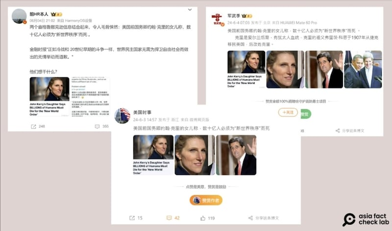

# 事實查覈｜世衛特使說"數十億人必須爲'新世界秩序'而死"?

作者：艾倫

2024.06.14 14:41 EDT

## 查覈結果：缺乏證據

**一分鐘完讀**:

近日，微博出現傳言，稱世界衛生組織特使凡妮莎·克里（Vanessa Kerry）語出驚人，說世上"數十億人必須爲'新世界秩序'而死"，微博留言中不少網民評論克里"太邪惡"、"不知道已經害死了多少人"。

經查，並沒有證據表明凡妮莎·克里曾說過這樣的話。中文社交媒體上的相關消息源自多次發佈假新聞的英文網站“The People's Voice”，該消息原始版本中所指的克里發言視頻中，也並沒有提到所謂“新世界秩序”或是“數十億人死亡”，而是她對氣候變化相關風險的評論。這條不實信息的英文版本近日也在多個英文社媒平臺流傳，並已被闢謠。

**深度分析**:

近日，微博粉絲超百萬的認證博主“前HR本人”、“軍武季”等發帖，稱世界衛生組織氣候變化與健康問題特使凡妮莎·克里曾發表驚人言論，稱“數十億人必須爲‘新世界秩序’而死”。該傳言還特別指出，凡妮莎·克里是美國前國務卿約翰·克里（John Kerry）的女兒。

多個微博帳號近期發佈消息，稱凡妮莎克里曾說數十億的人必須爲“新世界秩序而死”。（微博截圖）

以傳言文章所附截圖上的X帳號反搜，會發現該傳言最早來自X帳號“TVP Sean”，該帳號自稱是網站“The People's Voice”的主持人。

"The People's Voice網站"曾因發佈未經查證的陰謀論者及假新聞被主流媒體多次揭露。根據專注假信息研究的美國波因特研究所(Poynter Institute) [報告](https://www.poynter.org/fact-checking/2018/fact-checkers-have-debunked-this-fake-news-site-80-times-its-still-publishing-on-facebook/),2017至2018年間,國際事實查覈網站及主流媒體針對The People's Voice(前身爲Your News Wire)闢謠共超過八十次。這次的"數十億人必須爲'新世界秩序'而死"的傳聞又是來自該網站。

## 沒有證據表明凡妮莎·克里做出"發言"

“The People's Voice”於2024年4月發表文字報道及影音，題爲“John Kerry's Daughter Says BILLIONS of Humans Must Die for the 'New World Order'”，內容引用克里在第28屆聯合國氣候變化大會（COP28）上的談話，稱她在演說中提到， “數十億的人類必須爲新世界而死”。

查閱凡妮莎·克里的 [原談話視頻](https://www.youtube.com/watch?v=9csC1S9o81E),她的原話是:"全世界有33億人都是氣候變化影響下的脆弱羣體"(already up to 3.3 billion people in our world are highly vulnerable to the effects of climate change),沒有提到"死亡"二字,也沒提到"新世界秩序"。

"新世界秩序"(New World Order)是持續數十年的一項討論極權主義世界政府的 [陰謀論](https://www.isdglobal.org/explainers/new-world-order-explainer/),該陰謀論認爲,世上有少數權力菁英階級組成的祕密集團、影子政府與其密謀的全球主義議程在幕後操控世界,其最終目的是建立一個威權主義的世界政府統治世界。但至今並未有證據支持該"秩序"的真實存在。

上述關於凡妮莎·克里傳言的英文版本近日也同時在流傳,6月14日,路透社事實查覈部門 [發佈報告](https://www.reuters.com/fact-check/vanessa-kerry-did-not-say-billions-must-die-new-world-order-2024-06-14/),引用接近克里的信源稱,她並未說過這樣的話。

## 氣候變化多次成假信息目標

“The People's Voice”網站發表氣候變化相關謠言已不是第一次。

2023年,該網站就曾傳播關於美國前國務卿、前美國總統氣候特使約翰·克里的假消息。該傳言稱,約翰·克里說"數十億的人類必須犧牲來拯救地球",並引用當年蘇格蘭全球對話(Scottish Global Dialogue Conference)上約翰·克里的發言,但馬上被路透社 [闢謠](https://www.reuters.com/fact-check/john-kerry-quote-sacrificing-billions-people-save-earth-is-false-2023-10-31/)。造謠手法和本次針對凡妮莎·克里如出一轍。

*亞洲事實查覈實驗室（Asia Fact Check Lab）針對當今複雜媒體環境以及新興傳播生態而成立。我們本於新聞專業主義，提供專業查覈報告及與信息環境相關的傳播觀察、深度報道，幫助讀者對公共議題獲得多元而全面的認識。讀者若對任何媒體及社交軟件傳播的信息有疑問，歡迎以電郵afcl@rfa.org寄給亞洲事實查覈實驗室，由我們爲您查證覈實。*

*亞洲事實查覈實驗室在X、臉書、IG開張了，歡迎讀者追蹤、分享、轉發。X這邊請進：中文@asiafactcheckcn；英文：@AFCL\_eng、FB在這裏、IG也別忘了。*

[Original Source](https://www.rfa.org/mandarin/shishi-hecha/hc-06142024144029.html)