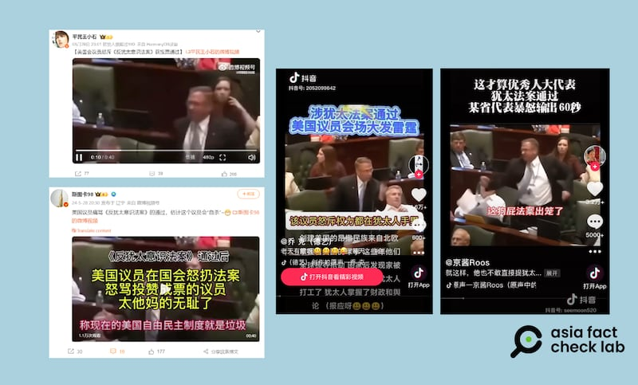

# 事實查覈｜美衆議員爆粗口、罵涉猶法案可恥？

作者：鄭崇生

2024.06.15 16:34 EDT

## 查覈結果：錯誤

## 一分鐘完讀：

美國聯邦衆議院5月1日通過 [《反猶太主義意識法案》](https://www.congress.gov/bill/118th-congress/house-bill/6090)( Antisemitism Awareness Act of 2023),引發中國媒體與網民在多個社交媒體熱議,各類謠言與虛假信息也陸續出現。6月8日,中國外交官張和清在其 [X賬號](http://archive.today/KCiqV)發佈了一段視頻,內容爲一位政治人物暴怒吼叫的場景,視頻並以中文標註"猶太法案出於美國多麼恥辱太狗血"。

亞洲事實查覈實驗室查覈發現，該影片是10多年前的舊視頻，是時任伊利諾州地方衆議員的邁克·博斯特（Mike Bost）批評退休金改革方案的場景，和這次聯邦衆院通過《反猶太主義意識法案》無關，是“移花接木”的虛假信息。

## 深度分析：

在張和清之前，上述同一段視頻已在X一些中文賬號、抖音與微博上流傳。視頻中一名男子使用粗魯語言批評“通過該死的法案很可恥”，還怒扔文件。多名中國網絡大V聲稱，連美國國會議員也看不下去美國政府偏袒猶太人與以色列。

【圖1】中國外交官張和清和一些中文X賬號傳播視頻，稱這是美國議員“大罵”衆議院最近通過的反猶太主義意識法案。（X截圖）

在X上，最早由賬號“東風起兮百花殘”發佈上述視頻，隨後有“圖爾蓀艾利”及“實事求是永立不敗之地”等賬號轉發後，至發稿時點閱率超過10萬人次。

中國社交媒體平臺抖音與微博隨後也開始傳播這段視頻。擁有數百萬粉絲的微博賬號" [斯圖卡98](https://archive.ph/OxstJ)"和" [平民王小石](https://archive.ph/lrftl)"聲稱這是美國國會議員怒斥涉猶法案獲投票通過,"斯圖卡98"更戲謔"估計這個議員會自殺",在抖音平臺上,這段視頻獲得數萬次點贊。

【圖2】在中國社交媒體上，類似“美議員痛罵涉猶法案”的視頻獲得微博大V轉發，在抖音上也廣受追捧。（圖/微博、抖音截圖）

亞洲事實查覈實驗室以截圖反搜發現,這是不實信息。該段視頻拍攝於2012年的伊利諾伊州衆議院,其中人物是該州地方議員的博斯特,在地方議會怒斥 [州政府提出的退休金改革法案](https://www.cbsnews.com/chicago/news/downstate-lawmaker-screams-throws-papers-over-pension-reform-bill/)的場景。然而,中國外交官及網民們卻將博斯特的發言剪輯、翻譯是美國國會衆議員批評《反猶太意識法案》。

進一步比對當時美國有線電視新聞網(CNN)的 [報道](https://youtu.be/AjCJvCy0oUk?si=0g9xMPt4-FDKsj_G),網傳視頻中的綠色椅子及其他人物動作特徵,和伊利諾伊州衆議院10多年前討論退休金改革方案的畫面相同。

【圖3】對比2012年的新聞視頻（上）和網傳視頻（下），人物動作特徵和場景細節基本一致。（CNN截圖、X截圖）

視頻中的博斯特從2015年開始擔任聯邦衆議員至今。他在最近的衆議院討論中到底有沒有“痛罵”涉猶法案呢？

亞洲事實查覈實驗室進一步查詢《反猶太意識法案》在聯邦衆院的審議情況,根據C-SPAN [轉播錄影](https://www.c-span.org/video/?535288-2/house-session&start=15549&transcriptSpeaker=30359),5月1日當天,討論該法案的辯論程序持續了近一個小時,雖然兩黨都有議員表達不支持法案的立場,但並無激烈的言語和肢體動作,博斯特則根本未就這一法案發言。在節目04'56"00處投票結果出爐,衆院以320票支持、91票反對、18票棄權,通過這一法案,根據 [投票記錄](https://clerk.house.gov/Votes/2024172?BillNum=H.R.6090),共和黨籍的博斯特也投下贊成票。

需要說明的是，這一法案目前仍待聯邦參議院表決，按照美國立法程序，法案需經參、衆兩院皆通過後，才能送交總統簽名生效。

將無關的舊照片或舊視頻套用於新聞事件,是以哈衝突以來相關虛假信息的生成方式之一,亞洲事實查覈實驗室發佈過系列文章,揭示網絡內容用假視頻冒充以哈衝突畫面( [1](2023-10-18_事實快查｜以哈衝突第一週，被當成"新聞"的舊照片.md)、 [2](2023-10-18_事實快查｜以哈衝突信息迷霧：戰爭罪免責？華爲立情報大功？孩童被斬首？.md)、 [3](2023-10-25_事實快查｜以哈衝突中的熱傳視頻：哈馬斯童軍突襲警局？加沙孩子餓到喫草？.md))和 [美國校園抗議活動](2024-04-30_事實快查｜美國大學校園反戰示威，這些畫面是否屬實？.md)等現象。另外,針對涉及以哈衝突的 [虛假信息傳播現象](2023-11-04_傳播觀察 ｜ 以哈戰爭中，真相是如何受害的.md),我們也將繼續發表相關的查覈報告,釐清不實資訊。

*亞洲事實查覈實驗室(Asia Fact Check Lab)針對當今複雜媒體環境以及新興傳播生態而成立。我們本於新聞專業主義,提供專業查覈報告及與信息環境相關的傳播觀察、深度報道,幫助讀者對公共議題獲得多元而全面的認識。讀者若對任何媒體及社交軟件傳播的信息有疑問,歡迎以電郵*  [*afcl@rfa.org*](mailto:afcl@rfa.org)  *寄給亞洲事實查覈實驗室,由我們爲您查證覈實。* *亞洲事實查覈實驗室在X、臉書、IG開張了,歡迎讀者追蹤、分享、轉發。X這邊請進:中文*  [*@asiafactcheckcn*](https://twitter.com/asiafactcheckcn)  *;英文:*  [*@AFCL\_eng*](https://twitter.com/AFCL_eng)  *、*  [*FB在這裏*](https://www.facebook.com/asiafactchecklabcn)  *、*  [*IG也別忘了*](https://www.instagram.com/asiafactchecklab/)  *。*

[Original Source](https://www.rfa.org/mandarin/shishi-hecha/hc-06152024163424.html)