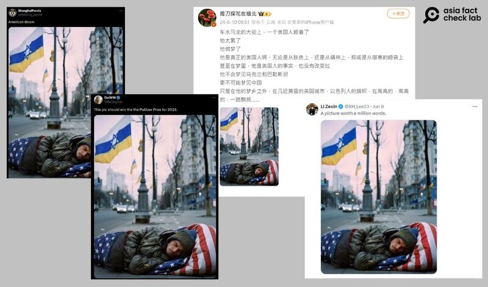
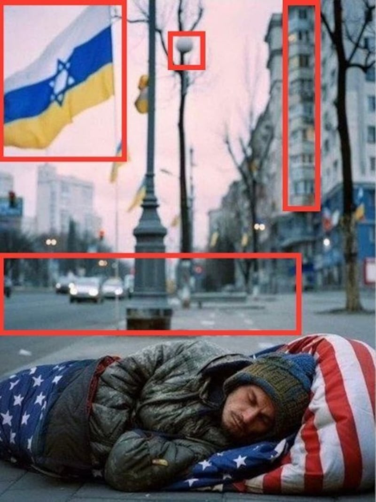
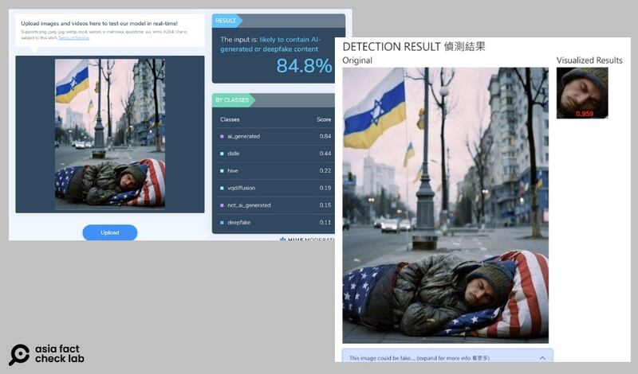

# 事實查覈｜遊民在街上睡美國國旗睡袋的圖片是真的嗎？

作者：艾倫

2024.06.18 15:27 EDT

## 查覈結果：錯誤

## 一分鐘完讀：

社交媒體平臺X和微博等近期流傳一張照片，一名男子睡臥在街上，使用的睡袋印有美國國旗花樣，照片的背景裏還出現多面具有烏克蘭、以色列國旗元素的旗幟。多位博主轉傳該圖來諷刺“美國夢”的破碎，甚至稱該圖“應該得普利策獎”。

亞洲事實查覈實驗室認爲，該圖片爲假圖的可能性極大。圖片內容存在明顯錯誤，並且AI及深僞技術工具分析提示，該張照片爲AI製成的概率很高。

## 深度分析：

自稱爲中國新華社記者的X認證賬號“Li Zexin”6月9日在X發佈一張照片，內容爲一名男子於街上睡在美國國旗圖案的睡袋裏，背景則有數面帶有烏克蘭、以色列國旗元素的旗幟飛揚，文案稱：“一張照片勝過千言萬語”（A picture worth a million words）。截至本文發稿，該帖文獲得超過50萬觀看量，兩萬多賬號轉發。

轉發該圖片的" [DaiWW](https://x.com/BeijingDai/status/1800297013558509706)"及" [Shanghai Panda](https://x.com/thinking_panda/status/1800129931852296291)"等賬號進一步用該圖片諷刺"美國夢",其中"DaiWW"文案還稱:"這張照片應該贏得2024普利策獎"(This pic should win the the Pulitzer Prize for 2024)。

中國社交媒體平臺微博上也隨即出現大V帳號傳播該圖,擁有400多萬跟隨者的博主"提刀探花在緬北"甚至連發兩次同張照片, [第一次](https://weibo.com/3031762330/OijwRdSAr)發文稱該圖片"是不是該得普利策獎", [第二次](https://weibo.com/3031762330/OijDIuXxZ)文案則寫道:"在他(照片裏的人)的夢鄉之外,在幾近黃昏的美國城市,以色列人的旗幟,在高高的,高高的,一路飄揚"。

微博和X上的網紅博主近期傳播一張睡在美國國旗睡袋的遊民照（微博、X截圖）

這張照片存在多處明顯問題——遊民背後的飄揚旗幟，並不屬於任何一個國家，這是由上藍下黃的烏克蘭國旗，以及藍白交錯、帶着“大衛之星”的以色列國旗的部分元素拼合而成。

亞洲事實查覈實驗室邀請兩位專家研判此圖。臺灣專長人工智慧安全的陽明交大電機系遊家牧副教授再指出三個疑點：

一、圖中的路燈燈泡“長”在樹上。

二、在多車道的道路上，所有車輛都往一個方向行駛。根據圖內兩個車道間的車距判斷，圖中駛向拍攝者方向至少有兩個以上的車道。如若這是一個靠右行駛的國家，這條路上只有靠人行道的一個車道是反向，不合常理；若整個道路的行駛方向都是駛向拍攝者方向，代表是在靠左行駛的國家。而無論在美國、以色列和烏克蘭，車輛都是靠右行駛。

三、最靠近男子的旗幟沒有旗座，而是直接“插在”人行步道磚上。

研究影像處理及多媒體資訊安全的成大數據所副教授許志仲還指出，圖片右上角建築物中，不同樓層之間的窗戶與陽臺線條不太一致。

該圖存在多個疑點，包含國旗、路燈、窗戶陽臺線條及車道行駛方向等。（網傳圖片，AFCL再製）

其次,AFCL將該圖放到 [AI檢測工具Hive](https://hivemoderation.com/ai-generated-content-detection)進行查證,結果爲高達84.8%的機率是AI或深僞技術生成。

臺灣成功大學數據研究所的深僞偵測工具則判定，該照片高達95%的機率爲假照片。

使用AI檢測工具Hive及成大數據所深僞照片偵測網站，可以發現網傳照片爲AI生成的機率極高。

因此，亞洲事實查覈實驗室認爲，該圖爲人工智能生成的假圖片的可能性較高。

(亞洲事實查覈實驗室鄭崇生對本文亦有貢獻。)

*亞洲事實查覈實驗室(Asia Fact Check Lab)針對當今複雜媒體環境以及新興傳播生態而成立。我們本於新聞專業主義,提供專業查覈報告及與信息環境相關的傳播觀察、深度報道,幫助讀者對公共議題獲得多元而全面的認識。讀者若對任何媒體及社交軟件傳播的信息有疑問,歡迎以電郵*  [*afcl@rfa.org*](mailto:afcl@rfa.org)  *寄給亞洲事實查覈實驗室,由我們爲您查證覈實。* *亞洲事實查覈實驗室在X、臉書、IG開張了,歡迎讀者追蹤、分享、轉發。X這邊請進:中文*  [*@asiafactcheckcn*](https://twitter.com/asiafactcheckcn)  *;英文:*  [*@AFCL\_eng*](https://twitter.com/AFCL_eng)  *、*  [*FB在這裏*](https://www.facebook.com/asiafactchecklabcn)  *、*  [*IG也別忘了*](https://www.instagram.com/asiafactchecklab/)  *。*

[Original Source](https://www.rfa.org/mandarin/shishi-hecha/hc-06182024152005.html)