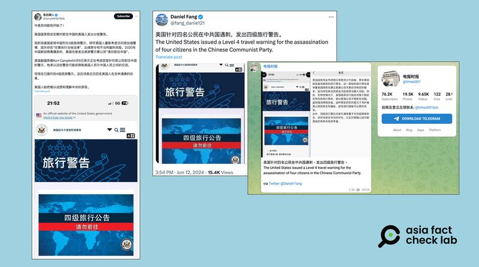
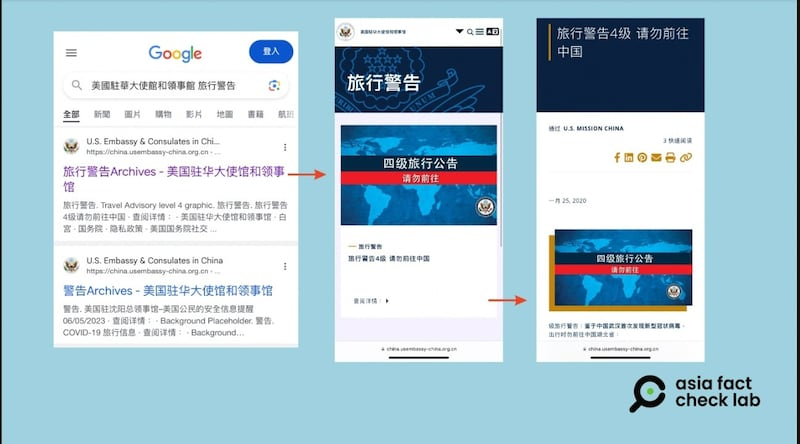

# 事實查覈｜美國針對四位公民在中國遇襲 發出四級旅行警告？

作者：莊敬

2024.06.20 17:00 EDT

## 查覈結果：錯誤

## 一分鐘完讀：

近日在X、Telegram等社媒上，部分用戶發文稱因爲四位美國公民在中國遇襲，美國政府對中國發布四級旅行警告。發文者並附上一張截圖，顯示美國駐華大使館和領事館的旅行警告頁面上寫著“四級旅行公告，請勿前往”。

經過查覈確認，目前美國國務院對中國的旅行公告爲第三級，最近一次更新時間顯示爲今年4月。而網傳四級旅行公告的截圖，經查爲2020年的庫存頁面，與日前四位美國公民在吉林遇襲事件無關。

## 深度分析：

6月10日，四名美國教師在中國吉林一座公園內被襲擊者刺傷，無生命危險，中國警方已逮捕行兇者。這起事件引起廣泛關注，美國官員表達關切，中國外交部則表示， “有關偶發事件不會對中美人文交流正常開展造成影響” 。

亞洲事實查覈實驗室注意到,事件發生不久後,在社媒平臺X上,部分獲認證的"藍勾勾"用戶( [1](https://twitter.com/fang_danie121/status/1800798926616031506), [2](https://twitter.com/Jerry00107966/status/1800666904639754525))發文,聲稱美國針對四位公民在中國遇襲,發出四級旅行警告。這些發文者並附上同一張截圖爲證,顯示美國駐華大使館和領事館的旅行警告頁面上寫著"四級旅行公告,請勿前往"。其中一則推文,被轉發至Telegram上的時事頻道 ["電報時報"](https://t.me/s/times001?before=697369)。

近日在X、Telegram等社媒上，有用戶發文稱美國針對四位公民在中國遇襲，發出四級旅行警告。圖取自X、Telegram

經查,目前美國國務院對中國的 [旅行公告](https://travel.state.gov/content/travel/en/traveladvisories/traveladvisories/china-travel-advisory.html)(China travel advisory)爲第三級,即要求美國公民"重新考慮"前往旅行,理由是香港特區新訂定了"國家安全法",當局任意執法可能讓美國公民被誣指或誤抓。更新時間顯示爲今年4月12日。

美國對中國的旅行警示,是不少媒體關注的議題,以中、英文關鍵字查詢,可以找到今年4月媒體報道美國更新對中旅行警示( [1](https://www.voacantonese.com/a/us-issues-new-travel-advisories-for-three-asian-destinations-20240414/7569643.html), [2](https://www.statesman.com/story/news/state/2024/04/25/china-travel-advisory-2024-level-3-travel-warning-detentions-exit-bans/73427549007/))。但以同樣的關鍵字查詢,沒有找到媒體報道美國因爲四位公民在中國遇襲而更新旅行警告。

至不同發文者分享的手機截圖,螢幕上顯示的時間、信號和電池電量均一致,可以判斷爲同一張截圖。亞洲事實查覈實驗室在Google上輸入"美國駐華大使館和領事館"和"旅行警告",獲得的第一個搜尋結果爲"旅行警告Archives - 美國駐華大使館和領事館",其 [頁面](https://china.usembassy-china.org.cn/zh/tag/travel-alert-zh/)和網傳截圖一樣。 ["查閱詳情"](https://china.usembassy-china.org.cn/zh/travel-alert-level-4-do-not-travel-to-hubei-zh/)後發現,這是2020年1月25日的旅行警告:"鑑於中國武漢首次發現冠狀病毒,出行時勿前往中國湖北省"。

美國國務院根據世界各地存在的各類風險等級，向公民發佈的海外旅行警吿由輕至重分爲四級。第一級爲“採取正常預防措施”，第二級敦促旅行者“提高警覺”，第三級建議民衆“重新考慮前往”，第四級是最嚴重的“請勿前往”。

在網上搜索“美國駐華大使館和領事館”和“旅行警告”，可找到與網傳截圖相符的畫面，但內容是2020年因冠狀病毒而發佈的四級旅行警告，與今年6月發生的吉林突襲事件無關。圖取自谷歌、美國駐華使館官網

*亞洲事實查覈實驗室（Asia Fact Check Lab）針對當今複雜媒體環境以及新興傳播生態而成立。我們本於新聞專業主義，提供專業查覈報告及與信息環境相關的傳播觀察、深度報道，幫助讀者對公共議題獲得多元而全面的認識。讀者若對任何媒體及社交軟件傳播的信息有疑問，歡迎以電郵afcl@rfa.org寄給亞洲事實查覈實驗室，由我們爲您查證覈實。*

*亞洲事實查覈實驗室在X、臉書、IG開張了，歡迎讀者追蹤、分享、轉發。X這邊請進：中文@asiafactcheckcn；英文：@AFCL\_eng、FB在這裏、IG也別忘了。*

[Original Source](https://www.rfa.org/mandarin/shishi-hecha/hc-06202024170014.html)