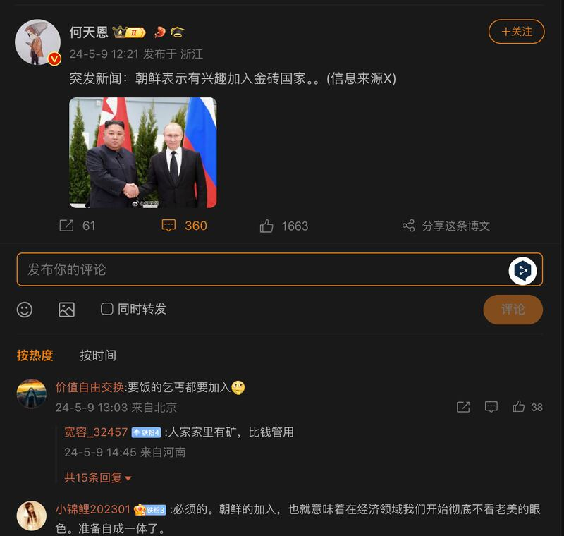
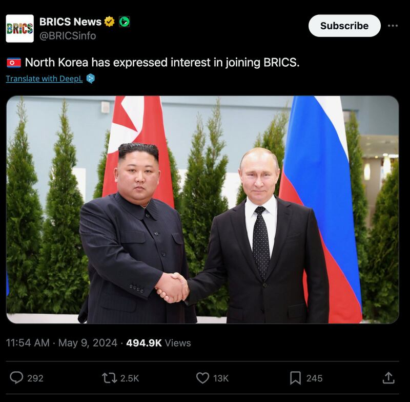

# 事實查覈｜朝鮮有意加入金磚國家？

作者：Dukin Han

2024.06.21 18:32 EDT

## 查覈結果：缺乏證據

## 一分鐘完讀：

原本由巴西、俄羅斯、印度、中國、南非組成的“金磚五國”組織，在2023年年8月再加入沙特阿拉伯、阿拉伯聯合酋長國、埃及、伊朗和埃塞俄比亞而成爲“金磚十國”。今年初，有國際媒體報道朝鮮有意加入金磚國家組織，但這些媒體報道並沒有引述任何可靠消息來源，也有媒體在未經查證的情況下就做出評論。

記者向多個金磚國家外交部發信查詢，最終接到了南非駐美大使館回信表示，朝鮮從未正式表達過加入金磚國家的意圖，金磚國家內部也未就此事進行過討論。因此網傳信息缺乏證據。

中文互聯網上流傳的朝鮮表示有興趣加入金磚國家的"突發新聞"帖子（新浪微博截圖）

## 深度分析：

"朝鮮表達加入金磚國家意願"相關消息五月初開始在社媒平臺上流傳,中、英文(朝鮮語)賬號都可以發現相關信息。例如"X(前稱推特)"的"金磚新聞"(金磚國家新聞)賬號,在5月9日中午貼出 [這則信息](https://x.com/BRICSinfo/status/1788417224870334654?t=86CR8JhYmv6yMqOXWhcQVg&s=19),截至發稿日爲止,這則貼文獲得近50萬次點擊,2500次轉推。也有中國微博賬號 [跟進](https://weibo.com/1861477054/OdsWC46xt),以中文發表這則"突發消息"。

亞洲事實查覈實驗室進一步檢視X平臺上的“金磚新聞”賬號，發現它也經營同名的電報新聞頻道，頻道中同樣發出了朝鮮有意加入金磚國家的簡短文字，配上一張朝鮮領導人金正恩與俄羅斯總統普京握手的照片。但相關報道並沒有引述來何消息來源。

社媒平臺流傳的金正恩與普京的握手照片，用以佐證朝鮮表達了加入金磚國家的意願 。（X截圖）

儘管如此，朝鮮有意加入金磚國家這條信息仍然被“LN24 國際”“新聞”和“金磚全球電視網（BGTN）”等互聯網新聞媒體轉載。特別是總部位於南非的“LN24國際”頻道在一個政論節目中討論了相關議題，主持人引述俄羅斯國際貨幣基金組織代表的談話，聲稱金磚國家已準備好提供美元的替代方案。但仍然沒有提出任何“朝鮮有意加入金磚國家”的可信報道及證據。

"LN24國際"頻道在政論節目中討論朝鮮表達想加入金磚國家的議題（"LN24國際"頻道官網截圖）

專門報道加密貨幣新聞的互聯網新聞媒體“加密DNES”也在5月11日發表了一篇分析文章，認爲朝鮮之所以被金磚國家吸引，是因爲“這是加強經濟聯盟並逃避朝鮮面臨的強大制裁的機會”。

## 南非大使館： " 朝鮮加入金磚國家的說法毫無根據 "

“朝鮮表達加入金磚國家意願”的信息究竟從何而來，記者向前述媒體發信查問，對方回覆來自另一些網絡媒體，但這些媒體同樣沒有可靠的信息來源。

記者也搜尋了朝鮮官方媒體如《勞動新聞》和朝鮮中央通訊社（KCNA），並未報道任何表示朝鮮實際表達過加入金磚國家意圖的內容。

同時，記者也發信給“金磚五國”— 中國、俄羅斯、印度、南非和巴西的駐美大使館，詢問朝鮮是不是曾經表達加入金磚國家的意願。

在聯繫的五個大使館中，唯一在一週內收到的官方回覆來自南非大使館。南非大使館在5日回覆“亞洲事實覈查實驗室”的查詢時表示，“朝鮮從未正式表達過加入金磚國家的意圖”。

因此，在媒體報道沒有引述任何消息來源，南非方面又予以否認的情況下，“朝鮮有意加入金磚國家”的傳言，沒有任何證據可供支持。

(本件查覈報告由韓語組記者完成，AFCL編輯。）

*亞洲事實查覈實驗室(* *Asia Fact Check Lab* *)針對當今複雜媒體環境以及新興傳播生態而成立。我們本於新聞專業主義,提供專業查覈報告及與信息環境相關的傳播觀察、深度報道,幫助讀者對公共議題獲得多元而全面的認識。讀者若對任何媒體及社交軟件傳播的信息有疑問,歡迎以電郵* *afcl@rfa.org* *寄給亞洲事實查覈實驗室,由我們爲您查證覈實。*

*亞洲事實查覈實驗室在* *X* *、臉書、* *IG* *開張了,歡迎讀者追蹤、分享、轉發。* *X* *這邊請進:中文*  [*@asiafactcheckcn*](https://twitter.com/asiafactcheckcn)  *;英文:*  [*@AFCL\_eng*](https://twitter.com/AFCL_eng)  *、*  [*FB* *在這裏*](https://www.facebook.com/asiafactchecklabcn)  *、*  [*IG* *也別忘了*](https://www.instagram.com/asiafactchecklab/)  *。*

[Original Source](https://www.rfa.org/mandarin/shishi-hecha/hc-06212024182457.html)