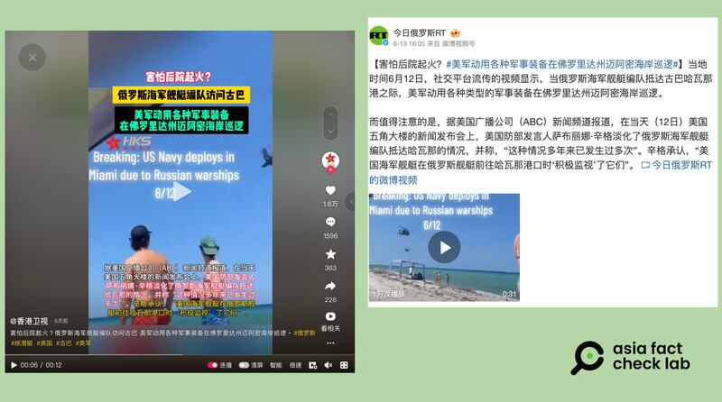
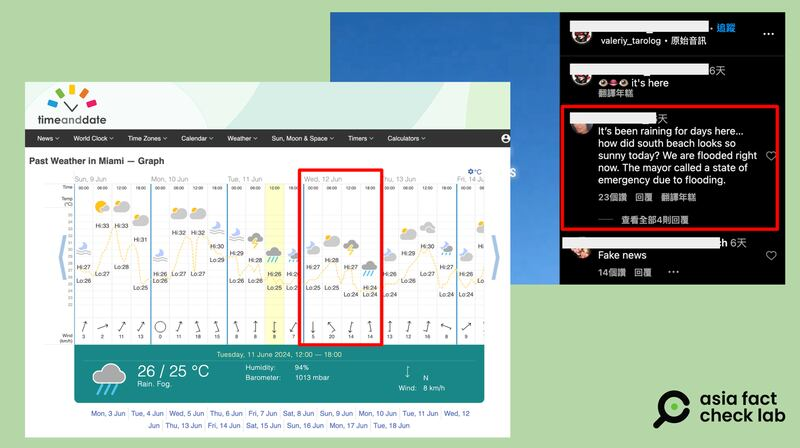

# 事實查覈｜美軍"大動作"回應俄艦訪古巴，重兵巡邏邁阿密海岸？

作者：董喆

2024.06.21 18:41 EDT

## 查覈結果：錯誤

## 一分鐘完讀：

俄羅斯軍艦隊6月12日抵達古巴，外界關注美方反應。香港衛視以及今日俄羅斯引用一則視頻，稱美國害怕後院起火，動用各式軍事裝備在佛州邁阿密海灘巡邏。但經過查覈，媒體引用的視頻是陣亡將士紀念日時邁阿密海灘的航空秀，與美軍巡邏無關。

## 深度分析：

俄羅斯軍艦隊6月12日陸續抵達古巴哈瓦那港,與古巴進行聯合演習。 [美方官員稱](https://www.voachinese.com/a/russian-warships-enter-havana-harbor-under-washington-s-watchful-eye-20240612/7653194.html)有部署軍機和軍艦跟蹤俄艦艇的行動路線,並表示俄方的軍艦或潛艇根本不能對美國構成任何直接威脅,但美方並未發佈美軍執行這些任務的視頻或者照片。而中俄媒體則是搶先"發佈",傳播移花接木的視頻,並宣稱美軍對此憂心不已。

"害怕後院起火?#美軍動用各種軍事裝備在佛羅里達州邁阿密海岸巡邏"中國官媒 [香港衛視](https://www.douyin.com/user/MS4wLjABAAAAHqO2fBYAlLv3oSWBJlNNO_rG_dMvkOYuvrwuQunIFOg?modal_id=7379988328264797459)和俄羅斯官媒 [今日俄羅斯](https://m.weibo.cn/detail/5044835189526044)以相同的主題詞和視頻材料在抖音和微博平臺發帖,宣稱美方"大動作"回應俄艦訪古巴。視頻中,海灘上的民衆抬頭觀望直升機與軍機低空飛行,視頻時間標記爲6月12日。

同樣的視頻也被微博軍事"大V" [衝鋒號角](https://weibo.com/2343014623/5045110607709920)分享,X上亦有 [賬號](https://x.com/NiKiTa_32156/status/1801129880815636871)轉貼。

香港衛視和今日俄羅斯發佈"美軍巡邏邁阿密海灘"的消息（抖音、新浪微博截圖）

亞洲事實查覈實驗室以圖反搜,發現這則視頻在西方社羣平臺已經廣泛傳播,但亦有許多網友自發闢謠。在一則 [Instagram貼文](https://www.instagram.com/reel/C8IxHJ-vXO1/?utm_source=ig_embed&ig_rid=0668f387-c662-4287-929e-44caa8ca1720%EF%BC%89%EF%BC%8C%E6%9C%89%E7%B6%B2%E5%8F%8B%E7%95%99%E8%A8%80%E8%AA%AC%E9%82%81%E9%98%BF%E5%AF%86%E5%B7%B2%E7%B6%93%E4%B8%8B%E4%BA%86%E5%BE%88%E5%A4%9A%E5%A4%A9%E9%9B%A8%EF%BC%8C%E7%94%9A%E8%87%B3%E7%99%BC%E5%B8%83%E4%BA%86%E6%B4%AA%E6%B0%B4%E8%AD%A6%E5%A0%B1%E3%80%82)中,分別有網友指6月12日前後邁阿密已連續多天下雨,與視頻不符。亦有網友提供線索,指出這是邁阿密航空秀的畫面。

亞洲事實查覈實驗室使用天氣回溯工具timeanddate [查詢](https://www.timeanddate.com/weather/usa/miami/historic),6月12日當天邁阿密皆爲多雲的天氣,且從中午12時過後就轉爲雷雨,確實與網傳視頻中豔陽高照的天氣有出入。

6月12日邁阿密的天氣記錄（timeanddate網頁截圖）

另外爲了驗證這則視頻是否是網友口中的航空秀,我們以邁阿密、航空展等關鍵字搜尋,在TikTok找到了多個雷同的視頻( [1](https://www.tiktok.com/@viviendoenbrickell/video/7373118827212721454?is_from_webapp=1&sender_device=pc&web_id=7205785657578538497)、 [2](https://www.tiktok.com/@miami_famous/video/7372648946956586271?is_from_webapp=1&sender_device=pc&web_id=7205785657578538497)、 [3](https://www.tiktok.com/@pama_li/video/7375994069702446368?is_from_webapp=1&sender_device=pc&web_id=7205785657578538497)、 [4](https://www.tiktok.com/@.zepoli/video/7373071150831865134?is_from_webapp=1&sender_device=pc&web_id=7205785657578538497)),在其中一段視頻中提到了"Memorial Day Hyundai Air and Sea Show",又在邁阿密海灘官方網站上找到 [活動通知](https://www.miamibeachfl.gov/event/hyundai-air-sea-show/),5月25至26日,這裏確實舉辦了由現代汽車贊助的陣亡將士紀念日航空秀。

亞洲事實查覈實驗室去信主辦單位USA Salute，發言人Nicole Lewis確認網傳視頻內容爲陣亡將士紀念日的週末時，在邁阿密海灘舉辦的現代航空秀。因此，香港衛視與今日俄羅斯發表的是移花接木的訊息。

*亞洲事實查覈實驗室（Asia Fact Check Lab）針對當今複雜媒體環境以及新興傳播生態而成立。我們本於新聞專業主義，提供專業查覈報告及與信息環境相關的傳播觀察、深度報道，幫助讀者對公共議題獲得多元而全面的認識。讀者若對任何媒體及社交軟件傳播的信息有疑問，歡迎以電郵afcl@rfa.org寄給亞洲事實查覈實驗室，由我們爲您查證覈實。*

*亞洲事實查覈實驗室在X、臉書、IG開張了,歡迎讀者追蹤、分享、轉發。X這邊請進:中文*  [*@asiafactcheckcn*](https://twitter.com/asiafactcheckcn)  *;英文:*  [*@AFCL\_eng*](https://twitter.com/AFCL_eng)  *、*  [*FB在這裏*](https://www.facebook.com/asiafactchecklabcn)  *、*  [*IG也別忘了*](https://www.instagram.com/asiafactchecklab/)  *。*

[Original Source](https://www.rfa.org/mandarin/shishi-hecha/hc2-06212024183439.html)