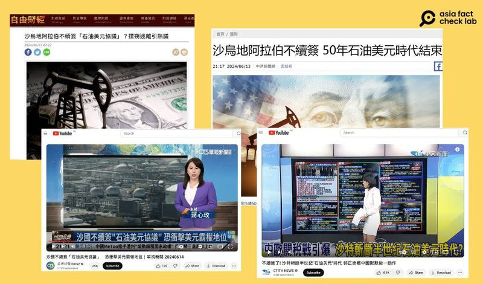
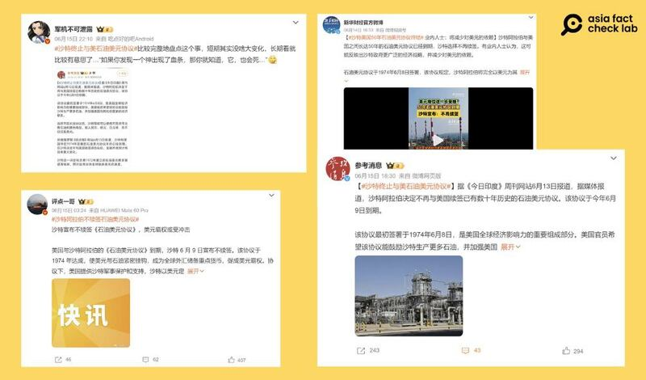
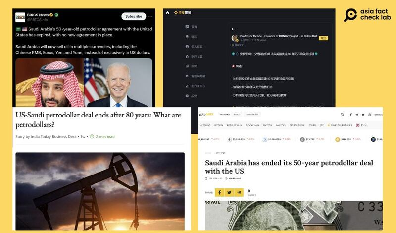

# 事實查覈｜"石油美元協議"已到期，沙特不續簽？

作者：艾倫

2024.06.24 20:17 EDT

## 查覈結果：錯誤

## 一分鐘完讀：

近期中英文媒體流傳一則消息，稱美國和沙特阿拉伯簽署的“石油美元協議”已經到期，且沙特無意續簽，意味著美元的霸權地位將再次受到挑戰。

針對這則消息，網路上可查到有權威經濟學家撰文表示，美沙之間並不存在“正式”的石油美元協議。亞洲事實查覈實驗室查詢美國政府責任署網頁檔案後發現，在1979年3月的一份“美沙經濟合作聯合委員會”的報告中，並沒有提及雙方簽訂任何正式的石油美元協議。責任署回覆查詢電郵時也強調： “我們沒有美國和沙特在石油貿易中使用石油美元的其他文件”。

亞洲事實查覈實驗室通過資料查證後發現，沙特的石油輸出仍以美元計價爲主，目前沒有如部分傳言所稱，部分交易已經開始使用非美元的其它貨幣。

## 深度分析：

中文互聯網近日流傳一則消息，指沙特阿拉伯終止“美元石油貿易協議”。內容稱，這紙協議最初簽署於1974年6月8日，規定所有沙特阿拉伯的石油交易皆以美元定價，並將剩餘石油收入投資於美國國債，而美國也以提供軍事保護作爲交換，該協議於今年6月9日到期。

相關消息在微博上不僅被"大V"博主如 [管清友](https://weibo.com/1226106902/Ojdg2iGpk?refer_flag=1001030103_)、 [軍機不可泄漏](https://weibo.com/2356166212/Oj9CebEZ2?refer_flag=1001030103_)、 [評點一哥](https://weibo.com/5703136759/Oj2fj4BEF?refer_flag=1001030103_)等轉傳,中國新聞媒體如 [新華財經](https://weibo.com/1832487154/OiY72lnJm?refer_flag=1001030103_)、 [微天下](https://weibo.com/1893801487/OiYeeFGce?refer_flag=1001030103_)和 [參考消息](https://weibo.com/2375086267/Oj8aFlISJ?refer_flag=1001030103_)也都轉發同樣說法。至於臺灣媒體,也在同一時間發佈相關報道。 [自由時報](https://ec.ltn.com.tw/article/breakingnews/4704903)、 [中時新聞網](https://www.chinatimes.com/realtimenews/20240613004713-260408?chdtv)、 [中天電視](https://www.youtube.com/watch?v=rFqAJNPeJC8)及 [華視新聞](https://www.youtube.com/watch?v=VNjh8D0Q36Q)皆引述相關說法,其中,中時、中天、華視都着重強調協議不續簽將對美元強勢地位帶來的影響。

多個微博博主及媒體社媒賬號發文稱石油美元協議已到期，"沙特決定不續簽"。（新浪微博截圖）

臺灣媒體跟進報道"石油美元協議的失效"（自由時報、中時新聞官網及YouTube截圖）

但也有少數報道或評論質疑這則傳問，例如中國的參考消息特別引述專家說法，指出所謂的石油美元協議爲虛構傳言。臺灣的自由時報也表示，目前並沒有證據顯示這項協議真的存在。

## 始於英文世界的傳言

通過Google搜尋,確認相關傳聞和媒體報道起於今年6月中,最初多是英文網絡媒體報道。例如保加利亞的加密貨幣新聞媒體CryptoDnes在6月13日的 [報道](https://cryptodnes.bg/en/sauditska-arabiq-prikluchi-50-godishnata-sdelka-sus-sasht-petrodolara/),當中特別強調沙特不續簽意味著使用其他貨幣交易石油的機會即將到來,其中包含比特幣。《今日印度》(India Today)則於6月14日發佈內容相似的 [新聞](https://www.msn.com/en-in/news/other/us-saudi-petrodollar-deal-ends-after-80-years-what-are-petrodollars/ar-BB1ocE5n?ocid=BingNewsSearch%23)。

X賬號 [金磚新聞](https://x.com/BRICSinfo/status/1801005240658858443?ref_src=twsrc%255Etfw%257Ctwcamp%255Etweetembed%257Ctwterm%255E1801052915852886384%257Ctwgr%255E8044e9e70b84495b0b855d93934ff96b766c9c76%257Ctwcon%255Es3_&ref_url=https://www.newarab.com/news/saudi-arabia-about-drop-petrodollar-chinese-yuan)(BRICS News)也在13日轉發相關消息,強調未來沙特將以多種貨幣出售石油,包括人民幣、歐元、日圓和美元,而不再僅限於使用美元。

值得注意的是,最初的報道對於協議存續的時間有"50年"和"80年"兩個版本,但如果按傳言稱,協議自1974年簽訂,80年期滿要到2054年,是個明顯錯誤。但中文世界仍有人直接轉發80年的說法,例如討論加密貨幣的社媒 [平臺幣安廣場](https://www.binance.com/zh-TC/square/post/9461697905905?ref=360939810)。

流傳於英文世界的"石油美元協議失效"傳言（X、今日印度官網、幣安廣場截圖）

## 石油美元是什麼？

華盛頓喬治城大學的國際經濟學學者Ibrahim M. Oweiss曾撰文解釋石油美元的 [定義](https://faculty.georgetown.edu/imo3/petrod/define.htm),他指出,石油美元簡單來說就是以美元計價的石油收入。

由於石油美元以美元計價，因此購買力取決於美國的通膨率和美元在國際貨幣市場上的兌換率。因此，只要美元本身受經濟影響，石油美元也會受到同樣程度的影響。可以說，美元與石油美元之間具有顯著明確的經濟、政治及其他關聯。

Oweiss [提到](https://faculty.georgetown.edu/imo3/petrod/petro2.htm),自1970年代,中東石油所有權開始從西方主要國際石油公司轉移到石油出口國政府手中,因此石油出口國預計其石油儲量將大幅增加。與此同時,西方國家和日本比以往任何時候都更加依賴主要來自石油輸出國組織(OPEC)成員國的石油供應。

而因爲這波新的石油革命在石油出口國的歷史上有其獨特性，爲了研究這一現象，Oweiss認爲需要一個新的術語，這便是石油美元（petrodollars）一詞的由來。

學術期刊網站JSTOR上曾刊出一篇 [文章](https://www.jstor.org/stable/48750200?seq=6):《美國如何通過控制中東來維持在國際石油貿易中的霸權》,內容提到美沙兩國的經濟合作中,兩國同意"僅以美元計價和交易石油",從此美元成爲全球石油價格的標準,而這也間接影響其他產油國採用相同定價系統並以美元交易。

## 石油美元協議有正式簽署嗎？

瑞銀集團全球財富管理首席經濟學家保羅多諾萬(Paul Donovan)6月14日發表一篇 [文章](https://www.ubs.com/global/en/wealth-management/insights/chief-investment-office/market-insights/paul-donovan/2024/dangers-of-confirming-your-beliefs.html),指出美國和沙特阿拉伯確實在1974年6月建立了經濟合作聯合委員會(The U.S.- Saudi Arabian Joint Commission On Economic Cooperation),其目的是協助沙特阿拉伯將剩餘美元消費在美國產品上,但並沒有所謂的正式石油美元協議。

查詢 [美國政府責任署](https://www.gao.gov/products/id-79-7)(GAO)檔案會發現,美國在1979年3月釋出了一份美沙經濟合作聯合委員會 [報告](https://efaidnbmnnnibpcajpcglclefindmkaj/https:/www.gao.gov/assets/id-79-7.pdf),但內容並無提及雙方有簽訂任何正式的石油美元協議。

美國政府責任署爲立法部門下的政府機構，是美國聯邦政府最高的審計及監督機構，常在國會及小組委員會的要求下展開調查工作，提供客觀資訊以利政府部門省錢和更有效率工作，又被稱爲“國會的看門狗”。

責任署回覆亞洲事實查覈實驗室指出，該報告僅提及美國及沙特阿拉伯經濟合作聯合委員會的任務、組成、運作、活動範圍和成就，以及如何將石油美元循環投資（recycling petrodollar），但並未提及有正式的石油美元協議。

“很遺憾，我們沒有美國和沙特在石油貿易中使用石油美元的其他文件”，責任署回應。

此外，多諾萬也指出，1974年7月，沙特同意將石油美元投資於美國國債，而這也是多名中文博主用來證明有協議存在的證據。

2016年5月彭博社刊文 [報道](https://www.bloomberg.com/news/features/2016-05-30/the-untold-story-behind-saudi-arabia-s-41-year-u-s-debt-secret?sref=TuLYJzYL),在美沙經濟合作聯合委員會成立一個月左右,沙特同意將出售石油賺取的數十億美元投資於美國國債,換取美國的軍事援助和設備。

總部位於麻州的美國經濟研究智庫(American Institute of Economic Research)也 [指出](https://www.aier.org/article/sense-and-nonsense-on-petrodollars/),這項"非正式"的合作讓沙特同意只以美元出售石油,但不是一份正式的協議或聲明。

## 沙特阿拉伯有使用其他貨幣交易石油嗎？

沙特阿拉伯"不續簽石油美元協議"的消息傳出後,多名經濟學者及智庫在闢謠的同時也指出,過去多年來使用非美元的貨幣購買石油早有案例。例如多諾萬 [文章](https://www.ubs.com/global/en/wealth-management/insights/chief-investment-office/market-insights/paul-donovan/2024/dangers-of-confirming-your-beliefs.html)中提到,石油的交易一直都有使用過非美元貨幣進行,沙特阿拉伯在2023年1月就已表示歡迎各國用其他貨幣來協議石油貿易。

相關說法外媒早有報道。《華爾街日報》在2022及2023年分別刊文指出,沙特阿拉伯曾考慮是否以 [人民幣和中國進行石油貿易](https://www.wsj.com/articles/saudi-arabia-considers-accepting-yuan-instead-of-dollars-for-chinese-oil-sales-11647351541?mod=article_inline),以及過去一年世界石油貿易總額有 [20%並非以美元計價](https://www.wsj.com/finance/currencies/the-dominant-dollar-faces-a-backlash-in-the-oil-market-0f151e28)。專門報道石油及能源新聞的《今日原油價格》(Crude Oil Prices Today)也 [撰文](https://oilprice.com/Energy/Crude-Oil/Gold-And-A-New-Crude-Benchmark-A-New-Dawn-For-The-Petroyuan.html)指出,中國在拋出石油人民幣的想法後,沙特阿拉伯已公開同意未來石油不必全已美金計價。

但亞洲事實查覈實驗室發現，前述報道只顯示出世界上“其他國家”使用不同的貨幣交易石油，以及沙特“有意願”開放使用其他貨幣。多項公開研究和資訊仍顯示，沙特阿拉伯出售石油依舊以美金計價。

專門研究世界經濟活動的視覺化平臺"經濟複雜性觀察站"(OEC)發佈的 [《沙特阿拉伯石油進出口數字及市場分析》](https://oec.world/en/profile/bilateral-product/crude-petroleum/reporter/sau),皆以美金呈現相關數據。OEC母公司Datawheel的首席經濟學家

Gilberto Garcia-Vazquez說， “沙特阿拉伯所有的（石油）交易數據都以美金計”（all trade data from Saudi Arabia comes in U.S. dollars）。

因此，“不續簽石油美元協議”及“沙特已經使用非美元貨幣交易石油”的說法，都缺乏證據。

*亞洲事實查覈實驗室（Asia Fact Check Lab）針對當今複雜媒體環境以及新興傳播生態而成立。我們本於新聞專業主義，提供專業查覈報告及與信息環境相關的傳播觀察、深度報道，幫助讀者對公共議題獲得多元而全面的認識。讀者若對任何媒體及社交軟件傳播的信息有疑問，歡迎以電郵afcl@rfa.org寄給亞洲事實查覈實驗室，由我們爲您查證覈實。*

*亞洲事實查覈實驗室在X、臉書、IG開張了,歡迎讀者追蹤、分享、轉發。X這邊請進:中文*  [*@asiafactcheckcn*](https://twitter.com/asiafactcheckcn)  *;英文:*  [*@AFCL\_eng*](https://twitter.com/AFCL_eng)  *、*  [*FB在這裏*](https://www.facebook.com/asiafactchecklabcn)  *、*  [*IG也別忘了*](https://www.instagram.com/asiafactchecklab/)  *。*

[Original Source](https://www.rfa.org/mandarin/shishi-hecha/hc-06242024200826.html)