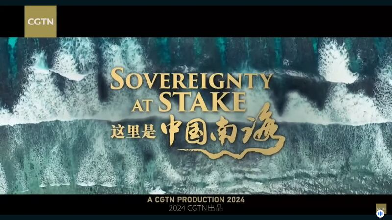
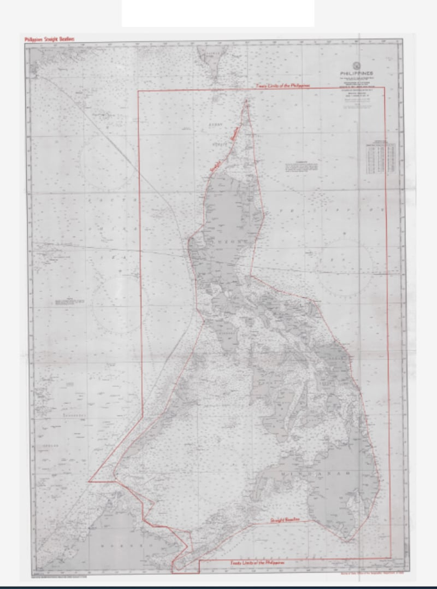
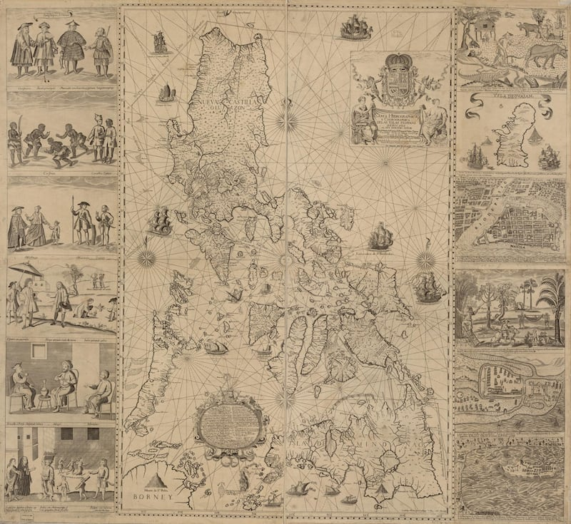

# 深度查覈 | 央視紀錄片爲南海主權提供了"鐵證"？ （上）

作者：鄭崇生

2024.06.25 18:54 EDT

中國和菲律賓因南海主權爭議對抗衝突不斷。除了海上短兵相接,中國央視英語頻道中國環球電視網(中國國際電視臺)也製作了 [《這裏是中國南海》的紀錄片](https://youtu.be/8wGkXI5HHTA?si=QoNuB_oRZGr1D5C8)(以下簡稱"紀錄片"),以實地考察、專家採訪和歷史資料的呈現形式,試圖證明"南海諸島自古以來就是中國領土"。

這部紀錄片製作了中文、英語、法語、俄語、西班牙語、阿拉伯語共六個語種,在電視及網絡平臺全面上線。央視 [介紹稱](https://news.cctv.com/2024/05/16/ARTIllue2Rf0fQJJwQNwC2t5240516.shtml),該"重磅製作"提供了"鐵證如山",是爲了"闡述中國對南海諸島擁有無可爭辯的主權"。

CGTN2024年的紀錄片《這裏是中國南海》片頭（紀錄片截圖）

亞洲事實查覈實驗室檢視這部紀錄片，發現片中部分說法並非歷史事實的完整呈現，是一類“觀點”而非“鐵證”。我們通過查閱資料，訪談專家，逐一查覈其中論據，以上下兩篇刊出。

## 1. 古代使用南海的，只有中國人？

## *中國南海研究院創始院長吳士存在紀錄片裏說,*   *"*   *當時在南海活動的漁民,應該說中國是唯一的*   *"*   *。另從南海的出土文物中試圖論證*   *"*   *長期以來,主要是中國人在南海作業、通過與使用*   *"*   *。*

## 查覈結果：這並非歷史全貌。

“‘靠海喫海’當然不可能只有中國人這麼做，這是常識。”黎蝸藤認爲，不論是在南海航行，或是在南海打漁（也就是片中說的“更路簿”），中國人都不是唯一的，甚至可能不是主要的人羣。

黎蝸藤是旅美華人學者，南海問題專家，着有《被扭曲的南海史——二十世紀前的南中國海》及《從地圖開疆到人工造島——南海百年紛爭史》。

黎蝸藤引述越南古代學者黎貴惇於18世紀的著作《撫邊雜錄》告訴亞洲事實查覈實驗室，根據該書記載，早在18世紀初期，越南人就在西沙羣島捕魚，書中提到“船人辰遇北國漁舟，洋中相問。”

他表示，“北國”就指中國，上述文獻記錄了當時越南漁民和中國漁民一起在西沙作業，和平共處。雖然很難就此判斷是誰首先開發了西沙羣島漁場，可以肯定的是中國漁民不是唯一在南海遠洋作業的國家。

黎蝸藤說，南海自古以來就是國際航海通道，無論中國和其他國家都有長期在南海遠洋航行的實踐，但最早也並非中國。中國大陸（和海南島）的南海海岸線只在整個南海的北部一帶。

他認爲，如果把“在南海沿岸短距離航行和近岸地區捕魚”就認爲是“在南海航行”、“在南海打漁”就算“開發利用南海”，相信所有圍繞南海沿岸地區的人民很早就都如此了。

在南海航路的使用上，也有史料記載，阿拉伯、東南亞各國也早有活動。

黎蝸藤指出，討論南海航路時，更應關注的是穿越南海的遠洋航行，即所謂“海上絲綢之路”。

他舉《漢書·地理志》所載中國第一次派使節前往南洋的事蹟：漢朝使者從中國南部沿岸出發，沿着海路到克拉地峽東側，轉陸路穿越地峽到西側，再經海路最後到達位於印度半島“黃支國”。

從史料可知：第一，漢朝派使節訪黃支的起因是黃支國派人到漢朝送禮，而黃支國顯然是通過海路來到中國的。這表明在這次旅程之前，“海上絲綢之路”已爲外國所開通。第二，漢使旅途的交通方式是“蠻夷賈船，轉送致之”，即提供交通的都是外國的“蠻夷賈船” ，中國使節是搭了順風船。

到了東漢三國魏晉南北朝，史料記載不少外國船隻到達中國南方廣州和交州經商，“番舶”、“崑崙舶”（東南亞）、“波斯舶”（伊朗）等都是從東南亞、印度、波斯外國等地來往中國。隋、唐時期，阿拉伯人在南海貿易中佔據主導地位，廣州還建立了阿拉伯人社區。

相反的是，唐代末前，中國人通過南海海路到外國的記載則非常少，主要是僧人，且都是乘坐外國商船往返。

黎蝸藤說，中國船隻成規模出海經商是宋朝前後。宋朝和之後，阿拉伯人和東南亞人也是南海海道的重要使用者。

## 2.  南海島礁爭議的背景究竟如何?

## *關於中、菲對於仁愛礁*   *(*   *Second Thomas Shoal*   *)*   *、黃巖島*   *(Scarborough Shoal)*   *的爭議,吳士存說,*   *"*   *東經*   *118*   *度國際線是一系列國際條約劃定的菲律賓領土西部邊界*   *"*   *,仁愛礁和黃巖島都位於東經*   *118*   *度以西,因此不屬菲律賓領土。*

## 這一說法部分屬實。

吳士存向亞洲事實查覈實驗室記者解釋了"一系列國際條約",指的是1898年的美國與西班牙的《巴黎條約》、1900年的《華盛頓條約》以及1930年的《美英條約》。亞洲根據美國國務院相關歷史檔案 [《條約外界線》](https://www.state.gov/wp-content/uploads/2019/11/LIS-33.pdf)的記錄,吳士存這一說法屬實。

美國國務院有關菲律賓《條約外界線》研究歷史檔案截圖

1898年美西戰爭後,美國與西班牙籤訂《巴黎條約》,之後雙方又簽訂《華盛頓條約》,又稱 [《菲律賓偏遠羣島之割讓》](https://maint.loc.gov/law/help/us-treaties/bevans/b-es-ust000011-0623.pdf)(Cession of Outlying islands of Philippines)。黎蝸藤指出,該條約規定"西班牙讓渡給美國其在《巴黎條約》簽訂時、屬菲律賓羣島的所有列島,以及該條約第三條規定的界線外之列島。"黎蝸藤認爲,這是一條"口袋式"條約,也就是如果一些島嶼在西屬菲律賓時代屬於菲律賓,那麼即便沒有在1898年年《巴黎和約》條約界線內,它們也屬於美屬菲律賓。

## 3.  中國的"更路簿"說服力完勝西班牙地圖?

## *紀錄片批評菲律賓以一張*   *200*   *多年前、西班牙殖民時代的*   *"*   *民間地圖*   *"*   *,試圖論證黃巖島自古以來屬於菲律賓,遠不如中國漁民*   *300*   *多年前的更路簿*   *(*   *民間航海手冊*   *)*   *更有說服力?*

## 這部分論證欠缺歷史脈絡。

紀錄片中的"民間地圖",是由西班牙傳教士維拉德(Murillo Velarde)繪製, [美國國會圖書館網站](https://tile.loc.gov/image-services/iiif/service:gmd:gmd8:g8060:g8060:ct003137/full/pct:12.5/0/default.jpg)已將紀錄片中使用的菲律賓古地圖數字化,可以線上查閱。

黎蝸藤指出，當時傳教士身份很多元，維拉德還是地理學者、法官、音樂家、詩人、歷史學家，而西班牙國王命令菲律賓總督塔蒙（Valdez Tamon）準備一份菲律賓地圖，塔蒙因此請維拉德繪製。

另外,根據 [文獻](https://www.vialibri.net/years/books/134512224/2009-angara-edgardo-j-carino-jose-maria-mapping-the-philippines-the-spanish-period),維拉德是1733年收到國王的命令繪製這份地圖的。這是第一份完整的、科學的菲律賓全圖,也在很長時間內成爲菲律賓地圖的標準版本。

維拉德菲律賓地圖（美國國會圖書館館藏）

至於“更路簿”，紀錄片描述它是海南漁民自古以來自編自用的航海“祕籍”，記錄了航海知識的手抄本小冊子及手繪的航海地圖。一位受訪者蘇承芬家就擁有三本流傳下來的“更路簿”，記載了包括黃巖島、仁愛礁在內的大部分島礁，”爲證明西沙和南沙羣島自古屬中國領土提供了有力證據”。

但“更路簿”並不是中國官方授權繪測。

紀錄片以“更路簿”和維拉德繪製的地圖和相比。黎蝸藤認爲即使中國認定“民間地圖”而不能作爲“菲律賓管治黃巖島”的證據，但這完全可以證明菲律賓當時已知道黃巖島。1792年，西班牙政府組織的科學家考察黃巖島；1800年，西班牙軍艦聖盧西亞號（Santa Lucia）在馬尼拉當局指派下，首次對黃巖島進行了詳細測量；1866年年，一艘船隻在黃巖島失事，馬尼拉派船隻救助。這些事件都可能被國際法視爲“有效統治”的證據。

*亞洲事實查覈實驗室(Asia Fact Check Lab)針對當今複雜媒體環境以及新興傳播生態而成立。我們本於新聞專業主義,提供專業查覈報告及與信息環境相關的傳播觀察、深度報道,幫助讀者對公共議題獲得多元而全面的認識。讀者若對任何媒體及社交軟件傳播的信息有疑問,歡迎以電郵* *afcl@rfa.org* *寄給亞洲事實查覈實驗室,由我們爲您查證覈實。*  *亞洲事實查覈實驗室在X、臉書、IG開張了,歡迎讀者追蹤、分享、轉發。X這邊請進:中文*  [*@asiafactcheckcn*](https://twitter.com/asiafactcheckcn)  *;英文:*  [*@AFCL\_eng*](https://twitter.com/AFCL_eng)  *、*  [*FB在這裏*](https://www.facebook.com/asiafactchecklabcn)  *、*  [*IG也別忘了*](https://www.instagram.com/asiafactchecklab/)  *。*

[Original Source](https://www.rfa.org/mandarin/shishi-hecha/hc-06252024184418.html)