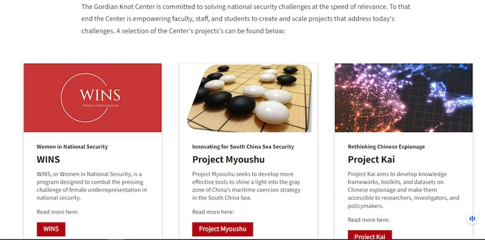
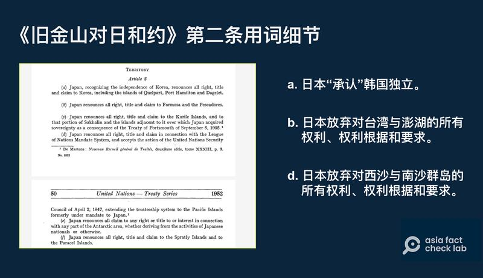

# 深度查覈 | 央視紀錄片爲南海主權提供了"鐵證"？ （下）

作者：鄭崇生

2024.06.26 14:50 EDT

過去幾年,中國和菲律賓因南海主權爭議對抗衝突不斷。除了海上短兵相接,中國央視英語頻道中國環球電視網(CGTN)製作了 [《這裏是中國南海》的紀錄片](https://youtu.be/8wGkXI5HHTA?si=QoNuB_oRZGr1D5C8),(以下簡稱"紀錄片")以實地採訪、專家訪問和歷史資料的呈現,試圖證明"南海諸島自古以來就是中國領土"。

亞洲事實查覈實驗室檢視這部紀錄片，發現片中部分說法並非歷史事實的完整呈現，是一類“觀點”而非“鐵證”。我們通過查閱資料，訪談專家，逐一查覈其中論據，以上下兩篇刊出，本篇爲下篇。

## 1. 各國對1946年的主權主張無異議？

## *1946年*   *中華民國政府畫制的*   *11*   *段線,*   *1948年*   *公佈中華民國行政區域圖(*   *administration map*   *)以及南海諸島位置圖,是中國在南海的領海主權和海域範圍,其他國家沒提出異議?*

此一說法部分屬實。

亞洲事實查覈實驗室發現，中華民國政府提出11段線（即中華人民共和國9段線）主張時，的確沒有國家針對這一主張提出異議。但在11段線宣告前，已經有國家提出對南海諸島的主權主張。

美國學者茲瑞克(Daniel Dzurek)1996年的著作 [《南沙羣島爭議:先來後到者有誰?》(The Spratly Islands Dispute: Who's On First?)](https://www.durham.ac.uk/media/durham-university/research-/research-centres/ibru-centre-for-borders-research/maps-and-databases/publications-database/Maritime-Briefings-(Vol.-2-no.-1).pdf),至今仍常爲包擴中國在內的多國學者引用。茲瑞克在書中提及,日本、法國曾在1920年-1930年間在南沙羣島頻繁活動;1930年,法國殖民中南半島多國期間,更聲明對北緯7°至12°和東經111°至117°之間的南沙羣島所有島礁擁有主權,當時中華民國政府曾通過駐法國使館 [聲明立場](https://www.roc-taiwan.org/jpna/post/438.html)。

至於爲什麼沒有國家對11段線的整體提出異議?黎蝸藤認爲,最大的可能是當時根本沒有國家知道中國劃設11段線,中國當時發佈地圖,都是中文版;儘管中文報紙刊登過,但刊出的位置也並非顯要(參見 [臺灣國史館的文章](https://www.drnh.gov.tw/var/file/3/1003/img/10/206122605.%20pdf),裏面反駁"中國沒有向各國通報"的質疑時,強調"當時中文也是聯合國公認的官方語文,並無規定一定要使用英文纔算是做了充足的國際通報。")。

黎蝸藤認爲，就算各國當時注意到也很可能不清楚其意義，“中國（民國政府）沒有宣佈過這11段線是什麼意思，實際上，至今中國也沒有明確說出9段線的準確含義。”

換言之，南海周邊各方沒有對十一段線的整體主張提出異議，但陸續有國家對個別島嶼、羣島進行主權宣示。包括：1950年，菲律賓開始塑造自己對南沙羣島有主權的說法；1956年，菲律賓明確提出對南沙羣島的主權要求。1951年舊金山會議上，獨立後的越南（保大帝政權代表）也提出對西沙和南沙羣島的主權主張。

黎蝸藤說，由此可見在中國官方劃出11段線後十多年間，就出現針對11段線內島嶼主權有異議的各國主張。因此，紀錄片中強調“各國對十一段線沒有異議”，來說明各國對島嶼和海域沒有爭議，論證並不充分。

## 2.  美國抹黑中國,還打算在仁愛礁建設軍事基地?

## *菲律賓亞洲世紀戰略研究所(*   *Asian Century Philippines Strategic Studies Institute*   *)所長勞雷爾(*   *Herman Tiu-Laurel*   *)在紀錄片中聲稱,美國有一個"妙手計劃"(*   *Myoushu Project*   *),旨在破壞中國國際聲譽,美國還計劃在仁愛礁上建立美軍作戰聯合基地,因爲仁愛礁是南海上的戰略要衝,美國還努力在第一島鏈上建立基地,四處擴充。*

此一說法缺乏證據。

[妙手計劃是美國斯坦福大學格迪安納中心(Gordian Knot Center)的項目之一](https://gordianknot.stanford.edu/projects),目前已和旨在揭露中國在海上以灰色地帶戰術、威脅恐嚇鄰國作爲的 ["海之光"(sealight)](https://gordianknot.stanford.edu/sealight)計劃合一,這一項目公佈的照片、衛星圖照或是航跡資訊,都是中國執法單位在南海上的真實行動。

"妙手計劃"相關細節在美國斯坦福大學格迪安納中心有公開信息（Gordian Knot Center網站截圖）

[公開資料顯示](https://gordianknot.stanford.edu/),專研國家安全創新的格迪安納中心是美國海軍研究辦公室(Office of Naval Research)資助成立。

至於美國計劃在仁愛礁上建立美軍作戰的聯合基地這一說法,並沒有已知證據支持。美國去年 [宣佈](https://www.defense.gov/News/News-Stories/Article/Article/3350297/new-edca-sites-named-in-the-philippines/)擴大與菲律賓的軍事合作,加速實施雙邊的《加強防務合作協議》(EDCA),要在菲律賓擴增4個軍事基地,其中位於巴拉旺島(Palawan Island)南端外海的巴拉巴克島(Balabac Island),距離南沙羣島(菲律賓稱斯普拉特利羣島)約320公里。

"美國要在南海建軍事基地"的傳聞,已經不是第一次傳播,亞洲事實查覈實驗室過去也發表過 [查覈報告](2023-08-18_事實查覈｜參議員呼籲美國租借東沙島建軍事基地？.md)。

## 3.  二戰後國際條約明確南海主權?

## *紀錄片中稱，二戰結束之後，原先由日本人非法侵佔的南海諸島，回到中國人手裏，而斷續線（九段線）不只是中國對南海主權的主張，更是二戰之後對南海秩序的一種確定？*

這個說法不乏爭議。最重要的一個爭論點就是二戰後日本投降後的 [《舊金山對日和約》](https://treaties.un.org/doc/publication/unts/volume%20136/volume-136-i-1832-english.pdf)中的文字內容。

在排除中國參與的 [《舊金山對日和約》](https://treaties.un.org/doc/publication/unts/volume%20136/volume-136-i-1832-english.pdf)中,美國主導下在關於南海的部分,只寫明日本在戰後放棄對西沙和南沙羣島的一切權利與要求,沒有明確指出將主權歸還中國。

《舊金山對日和約》原始文件中的用詞細節（截圖取自聯合國官網）

對比 [《舊金山對日和約》](https://treaties.un.org/doc/publication/unts/volume%20136/volume-136-i-1832-english.pdf)第二條的內容中,日本"承認"韓國獨立,並放棄包括濟州島、巨文島及鬱陵島在內,所有的權利、權利根據和要求;對於臺灣、澎湖、南沙及西沙羣島,日本在條約中僅提到放棄對上述島嶼的所有權利、權利根據和要求,並沒有承認或確認上述這些島嶼的領土主權歸屬。

*亞洲事實查覈實驗室(Asia Fact Check Lab)針對當今複雜媒體環境以及新興傳播生態而成立。我們本於新聞專業主義,提供專業查覈報告及與信息環境相關的傳播觀察、深度報道,幫助讀者對公共議題獲得多元而全面的認識。讀者若對任何媒體及社交軟件傳播的信息有疑問,歡迎以電郵afcl@rfa.org寄給亞洲事實查覈實驗室,由我們爲您查證覈實。*  *亞洲事實查覈實驗室在X、臉書、IG開張了,歡迎讀者追蹤、分享、轉發。X這邊請進:中文*  [*@asiafactcheckcn*](https://twitter.com/asiafactcheckcn)  *;英文:*  [*@AFCL\_eng*](https://twitter.com/AFCL_eng)  *、*  [*FB在這裏*](https://www.facebook.com/asiafactchecklabcn)  *、*  [*IG也別忘了*](https://www.instagram.com/asiafactchecklab/)  *。*

[Original Source](https://www.rfa.org/mandarin/shishi-hecha/hc-06262024144428.html)