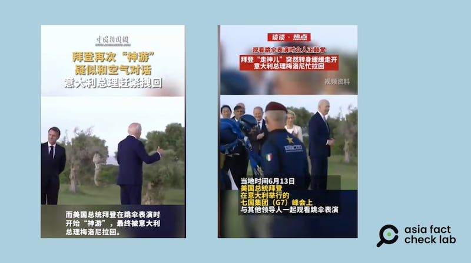
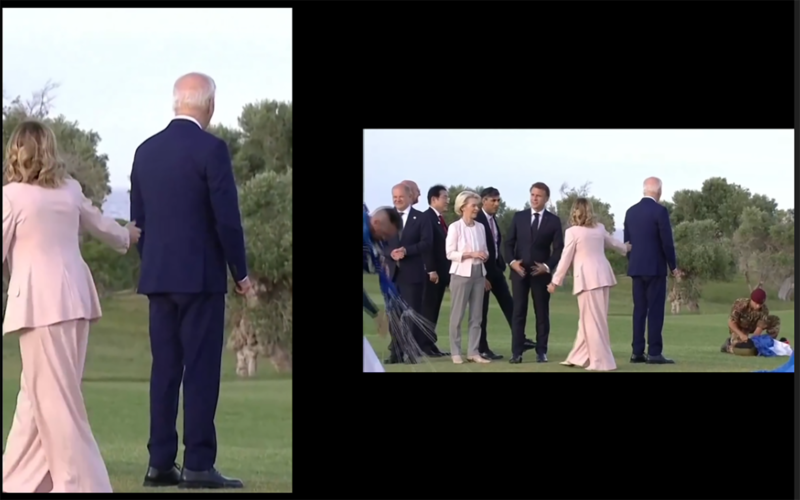
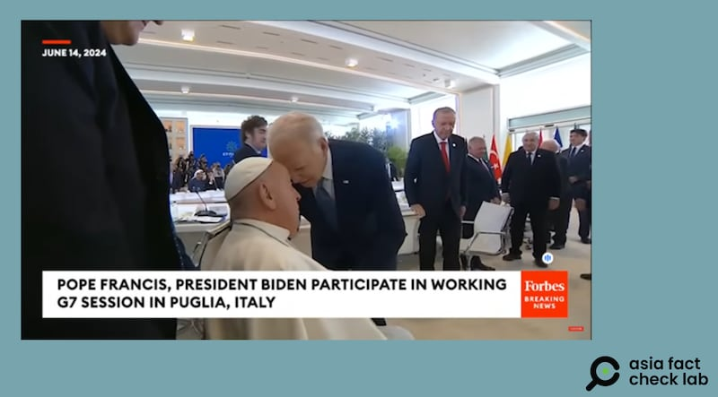
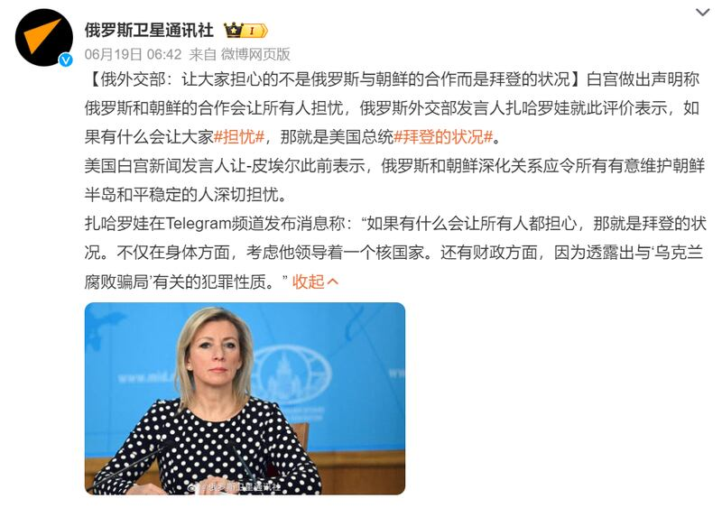

# 傳播觀察｜媒體“放大鏡”下的拜登是如何“走神”的

作者：鄭崇生

2024.06.27 15:42 EDT

"拜登又迷瞪走神、再次神遊,疑似與空氣對話",在 [中新網](https://v.douyin.com/i6Jub4AF/)、新華社旗下雜誌 [《半月談》](https://v.douyin.com/ijcGQFsV/)的抖音賬號上,"關於美國總統拜登(Joe Biden)的迷惑行爲"視頻一度霸榜,上了"抖音熱榜"排行。在中國社交媒體平臺上,一搜關鍵詞"拜登",就會出現大量拜登"不尋常行爲"的視頻,亞洲事實查覈實驗室發現,這些視頻跟最初發布的媒體報道視頻相比,都經過了剪輯與加工,且這些剪輯和加工逐漸形成一定的模式,凸顯拜登的"反應遲緩""無厘頭"和"走神",不少發佈者和評論者據此對拜登政府乃至美國的選舉制度展開批評。

然而，經過與其他現場資料的比對，亞洲事實查覈實驗室發現，這些視頻均在加工後發生了失實，而集中和反覆的傳播卻已經在媒體上塑造了拜登“老年癡呆”的“人設”，由此引發了持續的輿論。

中新社和《半月談》官方社媒賬號發佈的拜登“神遊”“走神”短視頻 圖截取自抖音

## 裁剪畫面和演繹式解說

上述豎版短視頻在製作的時候，把畫幅橫豎比爲16:9的電視轉播的畫面進行了裁剪，裁掉了原視頻裏明顯可見到的跳傘員，就呈現出“拜登似乎又與空氣對話、走神”的表象。

而這段被剪切的視頻最早出自右派立場鮮明的《紐約郵報》(New York Post),在其X [賬號](https://archive.ph/pZP3t/image)上的貼文中,拜登被指"明顯在神遊"。然而,亞洲事實查覈實驗將《紐約郵報》的豎版視頻與路透社提供的當天活動轉播畫面做對比,在沒有修剪關鍵片段與鏡頭、鏡位的狀況下,《紐約郵報》裁掉傘兵後的效果,的確使得拜登"丟失"了互動對象,顯得"無厘頭"。

[Opens in new window](https://www.youtube.com/watch?v=aQ3EBniVRI4)

點擊看視頻：《紐約郵報》豎版視頻與路透社橫版視頻對比。

## 放大細節、放慢速度

除了剪切畫面,製造話題的方式還有放大非特寫鏡頭畫面和放慢原視頻播放速度。比如拜登在G7峯會上與教宗頭碰頭問候時, [環球網的抖音](https://v.douyin.com/i62nNUBH/)視頻將這個畫面做了局部放大的處理,並判斷拜登對教宗的這個舉動,"讓一旁阿根廷總統米萊(Javier Milei)一臉震驚"。另外,《北京青年報》的 [抖音賬號](https://v.douyin.com/i62psmB4/)也將拜登在一場好萊塢名人爲他舉辦募款活動上的動作,加工並解讀爲拜登"神遊",接着又拼貼並放大了後來前總統奧巴馬(Barack Obama)拉着拜登的手一起下舞臺的畫面,解讀爲拜登失去自理能力,最終被奧巴馬牽着離開的故事。

環球網和《北京青年報》剪輯製作的拜登“迷惑”短視頻 圖截取自抖音

在 [美國媒體的完整轉播](https://youtu.be/_LCGYgdyWIo?si=4ZSIK2SfVc4G6Awz)中,米萊在拜登之前,也有跟教宗臉貼臉並擁抱的動作,因此拜登的舉動並不會顯得"特立獨行"。另外,米萊看拜登與教宗互動的連續影片中,看起來是爲躲鏡頭才退後,整個連續畫面不到一秒鐘,但環球網的視頻中,把原本不到一秒中的片段,慢速度與重複剪接撥放三次,再加上俏皮的音樂,呈現出截然不同的劇情效果。

原視頻中，在拜登向教宗致敬時，米萊並沒有回頭做出震驚表情 圖截取自福布斯官網

《北京青年報》製作的奧巴馬與拜登同臺的場景也刻意放了大了奧巴馬拉了拉拜登的手的動作。根據 [美聯社](https://apnews.com/article/biden-fundraiser-freeze-misinformation-election-efe67fe51ab189cbcbc850332969fd46)另一視角的完整連續視頻以及募款活動主持人的回應,拜登向舞臺右方致意轉身後,舞臺左邊還有支持者不斷表達鼓勵,拜登纔會停留了約5秒鐘與之互動。北青網視頻還在這段剪輯視頻上加上了音效,將微軟電腦系統關機的聲音當作背景音,凸顯拜登突然"斷片"的效果。

環球網與北青報的抖音賬號都標註了視頻來自俄國官方媒體"今日俄羅斯",另一俄國官媒"俄羅斯衛星通訊社"的 [中文微博](http://archive.today/Ic0ks)上,俄羅斯外交官扎哈羅娃公開質疑"領導着一個有核國家"的拜登,身體狀況令人擔憂。

俄外交官公開稱拜登身體狀況令人擔心 圖截取自新浪微博

## “選擇性編輯”的效果

紐約大學社交媒體與政治中心執行主任桑德森(Zeve Sanderson)告訴 [法新社](https://www.msn.com/en-us/news/world/cheapfakes-out-of-context-videos-target-biden-s-age/ar-BB1otyZg?apiversion=v2&noservercache=1&domshim=1&renderwebcomponents=1&wcseo=%201&batchservertelemetry=1&noservertelemetry=1),"選擇性編輯"的視頻剪輯手段是有效的,因爲與完全捏造或以人工智能生成的內容相比較,它們以較不明顯的方式誤導、重新定義或裁剪。

質疑拜登身心健康狀況的造假、斷章取義或移花接木的視頻，通常能迅速流傳到中文世界，拜登的競爭對手特朗普也是推手之一，上述這些視頻都已是他口中批評拜登的競選素材。中國官媒以及網絡大V也沒少當“搬運工”，推動了這些信息在中文世界的傳播。

亞洲事實查覈實驗室也就此發表過多篇查覈報告，可以點擊以下標題內的連結回顧。

[ [拜登試圖坐在空氣上？Opens in new window](2024-06-13_事實查覈｜拜登試圖坐在空氣上？.md) ]

[ [拜登老糊塗又犯了？忘了兒孫有幾人？Opens in new window](2024-03-26_事實查覈｜拜登老糊塗又犯了？忘了兒孫有幾人？.md) ]

[ [拜登稱自己在以色列出生？被質疑沒資格當美國總統？Opens in new window](2023-10-26_事實查覈｜拜登稱自己在以色列出生？被質疑沒資格當美國總統？.md) ]

[ [拜登競選演講後再次試圖"與鬼魂握手"？Opens in new window](2024-05-01_事實查覈 ｜ 拜登競選演講後再次試圖"與鬼魂握手"？.md) ]

[ [美國總統拜登又和"看不見的人"打招呼？Opens in new window](2023-07-28_事實查覈｜美國總統拜登又和"看不見的人"打招呼"？.md) ]

*亞洲事實查覈實驗室(Asia Fact Check Lab)針對當今複雜媒體環境以及新興傳播生態而成立。我們本於新聞專業主義,提供專業查覈報告及與信息環境相關的傳播觀察、深度報道,幫助讀者對公共議題獲得多元而全面的認識。讀者若對任何媒體及社交軟件傳播的信息有疑問,歡迎以電郵* *afcl@rfa.org* *寄給亞洲事實查覈實驗室,由我們爲您查證覈實。*  *亞洲事實查覈實驗室在X、臉書、IG開張了,歡迎讀者追蹤、分享、轉發。X這邊請進:中文*  [*@asiafactcheckcn*](https://twitter.com/asiafactcheckcn)  *;英文:*  [*@AFCL\_eng*](https://twitter.com/AFCL_eng)  *、*  [*FB在這裏*](https://www.facebook.com/asiafactchecklabcn)  *、*  [*IG也別忘了*](https://www.instagram.com/asiafactchecklab/)  *。*

[Original Source](https://www.rfa.org/mandarin/shishi-hecha/hc-06272024154209.html)