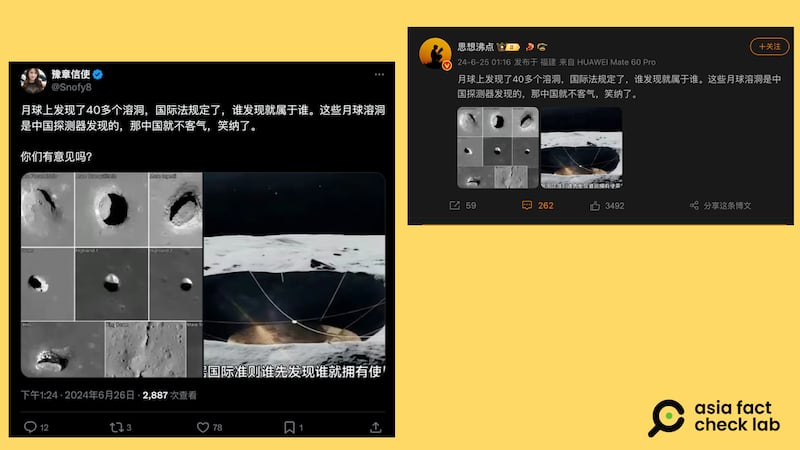

# 事實查覈｜中國探月發現40多個溶洞?國際法規定“先到先得”？

作者：董喆

2024.06.28 14:37 EDT

## 查覈結果：錯誤

## 一分鐘完讀：

中國探月工程嫦娥六號於6月25日返回地球，此次探月任務從月球背面帶回樣品，中國國家航天局還公佈系列月背面拍攝照片，引發社交媒體再度對探月的熱議。其中，有社媒賬號聲稱，此次嫦娥六號“發現了四十多個溶洞”，並稱中國“依照國際法”可以擁有這些溶洞。

經查覈，這是錯誤資訊。中國官方對嫦娥六號的官方發佈中並未提及“發現40多個溶洞”的內容。並且，根據《外太空條約》以及《月球協定》，任何國家不得對外太空及天體主張主權。此外，這篇貼文中引用的照片也非此次嫦娥六號拍攝的照片，而是十幾年前美國NASA月球勘測軌道飛行器（LRO）過往的探勘資料。

## 深度分析：

歷經53天,中國探月工程嫦娥六號的返回器於6月25日返回地球,並帶回從月球背面採得的樣本。微博賬號" [思想沸點](https://ghostarchive.org/archive/dnaMS)"和以及X(原推特)賬號上" [豫章信使](https://x.com/Snofy8/status/1805834384525959483)"帳號等稱,嫦娥六號登月"發現了四十多個溶洞,依照國際法規定,是誰發現就是屬於誰的,因此中國可以擁有這些溶洞",並附上一張由14個黑白坑洞影像的合成圖。

該說法還被做成短視頻進一步傳播，在網易、好看視頻等平臺一再轉傳，並有中國將“掌握資源開發先機”、“美國只能眼饞”等評論。

中國社羣媒體流傳說法，稱中國在月球上發現溶洞，“誰發現就屬於誰”。經查覈，該說法爲錯誤信息（圖/微博、X截圖）

相關文章: [事實快查|美國登月是否造假再成熱點,這五則傳言有問題](2024-05-22_事實快查｜美國登月是否造假再成熱點，這五則傳言有問題.md)

## 中國官方並未通報“發現四十多個溶洞”

亞洲事實查覈實驗室(AFCL)查證,中國國家航天局的確在6月4日釋出由嫦娥六號拍攝的 [月背系列影像圖](https://www.cnsa.gov.cn/n6758823/n6758838/c10543340/content.html),當中包含多個直徑十多公里的環形坑。但該發佈並未對影像中的環形坑進一步解釋。並且,這些照片與社羣流傳的發現"月球溶洞"照片並不相符。

AFCL以圖反搜,發現上述帳號所傳的照片其實出自 [美國NASA](https://www.nasa.gov/solar-system/lunar-pits-could-shelter-astronauts-reveal-details-of-how-man-in-the-moon-formed/)。 2009年美國發射月球勘測軌道飛行器(LRO),持續拍攝月球表面的高解析照片,上述說法中展示的"月球溶洞"照片實爲由LRO收集的隕石坑照片,與中國嫦娥六號登月任務無關。

6月28日,中國國家航天局舉行嫦娥六號任務的 [新聞發佈會](https://www.cnsa.gov.cn/n6758967/n6758969/c10567662/content.html),介紹此次登月任務的各項成果,其中也並未提及"發現四十多個溶洞"的內容。

## 外太空主權並非“先到先得”

即使真的有新發現，國際法是否規定月球表面坑洞的主權屬於首個發現的國家？

亞洲事實查覈實驗室檢視兩個與外太空包含的國際法條，內容皆顯示任何國家或政治實體不得對外太空以及天體主張主權。

首先是由聯合國1966年通過、1967年生效的《Principles governing the Activities of States in the Exploration and Use of Outer Space, including the Moon and Other Celestial Bodies》,簡稱《 [外太空條約](https://www.un.org/zh/documents/treaty/A-RES-34-68)》,第二條即規定"外空,包括月球與其他天體,不得由國家以主張主權或以使用或佔領之方法,或以任何其他方法,據爲己有。"

另外1979年的《Agreement Governing the Activities of States on the Moon and Other Celestial Bodies》,簡稱《 [月球協定](https://www.un.org/zh/documents/treaty/A-RES-34-68)》,當中第11條載明"月球不得由國家依據主權要求,通過利用或佔領,或以任何其他方法據爲已有"且"月球的表面或表面下層或其任何部分或其中的自然資源均不應成爲任何國家、政府間或非政府國際組織、國家組織或非政府實體或任何自然人的財產。 "

根據聯合國資料, [中國有簽署《外太空條約》](https://treaties.unoda.org/t/outer_space/participants),但 [並未簽署《月球協定》](https://treaties.unoda.org/t/moon/participants),不過"國際法規定月球表面坑洞主權屬於首個發現國"仍是錯誤資訊。

*亞洲事實查覈實驗室(Asia Fact Check Lab)針對當今複雜媒體環境以及新興傳播生態而成立。我們本於新聞專業主義,提供專業查覈報告及與信息環境相關的傳播觀察、深度報道,幫助讀者對公共議題獲得多元而全面的認識。讀者若對任何媒體及社交軟件傳播的信息有疑問,歡迎以電郵*  [*afcl@rfa.org*](mailto:afcl@rfa.org)  *寄給亞洲事實查覈實驗室,由我們爲您查證覈實。* *亞洲事實查覈實驗室在X、臉書、IG開張了,歡迎讀者追蹤、分享、轉發。X這邊請進:中文*  [*@asiafactcheckcn*](https://twitter.com/asiafactcheckcn)  *;英文:*  [*@AFCL\_eng*](https://twitter.com/AFCL_eng)  *、*  [*FB在這裏*](https://www.facebook.com/asiafactchecklabcn)  *、*  [*IG也別忘了*](https://www.instagram.com/asiafactchecklab/)  *。*

[Original Source](https://www.rfa.org/mandarin/shishi-hecha/hc-06282024143707.html)