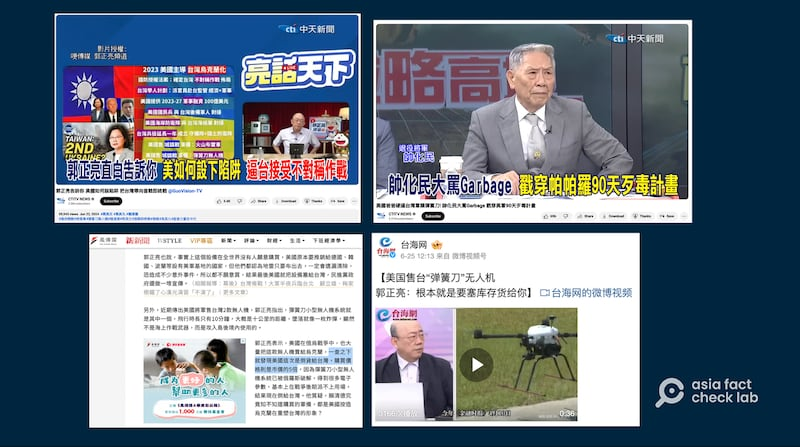
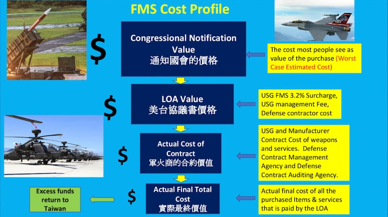

# 傳播觀察｜"疑美"熱點解析：美國對臺軍售"又爛又貴"？

作者：莊敬

2024.07.02 16:25 EDT

美國政府6月中宣佈對臺銷售兩款攻擊型無人機飛彈系統，總額約3.6億美元。這起軍售案再度掀起“疑美論”，部分臺灣評論人士在電視、網路節目指控美國售臺的無人機“毫無用處”“貴得離譜”，言論經兩岸媒體轉載後，話題延燒至今熱度不減。

亞洲事實查覈實驗室（AFCL）通過向美國國務院查證，採訪軍事專家，和比對官方公開資料與相關報道，發現前述評論人在欠缺證據的情況下，傳播了誤導信息。

## 臺"名嘴"批軍售案 兩岸媒體傳播發酵

美東時間6月18日,美國國防安全合作局(DSCA)發佈兩則新聞稿,公告行政部門已通知國會,將對臺灣出售720架" [人員殺傷型(彈簧刀300)](https://www.dsca.mil/press-media/major-arms-sales/taipei-economic-and-cultural-representative-office-united-states-33)"等軍備和服務,這筆軍售約6020萬美元;另批准至多291套" [反裝甲型(ALTIUS 600M)](https://www.dsca.mil/press-media/major-arms-sales/taipei-economic-and-cultural-representative-office-united-states-34)"無人機系統,這筆軍售約3億美元。

美國宣佈對臺軍售後不久，臺灣前立委郭正亮便在個人網路節目《亮話天下》說，“有人去查，美國這次倒貨給臺灣，價格是市價的五倍⋯⋯美國爲什麼倒貨給臺灣，爲什麼沒有人要買，因爲這款無人機炸彈系統在俄烏戰爭被俄羅斯破解了⋯⋯”。

《亮話天下》在YouTube" [郭正亮頻道](https://www.youtube.com/watch?v=dzAwVsZdhm0)"、 [哏傳媒](https://www.youtube.com/watch?v=ERu_HjbWH8I)、 [中天新聞](https://www.youtube.com/watch?v=a9r3CkyI8Uw)等平臺播放,而郭正亮質疑"彈簧刀300"用處和價格的內容,獲 [風傳媒](https://archive.ph/o35fW)等媒體引述報道,並經 [Yahoo!新聞](https://ynews.page.link/cMSWE)轉載。郭正亮也在《國際直球對決》等其他節目上發表類似論述,稱這筆軍售"貴得離譜",這些言論也被 [中時新聞網](https://ynews.page.link/FGYR3)、 [Nownews](https://www.nownews.com/news/6455803)等多家媒體引述。

臺灣評論人士在節目上批評美國對臺軍售又貴又爛，言論經兩岸媒體引述報道。（YouTube、微博、風傳媒截圖）

除了郭正亮,據 [中時新聞網](https://www.chinatimes.com/realtimenews/20240623001294-260407?chdtv)報道,另一位"名嘴"帥化民在 [中天節目](https://www.youtube.com/watch?v=1pPdRUOMpTM)上,直批彈簧刀300型無人機"是垃圾";另據 [中天新聞網](https://ynews.page.link/RwSzo)報道,退將慄正傑在中天節目上說,美國軍售臺灣彈簧刀無人機,是把臺灣"當盤子"(盤子:臺方言,指好騙,容易被佔便宜)。

上述臺灣評論人士的言論,不僅透過臺灣各大媒體引述報道,也傳到中國媒體,包括 [鳳凰網](https://i.ifeng.com/c/8aeJinPf6JP)、 [騰訊網](https://new.qq.com/rain/a/20240620A02GRH00)轉載了《海峽導報》的相關報道,也出現在 [臺海網的微博視頻號](https://m.weibo.cn/detail/5049125702209135),並經多位 [微博](https://m.weibo.cn/detail/5049242731681271)、 [網易](https://m.163.com/v/video/VU4LJ0243.html)用戶分享,在兩岸輿論場上熱議多日。

## 軍事專家怎麼說？

前述評論人的批評大致分爲三點：武器太貴、沒用、沒人要。多數評論人士僅提出其個人見解，並未說明他們引用的數據或資料來源。亞洲事實查覈實驗室透過檢視公開報道與資料、採訪專家、向官方查證等方式，對上述言論的準確性進行驗證。

評論聲稱沒有其他國家要買"彈簧刀300",但根據製造商空境公司(AeroVironment)發佈的 [新聞稿](https://www.avinc.com/resources/press-releases/view/aerovironment-awarded-64.6-million-contract-by-u.s-army-for-switchblade-300-loitering-missile-systems),以及軍聞網站 [Army Recognition](https://armyrecognition.com/news/army-news/army-news-2023/aerovironment-from-us-to-procure-switchblade-300-loitering-missile-to-france-and-allied-nations)報道,法國與另一個美國盟國在2023年採購了這款攻擊型無人機系統,計劃今年7月交付。至於"彈簧刀300"在戰場上的表現,包括《金融時報》《國家利益》雜誌等媒體都有所報道,指它體積小、技術含量相對較低,適合烏克蘭抵抗運動,但隨著俄羅斯改進其電子戰系統,發送假信息干擾無人機導航,烏克蘭逐漸減少使用無人機。

美國智庫“國際評估與戰略中心”資深研究員費學禮（Richard Fisher）告訴亞洲事實查覈實驗室，臺灣迫切需要數千架此類無人機系統，以抵擋解放軍的空降和兩棲入侵部隊，而且用各種無人機系統對抗解放軍，使對方的防禦需求複雜化，對臺灣而言也是個好策略。費學禮並說，當然臺灣也可以像烏克蘭一樣，把數千架中國製造的便宜業餘無人機變成武器，但這些無人機的軟體有可能會被解放軍控制。

曾任職於美國國防部、美國在臺協會（AIT）、雷神公司的胡振東（Tony Hu）則認爲，烏克蘭和臺灣的使用情況不同，“彈簧刀300”相對適合臺灣的環境，因爲會用於海上，敵人沒有什麼建築物可躲藏，不像在烏克蘭。

臺灣國防部6月24日發佈 [新聞稿](https://www.mnd.gov.tw/Publish.aspx?p=83126&title=%e5%9c%8b%e9%98%b2%e6%b6%88%e6%81%af&SelectStyle=%e6%96%b0%e8%81%9e%e7%a8%bf)說明,部分人士評論"陸軍採購攻擊無人機不符作戰需求"陳述內容欠缺考證,並不屬實。國防部並表示,各型無人機爲現在戰場不對稱戰力的重要運用方式,臺灣採購的兩款無人機系統,具偵打一體功能,操作簡單,爲美軍現役裝備。

## 評論稱"貴得離譜"有根據嗎？

部分評論人士和網紅尤其關注"彈簧刀300"的價格,包括郭正亮稱"有人去查,美國這次倒貨給臺灣,價格是市價的五倍價格";在微博擁有390多萬粉絲的 ["小凡好攝"](https://m.weibo.cn/u/1659893422?luicode=10000011&lfid=100103type%3D61%26q%3D%E5%8F%B0%E7%81%A3%20%E8%BB%8D%E5%94%AE%26t%3D)稱根據NBC報道稱,"彈簧刀300"的建造成本僅6000美元。

亞洲事實查覈實驗室發現,有關"彈簧刀300"的成本,網上出現好幾種金額。例如,"小凡好攝"所引用的 [NBC報道](https://www.nbcnews.com/politics/national-security/ukraine-asks-biden-admin-armed-drones-jamming-gear-surface-air-missile-rcna20197)中,確實提及"據估計,彈簧刀300的價格可能僅爲6000美元。"但根據美國軍方公開的 [2023財年預算文件](https://www.asafm.army.mil/Portals/72/Documents/BudgetMaterial/2023/Base%20Budget/Procurement/MSLS_ARMY.pdf),"彈簧刀300"的單位成本爲52914美元。

然而，胡振東告訴亞洲事實查覈實驗室，“一個武器多少錢”這種比較沒有意義，“因爲臺灣不是買一個飛彈，而是買capability（作戰能力），所以會有訓練、（零）部件等很多東西加進去。”胡振東說明，目前在通知國會的程序，公告價格只是估計，這個階段會把所有可能發生的事情加入，價格會比較高，雙方談合約時纔是真的價錢。

過去面對外界質疑F-16V採購價時,臺灣空軍司令部曾提出 [單機價格資料](https://www.mnd.gov.tw/Publish.aspx?p=76656&title=%E5%9C%8B%E9%98%B2%E6%B6%88%E6%81%AF&SelectStyle=%E6%96%B0%E8%81%9E%E7%A8%BF),顯示臺灣採購單價比起巴林、斯洛伐克、摩洛哥、保加利亞等採購國,並沒有更貴。但空軍司令部也特別說明,F-16V(BLK70/72)採購國,各國採購品項不盡相同,價格資訊爲參考使用。根據DSCA的公告, [臺灣](https://www.dsca.mil/press-media/major-arms-sales/taipei-economic-and-cultural-representative-office-united-states-11)、 [巴林](https://www.dsca.mil/press-media/major-arms-sales/government-bahrain-f-16v-aircraft-support)、 [斯洛伐克](https://www.dsca.mil/press-media/major-arms-sales/slovakia-f-16-block-7072-v-configuration-aircraft)、 [摩洛哥](https://www.dsca.mil/press-media/major-arms-sales/morocco-f-16-block-72-new-purchase)、 [保加利亞](https://www.dsca.mil/press-media/major-arms-sales/bulgaria-f-16cd-block-7072-aircraft-support)雖然都向美國採購F-16V戰機,但購買的品項、數量、供貨期程並不相同,因此以採購單價推估是否買貴,意義不大。

美國國務院官員回覆亞洲事實查覈實驗室表示，美國政府與包括臺灣在內的外國合作伙伴密切合作，依據他們的特定需求進行對外軍售。基於這些系統對臺灣而言是新引進的，這筆軍售案不僅涉及軍備系統本身的需求，還涉及臺灣成功引進與維持該系統所需的相關部件和服務。

美國對外軍售說明圖表（胡振東提供）

胡振東表示，部分評論人士並沒有實際參與軍售的經驗，在“亂講”。他認爲這是“疑美論”，是中國認知戰的一部分，希望大部分臺灣人民能夠睜大眼睛，認清錯假信息。

## 軍售案遭疑"貴五倍"不是第一次

近幾年美國公告對臺軍售後,兩岸輿論場上反覆出現"疑美論",質疑美國售臺的武器"又爛又貴"。其中一例是臺灣的節目主持人,時爲國民黨副總統候選人的趙少康,曾在去年底舉辦的政見會上,質疑臺灣採購MQ-9B無人機買貴五倍,臺灣國防部隨後發佈 [新聞稿](https://www.cna.com.tw/news/aipl/202312230055.aspx)澄清。且在臺灣副總統政見會之前,臺灣事實查覈中心也已經針對網傳"買貴五倍"的說法發佈過 [查覈報告](https://tfc-taiwan.org.tw/articles/9244)。

另一例是亞洲事實查覈實驗室今年初發布的 [《臺灣花大價錢從美國買F-16"落伍戰機",是"冤大頭"?》](2024-01-03_事實查覈｜ 臺灣花大價錢從美國買F-16"落伍戰機"，是"冤大頭"？.md),查覈結果爲"錯誤"。 [美國之音(VOA)"揭謊頻道"](https://www.voacantonese.com/a/fact-check-us-outdated-overpriced-weapons-to-taiwan/7217624.html)、 [臺灣事實查覈中心](https://tfc-taiwan.org.tw/articles/6568)等單位,也都曾針對不同軍售案的傳言進行查覈。

根據 [臺灣資訊環境研究中心(IORG)報告](https://iorg.tw/a/us-skepticism-238),2021年8月拜登政府首次對臺軍售,便出現指控所購軍備是"廢鐵""天價"、軍售是"騙錢"的論述。然而這些年來,相似劇本不斷上演,這次無人機軍售案也不例外。

此外,對於這件無人機軍售案,臺灣 [國防部](https://www.mnd.gov.tw/Publish.aspx?p=83109&title=%e5%9c%8b%e9%98%b2%e6%b6%88%e6%81%af&SelectStyle=%e6%96%b0%e8%81%9e%e7%a8%bf)、 [外交部](https://www.mofa.gov.tw/News_Content.aspx?n=95&s=117575)等單位表示歡迎與感謝, [中國外交部](https://www.mfa.gov.cn/web/wjdt_674879/fyrbt_674889/202406/t20240620_11439108.shtml)則一貫反對,指控美國對臺出售武器,嚴重違反一箇中國原則和中美三個聯合公報,特別是"八一七公報"規定。有關美國對臺軍售是否違反"八一七公報",亞洲事實查覈實驗室也曾發佈詳細 [報告](2023-03-07_事實查覈 ｜ 美國對臺軍售違反《八一七公報》規定嗎？.md)。

*亞洲事實查覈實驗室(Asia Fact Check Lab)針對當今複雜媒體環境以及新興傳播生態而成立。我們本於新聞專業主義,提供專業查覈報告及與信息環境相關的傳播觀察、深度報道,幫助讀者對公共議題獲得多元而全面的認識。讀者若對任何媒體及社交軟件傳播的信息有疑問,歡迎以電郵*  [*afcl@rfa.org*](mailto:afcl@rfa.org)  *寄給亞洲事實查覈實驗室,由我們爲您查證覈實。* *亞洲事實查覈實驗室在X、臉書、IG開張了,歡迎讀者追蹤、分享、轉發。X這邊請進:中文*  [*@asiafactcheckcn*](https://twitter.com/asiafactcheckcn)  *;英文:*  [*@AFCL\_eng*](https://twitter.com/AFCL_eng)  *、*  [*FB在這裏*](https://www.facebook.com/asiafactchecklabcn)  *、*  [*IG也別忘了*](https://www.instagram.com/asiafactchecklab/)  *。*

[Original Source](https://www.rfa.org/mandarin/shishi-hecha/hc-07022024161914.html)