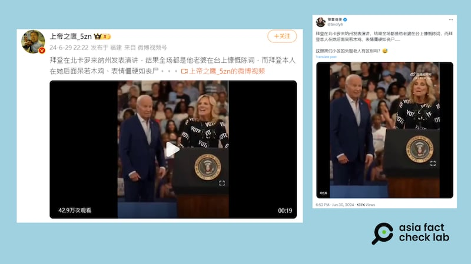

# 事實快查｜美國總統首場辯論後 這些傳言有問題

作者：莊敬、艾倫

2024.07.03 14:02 EDT

2024年美國總統大選的首場辯論在美東時間6月27日晚間舉行。民主黨籍現任總統拜登（Joe Biden）與共和黨籍的對手、前總統特朗普（Donald Trump）再度交鋒。辯論結束後，針對華文輿論場上流傳一些錯誤、誤導的說法，亞洲事實查覈實驗室做了如下幾條查覈。

## 一、特朗普說"普京從未入侵過烏克蘭"？

## 查覈結果：錯誤

6月28日,X上出現 [一則視頻](https://x.com/milpitas95035/status/1806507408421732765),文案稱特朗普替普京辯護,在辯論會上說普京從未侵略烏克蘭,發文者爲藍勾勾帳號"郭寶勝",文章附上一張CNN的辯論會截圖。

該貼文發佈三天內已經累積超過十萬則觀看及五十則轉發。

X中文賬號轉發CNN選舉辯論片段，稱特朗普說普京未曾入侵烏克蘭。（X截圖）

經查，特朗普的原話在CNN辯論直播28分58秒處。亞洲事實查覈實驗室翻譯如下：

*原文：As far as Russia and Ukraine, if we had a real president, a president that knew, that was respected by Putin, he would’ve never invaded Ukraine.*

*參考翻譯： 就俄羅斯和烏克蘭而言，如果我們有一個真正的總統，一個被普京尊重的總統，他就絕不會入侵烏克蘭。*

參考原文，特朗普此段話意在批評拜登應對烏俄戰爭不力，而並非說“普京從未侵略烏克蘭”。

原發文者郭寶勝也已再次發文 [承認原文翻譯不準確](https://x.com/milpitas95035/status/1806685534422454366),並解釋自己想傳達的是特朗普不該美化普京的侵略行爲,但並未刪除原文。

## 二：拜登決定退出競選？

## 查覈結果：缺乏證據

選舉後幾日,有多個微博"大V"帳號發文( [1](https://m.weibo.cn/detail/5051532456755505), [2](https://m.weibo.cn/detail/5051532456755505),  [3](https://m.weibo.cn/detail/5051308409359047)),宣稱"拜登要退選了",並附上福克斯新聞前主播、現政治評論員奧萊利(Bill O'Reilly)的社媒發文截圖爲證。

奧萊利6月30日在社媒X上 [發文](https://twitter.com/srobhartkopf/status/1807489423468064869),稱"總統已決定退出競選",並稱原因是民主黨認爲拜登無法從辯論的失敗中恢復、拜登競選資金枯竭。在社媒文章中,奧萊利沒有提供任何消息來源,但他的說法迅速廣傳,也在中文社媒引起討論。

多位微博用戶引述美國政治評論員奧萊利的社媒發文，稱美國總統拜登已經決定退出競選。（微博截圖）

拜登與特朗普辯論後, [CNN](https://edition.cnn.com/2024/06/28/politics/debate-poll-cnn-trump-biden/index.html)、 [CBS](https://www.cbsnews.com/news/poll-debate-should-biden-be-running-mental-abilities/)等民調顯示,選民對拜登表現失望,也有 [媒體](https://www.nytimes.com/2024/06/28/opinion/biden-election-debate-trump.html)和評論人士掀起"換拜"聲浪,認爲拜登不該繼續競選。

雖然如此,截至7月3日,並無官方消息宣佈拜登退選。針對奧萊利在社媒上發佈有關拜登決定退選的消息,事實查覈網站《PolitiFact》已 [發佈查覈報告](https://www.politifact.com/factchecks/2024/jul/01/bill-oreilly/no-as-of-july-1-president-joe-biden-hadnt-quit-his/),拜登競選團隊發言人表示,奧萊利的發文不實。

## 三、辯論後拜登首場活動，全場只能靠夫人致辭？

## 查覈結果：誤導

6月28日,拜登在辯論之後首次露面,於北卡羅萊納州參加競選造勢活動,引起許多關注與媒體報道。然而,在微博上擁有247萬粉絲的大V用戶" [上帝之鷹\_5zn](https://weibo.com/1647486362/OlhFX1IYF?type=repost)"發佈一則19秒短視頻,畫面是第一夫人吉爾·拜登(Jill Biden)在臺上發言,拜登站在一旁聆聽,視頻配文寫着:"全場都是他老婆在臺上慷慨陳詞⋯⋯"。這則短視頻並經AFCL多次查覈的X"藍勾勾"用戶" [豫章信使](https://twitter.com/Snofy8/status/1807366562988343616)"轉發。

部分中文社媒用戶發佈短視頻，稱美國總統拜登到北卡活動，結果全場都是第一夫人在臺上慷慨陳詞。（微博、X截圖）

根據 [C-Span完整視頻](https://www.c-span.org/video/?536586-1/president-biden-campaigns-raleigh-north-carolina),吉爾·拜登爲活動開場,大約自視頻1分鐘處上臺致詞,至視頻5分15秒處下臺擁抱下一位致詞嘉賓、教育家菲茨(Eric Fitts),其發言約4分多鐘。拜登約在視頻9分10秒處上臺演講,講到視頻29分38秒,演講時長20分鐘。

在這個演講中,拜登在演講中解釋了自己辯論時的欠佳表現, [《紐約時報》](https://www.nytimes.com/2024/06/28/us/politics/biden-rally-debate.html)等主流媒體對發言內容進行了詳細報道。但這則影片僅剪輯吉爾·拜登發言的十幾秒片段,傳播"全場都是拜登老婆在臺上慷慨陳詞"的誤導信息。

*亞洲事實查覈實驗室（Asia Fact Check Lab）針對當今複雜媒體環境以及新興傳播生態而成立。我們本於新聞專業主義，提供專業查覈報告及與信息環境相關的傳播觀察、深度報導，幫助讀者對公共議題獲得多元而全面的認識。讀者若對任何媒體及社交平臺傳播的信息有疑問，歡迎以電郵afcl@rfa.org寄給亞洲事實查覈實驗室，由我們爲您查證覈實。*

*亞洲事實查覈實驗室在X、臉書、IG開張了，歡迎讀者追蹤、分享、轉發。 X這邊請進：中文@asiafactcheckcn；英文：@AFCL\_eng、FB在這裏、IG也別忘了。*

[Original Source](https://www.rfa.org/mandarin/shishi-hecha/hc-07032024135414.html)