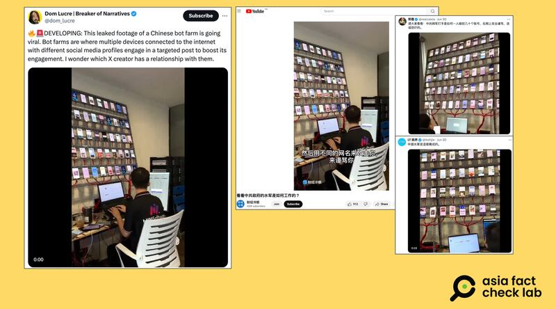
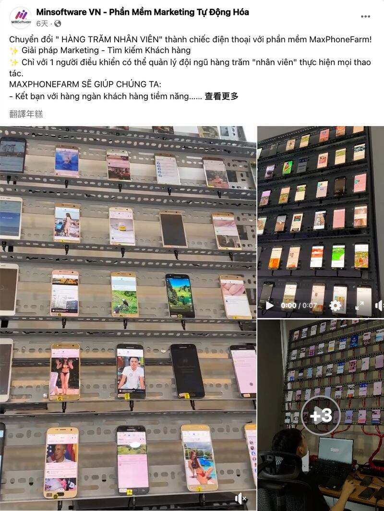

# 事實查覈｜網傳影像爲中國網軍資料外泄？

作者：莊敬

2024.07.05 18:00 EDT

## 查覈結果：錯誤

## 一分鐘完讀：

近日X、YouTube等平臺流傳一則短視頻，畫面中幾名男子操作連接着數十支手機的電腦。部分轉傳者的配文寫着：“這段泄漏中共水軍的影像（leaked footage）正在瘋傳”、“看看中共政府的水軍是如何工作的”。

亞洲事實查覈實驗室查詢到原始視頻，實爲一家越南網絡營銷公司的宣傳資料，該視頻公開發布在該公司官方頁面，並非所謂祕密資料“泄漏”，並且，目前並沒有證據證明該視頻與中國網軍有關。

## 深度分析：

"這段泄漏中共機器人水軍的影像正在瘋傳。(This leaked footage of a Chinese bot farm is going viral.)"X平臺上獲認證的"藍勾勾"用戶" [Dom Lucre](https://x.com/dom_lucre/status/1807109826360889500)"6月底發文,並附上一則短視頻,畫面中有三名男子操作面前的電腦,而每臺電腦的上方都連接着數十支手機,背景音爲幾名男子以東南亞語言交談。

隨後,X上其它"藍勾勾"用戶包括" [LT視界](https://twitter.com/ltshijie/status/1807104651214393694)"、" [蔡霞](https://twitter.com/realcaixia/status/1807226459313893664)"等帳號也分享了這則短視頻,配文寫着"中國水軍是這樣養成的"、"請大家看看:中共網軍打手是如何一人操控幾十個帳號,在網上攻擊謾罵、造謠恐嚇的。"此外,YouTube帳號" [財經冷眼](https://www.youtube.com/watch?v=NkbLIPLTcE4)"也發佈同一視頻,標題爲"看看中共政府的水軍是如何工作的"。

其中，“財經冷眼”與“蔡霞”發佈的視頻以中文男聲配音稱：“大家看平時在網路上攻擊、謾罵你的水軍和粉紅是什麼樣子，大概就是這個樣子，一臺筆記本連幾十個手機，然後用不同的網名來攻擊你，來謾罵你”。

近日在X、YouTube等平臺上流傳一則短視頻，發文者稱是中國水軍的工作畫面。（圖取自X、YouTube）

仔細看視頻,在11秒處可以看到畫面中男子身上的黑衣寫着"MINSoftware"。亞洲事實查覈實驗室根據此關鍵詞搜尋後發現,這是一家登記在越南的軟件公司的名稱,根據其 [網站介紹](https://minsoftware.vn/),該公司提供有助於管理社媒粉絲專頁的數位行銷解決方案,標榜可以節省廣告費用、人員和時間。

而"MINSoftware"6月26日在其 [公司臉書賬號頁面](https://www.facebook.com/61550567098549/videos/pcb.122183939732018903/1112164803182003)發佈三段畫面,以宣傳該公司的行銷解決方案。其中一段正是這段被許多社媒用戶瘋傳,宣稱"泄漏中共水軍"的短視頻。

越南公司“MINSoftware”在臉書發佈三則宣傳視頻，其中一則就是網傳所謂“中共水軍泄漏畫面”。(圖取自臉書)

"MINSoftware"於7月1日在 [臉書發文](https://www.facebook.com/photo?fbid=122184891362018903&set=pcb.122184891410018903),表示他們發現有社媒帳號使用其發佈的產品視頻、傳播針對特定宗教的不實信息。不過,這則發文並未針對網傳"中共水軍"的消息說明,亞洲事實查覈實驗室7月1日向"MINSoftware"發送電子郵件,詢問他們是否與中國政府有關,至截稿前尚未獲回覆。

中國的互聯網"水軍"惡意 [傳播假信息](https://foreignpolicy.com/2016/05/19/meet-the-chinese-internet-trolls-pumping-488-million-posts-harvard-stanford-ucsd-research/)、 [騷擾異見人士](https://www.cnn.com/2023/11/13/us/china-online-disinformation-invs/index.html)等操作確實持續多年,並有不少媒體報道。然而就目前所知的證據,並不能證明這則網傳短視頻與"中共水軍"有關。該視頻爲越南公司的公開宣傳片段,所謂"泄漏中共水軍的影像"爲錯誤陳述。至於畫面中男子處理的業務是否與中國有關,尚缺乏證據。

*亞洲事實查覈實驗室（Asia Fact Check Lab）針對當今複雜媒體環境以及新興傳播生態而成立。我們本於新聞專業主義，提供專業查覈報告及與信息環境相關的傳播觀察、深度報道，幫助讀者對公共議題獲得多元而全面的認識。讀者若對任何媒體及社交軟件傳播的信息有疑問，歡迎以電郵afcl@rfa.org寄給亞洲事實查覈實驗室，由我們爲您查證覈實。*

*亞洲事實查覈實驗室在X、臉書、IG開張了，歡迎讀者追蹤、分享、轉發。X這邊請進：中文@asiafactcheckcn；英文：@AFCL\_eng、FB在這裏、IG也別忘了。*

[Original Source](https://www.rfa.org/mandarin/shishi-hecha/hc-chinese-bot-leaked-footage-07052024175935.html)