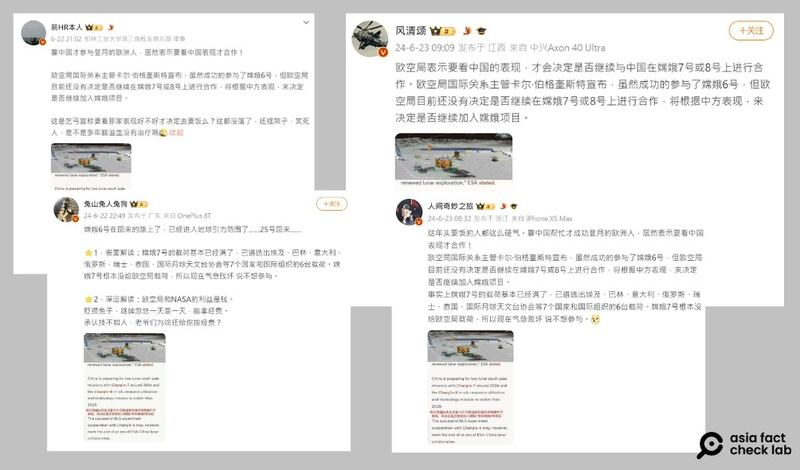
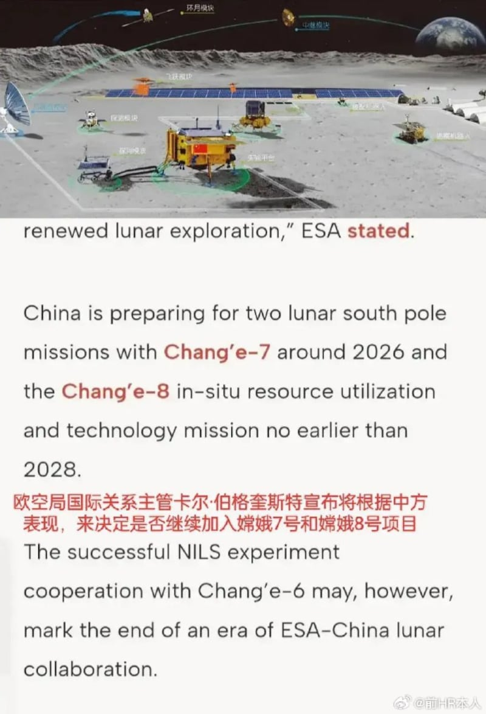

# 事實查覈｜歐洲要“看中國表現”再決定是否參與新太空計劃？

作者：艾倫

2024.07.06 10:37 EDT

## 查覈結果：錯誤

## 一分鐘完讀：

六月底，中文社交媒體上盛傳，歐洲航空局（ESA）雖然和中國成功合作了“嫦娥六號”登月計劃，但歐洲要不要加入中國新的登月計劃，還要“看中方表現”決定。

這則消息引發網友議論，批評歐空局“得了便宜還賣乖”。但經查覈發現，傳言引證的報道並沒有提到前述說法，關鍵翻譯也有錯誤。

## 深度分析：

近期,數個微博"大V"傳播一則消息稱,歐洲航空局國際關係主管卡爾∙伯格奎斯特(Karl Bergquist)宣佈,歐洲雖然成功參與中國"嫦娥六號"登月計劃,但是否加入未來新的登月項目,"將根據中方表現"決定。網傳消息附有一張美國《太空新聞》(SpaceNews) [報道截圖](https://archive.ph/oHOXg)以及部分翻譯。

轉傳的賬號包括 [前HR本人](https://archive.ph/jfjLD)、 [風清頌](https://archive.ph/e08MF)、 [人間奇妙之旅](https://archive.ph/6m7CL)及 [兔山兔人兔狗](https://archive.ph/mjLRw),其中"前HR本人"在轉發後五天內獲得超過五千個贊和近千則留言,一些網民批歐空局"白嫖又要擺架子""就是個乞丐"。

歐洲航空局“將看中國表現”決定是否合作未來太空計劃的消息在微博廣傳 圖截取自新浪微博

然而，傳言所附截圖上的“翻譯”和《太空新聞》的報道內容並不相符。以下是截圖部分原文的翻譯：

“中國正在準備兩個月球南極任務，分別是2026年左右的‘嫦娥七號’和最快2028年進行的‘嫦娥八號’當地資源運用和技術任務。

然而，與‘嫦娥六號’的月球表面負離子實驗成功合作，可能標誌着歐空局中國月球合作時代的結束。”

網傳截圖中的報道原文經查和網帖的中文“翻譯”無關

不僅網傳報道截圖的英文內容並沒有提到歐空局要“看中國表現”決定是否繼續合作新的太空計劃，原報道也有說明歐空局不再參與未來計劃的原因。

《太空新聞》指出，歐空局說未來將不會參與中國主導的國際月球科研站（ILRS），主因爲這是中俄的共同合作項目，而歐空局目前禁止與俄羅斯進行任何太空合作。

2021年6月，中國和俄羅斯在聖彼得堡正式提出了一項聯合太空藍圖，預計2030年代間要透過發射超重型火箭打造一個機器人化的月球基地。

莫斯科和北京曾希望吸引歐空局及其成員國參與此項目，但自從2022年2月俄羅斯入侵烏克蘭後，任何合作前景皆已腰斬。

歐空局回應亞洲事實查覈實驗室時再次確認，未來不打算繼續和中國合作新的嫦娥計劃。因此無論是根據原報道或歐空局的說法，都沒有網傳翻譯裏所說“看中國表現”的說法。

*亞洲事實查覈實驗室（Asia Fact Check Lab）針對當今複雜媒體環境以及新興傳播生態而成立。我們本於新聞專業主義，提供專業查覈報告及與信息環境相關的傳播觀察、深度報道，幫助讀者對公共議題獲得多元而全面的認識。讀者若對任何媒體及社交軟件傳播的信息有疑問，歡迎以電郵afcl@rfa.org寄給亞洲事實查覈實驗室，由我們爲您查證覈實。*

*亞洲事實查覈實驗室在X、臉書、IG開張了,歡迎讀者追蹤、分享、轉發。X這邊請進:中文*  [*@asiafactcheckcn*](https://twitter.com/asiafactcheckcn)  *;英文:*  [*@AFCL\_eng*](https://twitter.com/AFCL_eng)  *、*  [*FB在這裏*](https://www.facebook.com/asiafactchecklabcn)  *、*  [*IG也別忘了*](https://www.instagram.com/asiafactchecklab/)  *。*

[Original Source](https://www.rfa.org/mandarin/shishi-hecha/hc-07062024103648.html)