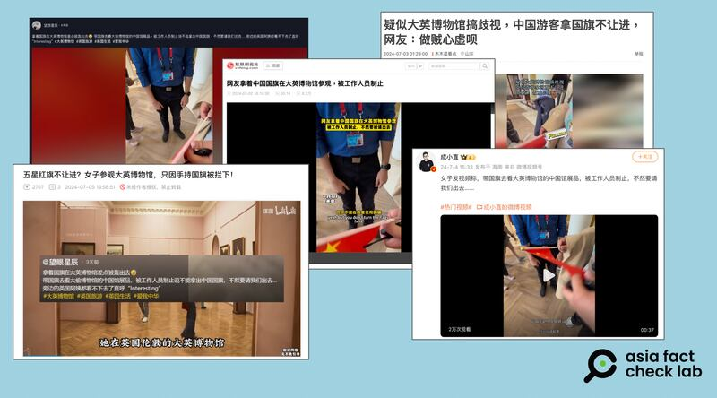

# 事實查覈｜大英博物館威脅驅逐手持中國國旗的訪客？

作者：莊敬

2024.07.08 16:32 EDT

## 查覈結果：誤導

## 一分鐘完讀：

近日，有網民發佈視頻爆料，稱她帶國旗去參觀大英博物館，被工作人員制止說不能拿出中國國旗，不然要請她出去。該消息迅速在中國媒體和社媒平臺上傳播。

但經覈查，網傳視頻中的博物館工作人員只是請該網民將國旗收好，並沒有請其離開。亞洲事實查覈實驗室也向大英博物館查證，對方確認視頻在該館拍攝，但其工作人員並未要求女子離開，也並未沒收國旗。

**深度分析**:

近日 [鳳凰網視頻](https://v.ifeng.com/c/8atTW1gZM66)、 [微博](https://weibo.com/2889942201/5052437457278519)、 [網易](https://www.163.com/dy/article/J68BIVTR055612JK.html)、 [臉書](https://www.facebook.com/groups/720532649310716/posts/1224810855549557/?paipv=0&eav=AfYV86NrbPWassgHujol6S5Iz-X969KCoDNnJe7j4fA0WV2w9UmBZY4FZ8-4BN8ouPY&_rdr)、 [B站(Bilibili)](https://www.bilibili.com/video/BV1E1421b773/)等多個平臺廣傳一則消息,一網民發佈視頻爆料,稱自己帶着中國國旗去看大英博物館的中國館展品,被工作人員制止說不能拿出中國國旗,不然要請她出去。

該消息的多位傳播者都是轉發抖音賬號 ["望眼星辰"](https://v.douyin.com/i6pfkqJL/)在7月1日發佈的視頻,這也是亞洲事實查覈實驗室(AFCL)找到最早發佈該視頻的用戶。而"望眼星辰"抖音賬號截至7月8日僅有一則視頻作品,其粉絲391人,獲贊數卻高達5.7萬。

“望眼星辰”發佈的37秒短視頻，前半段畫面爲一名手持中國國旗的女子與博物館工作人員對話，工作人員表示館內不允許拿出旗幟，之後請女子將旗幟摺疊好收起來，工作人員說完便離去。接著有另一位講英文的婦女上前詢問手持國旗的女子她與博物館工作人員的對話內容，聽完後說了一句“interesting”。

## 大英博物館工作人員說什麼？

“望眼星辰”視頻的文字描述寫着：“拿着國旗在大英博物館差點被轟出去”“被工作人員制止說不能拿出中國國旗，不然要請我們出去”。

但仔細聽視頻中兩人的對話，博物館工作人員僅表示館內不允許拿出旗幟，請女子將旗幟收起，並沒有針對“中國國旗”，也沒有說出“否則要請女子離場”等言論。

亞洲事實查覈實驗室向大英博物館查證,博物館發言人華生(Connor Watson)確認視頻是在該館拍攝,並表示該名訪客沒有被要求離開,他們的旗幟也沒有被沒收。華生並提供了大英博物館發佈在網站上的 [限制物品清單](https://www.britishmuseum.org/visit#entering-the-museum)與 [訪客規定](https://www.britishmuseum.org/sites/default/files/2023-11/British_Museum-Visitor_Regulations.pdf)。經查,雖然旗幟並未列入限制物品清單,但根據訪客規定第9點,爲保護展品與安全考量,訪客不得使用棍子、雨傘、旗幟或任何其它物件指向館內的人或展品。

依據網傳視頻的對話內容和大英博物館發言人的回應，網傳所謂“大英博物館工作人員制止說不能拿出中國國旗，不然要請網民出去”爲誤導信息。

*亞洲事實查覈實驗室(Asia Fact Check Lab)針對當今複雜媒體環境以及新興傳播生態而成立。我們本於新聞專業主義,提供專業查覈報告及與信息環境相關的傳播觀察、深度報道,幫助讀者對公共議題獲得多元而全面的認識。讀者若對任何媒體及社交軟件傳播的信息有疑問,歡迎以電郵*  *[afcl@rfa.org](mailto:afcl@rfa.org)*  *寄給亞洲事實查覈實驗室,由我們爲您查證覈實。*

*亞洲事實查覈實驗室在X、臉書、IG開張了,歡迎讀者追蹤、分享、轉發。X這邊請進:中文*  *[@asiafactcheckcn](https://twitter.com/asiafactcheckcn)*  *;英文:*  *[@AFCL\_eng](https://twitter.com/AFCL_eng)*  *、*  *[FB在這裏](https://www.facebook.com/asiafactchecklabcn)*  *、*  *[IG也別忘了](https://www.instagram.com/asiafactchecklab/)*  *。*

[Original Source](https://www.rfa.org/mandarin/shishi-hecha/hc-british-museum-rumour-07082024163249.html)