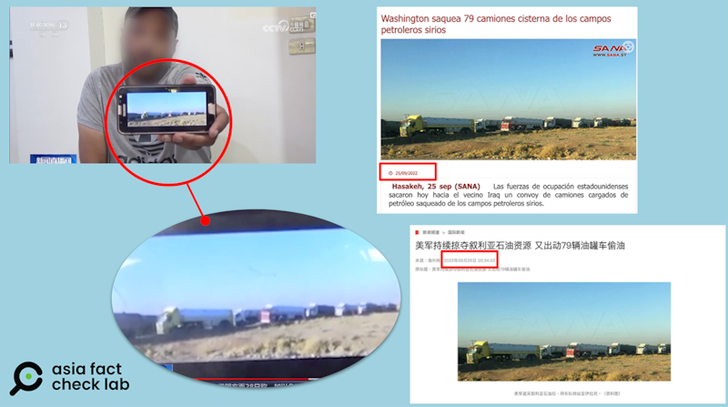
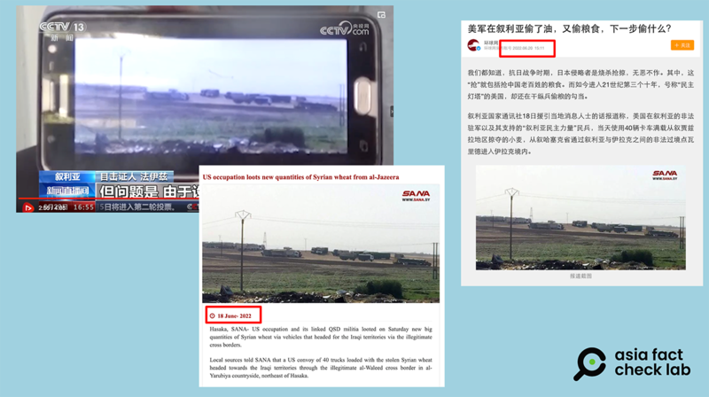
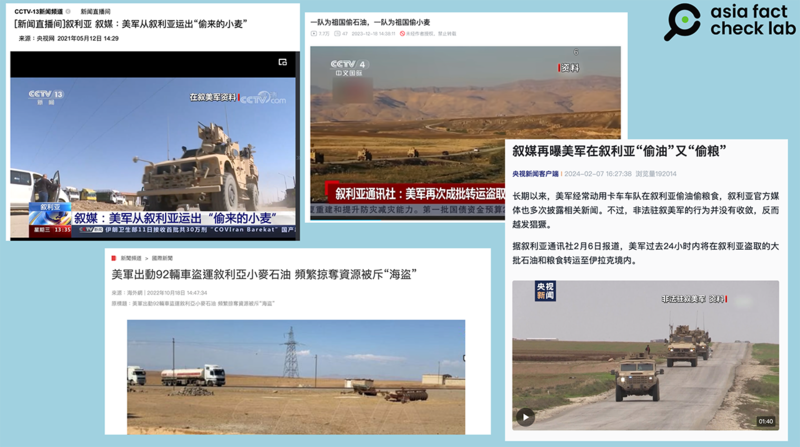

# 事實查覈｜央視“獨家調查”美軍偷敘利亞小麥 ？最新“證據”實爲舊照片

作者：董喆

2024.07.10 15:53 EDT

## 查覈結果：證據不足

## 一分鐘完讀：

6月29日，中國中央電視臺新聞頻道推出對敘利亞糧食危機的“獨家調查”，指控駐敘利亞美軍在當地“偷小麥”並運往境外。節目中，據稱是目擊證人的受訪者出示了一張“冒險拍攝”的照片做爲“證據”，宣稱是美軍偷運小麥的車隊。 7月3日，中國外交部在記者會上以此事批評美國，“美軍在敘利亞偷小麥”的話題再成社媒討論熱點。

亞洲事實查覈實驗室查證，央視節目中展示的兩張照片並非最新拍攝，這些照片早在2022年就已經在敘利亞國家通訊社以及中國官方媒體的報道中出現過，所謂冒險躲避搜查拍下的最新“證據”，事實上是舊照片。

## 深度分析：

中國官方媒體中央電視臺6月29日推出一則 ["獨家調查"](https://tv.cctv.com/2024/06/29/VIDEfU7ZUBl25LHyQQNMBoJs240629.shtml?spm=C53156045404.PKXC0xLPAnP9.0.0) ,稱駐敘利亞美軍從5月收穫季節開始"偷小麥",每天用十多輛卡車將敘利亞小麥運往境外。報道還稱,美軍爲了掩蓋盜運行爲,支持當地武裝分子在沿路設置檢查站防止畫面流出。節目中,記者訪問了一位名爲法依茲的"目擊證人",這位證人宣稱,自己親眼看到美軍的貨車,並冒險拍下照片。而當地軍警設下崗哨嚴查路過民衆的手機,如果被查出相關照片,就會被關押。隨即,法依茲出示了兩張照片,內容均爲貨車行駛在公路上的場景,央視記者在旁白中稱,正是這些照片讓他陷入被扣押的風險。

7月3日,中國中央廣播電視總檯記者在外交部例行記者會上就此事提問, [發言人毛寧](https://www.fmprc.gov.cn/web/fyrbt_673021/jzhsl_673025/202407/t20240703_11446517.shtml) 在回應中語氣嚴厲地批評美國"打着反恐旗號,心裏裝的是掠奪資源的算計",在敘利亞"製造人道危機"。外交部官方表態再度提升微博等社交媒體對此事的討論熱度,有網民評論"原來美帝偷麥子是真的,爲掩蓋罪行,還查路人手機,防止照片流出,沒想到還是被我大央視識破了。"

中國政府和官方媒體對美軍在敘利亞“掠奪資源”的指控已經出現多次，內容包括“偷小麥”、“竊取石油”等。

亞洲事實查覈實驗室（Asia Fact Check Lab, 下簡稱AFCL）此前曾發表查覈報告，認爲此前中國外交部等對美軍在敘利亞“偷石油”的批評缺乏事實證據，也未向讀者交代敘利亞危機的複雜背景。而此次央視採訪“目擊證人”控訴美軍在敘利亞偷竊小麥，展示的照片“證據”卻很有問題。

* [事實查覈|中國外交部稱美國從敘利亞"偷石油"?](https://www.rfa.org/cantonese/news/syria-01242023080733.html)

## 證人的 " 獨家 " 照片?央視早就用過了

“從五月收穫季節開始，我幾乎每天都能看到他們。”面貌被模糊處理的法依茲據稱是住在敘利亞哈賽克省的居民，他向中國央視記者出示“差點導致他被扣押”的美軍運糧照片。

影片2分25秒開始，法依茲一邊展示照片，一邊描繪自己所見，“所有卡車都裝滿了小麥，因爲他們都是從泰勒阿盧的筒倉出來，當地的所有筒倉都裝滿了穀物，卡車離開泰勒阿盧，朝着馬哈茂迪的方向行駛，卡車都裝滿了小麥”。他接着拿出第二張照片說：“ 我們幾乎每天都會拍照，但問題是由於設有檢查站，大多數日子我們必須刪除這些照片”。

AFCL將法依茲提供的兩張照片進行反搜，發現這些“獨家”照片，已經在網絡和新聞媒體上傳播多時。

法依茲展示出的第一張照片早在2022年9月時就已經出現在 [敘利亞國家通訊社的報道](https://sana-syria.org/es/?p=254302) 中,但當時的報道並未提及"偷小麥"一說,而是稱這些卡車上裝着"從敘利亞掠奪的原油"。該報道指控美軍運用79輛卡車掠奪敘利亞的原油至伊拉克,而照片事發地點在敘利亞的代爾祖爾省(Deir Ezzor)。

事實上,央視的官方網站也已經在2022年 [就已經使用過此張照片](https://news.cctv.com/2022/09/26/ARTILzTXACnMXYAQEXvAE7op220926.shtml) ,在當年9月26日作爲"美軍掠奪敘利亞石油資源"、"出動79輛油罐車"報道的配圖,並標註爲"資料照"。

而到了2024年，這張照片卻成了央視“獨家調查報道”中，目擊證人冒險保存的美軍“偷小麥”的最新“罪證”。

央視報道中受訪者展示的第一張照片，早在2022年敘利亞國家通訊社和央視網站就已經用過。（央視節目、敘利亞國家通訊社網站、央視網截圖）

法依茲展示的第二張照片也源自敘利亞國家通訊社,2022年, [該通訊社報道](https://sana.sy/en/?p=275102) 美軍運用40輛卡車偷運敘利亞小麥至伊拉克,事發地點在Al-Yarubiya。同樣地,官媒 [環球網](https://mil.sina.cn/gjjq/2022-06-20/detail-imizirau9570315.d.html) 2022年的報道也使用了同一張照片。

央視節目中受訪者展示的第二張照片，也於2022年出現在敘利亞國家通訊社、環球網等媒體的報道中。（央視節目、敘利亞國家通訊社網站、環球網截圖）

## 反覆出現的美軍 " 掠奪 " 敘利亞報道

央視此次的“獨家報道”控訴美軍掠奪敘利亞糧食，但並未提供新證據。AFCL發現，在過去幾年中，類似敘事不斷出現在央視的報道中，

2021年,央視網引用敘利亞國家通訊社,稱 [美軍從敘利亞運出"偷來的小麥"。](https://tv.cctv.com/2021/05/12/VIDEhKYalqhfY8AW2lV2NS3H210512.shtml)

2022年,央視網再次引用敘利亞國家通訊社,報道美軍 [用92輛卡車盜走敘利亞石油與小麥](https://big5.cctv.com/gate/big5/news.cctv.com/2022/10/18/ARTIfbTgnMBc6qQYLIyM4cvR221018.shtml) 。

2023年, [美軍竊取石油與小麥](https://www.bilibili.com/video/BV1C94y1A7rY/) 再次登上央視國際新聞。

2024年,在6月底的此次獨家報道之前,央視於2月又再發布了 [美軍偷油偷糧](https://content-static.cctvnews.cctv.com/snow-book/index.html?item_id=9144138652003322858) 的報道。

這些報道的共同點是，僅引用敘利亞國家通訊社的說法，消息來源皆爲“當地消息人士”，報道配圖均使用“資料畫面”，並未提供充分證據。

中央電視臺曾多次在新聞節目和網站報道中指控美軍掠奪敘利亞資源。（央視節目、央視網截圖）

敘利亞內戰已持續十餘年,庫爾德武裝力量在敘利亞北部建立自治區,此區域也是敘利亞小麥重要生產地。根據 [路透社報道](https://www.reuters.com/article/world/syrian-kurdish-authorities-to-stop-wheat-going-to-government-territory-idUSKCN1TD1KI/) ,佔全國小麥產量近七成的三個省份,大部分掌握在庫爾德人民保衛軍(YPG)領導的敘利亞民主力量(SDF)手中。

2024年6月敘利亞北部和東部自治政府(AANES)過去也曾 [公開否認](https://www.kurdistan24.net/en/story/30513-Syrian-Kurds-deny-stealing-oil-and-wheat) 竊取小麥,並表示在連年乾旱的情況下,自治區小麥的產量也僅能滿足當地人的需求,他們將會與大馬士革達成政治協議,將資源分配給所有敘利亞人民。同時,根據在線媒體《 [敘利亞觀察家](https://syrianobserver.com/syrian-actors/more-than-2500-tons-sdf-supplying-wheat-to-regime-in-hassakeh.html) 》報道,今年6月起,敘利亞民主力量已開始將東北部農民收成的第一批小麥運送到卡米什利以南的敘利亞政權糧食接收中心。這是基於敘利亞政府與SDF達成協議,要求後者分批供應共計50萬噸小麥,以每公斤36美分計價。

敘利亞小麥或石油的運輸、貿易，由誰主導、誰能獲益，牽涉到不同政治立場的表述，不在事實查覈範圍內。然而，新聞媒體使用已經反覆發佈過的舊照片，作爲“最新”、“獨家”證據，則是會誤導讀者的不實信息。AFCL建議，讀者在閱讀單一訊息來源的報道時，應多方查證並考量各方的立場與利益傾向。

AFCL亦去信美國國家安全事務委員會與敘利亞政團“民主力量”，至截稿前未獲回應。

*亞洲事實查覈實驗室(* *Asia Fact Check Lab* *)針對當今複雜媒體環境以及新興傳播生態而成立。我們本於新聞專業主義,提供專業查覈報告及與信息環境相關的傳播觀察、深度報道,幫助讀者對公共議題獲得多元而全面的認識。讀者若對任何媒體及社交軟件傳播的信息有疑問,歡迎以電郵 [afcl@rfa.org](mailto:afcl@rfa.org)*  *寄給亞洲事實查覈實驗室,由我們爲您查證覈實。*

*亞洲事實查覈實驗室在* *X* *、臉書、* *IG* *開張了,歡迎讀者追蹤、分享、轉發。* *X* *這邊請進:中文 [@asiafactcheckcn](https://twitter.com/asiafactcheckcn)*  *;英文: [@AFCL\_eng](https://twitter.com/AFCL_eng)*  *、 [FB在這裏](https://www.facebook.com/asiafactchecklabcn)*  *、 [IG也別忘了](https://www.instagram.com/asiafactchecklab/)*  *。*

[Original Source](https://www.rfa.org/mandarin/shishi-hecha/hc-07102024154735.html)