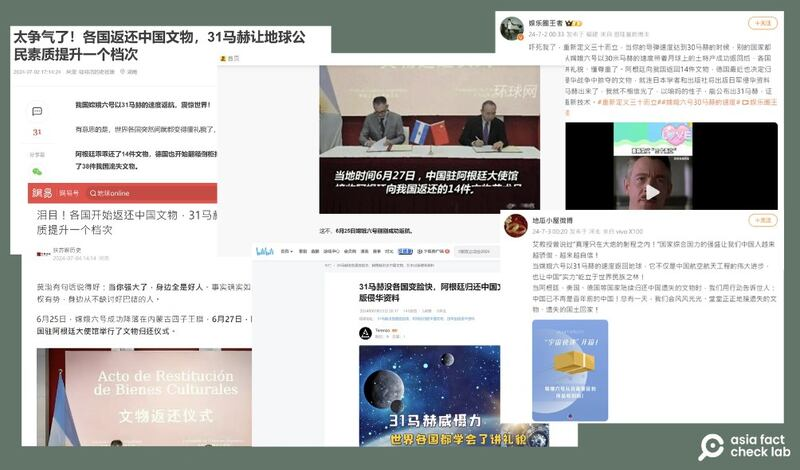

# 事實查覈｜嫦娥六號震攝世界，阿根廷趕緊歸還中國文物？

作者：艾倫

2024.07.11 20:05 EDT

## 查覈結果：錯誤

## 一分鐘完讀：

自嫦娥六號6月底成功從月球返回，中文互聯網上充斥各類傳言，其中不乏宣揚“國威”的說法。7月初開始，中國媒體及社媒上流傳消息稱，阿根廷和其他西方國家陸續歸還中國文物，是因爲看到了“嫦娥六號31馬赫”的威力，不得不開始“尊敬”中國。

然而，亞洲事實查覈實驗室發現，阿根廷早在2019年便已和中國討論將所查獲非法販運的中國文物還給中方，法院裁定歸還文物時嫦娥六號尚未升空。阿根廷歸還文物，和嫦娥六號並沒有關係。

傳言中還提到的美國、德國等國家在過去皆有和中國合作返還歷史文物的案例，但都和本次嫦娥計劃無關。

深度分析：

7月初,中國多個媒體平臺如 [網易](https://www.163.com/dy/article/J63VS7AV05564J81.html)、 [搜狐](https://m.sohu.com/a/790359026_121948376)、 [嗶哩嗶哩](https://www.bilibili.com/read/cv35906238/?jump_opus=1)流傳一則敘事:世界各國開始歸還中國文物,是因爲看到中國擁有嫦娥六號"31馬赫"的技術,心生敬畏。這一波"中國已經強大起來"的敘事中,輿論特別指向近期決定歸還中國14項文物的阿根廷。

所謂31馬赫,是指嫦娥六號返回艙在返回地球的途中,速度高達31馬赫。美國國家航空暨太空總署(NASA)的資料 [指出](https://www.grc.nasa.gov/www/k-12/airplane/mach.html),馬赫(Mach number)是指飛行物體速度與氣體中音速的比值,不考量飛行高度及空間的話,31馬赫相當於每小時可飛行38278.8公里(1馬赫爲每小時1225公里)。

返回艙達到31馬赫的速度，被這些網民認定是中國科技高度發展的象徵。

相關消息也在微博上經網民轉發( [1](https://weibo.com/2714619071/OlL3R1ZQU), [2](https://weibo.com/1952605797/OlHYF8PYb), [3](https://weibo.com/1305352484/OlKJhpGjr), [4](https://weibo.com/7660914242/OlBo38b0m)),有網民稱"31馬赫讓各國學會講文明""中國已不再是百年前的中國",暗示中國科技強大是造成各國歸還文物的原因。

中國多個新聞及社交媒體平臺廣傳“嫦娥六號31馬赫”的強大，使得世界各國開始尊重中國、歸還文物 圖取自網易、搜狐、Bilibili、新浪微博

經查，2023年12月12日，阿根廷法院就已裁定，要將14件如青銅纈鍾、陶俑及銅盔等文物歸還給中國。而這些文物是2017年阿根廷聯邦警察文化遺產保護分部在打擊文物非法販運時所截獲的贓物。早在2019年，中國國家文物局就已知悉並和阿根廷協調運回文物。

中國官媒新華社也曾報道過 [相關事實](http://big5.news.cn/gate/big5/www.news.cn/world/20240627/55d7d2c4e3934325a8f55593a2bd368c/c.html)。由此可得知,阿根廷歸還的文物並非掠奪而來,且早在嫦娥六號成功登月前,文物歸還就已經敲定。

## 其他國家歸還中國文物也與“嫦娥六號”無關

除了阿根廷外，網路傳言提到德國和美國也因爲中國登月計劃成功而選擇歸還文物。

亞洲事實查覈實驗室以關鍵字搜尋,發現今年有關於德國歸還文物的 [新聞](https://www.163.com/dy/article/J5STBAK70521U536.html?spss=wap2pc),其實是2023年《日經亞洲》報道過的 [舊聞](https://asia.nikkei.com/Life-Arts/Arts/German-museums-dig-into-legacy-of-Boxer-Rebellion-looting)。

原報道指出，七家德國博物館已經開始與北京故宮博物院合作，共同清理德國收藏的數千件中國文物，確定哪些是在義和團運動後被掠奪並走私出境的，其中可能涉及數百件瓷器、青銅器和畫卷。

該報道還提到，德國近年來開始歸還殖民時期掠奪來的物品。2018年，柏林歸還在20世紀初德國人於納米比亞實行種族滅絕期間掠奪的頭骨，而2019年時則與上海大學合作，將注意力轉向義和團時期的文物處理。北京故宮也在2022年加入了這項計劃，並參與了自該年12月開始的線上會議討論——而這些都早於嫦娥六號探月工程。

至於美國最近一次歸還中國文物則是在2024年4月。中國國家文物局在4月18日刊登 [新聞稿](http://virtual.vizen.ex2.ipv6.ncha.gov.cn/art/2024/4/18/art_722_188297.html),指文物局在中國駐紐約總領事館接收曼哈頓區檢察官辦公室歸還的38件文物,其中大多爲藏傳佛教藝術品。

根據文物局的資料，自2009年1月14日，也就是中美首次簽署“防止中國文物非法入境美國備忘錄”開始，中美成功將共15批、504件文物歸還給中國。四月份的文物返還也是自2024年1月中美更新備忘錄以來，中美政府成功進行的首次文物返還合作，與嫦娥六號無關。

*亞洲事實查覈實驗室(Asia Fact Check Lab)針對當今複雜媒體環境以及新興傳播生態而成立。我們本於新聞專業主義,提供專業查覈報告及與信息環境相關的傳播觀察、深度報道,幫助讀者對公共議題獲得多元而全面的認識。讀者若對任何媒體及社交軟件傳播的信息有疑問,歡迎以電郵*  *[afcl@rfa.org](mailto:afcl@rfa.org)*  *寄給亞洲事實查覈實驗室,由我們爲您查證覈實。*

*亞洲事實查覈實驗室在X、臉書、IG開張了,歡迎讀者追蹤、分享、轉發。X這邊請進:中文*  *[@asiafactcheckcn](https://twitter.com/asiafactcheckcn)*  *;英文:*  *[@AFCL\_eng](https://twitter.com/AFCL_eng)*  *、*  *[FB在這裏](https://www.facebook.com/asiafactchecklabcn)*  *、*  *[IG也別忘了](https://www.instagram.com/asiafactchecklab/)*  *。*

[Original Source](https://www.rfa.org/mandarin/shishi-hecha/hc-china-lunar-exploration-07112024200535.html)