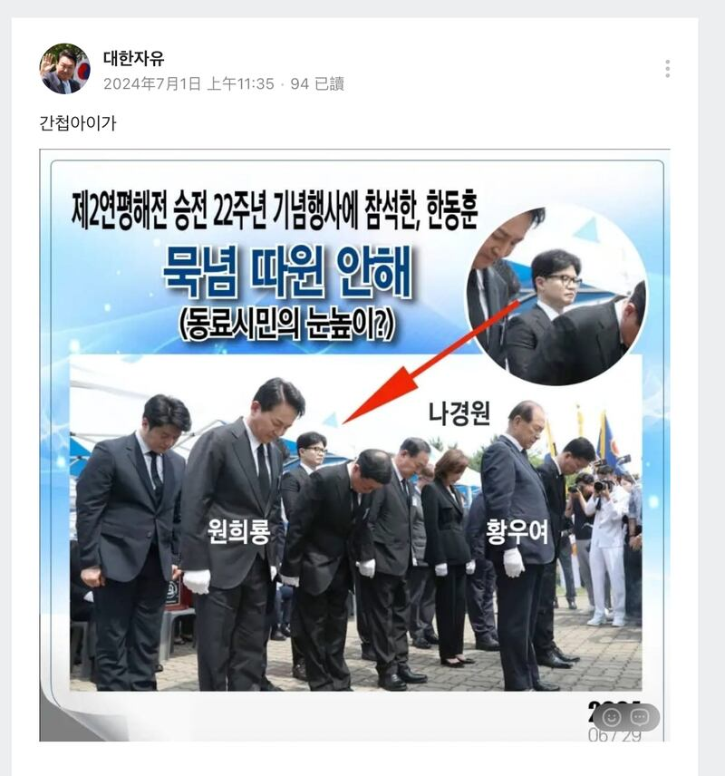
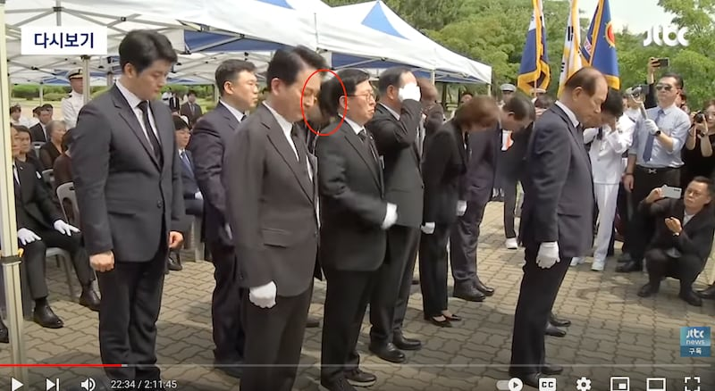

# 事實查覈｜韓國政要在紀念烈士儀式上不鞠躬？

作者：Taejun Kang

2024.07.12 14:31 EDT

## 查覈結果：錯誤

## 一分鐘完讀

近日，一張韓國前法務部長、前“國民力量黨”緊急對策委員長韓東勳的照片，在韓國社羣媒體上被多次轉載，照片中字卡稱，韓東勳6月出席於2002年與北韓海上衝突而陣亡的士兵追悼會時“沒有鞠躬”。

然而，這種說法是錯誤的。事實上，這張照片是在韓東勳與其他政治人物一起鞠躬前的瞬間拍下的，多家媒體拍攝到的儀式影片都顯示，他當時確實有鞠躬。

韓國社羣平臺傳，韓東勳在紀念烈士的活動上沒有鞠躬。（Naver Band截圖）

**深度分析**:

這張照片最初於2024年7月1日,在韓國網路論壇"Naver Band"上 [流傳和分享](https://band.us/band/77205747/post/294948),照片中有一個箭頭指向韓東勳,同時以韓文標註:"韓東勳參加第二次延坪海戰22週年的紀念儀式,卻沒有鞠躬"。

照片的內容是韓國保守派執政黨-國民力量黨 (PPP) 的政治人物們，出席6月29日舉行的第二次延坪海戰22週年紀念儀式。發生於2002年的延坪海戰中，韓國海軍隊擊退了發動突襲的朝鮮海軍，但也有6名韓國海軍官兵在這場衝突中喪生。

AFCL在谷歌進行反向圖像搜索,找到韓國媒體Newsis在6月29日發佈的 [原始圖像](https://www.newsis.com/view/NISX20240629_0002792142),顯示照片拍攝於韓東勳在儀式上鞠躬的前一刻,的確如網傳照片的情況:其它參與者都低頭鞠躬,但韓東勳卻站得直挺挺的。

這張照片在Naver Band上廣爲流傳的同時，還有貼文還指責這位韓東勳同情北韓，是北韓的間諜。

韓東勳曾任總統尹錫悅執政團隊的法務部長，也是國民力量前任臨時領導人。在這則流言傳播之際，韓東勳正準備正式挑戰該黨的領導權，他也被視爲未來可能代表國民力量黨，角逐總統大位的候選人之一。

爲了用影像查覈現場情況,亞洲事實查覈實驗室在YouTube上進行關鍵字搜索,找到韓國電視臺JTBC直播的儀式片段。在影片的 [22分33秒處](https://www.youtube.com/watch?v=C4ua43coJx8&t=1353s),可以看到韓東勳站在執政黨政治人物的後排,確實曾向紀念壇鞠躬,以表達對陣亡將士的敬意。

以下是JTBC影片的截圖，顯示韓東勳在儀式上鞠躬，AFCL編輯以紅圈標出韓東勳。

JTBC影片的截圖顯示韓東勳在儀式確實上鞠了躬。（JTBC截圖，AFCL標註）

包括KBS在內的其他韓國電視臺,也對儀式進行了現場直播,顯示韓東勳在 [2小時29分50秒](https://www.youtube.com/live/Wq3-zCImTK8?t=8990s)處,與其他政治人物一起低頭鞠躬。

*亞洲事實查覈實驗室(Asia Fact Check Lab)針對當今複雜媒體環境以及新興傳播生態而成立。我們本於新聞專業主義,提供專業查覈報告及與信息環境相關的傳播觀察、深度報道,幫助讀者對公共議題獲得多元而全面的認識。讀者若對任何媒體及社交軟件傳播的信息有疑問,歡迎以電郵*  *[afcl@rfa.org](mailto:afcl@rfa.org)*  *寄給亞洲事實查覈實驗室,由我們爲您查證覈實。*

*亞洲事實查覈實驗室在X、臉書、IG開張了,歡迎讀者追蹤、分享、轉發。X這邊請進:中文*  *[@asiafactcheckcn](https://twitter.com/asiafactcheckcn)*  *;英文:*  *[@AFCL\_eng](https://twitter.com/AFCL_eng)*  *、*  *[FB在這裏](https://www.facebook.com/asiafactchecklabcn)*  *、*  *[IG也別忘了](https://www.instagram.com/asiafactchecklab/)*  *。*

[Original Source](https://www.rfa.org/mandarin/shishi-hecha/hc-korean-politician-not-bow-07122024142638.html)