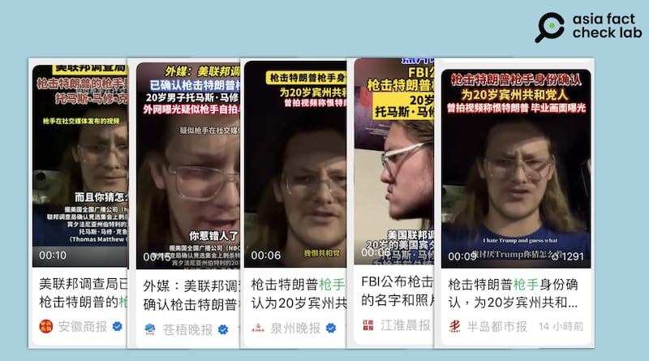
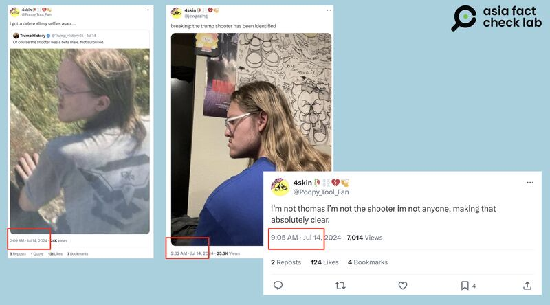
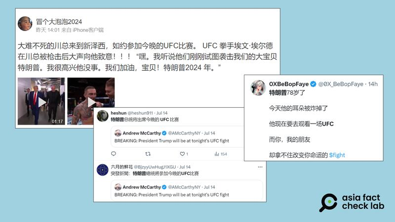
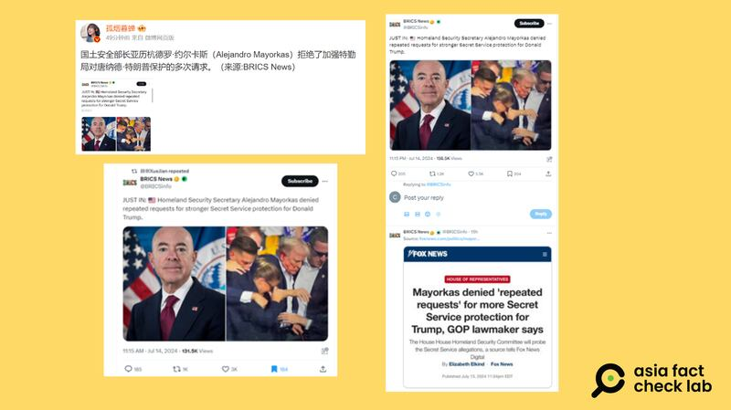
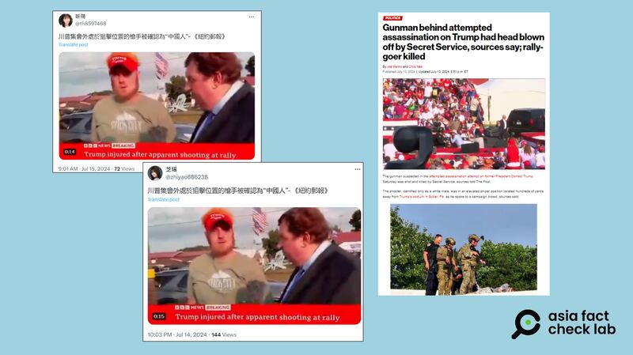

# 事實快查｜特朗普被槍擊後，哪些錯假信息在中文媒體流傳？

作者：莊敬、董喆、鄭崇生

2024.07.15 13:16 EDT

7月13日，參選總統的特朗普在美國賓夕法尼亞州選舉造勢活動上遭遇槍擊，耳朵受傷送醫治療，當日稍晚，特勤局通報特朗普狀態“安全”。此次槍擊事件在美國和國際媒體上引發了海量虛假信息和未經證實的說法，雖各主流媒體和事實查覈機構努力覈實、闢謠，不少錯假信息已造成深遠影響。

在中文媒體環境中，槍擊事件發生不久，亦有大量已經被證僞的信息通過新聞媒體和社交媒體流傳。亞洲事實查覈實驗室（Asia Fact Check Lab，下簡稱AFCL）針對部分華文輿論場流傳的錯誤或誤導信息，做了以下查覈。

## 一、槍手“自拍影片”曝光，稱自己討厭共和黨和特朗普？

## 查覈結果：錯誤

一名男子帶着白邊眼鏡，身穿藍衣頂着金色長髮，以側臉對向鏡頭。這張照片在特朗普遇刺的24小時內於社羣瘋傳，被稱爲是槍手克魯克斯（Thomas Matthew Crooks）的肖像，也在中文世界的主流媒體一再轉傳。

臺灣媒體包含 [鏡週刊](https://www.mirrormedia.mg/story/20240714edi009?utm_source=feed_related&utm_medium=yahoo)、 [民視新聞](https://youtu.be/xoBmqgG-Gp4?t=65)、 [東森新聞](https://news.ebc.net.tw/news/world/431483)等,都在第一時間將其當作嫌疑犯的照片,至本文截稿(美國東部時間7月15日下午1時)時,仍未更正。不少中國省級官方媒體,如安徽商報、泉州晚報、合肥交通廣播等微信公衆號甚至貼出一則視頻,同一名藍衣男子對着鏡頭說自己是克魯克斯,"我恨共和黨人,我恨特朗普,你知道嗎,你找錯人了。("I hate Republicans, I hate Trump, and guess what, you got the wrong guy.")"

中國省級官媒如安徽商報、泉州晚報等皆轉貼了＠jewgazing的惡作劇影片，稱槍手曾自拍影片表示討厭共和黨和特朗普。 （微信公衆號截圖）

事實上,這是X用戶上傳的惡作劇照片。發佈源頭是名爲"@jewgazing"的X帳號。帳號事發後推文稱" [槍手已被確認身份](https://archive.is/HqwiL)",並附上了這張藍衣男子照片,接着又發佈了" [自白影片](https://archive.is/ZHGG4)"。

另外,網上早一些時候流傳了一張他背對鏡頭身穿灰色T恤的照片,@jewgazing [轉推了這張照片](https://archive.is/TF7LU)並稱,"我要儘快刪掉我的所有自拍照片....( I gotta delete all my selfies asap…..)"

X帳號＠jewgazing在發表惡搞推文後，已經公開表示自己並非槍手。 （X平臺截圖）

官方消息稱,槍手在開槍之後很快遭到擊斃,因此,這位在槍擊事件後回覆網友"要開始刪除自己的自拍"的帳號所有者並不可能是槍手本人。 @jewgazing(現已將帳號改爲@Poopy\_Tool\_Fan)後來也 [發表推文](https://archive.ph/VqXfQ),澄清自己不是槍手。

查覈組織 [Politifact](https://www.politifact.com/factchecks/2024/jul/14/social-media/no-this-photo-is-not-of-trump-rally-shooting-suspe/)、 [Lead Stories](https://leadstories.com/hoax-alert/2024/07/fact-check-thomas-matthew-crooks-jewgazing-picture.html)也都對該惡搞內容被當真的事件發佈了查覈報告。

美國 [聯邦調查局](https://www.fbi.gov/news/press-releases/fbi-statement-on-incident-in-butler-pennsylvania)確認,槍擊特朗普的槍手爲20歲的托馬斯·馬修·克魯克斯,居住在的賓夕法尼亞州貝塞爾帕克市。據 [BBC](https://www.bbc.com/news/articles/c3gw58wv4e9o), [NBC](https://www.nbcnews.com/politics/politics-news/fbi-trying-determine-motive-attempted-trump-assassination-rcna161851)等媒體報道,克魯克斯註冊爲共和黨員,但曾爲自由派活動捐款,截止本文截稿,官方並未確定槍手的動機。

## 二、特朗普遭槍擊當晚 仍出席了終極格鬥冠軍賽？

## 查覈結果：錯誤

特朗普被槍擊事件發生不久，中、英文社媒盛傳，特朗普受傷後仍出席了當晚舉辦的終極格鬥冠軍賽（UFC）。

不過,傳言內容有些許不同,部分用戶聲稱特朗普出席了在科羅拉多州的UFC比賽,另一些用戶則稱特朗普到新澤西州參加UFC比賽,其中有 [用戶](https://m.weibo.cn/detail/5056020200301375)附上特朗普抵達新澤西州走下機的畫面,另有 [社媒用戶發佈](https://m.weibo.cn/detail/5056038227149274)一段特朗普抵達UFC賽場的視頻。

美國前總統特朗普13日在賓州造勢活動上遭槍擊，網路盛傳他仍出席事發當晚舉辦的UFC比賽。（微博、X截圖）

根據 [ABC新聞等媒體報道](https://abcnews.go.com/US/video/donald-trump-arrives-new-jersey-after-assassination-attempt-111922890),網傳畫面確實是特朗普在槍擊事件後、當晚抵達新澤西的影像,但他並沒有現身UFC比賽。而網傳特朗普抵達UFC賽場的視頻,則是特朗普於6月初到場參觀 [UFC比賽](https://www.youtube.com/watch?v=zu1U4ANFIpQ)的畫面,並非發生在槍擊事件後。美國《新聞週刊》(Newsweek)已針對此謠言發佈 [查覈報告](https://www.newsweek.com/donald-trump-ufc-shot-pennsylvania-1924882)。

## 三、美國土安全部拒絕加強特勤局對特朗普的保護？

## 查覈結果：誤導

在微博上擁有700多萬粉絲的"大V"用戶 ["孤煙暮蟬"](https://m.weibo.cn/detail/5056388763487530)15日發文,稱美國國土安全部長馬約爾卡斯(Alejandro Mayorkas)拒絕了加強特勤局對特朗普保護的多次請求。其消息來源是" [BRICS News](https://m.weibo.cn/detail/5056388763487530)",而"BRICS News"是引自《福斯新聞》。

根據 [《福斯新聞》](https://www.foxnews.com/politics/mayorkas-denied-repeated-requests-more-secret-service-protection-trump-gop-lawmaker-says.amp)報道,共和黨議員沃茲(Mike Waltz)在社媒平臺X上 [發文](https://x.com/michaelgwaltz/status/1812305942635049243),稱有可靠消息來源告訴他,馬約爾卡斯拒絕了加強特勤局對特朗普保護的多次請求。而特勤局發言人古利耶米(Anthony Guglielmi)已經在社媒上 [回應相關說法](https://x.com/SecretSvcSpox/status/1812451649387933912),表示這些指控"錯得離譜",事實上特勤局已增加維安的資源、技術與能力。

中國外交官與微博大V用戶轉發“BRICS News”的文章，稱美國國土安全部長馬約爾卡斯拒絕了加強特勤局對特朗普保護的多次請求。（微博、Ｘ截圖）

AFCL發現，《福斯新聞》報道中，報道了雙方的說法，不僅有沃茲的指控，稱國土安全部多次拒絕加強保護特朗普，也有特勤局否認該指控的回應。但“BRICS News”只報道指控，沒有報道回應，“孤煙暮蟬”、中國外交官薛劍等人照樣轉發，傳播了誤導信息。

## 四、暗殺特朗普的槍手“被確認爲中國人”？

## 查覈結果：錯誤

特朗普遭槍擊後，關於槍手身份的說法一時信息混亂。美國的《紐約郵報》（New York Post）在13日晚間7時許發佈的報道中，稱嫌犯是一名華人，消息立刻在社媒平臺上傳開，經多個具影響力的認證帳號轉發。

隨後官方信息發佈，嫌犯的身份爲20歲白人男子克魯克斯。

[《紐約郵報》](https://nypost.com/2024/07/13/us-news/gunman-behind-attempted-assassination-on-trump-shot-and-killed-by-secret-service-sources/)在報道發佈後一個多小時便更新內容,將關於槍手描述從華裔改爲白人男子。一些具影響力的社媒用戶隨後刪文,或是另發一則帖子說明早前的誤報信息。但AFCL發現,在執法單位公佈槍手身分後,仍有部分 [社媒用戶](https://udn.com/news/story/121777/8095861)傳播"槍手被確認爲中國人"的錯誤內容。

美國前總統特朗普遭槍擊後，美國的《紐約郵報》曾誤報槍手爲華人，但隨後更新槍手爲白人男子，但仍有社媒用戶傳播槍手被確認爲中國人的錯誤信息。（Ｘ、紐約郵報截圖）

根據華文媒體 [《世界日報》報道](https://udn.com/news/story/121777/8095861),一名華裔人士曾致電給撰寫該報道的記者馬裏諾(Joe Marino),並詢問馬裏諾報道該槍手爲華裔男子的消息來源爲何,馬裏諾回應她,"實際上是一名白人男性,這篇報導中出現了排版錯誤(misprint)。"

對於這個錯誤信息的瘋傳，美國華人社羣反響熱烈，一方面，他們認爲《紐約郵報》刊發“槍手被確認爲中國人”的報道之後，又將內容修改爲“白人男性”，但並沒有發表任何勘誤聲明，是不恰當的新聞操作；另一方面，華人社羣也擔心此消息的傳播會在政治形勢緊張的美國讓華裔族羣處於不利地位。

AFCL瞭解到，紐約州衆議員Lester Chang致信紐約郵報，要求對方做出解釋，美國酒店華裔協會等羣體也迅速發佈公開信要求記者向全美華人公開道歉。但至本文發稿之時，《紐約郵報》並未作出任何勘誤聲明或者道歉。

*亞洲事實查覈實驗室(Asia Fact Check Lab)針對當今複雜媒體環境以及新興傳播生態而成立。我們本於新聞專業主義,提供專業查覈報告及與信息環境相關的傳播觀察、深度報道,幫助讀者對公共議題獲得多元而全面的認識。讀者若對任何媒體及社交軟件傳播的信息有疑問,歡迎以電郵*  [*afcl@rfa.org*](mailto:afcl@rfa.org)  *寄給亞洲事實查覈實驗室,由我們爲您查證覈實。* *亞洲事實查覈實驗室在X、臉書、IG開張了,歡迎讀者追蹤、分享、轉發。X這邊請進:中文*  [*@asiafactcheckcn*](https://twitter.com/asiafactcheckcn)  *;英文:*  [*@AFCL\_eng*](https://twitter.com/AFCL_eng)  *、*  [*FB在這裏*](https://www.facebook.com/asiafactchecklabcn)  *、*  [*IG也別忘了*](https://www.instagram.com/asiafactchecklab/)  *。*

[Original Source](https://www.rfa.org/mandarin/shishi-hecha/hc-trump-shot-by-republican-gunman-07152024131555.html)