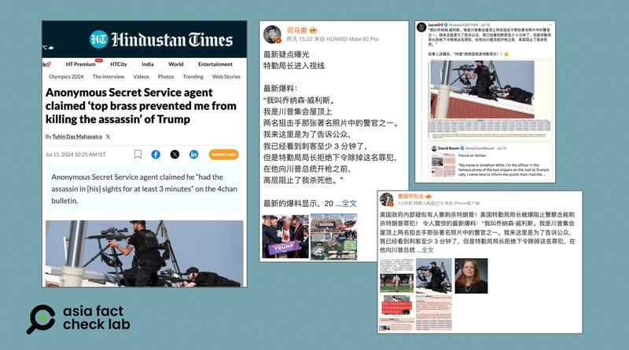

# 事實查覈｜美國“特勤人員”爆料：局長坐視特朗普遇刺？

作者：莊敬

2024.07.16 10:47 EDT

## 查覈結果：錯誤

## 一分鐘完讀：

美國總統候選人特朗普7月13日在賓州造勢活動遇襲後，網路論壇出現一則帖子：一名自稱名爲喬納森·威利，事發時在制高點警戒的特勤幹員爆料，他至少在案發前三分鐘就看見槍手，彙報上級，但特勤局長拒絕下令除掉槍手。這則帖子經印度新聞媒體、多個獲認證的中文社媒用戶轉發，在中、英文輿論場快速傳播。

亞洲事實查覈實驗室（Asia Fact Check Lab，下簡稱AFCL）向特勤局查證，發言人回覆表示，特勤局沒有人叫喬納森·威利斯（Jonathan Willis），同時網傳事發情節也和特勤人員執勤準則不符。因此這是錯誤信息。

## 深度分析：

競選總統的特朗普(Donald Trump)7月13日在賓州造勢活動上遭遇槍擊,20歲槍手現場被擊斃。槍擊事件後,一名自稱在造勢活動現場的特勤人員,7月14日在匿名論壇"4chan" [發帖爆料](https://archive.ph/3Qc2U):

“我叫喬納森·威利斯。我是特朗普集會屋頂上兩名狙擊手那張著名照片中的警官之一。我來這裏是爲了告訴公衆，我已經看到刺客至少3分鐘了，但是特勤局局長拒絕下令除掉這名罪犯，在他向特朗普總統開槍之前，高層阻止了我擊斃他。”

發文者自稱喬納森·威利斯(Jonathan Willis), [他的發文](https://twitter.com/Jacob43817149/status/1812602173278085451)立即在X等社媒平臺上掀起討論,也激發出新一波陰謀論。根據"臺灣事實查覈中心"的 [一份報告](https://tfc-taiwan.org.tw/articles/4637),"4chan"被稱爲"陰謀論產生地",極右翼陰謀論團體"匿名者Q"(QAnon)最早於2017年出現在"4chan"。

這則未經證實的消息快速傳進中國的微博、網易等平臺,包括在微博擁有300多萬粉絲的" [司馬南](https://m.weibo.cn/detail/5056420919644898)"、熱門社會時事博主 ["魯國平先生"](https://m.weibo.cn/detail/5056662887203206)等多個獲認證的"大V"用戶都轉傳,另有印度媒體《 [印度斯坦時報](https://archive.ph/Rdbin)》(Hindustan Times)報道。

* [事實快查|特朗普被槍擊後,哪些錯假信息在中文媒體流傳?](2024-07-15_事實快查｜特朗普被槍擊後，哪些錯假信息在中文媒體流傳？.md)

美國前總統特朗普在賓州造勢活動上遭遇槍擊後，網上盛傳一名自稱特勤局警官的爆料。（《印度斯坦時報》網站、微博、X截圖）

AFCL向特勤局查證，特勤局發言人赫林（Nate Herring）回覆表示，“網傳說法錯得離譜。美國特勤局沒有員工叫那個名字。（This claim is categorically false. There is no U.S. Secret Service employee by that name.）”

[美聯社](https://apnews.com/article/fact-check-trump-shooting-secret-service-334166850448)、事實查覈組織" [FactCheck.org](http://factcheck.org)"等單位也都對此事件發佈了查覈報告。 《美聯社》在查覈報告中也引述一名特勤局發言人表示,制高點的狙擊手所受的訓練和執勤準則是一旦發現威脅,可以自行決定行動,除去安全威脅,不需請示或等待命令。

前述特勤局對制高點狙擊手任務的形容，形同反駁了原帖所稱，“已彙報上級，但局長不下令行動”的指控。

根據 [聯邦調查局(FBI)聲明](https://www.fbi.gov/news/press-releases/update-on-the-fbi-investigation-of-the-attempted-assassination-of-former-president-donald-trump),企圖暗殺特朗普的槍手是一名20歲的男子克魯克斯(Thomas Matthew Crooks),當局仍在調查其犯案動機。

在特朗普槍擊案發生後,中、英文輿論場出現大量虛假信息和誤導說法, [AFCL已查覈了部分信息。](2024-07-15_事實快查｜特朗普被槍擊後，哪些錯假信息在中文媒體流傳？.md)

*亞洲事實查覈實驗室(Asia Fact Check Lab)針對當今複雜媒體環境以及新興傳播生態而成立。我們本於新聞專業主義,提供專業查覈報告及與信息環境相關的傳播觀察、深度報道,幫助讀者對公共議題獲得多元而全面的認識。讀者若對任何媒體及社交軟件傳播的信息有疑問,歡迎以電郵*  [*afcl@rfa.org*](mailto:afcl@rfa.org)  *寄給亞洲事實查覈實驗室,由我們爲您查證覈實。* *亞洲事實查覈實驗室在X、臉書、IG開張了,歡迎讀者追蹤、分享、轉發。X這邊請進:中文*  [*@asiafactcheckcn*](https://twitter.com/asiafactcheckcn)  *;英文:*  [*@AFCL\_eng*](https://twitter.com/AFCL_eng)  *、*  [*FB在這裏*](https://www.facebook.com/asiafactchecklabcn)  *、*  [*IG也別忘了*](https://www.instagram.com/asiafactchecklab/)  *。*

[Original Source](https://www.rfa.org/mandarin/shishi-hecha/hc-trump-assassination-attempt-07162024104423.html)