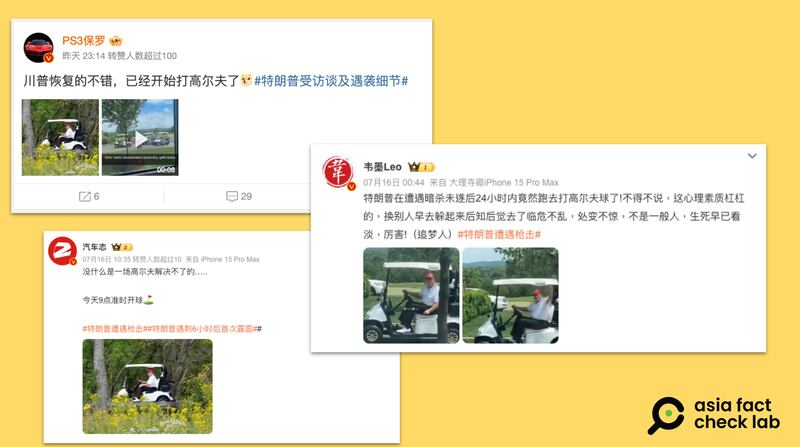
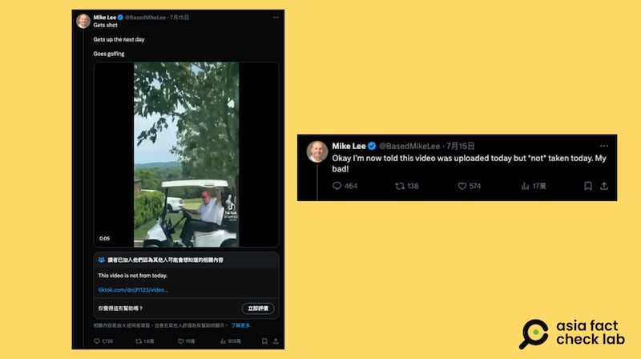
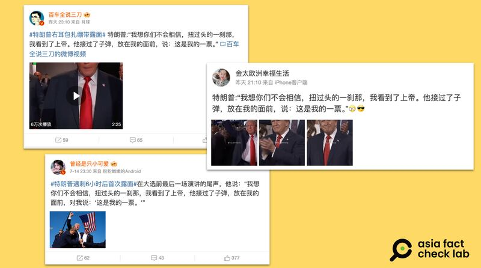
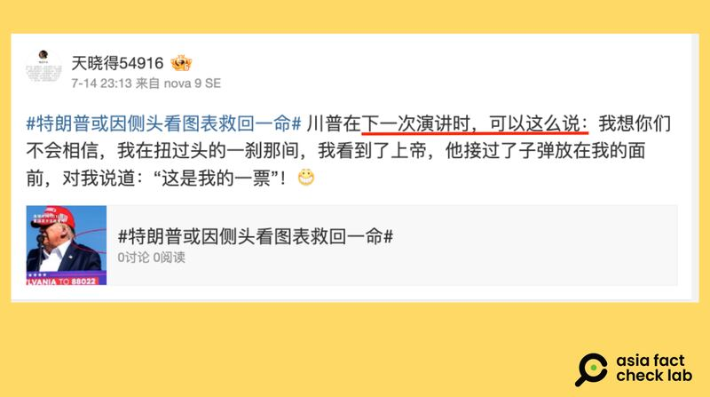

# 事實快查｜特朗普遇襲隔天就打高爾夫？稱上帝"爲他投票"？

作者：董喆

2024.07.17 14:19 EDT

美國總統候選人特朗普13日在賓州的造勢活動遇襲，至今仍有不實訊息在中文世界流傳。除了從西方社媒翻譯的錯誤資訊，也有微博網友的玩笑言論被當真而廣泛流傳，甚而有人深信不疑。

亞洲事實查覈實驗室查覈了這些仍在流傳的錯假信息。

## 特朗普遇襲隔天就去打高爾夫？

## 查覈結果：錯誤

微博有帳號貼出照片與影片稱特朗普在遇襲後立刻現身球場打高爾夫，稱他心理素質強、看淡生死。同樣的言論其實早一步在X上發酵，猶他共和黨參議員Ｍike Lee在特朗普遇襲後隔日一早發佈微博流傳的同一則視頻，註解“被槍擊，隔天起牀，去打高爾夫球。 （Gets shot. Gets up the next day. Goes golfing）”這則視頻截至7月17日累積超過959萬次觀看。

微博上不少有影響力的用戶盛傳特朗普在遇襲第二天去打高爾夫（微博截圖）

隨着信息流傳，網上出現兩種聲浪：一是盛讚特朗普身心理素質堅強，二是批評特朗普不顧受害者家屬感受。

但亞洲事實查覈實驗室將網上流傳的照片與影片分別進行反搜，證實這是錯誤訊息。

首先,微博上流傳的特朗普駕駛高爾夫球車的照片,以圖反搜後確認是2022年的舊照。這張照片 [出自美聯社](https://newsroom.ap.org/editorial-photos-videos/detail?itemid=43c6c6c12c444421835cf1bf48bbd0e3&mediatype=photo)攝影師Alex Brandon,時間是2022年9月12日,特朗普在維吉尼亞州的特朗普國家高爾夫俱樂部(Trump National Golf Club)駕駛高爾夫球車。

特朗普遇襲隔天去打高爾夫的說法來自猶他州參議院Mike Lee，他本人已經更正說法。（X截圖）

影片部分,根據Mark Lee發文的視頻浮水印,可以確定影片出自TikTok帳號cjf1123,目前這個帳號已經關閉,影片也已下架, [僅能查看備份](https://web.archive.org/web/20240714201804/https://www.tiktok.com/@cjf1123/video/7391491197883125023?_r=1&_t=8o1U2uYCAqh)。 Mark Lee 7月15日也發佈更正說明,稱自己被告知該視頻是當天(15日)上傳的,但不是那天(15日)拍攝的。

## 特朗普稱"上帝接過子彈，放在我面前說，這是我的一票"？

## 查覈結果：錯誤

特朗普遇襲後，微博上流傳如下一段戲劇性的談話，不少人認爲，這是特朗普的發言。

特朗普：“我想你們不會相信，扭過頭的那一霎那，我看到了上帝。他接過了子彈，放在我的面前，對我說，這是我的一票。”

微博傳言稱，特朗普稱上帝"接過子彈"、爲他"投票"。（微博截圖）

多個微博帳號轉傳這段話，有些說是特朗普在共和黨代表大會中發表的言論，也有說法是特朗普遇刺6小時後的發言，衆說紛紜。

亞洲事實查覈實驗室檢視特朗普事發後的公開言論。首先,他在遇刺後於社羣平臺TRUTH上 [發表了貼文](https://truthsocial.com/@realDonaldTrump/posts/112784638860095397),提到"正是上帝阻止了難以想像的事情發生",內容與微博所提並不相符。遇刺後特朗普接受《華盛頓觀察家報》(The Washington Examiner) [獨家專訪](https://www.washingtonexaminer.com/news/campaigns/presidential/3082180/trump-rewrites-republican-convention-speech-focus-unity-not-biden/),他提到是因爲自己轉過頭才倖免於難,但並未提到他"看見上帝"。

亞洲事實查覈實驗室將微博流傳的這段話進行搜尋，發現其源頭極有可能是一位微博網友的玩笑。微博帳號“天曉得54916”7月14日於微博發文，稱川普在下次演講時，可以這麼說：“我想你們不會相信，我在扭過頭的一霎那間，我看到了上帝，他接過了子彈放在我的面前，對我說道：這是我的一票！”

所謂特朗普稱上帝爲他"投票"的說法，其實是網友編寫的玩笑段子。（微博截圖）

後續轉傳的網友，極有可能忽略了帖文中稱特朗普“可以這麼說”的部分，而並非是特朗普的發言的記錄，造成錯誤資訊傳播。

*亞洲事實查覈實驗室(Asia Fact Check Lab)針對當今複雜媒體環境以及新興傳播生態而成立。我們本於新聞專業主義,提供專業查覈報告及與信息環境相關的傳播觀察、深度報道,幫助讀者對公共議題獲得多元而全面的認識。讀者若對任何媒體及社交軟件傳播的信息有疑問,歡迎以電郵*  [*afcl@rfa.org*](mailto:afcl@rfa.org)  *寄給亞洲事實查覈實驗室,由我們爲您查證覈實。* *亞洲事實查覈實驗室在X、臉書、IG開張了,歡迎讀者追蹤、分享、轉發。X這邊請進:中文*  [*@asiafactcheckcn*](https://twitter.com/asiafactcheckcn)  *;英文:*  [*@AFCL\_eng*](https://twitter.com/AFCL_eng)  *、*  [*FB在這裏*](https://www.facebook.com/asiafactchecklabcn)  *、*  [*IG也別忘了*](https://www.instagram.com/asiafactchecklab/)  *。*

[Original Source](https://www.rfa.org/mandarin/shishi-hecha/hc-trump-assassination-07172024135553.html)