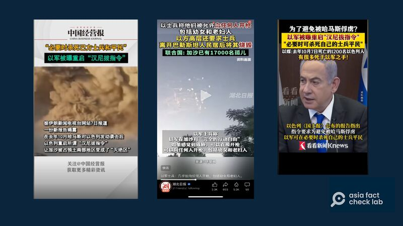
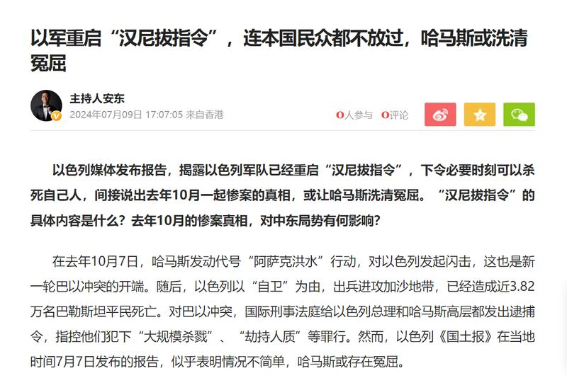
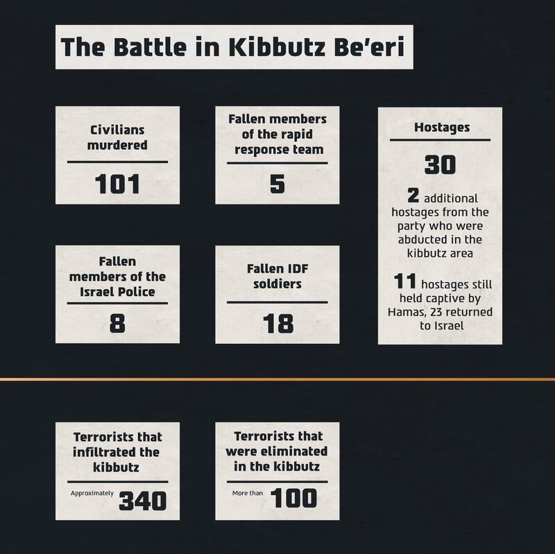
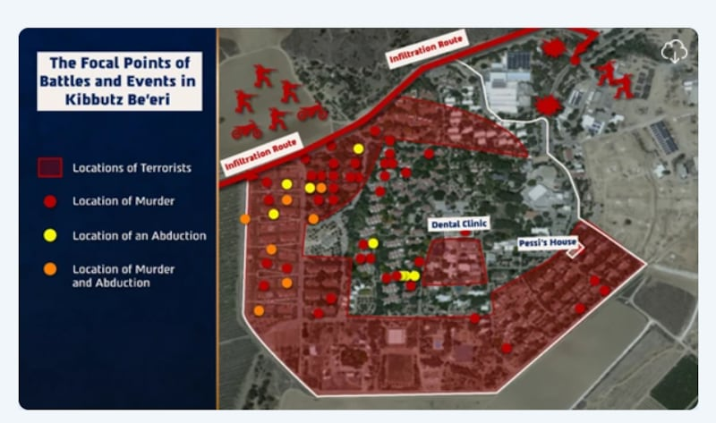

# 事實查覈｜爲打擊哈馬斯，以色列允許軍人"殺自己人"？

作者：鄭崇生

2024.07.18 19:24 EDT

## 標籤：誤導

## 一分鐘完讀：

"以色列狠起來連自己人都殺""避免被哈馬斯俘虜,以軍可以殺自己軍人與平民"。包括 [《湖北日報》](https://v.douyin.com/i63GAuoL/) [《中國經營報》](https://v.douyin.com/i63Gk19f/)及 [上海東方衛視](https://v.douyin.com/i63sgH18/)在內的中國地方媒體,近來在抖音上發佈短視頻稱,以色列於去年10月7日面對哈馬斯攻擊時,重啓"漢尼拔指令"(Hannibal directive/procedure),允許以色列軍方可以殺死自己的士兵及平民。

多家中國官媒近日傳播評論"以軍被授權可以殺自己人和平民"的"漢尼拔指令"（《湖北日報》《中國經營報》及東方衛視官方社媒賬號截圖）

亞洲事實查覈實驗室發現,這則消息最早是來自以色列媒體《國土報》(Haaretz)的 [調查報道](https://archive.ph/pLaWZ),《國土報》引述的消息來源認爲,以色列國防部重啓了"漢尼拔指令",這是爲抓捕哈馬斯及營救人質,在戰鬥過程中採取可能造成自家人員傷亡的措施,這和網傳以色列政府直接允許殺自己的軍人與平民是完全不一樣的概念。

## 深度分析：

上海東方衛視旗下的看看新聞網在抖音短視頻中指出，根據《國土報》報道，以軍方下令，爲避免遭哈馬斯俘虜，以色列允許軍隊必要時可以殺死自己的士兵和平民，《中國經營報》更直接報道稱“以軍重啓漢尼拔指令”。

"漢尼拔指令"是以色列的一項軍事政策,根據 [半島電視臺介紹](https://www.aljazeera.com/amp/news/2024/7/9/why-did-israel-deploy-hannibal-directive-allowing-killing-of-own-citizens),1986年,以色列軍方在3名軍人遭黎巴嫩真主黨俘虜後,制定這項祕密命令,也就是當士兵遭俘虜或綁架時,允許作戰指揮官可以執行任何必要措施,阻止士兵遭俘虜或帶入敵方領土,即使有可能危及遭綁架士兵的性命安危。這一指令已於2016年撤銷。

## 以國媒體怎麼報道的？

《國土報》引述以色列一名國防部高階官員的話稱，在鎮守加沙地區邊境的指揮官當天宣佈“‘非利士人’（Philistines，指巴勒斯坦人）入侵了”後，地區指揮官就有權啓動對以色列領土實施猛烈火力攻擊的程序，以阻止敵人。但這名官員又說，這並不是加沙地區指揮官下的命令。

報道說，哈馬斯去年10月7日清晨突襲攻入以色列的第一時間，以色國防部並不知道究竟有多少人質已遭綁架至加沙地區，但以軍指揮官在10月7日上午10時32分下令，對加沙地帶發動炮擊，並在哈馬斯進入以色列南部貝埃裏（Be'eri）屯墾區後，對該地區展開攻擊，隨後又禁止任何以色列境內的車輛返回加沙地帶。報道認爲，“這些訊息的含義以及對一些被綁架者的命運的影響將是完全清楚的”，隨後並提到，“爲了挫敗綁架事件所下的命令，甚至不惜犧牲被綁架者的生命，這一程序在軍隊中被稱爲‘漢尼拔指令’。”

《國土報》也指出，即使有人下達相關命令，也無法確認以軍去年10月7日回應哈馬斯綁架攻擊行動時，究竟造成多少自家平民傷亡。

但中國媒體及網傳信息省略了哈馬斯攻入以色列綁架人質，並且攻擊以軍要塞在先，以色列是在抓捕哈馬斯及營救人質的戰鬥過程中，採取可能造成人員傷亡的措施，這和直接允許殺自己平民與軍人，以防成爲俘虜，是完全不一樣的概念。

《國土報》的報道經中國媒體引用傳播後,引起輿論對以色列的譴責。鳳凰衛視主持人安東 [撰寫的文](https://archive.ph/SOGN0)章提到"不難看出哈馬斯纔是被冤屈者,以色列軍隊是真正的恐怖分子"。

中國媒體人安東譴責以軍，稱哈馬斯或存在冤屈。（安東個人社交媒體賬號截圖）

至於以色列部隊在去年10月7日反擊哈馬斯時，是不是真的造成自己人傷亡？《國土報》在報道中提到了發生在貝埃裏屯墾區的“佩西柯恩民房”（Pessi Cohen）事件。以色列軍隊在這裏營救人質時確實造成了自己平民的傷亡。

《國土報》發表後,以色列國防部7月11日公佈有關去年10月7日哈馬斯攻擊事件的 [調查報告](https://www.idf.il/216005),主要針對當時在靠近加沙地帶南部戰區以軍的救援行動,依時間線詳細陳述的以國國防部當天的反擊過程。

這份報告明確檢討並指出以軍第一時間的諸多缺失，包括承認事前情報沒掌握、準備不足、沒保護好自己的人民，在平民撤離的行動時，以國軍方沒有提供足夠的安全保障。

以軍行動確實造成了人員傷亡，並經過了檢討。（以色列國防部官網截圖）

該報告指出，在建築物外的確有發生兩名平民被彈片炸傷的孤立事件，“建築物內沒有平民受到以軍攻擊的傷害”。調查小組確定，“多數人質可能都是被恐怖分子謀殺”，但有必要對更多調查結果進行進一步調查和審理。以色列參謀長在調查報告中認爲，那是在激烈戰鬥地區的拯救人質行動，是極特殊的情況，以軍指揮官在艱難情況下仍以“儘可能拯救最多平民”爲最高原則，向恐怖份子施壓，“這是一個艱難決定”。

以色列國防部也公佈了10月7日當天營救人質及逮捕哈馬斯的行動中，有101名平民遭殺害，當地有30名人質和另外2名人質遭綁架到哈馬斯掌控的加沙地帶，至今仍有11人遭關押在加沙。至於以軍的傷亡情況，有31名安全人員身亡，其中有23人是以色列國防部士兵，8名是警察。

以色列國防部調查報告中人員傷亡及分佈示意圖（以色列國防部官網）

*亞洲事實查覈實驗室(* *Asia Fact Check Lab* *)針對當今複雜媒體環境以及新興傳播生態而成立。我們本於新聞專業主義,提供專業查覈報告及與信息環境相關的傳播觀察、深度報道,幫助讀者對公共議題獲得多元而全面的認識。讀者若對任何媒體及社交軟件傳播的信息有疑問,歡迎以電郵* *afcl@rfa.org* *寄給亞洲事實查覈實驗室,由我們爲您查證覈實。*

*亞洲事實查覈實驗室在* *X* *、臉書、* *IG* *開張了,歡迎讀者追蹤、分享、轉發。* *X* *這邊請進:中文*  [*@asiafactcheckcn*](https://twitter.com/asiafactcheckcn)  *;英文:*  [*@AFCL\_eng*](https://twitter.com/AFCL_eng)  *、*  [*FB* *在這裏*](https://www.facebook.com/asiafactchecklabcn)  *、*  [*IG* *也別忘了*](https://www.instagram.com/asiafactchecklab/)  *。*

[Original Source](https://www.rfa.org/mandarin/shishi-hecha/hc-israel-hamas-07182024191502.html)