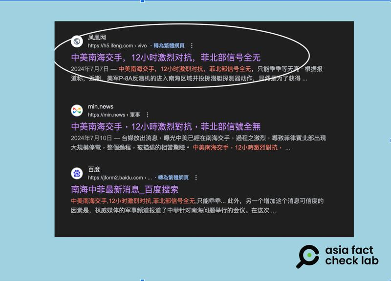
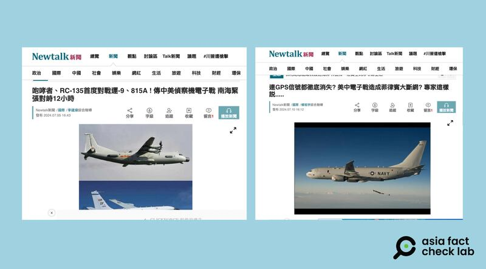

# 傳播觀察｜"美中電子戰"謠言傳播三部曲

作者：莊敬

2024.07.19 15:53 EDT

近期，中國、臺灣部分新聞節目以及社媒平臺熱議關於“美中電子戰”的相關消息，大致內容包括：中國解放軍和美軍6月底曾在南海上空爆發12小時的電子戰，“戰況”激烈，甚至波及菲律賓呂宋島北部網際網路中斷、GPS信號消失。這場“電子戰”以解放軍大勝告終，美軍因此決定撤走此前部署在菲律賓北部的美國“堤豐”（Typhon）中程導彈系統。

在 [上篇報道](2024-07-18_事實查覈｜菲律賓上空爆發中美電子大戰？.md)中,亞洲事實查覈實驗室(Asia Fact Check Lab,下簡稱AFCL)對這些說法中多處錯誤信息進行了相關查覈。並且,AFCL發現這些說法源頭不明,傳播途徑混亂,甚至出現中國媒體稱"根據臺媒報道"、臺灣媒體稱"根據中國媒體報道",形成相互引用,互推責任的亂象。

然而這樣一則來源不明的消息,話題熱度卻能一路從6月底延續到7月中,直到7月16日,仍有臺灣 [網路節目](https://www.youtube.com/watch?v=6XrAhUoxIdk)在討論此事。

AFCL觀察到，“美中電子戰”消息的傳播大致分爲三階段：最初期，中國、臺灣、香港等地媒體接力傳播上述錯誤信息，一段時間後，這些媒體又出現各種“闢謠”文章，導致有平臺出現一邊發佈謠言、一邊又闢謠，自相矛盾的情形，最近幾天，不少媒體再評述此事時，又開始出現統一的敘事，稱“無論傳聞真假”，這些傳言都表明中國解放軍實力雄厚，“已是美國的強大對手”等說法。

## 第一部曲：錯誤信息來源不明 仍強力傳播

AFCL以中文關鍵詞"中美電子戰"、"南海"搜尋,發現7月初開始,網上出現大量相關信息,包括中國的 ["騰訊網](https://new.qq.com/rain/a/20240705A03VG200)"、軍事資訊平臺" [China-Arms](https://archive.ph/ud4pp)"、香港" [東網](https://hk.on.cc/hk/bkn/cnt/commentary/20240708/bkn-20240708000434777-0708_00832_001.html)"、臺灣媒體" [Newtalk新聞](https://archive.ph/eb8eW)"、 [TVBS節目](https://www.youtube.com/watch?v=--LBwMztdQI)、 [中天新聞節目](https://www.youtube.com/watch?v=6x405n4o5E8)等,都有報道或討論。

中文媒體與社媒平臺廣傳6月底美中在南海爆發電子戰，但臺媒聲稱消息來自中國，中國平臺上的文章卻說是臺媒爆料。（YouTube、東網、網易截圖）

令人疑惑的是，前述媒體和平臺所傳播的電子戰情節相似，但各家報道聲稱引述的消息來源卻都不同。根據“Newtalk新聞”，消息來源是“據網友稱”、“廣大網友猜測”、“外界猜測”；網路媒體“China-Arms”，則說“有報道指出（There are reports ）”。

" [騰訊網](https://new.qq.com/rain/a/20240706A07X0G00)"、" [網易](https://archive.ph/NByRs)"等中國媒體平臺上的文章則稱,這是臺灣媒體爆的料。

一些臺灣電視媒體則稱，中國、菲律賓是消息來源。臺灣中天電視臺節目《盧秀芳辣晚報》，消息來源稱是某菲律賓媒體以及中國的鳳凰新聞，TVBS《新聞大白話》標題寫着“陸爆中美電子干擾大戰硝煙”，指消息來自中國大陸。

這則新聞最初究竟出於何處,各家媒體的說法都不一樣。有新聞評論員發現,這則新聞的源頭已經無可稽考。例如曾任臺灣海軍軍官的評論員呂禮詩在YouTube節目" [觀點](https://www.youtube.com/watch?v=-10rZhXelH8)"中說(影片23:10處),"新聞報道最先開始的是鳳凰新聞報道的,可是怪就怪在,我現在找不回那則新聞。"

最早開始傳播該信息的媒體中，也有不少稱原報道來自中國的鳳凰網。

臺灣媒體與評論員稱報道來自鳳凰新聞，但網絡搜尋結果僅顯示標題，以及一段文字描述，點入後頁面已不存在。（搜索結果頁面截圖）

AFCL試圖搜尋原始報道，以中文關鍵字查詢，在搜索結果頁面可以看到鳳凰網的標題“中美南海交手，12小時激烈對抗，菲北部信號全無”，以及一段文字，但點擊標題後進入的頁面顯示“抱歉－您訪問的頁面不存在”。AFCL推測，該新聞頁面可能曾經存在，但已被刪去，搜索結果頁面應是此前緩存的信息，但從目前可知信息並不能確定鳳凰網原文發佈的時間。

而AFCL目前所能找到最早的相關文章,是 [網易號](https://www.163.com/dy/article/J5VA5LS405462AQI.html)發佈於6月30日的帖子,文中稱"據菲律賓媒體報道"、"據外媒報道",但沒有說明是哪家媒體。

## 第二部曲：新聞平臺一邊傳謠，一邊闢謠

被臺灣評論員點名爲"最先開始報道"的鳳凰網,在7月11日轉載"觀察者網"專欄作者的 [闢謠文章](https://www.guancha.cn/AoKaMuTiDao/2024_07_11_741109.shtml),文中指出"在臺灣名嘴的討論和香港媒體的報道中,這場電子戰場面被描述得非常熱鬧"、"臺灣和香港的說法都是"據菲媒報道",但沒有指出是哪家菲媒,也沒有人引用具體的報道。境外社交網站也沒有呂宋島大面積斷網的討論。到此,基本可以判定這就是個假消息。"

Newtalk等新聞網站報道"美中電子戰"相關消息，一邊繼續讓錯假信息繼續在線，一邊報道專家闢謠評論。 （Newtalk 網站截圖）

另外,"Newtalk新聞"在7月10日的 [報道](https://newtalk.tw/news/view/2024-07-10/927483)中,引述《騰訊網》軍事專欄作者"劉曉非說"的分析,指"美中南海大打電子戰"的消息,是"地理盲"、"物理盲"創造出來的假消息。在發佈這則"闢謠"信息後,至本文發稿前,Newtalk於7月5日發佈的美中在南海對峙的 ["電子戰"新聞](https://archive.ph/eb8eW)仍然繼續在線。

## 第三部曲：不論"電子戰"真假，宣揚解放軍實力"超過美國"

雖然多家媒體已經闢謠,"美中電子戰"話題並沒有停止。部分媒體、內容創作者反而運用傳聞進而分析中國軍事實力,開始出現藉此信息,正面宣傳中國軍事實力的敘事。例如"香港01"7月13日轉載的《聯合早報》專文,將標題改爲《 [中美南海爆發電子戰?網民爲傳聞"起舞"不論真假"已說明一點"](https://www.hk01.com/%E5%9C%8B%E9%9A%9B%E5%88%86%E6%9E%90/1037762/%E4%B8%AD%E7%BE%8E%E7%88%86%E7%99%BC%E9%9B%BB%E5%AD%90%E6%88%B0-%E5%82%B3%E8%81%9E%E4%BB%A4%E7%B6%B2%E6%B0%91%E7%82%BA%E4%B9%8B-%E8%B5%B7%E8%88%9E-%E4%B8%8D%E8%AB%96%E7%9C%9F%E5%81%87%E9%83%BD%E5%B7%B2%E8%AA%AA%E6%98%8E%E4%B8%80%E4%BB%B6%E4%BA%8B?utm_source=01webshare&utm_medium=referral&utm_campaign=non_native)》。

這篇文章完整交代了電子戰傳聞內容、網路闢謠文，並澄清中國媒體發佈的文章並沒有證實這場電子戰的存在，只是來自軍事迷和自媒體的猜測。但文章接着分析中美電子戰的能力，最終結論是：“解放軍早已不是上世紀九十年代那個吳下阿蒙，電子戰水平正在快速追上甚至部分超越美軍，中美兩軍在電子戰能力上正在快速接近，中美兩軍在中國近海的偵查與反偵察的角力也不時上演。這次中美電子戰傳聞，其實表明瞭解放軍已是美軍的一個強大對手。”

類似的觀點也在一些中國自媒體平臺廣泛傳播。"網易號"7月15日刊出文章《 [中美南海電子戰雖是虛假消息,但解放軍驚人實力令美國憂心](https://m.163.com/dy/article/J75JVDV105563F9H.html)》,文中提及"美國也要意識到中國已經成爲美國一個非常強大的對手了"、"如今美軍想要在電子戰領域壓制中國已經是愈來愈困難的了"等言論。

然而，這些文章從“電子戰”傳聞是否真假的討論，得出“不論真假”，中國的電子戰實力都“非常強大”、“超過美軍”的結論，似乎並不符合邏輯。

對於此次“美中電子戰”相關謠言的傳播現象，美國智庫國際評估與戰略中心資深研究員費學禮（Richard Fisher）向AFCL分析，隨着中國針對臺海、日本、菲律賓的軍事緊張局勢加劇，中國似乎希望製造一種宣傳敘事“解放軍將贏得他們所發起的戰爭”。費學禮認爲，這種作法可能爲中國共產黨和解放軍帶來災難，因爲他們並無法保證能在戰爭中取得勝利。

*亞洲事實查覈實驗室(Asia Fact Check Lab)針對當今複雜媒體環境以及新興傳播生態而成立。我們本於新聞專業主義,提供專業查覈報告及與信息環境相關的傳播觀察、深度報道,幫助讀者對公共議題獲得多元而全面的認識。讀者若對任何媒體及社交軟件傳播的信息有疑問,歡迎以電郵*  [*afcl@rfa.org*](mailto:afcl@rfa.org)  *寄給亞洲事實查覈實驗室,由我們爲您查證覈實。* *亞洲事實查覈實驗室在X、臉書、IG開張了,歡迎讀者追蹤、分享、轉發。X這邊請進:中文*  [*@asiafactcheckcn*](https://twitter.com/asiafactcheckcn)  *;英文:*  [*@AFCL\_eng*](https://twitter.com/AFCL_eng)  *、*  [*FB在這裏*](https://www.facebook.com/asiafactchecklabcn)  *、*  [*IG也別忘了*](https://www.instagram.com/asiafactchecklab/)  *。*

[Original Source](https://www.rfa.org/mandarin/shishi-hecha/hc-sino-american-electronic-war-07192024154557.html)