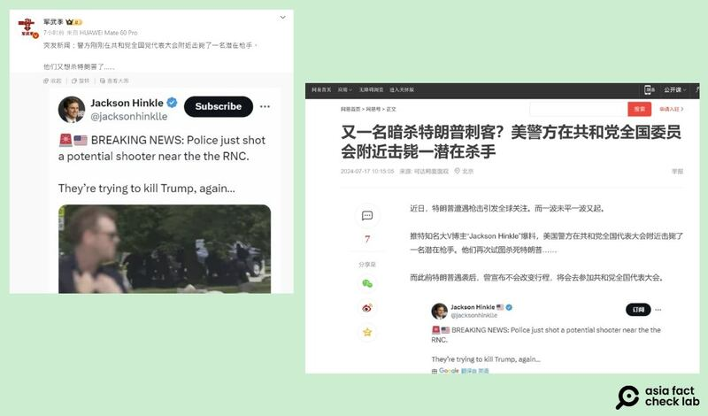
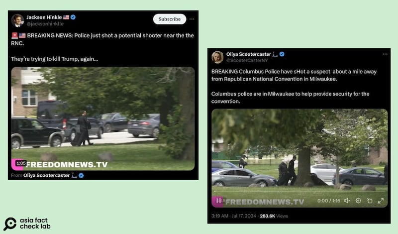
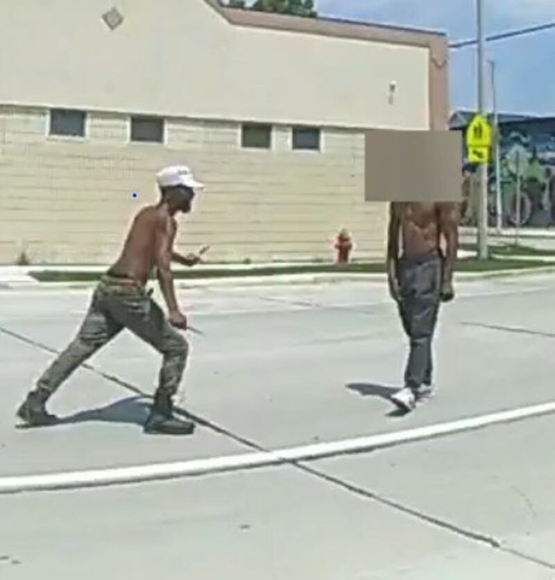

# 事實查覈｜又有人準備刺殺特朗普但被警察擊斃了？

作者：艾倫

2024.07.22 18:41 EDT

## 查覈結果：錯誤

## 一分鐘完讀：

2024年美國共和黨全國代表大會於7月15至18日在威斯康星州密爾沃基市舉行，剛經歷槍擊事件的特朗普也出席大會並正式成爲共和黨總統候選人。隨後，有消息流傳在中英文社交媒體上，稱有一名 “潛在槍手”在大會附近準備刺殺特朗普，遭在場警察擊斃。

亞洲事實查覈實驗室查證並還原了事發經過：

駐守大會附近的警察發現有兩人發生近距離的衝突，前往制止未果，於是開槍射擊其中一名手持雙刀的43歲男子。該男子是密爾沃基市本地人，在事件中受重傷致死。目前沒有任何證據顯示該男子持有槍支並意圖行刺特朗普。

## 深度分析：

新浪微博賬號"軍武季"於7月17日 [發文](https://weibo.com/2178514797/OnVtkxMNl)指出,特朗普在密爾沃基參與共和黨全國代表大會時,附近一名"潛在槍手"被警方擊斃,貼文寫道:"他們又想殺特朗普了"。暗示特朗普纔剛經歷完賓州槍擊後,馬上又遭遇刺殺,文末並附上一張X上傳播的該事件的截圖。

該文於五天內獲得超過七十次轉發,也傳到了中國新聞平臺 [網易](https://www.163.com/dy/article/J79RTTPP0553A9YO.html),網民評論"拜登只有一不做二不休,纔有機會""這樣還不如打內戰"。

圖：中文社媒及媒體輿論持續關注特朗普動向，近期傳出共和黨全國代表大會舉行期間，警方擊斃了一名要暗殺特朗普的“潛在槍手”。圖取自微博、網易

亞洲事實查覈實驗室發現,這則消息源自美國政治評論員傑克遜∙欣克爾(Jackson Hinkle)的X [賬號](https://x.com/jacksonhinklle/status/1813302933305590154),該賬號又是轉發的名爲"Oliya Scootercaster"的認證賬號所發的 [視頻](https://x.com/ScooterCasterNY/status/1813292460333777354),並附有文案,稱警方在大會附近殺了一名"潛在槍手"(potential shooter)。

圖：中文世界的相關傳言始於X上的英文賬號，多名獲認證的用戶發文指出特朗普在大會上再遭暗殺，並附上一則視頻佐證。圖取自X

密爾沃基警察局 [官方臉書賬號](https://www.facebook.com/milwaukeepolice/posts/pfbid0jf16NwpxatoxFE1dGeLP8RKHtusd8pyVvWAHZdemj3uvxexYF4hSFix5T8VZYz5Tl?rdid=0m9yRVgbUWMMqs0R)於7月17日公佈了警察的 [執法記錄儀視頻](https://videos.files.wordpress.com/gsRxcrgU/officer_1_2024-07-16_redacted.mp4?fbclid=IwZXh0bgNhZW0CMTAAAR07Zg5_f0fwwLpzRDHHGgpCp2ri7jNfirhkWUtYsmWWN3hhqFOY2cgTQzI_aem_gl_RJ7XCq-fkBTgw8wgZZg),並配文解釋了案件經過:多名警察目睹一名持有"雙刀"的嫌疑人與另一位未持武器的人發生爭執。警察表明身份並多次命令嫌疑人放下刀,但嫌疑人拒絕服從命令,並持刀衝向另一個人。警察最後朝向揮舞刀械的男子開槍,男子當場倒地。執法視頻完整記錄了這一過程。

圖：警方發佈的執法影像顯示，兩名赤裸上身的男子在大會會場附近發生衝突，其中一名手持雙刀，最後遭員警開槍擊斃。圖取自密爾沃基警察局臉書賬號

至於這場衝突是否和共和黨全國代表大會有關,哥倫布市警察部門在7月17日也發表 [聲明](https://www.facebook.com/ColumbusPolice/posts/pfbid02oDQcyXjjw6m34GP36874Db9TV9U9wavciWneetwyRiwBG52vb5J2HLHFL3JabAnhl?rdid=0le3otgKkSvSrMcN):"目前看起來此事件與大會無關,密爾沃基地區調查小組正在積極調查。"

無論從攝影記錄或是警方目前的判斷來看，都沒有證據證明這是一場“針對特朗普的暗殺”。

*亞洲事實查覈實驗室（Asia Fact Check Lab）針對當今複雜媒體環境以及新興傳播生態而成立。我們本於新聞專業主義，提供專業查覈報告及與信息環境相關的傳播觀察、深度報道，幫助讀者對公共議題獲得多元而全面的認識。讀者若對任何媒體及社交軟件傳播的信息有疑問，歡迎以電郵afcl@rfa.org寄給亞洲事實查覈實驗室，由我們爲您查證覈實。*

*亞洲事實查覈實驗室在X、臉書、IG開張了,歡迎讀者追蹤、分享、轉發。X這邊請進:中文*  [*@asiafactcheckcn*](https://twitter.com/asiafactcheckcn)  *;英文:*  [*@AFCL\_eng*](https://twitter.com/AFCL_eng)  *、*  [*FB在這裏*](https://www.facebook.com/asiafactchecklabcn)  *、*  [*IG也別忘了*](https://www.instagram.com/asiafactchecklab/)  *。*

[Original Source](https://www.rfa.org/mandarin/shishi-hecha/hc-another-trump-shooting-rumor-07222024184047.html)