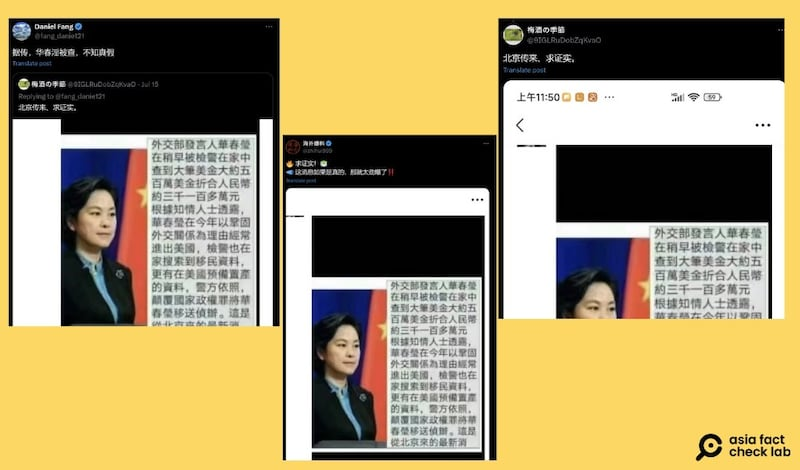
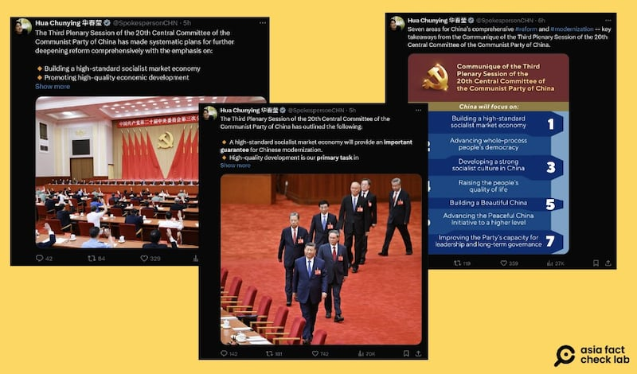
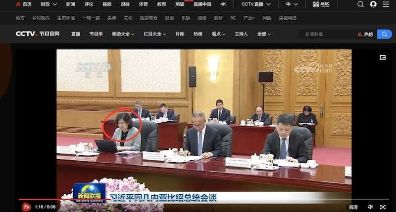

# 事實查覈｜華春瑩被查，家中搜出500萬美金？

作者：艾倫

2024.07.22 18:37 EDT

## 查覈結果：缺乏證據

## 一分鐘完讀：

中國外交部原發言人華春瑩今年五月升任外交部副部長。七月中，社媒平臺傳出華春瑩家中被搜出500萬美金，還被執法單位發現預備移民及置產的資料，因而遭“移送偵辦”的消息。

亞洲事實查覈實驗室查覈後發現，相關說法早在2018年時已流傳過，當時華春瑩還親自現身記者會“闢謠”。同時華春瑩最近一次公開活動是七月十日出席了一場外交拜會活動。目前沒有任何證據顯示華春瑩遭調查甚至落馬。

此外，被捕傳言傳出後不久，華春瑩的X賬號仍持續更新。

## 深度分析：

7月15日,X上出現一則消息(賬號 [1](https://x.com/zhihui999/status/1813055608888652210), [2](https://x.com/fang_danie121/status/1812766248033460601), [3](https://x.com/9IGLRuDobZqKvaO/status/1812749165031743707)),稱中國外交部副部長華春瑩家中被查出500萬美金和預備去美國移民和置產的資料,因此遭以"顛覆國家政權罪"移送偵辦。消息是以圖卡形式傳播,並附有華春瑩的照片。

這一消息經上述三個賬號轉傳約一天時間，在X上已有共逾百萬人瀏覽。

圖：中國外交部副部長華春瑩因家中藏有大量美金而被捕的消息於七月中在社媒平臺上大量流傳，截圖中的三篇推文總觀看量已破百萬。圖截自X

將網傳圖卡在谷歌以圖反搜,會發現相同的消息在 [2018年2月](https://newtalk.tw/news/view/2018-03-02/115822)就已經開始流傳,且廣傳的圖片和說法與本次一模一樣,包括500萬美金折算成人民幣"約爲3100多萬"的估算值。亞洲事實查覈實驗室發現,2018年2月和當下的美元兌換人民幣的匯率差距較大,如果按照2018年2月大約6.3的平均匯率,500萬美元的確大約可兌換3100多萬人民幣;而如果按照近期大約7.2左右的匯率,500萬美金的兌換價格已達約3600萬人民幣,網傳圖片明顯爲舊聞重傳,細節與當下的事實不符。

而根據當時臺灣中央社 [報道](https://www.cna.com.tw/news/acn/201803010248.aspx),華春瑩在二月底被傳私藏美元被捕後,於3月1日出席例行記者會,當時被解讀爲此舉是爲"露面闢謠"。

亞洲事實查覈實驗室也注意到，從七月中被捕消息傳出後，華春瑩的X社媒號仍活躍發文，從15日到截稿當日（22日），轉發和親自推文的數量高達15則。

圖：華春瑩被捕消息傳出後，其X賬號仍持續發文，圖中三張截圖爲華春瑩針對今年中國三中全會的相關推文。圖取自X

此外,中國央視於7月10日發佈的"習近平同幾內亞比索總統會談" [視頻](https://tv.cctv.com/2024/07/10/VIDEuAXKtKw0c6w25s0xxEwT240710.shtml)裏,華春瑩於1分16秒時出現在會談畫面中,比傳言散播只早5天,可看出華春瑩近期仍有出席公開活動。

圖：央視釋出的視頻畫面裏可看到，7月10日華春瑩親自參與習近平和幾內亞比索總統的會見。畫面取自央視

華春瑩最近一次在中國外交部的網站上露面是在5月21日，她接見拉美高端智庫青年學者訪華團。27日，中國國務院宣佈華春瑩出任外交部副部長後，外交部官網針對主要官員的“相關新聞”中迄今沒有發佈關於她的新的消息。

根據 [報道](https://www.cna.com.tw/news/acn/201803010248.aspx),2018年華春瑩出面闢謠時,距離她上次出現在外交部例行記者會上已時隔一個月,這次被捕傳言也是在華春瑩於外交部的動態大幅減少後所傳出。

*亞洲事實查覈實驗室（Asia Fact Check Lab）針對當今複雜媒體環境以及新興傳播生態而成立。我們本於新聞專業主義，提供專業查覈報告及與信息環境相關的傳播觀察、深度報道，幫助讀者對公共議題獲得多元而全面的認識。讀者若對任何媒體及社交軟件傳播的信息有疑問，歡迎以電郵afcl@rfa.org寄給亞洲事實查覈實驗室，由我們爲您查證覈實。*

*亞洲事實查覈實驗室在X、臉書、IG開張了,歡迎讀者追蹤、分享、轉發。X這邊請進:中文*  [*@asiafactcheckcn*](https://twitter.com/asiafactcheckcn)  *;英文:*  [*@AFCL\_eng*](https://twitter.com/AFCL_eng)  *、*  [*FB在這裏*](https://www.facebook.com/asiafactchecklabcn)  *、*  [*IG也別忘了*](https://www.instagram.com/asiafactchecklab/)  *。*

[Original Source](https://www.rfa.org/mandarin/shishi-hecha/hc-huachunying-arrested-fake-news-07222024183611.html)