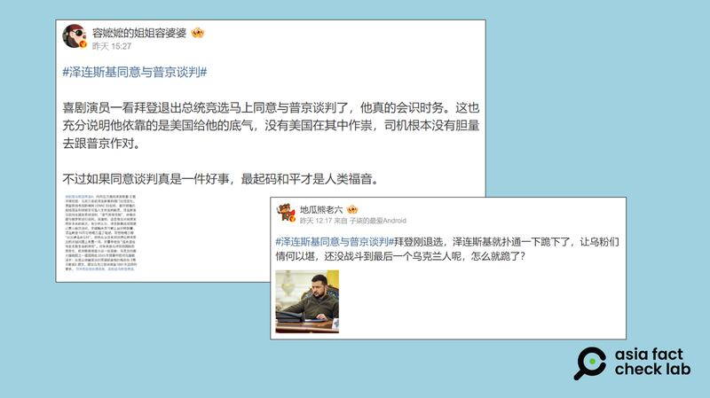

# 事實快查｜拜登宣佈退選 中文輿論場上哪些消息有問題？

作者：莊敬、艾倫

2024.07.23 12:27 EDT

美國總統拜登（Joe Biden）在7月21日宣佈放棄競選連任，並表態支持副總統哈里斯（Kamala Harris，或譯“賀錦麗”）代表民主黨參選總統。拜登成爲繼詹森（Lyndon B. Johnson）之後，56年來首位放棄連任的美國總統。

拜登退選的相關消息迅速傳遍各大社媒平臺，並一度登上中國微博熱搜榜，但其中有許多爲虛假信息或未經證實的說法。亞洲事實查覈實驗室（Asia Fact Check Lab, 下簡稱AFCL）針對部分華文輿論場廣爲流傳的消息進行查覈，發現了不少錯誤或誤導的信息。

## 一、民主黨已經“正式”推出哈里斯參選總統？

## 查覈結果：錯誤

7月22日,X認證的中文賬號 ["熱點新聞"](https://x.com/__Inty__/status/1815136786496225702)和 ["海外爆料"](https://x.com/zhihui999/status/1815137413855146054)發文稱,民主黨因爲"沒人可用",已經"正式"推出哈里斯參與2024總統大選。

相關傳言還附上了一張美國聯邦選舉委員會（FEC）的表格截圖，內文提到，哈里斯已不再是副總統而是總統候選人，因此委員會名稱改成“哈里斯選總統”（Harris for President），發文者藉由這張文件截圖證明哈里斯已是正式人選。

拜登退選新聞一出，網路上隨即出現傳言，稱現任美國副總統哈里斯已正式被提名爲民主黨總統候選人。圖截自X

經查,民主黨的最終候選人會在8月19至22日 [全國代表大會](https://demconvention.com/faqs/)期間才正式提名,而根據 [報道](https://www.wsj.com/livecoverage/biden-drops-out-election-2024/card/dnc-rules-committee-seeks-framework-to-select-new-nominee-ufoqd3hVJJ4LJ740B6m4),7月24日(週三)民主黨全代會規則委員會將開會討論提名候選人的方式,並全程直播。因此,所謂民主黨已經"正式"推出哈里斯參選總統的說法,是錯誤的。

此外，亞洲事實查覈實驗室去信詢問聯邦選委會，查證網傳截圖的真實性，得到的回應爲該圖的內容並無造假，但也不能當作民主黨正式提名的證據。

曾任聯邦選委會的共和黨前主席、也是網站"競選法律中心"(Campaign Legal Center)的創辦人特雷弗·波特(Trevor Potter)在一份 [公開聲明](https://campaignlegal.org/press-releases/clcs-trevor-potter-fec-rules-guiding-campaign-funds-when-nominee-withdraws)中提到,依照選委會的規定,由於拜登和哈里斯共享一個競選委員會,即使拜登退選,如果哈里斯仍是總統或副總統候選人,她可以繼續使用現有的競選資金參加大選。

因此,該截圖顯示的是一份修改後的 [委員會聲明](https://docquery.fec.gov/cgi-bin/forms/C00703975/1805325/),更改的原因是拜登已退出總統大選,需要更改委員會的名稱才能繼續使用競選資金,而非代表哈里斯已正式出線。

“直到昨天（21日），該委員會還是叫做‘拜登選總統’委員會”，美國聯邦選委會回應時說。

## 二、奧巴馬反對哈里斯代表民主黨選總統？

## 查覈結果：誤導

拜登宣佈退選後,不少民主黨政要表態支持哈里斯參選,然而黨內關鍵人物、前總統奧巴馬(Barack Obama)至今(截稿日7月23日)尚未公開相挺。在中文輿論場上,被部分媒體與社媒用戶解讀爲奧巴馬 ["拒絕支持哈里斯"](https://m.weibo.cn/detail/5058965577140230) ["反對哈里斯"](https://m.weibo.cn/detail/5058964108877217)。

美國總統拜登宣佈退選並表態支持副總統哈里斯參選後，網路傳言稱前總統奧巴馬反對哈里斯出線。圖取自微博

這種說法具誤導性，因爲奧巴馬在拜登退選後，並未表態支持或反對任何特定人選。

奧巴馬21日發表一篇向拜登致敬的文章,其中未提哈里斯或任何可能代表民主黨參選總統之人,但表示有信心民主黨能夠制定一套完善的方法,以遴選傑出的總統候選人。根據 [《紐約時報》](https://www.nytimes.com/2024/07/21/us/politics/why-obama-hasnt-endorsed-harris.html)引述消息人士的說法,奧巴馬是爲保持公正並且顧及拜登觀感,未立即表態力挺哈里斯。

事實上,即使拜登與許多民主黨政要表態支持哈里斯,並不代表她自動成爲民主黨總統候選人。根據 [路透社](https://www.reuters.com/world/us/dnc-chair-says-party-will-deliver-presidential-nominee-by-aug-7-2024-07-22/)等媒體報道,民主黨將由3949名黨代表投票決定總統提名人,哈里斯至少要拿下1976票才能邁過門檻。民主黨全代會主席哈里森(Jaime Harrison)向媒體表示,將於8月7日前舉行線上投票,確認總統提名人。

## 三、拜登一宣佈退選 澤連斯基馬上同意與普京談判？

## 查覈結果：誤導

在中國微博獲認證的"大V"博主 [發文](https://m.weibo.cn/detail/5058958929431930),稱烏克蘭總統澤連斯基一看拜登退出總統競選,馬上同意與俄羅斯總統普京談判了。

部分微博用戶稱，美國總統拜登一宣佈退選，烏克蘭總統澤連斯基馬上同意與俄羅斯談判。圖取自微博

這是誤導信息。博主附上的文章截圖是美國有線電視新聞網(CNN)7月20日的 [報道](https://edition.cnn.com/2024/07/20/europe/ukraine-zelensky-uncertainty-russia-negotiations-intl/index.html),也就是在拜登21日宣佈退選之前所發佈的。

而且，CNN報道內容並不是澤連斯基說他同意與普京談判，而是分析澤連斯基之前發表談話時“語氣剋制”，並“暗示”烏克蘭願與俄羅斯談判；CNN訪問的專家指出，澤連斯基建議莫斯科派代表團參加下次的和平峯會，這可能是向世界發出的信息，表明烏克蘭願意坐在談判桌上，但不能完全按照俄羅斯的條件，也不會讓烏克蘭投降。

## *亞洲事實查覈實驗室（Asia Fact Check Lab）針對當今複雜媒體環境以及新興傳播生態而成立。我們本於新聞專業主義，提供專業查覈報告及與信息環境相關的傳播觀察、深度報道，幫助讀者對公共議題獲得多元而全面的認識。讀者若對任何媒體及社交軟件傳播的信息有疑問，歡迎以電郵*  [*afcl@rfa.org*](mailto：afcl@rfa.org)  *寄給亞洲事實查覈實驗室，由我們爲您查證覈實。* *亞洲事實查覈實驗室在X、臉書、IG開張了，歡迎讀者追蹤、分享、轉發。X這邊請進：中文*  [*@asiafactcheckcn*](https：//twitter.com/asiafactcheckcn)  *；英文：*  [*@AFCL\_eng*](https：//twitter.com/AFCL_eng)  *、*  [*FB在這裏*](https：//www.facebook.com/asiafactchecklabcn)  *、*  [*IG也別忘了*](https：//www.instagram.com/asiafactchecklab/)  *。*

[Original Source](https://www.rfa.org/mandarin/shishi-hecha/hc-biden-withdrawal-07232024122400.html)