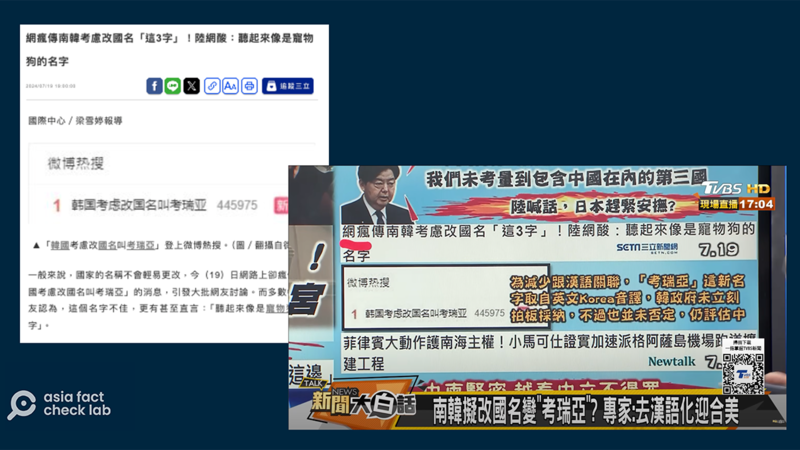
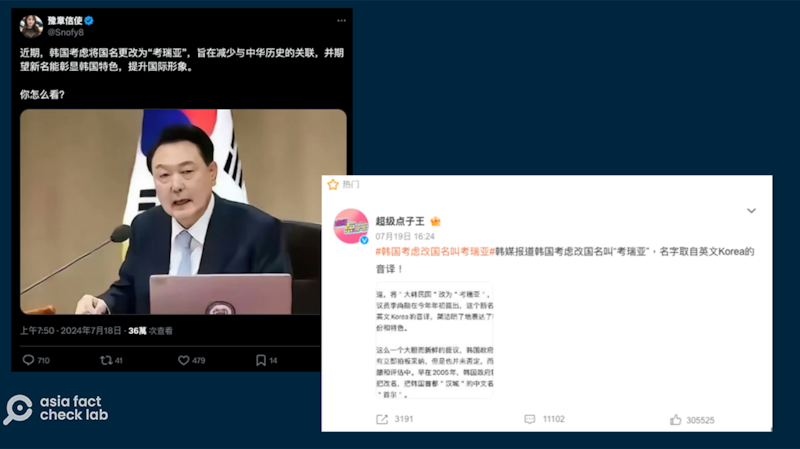
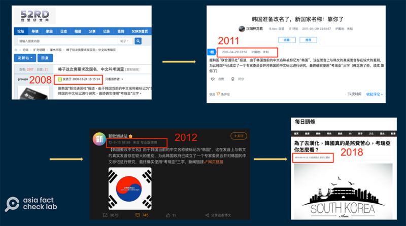

# 事實查覈｜韓國議員提案改國名爲“考瑞亞”？

作者：董喆

2024.07.24 16:20 EDT

## 標籤：錯誤

## 一分鐘完讀：

近期，微博有傳言稱有韓國議員提案“韓國考慮改國名爲考瑞亞”，相關討論更登上微博熱搜。不少臺灣媒體跟進報道，進一步傳播該消息，並有政論節目專家分析此舉是爲了“去漢語化”、“迎合美國”。

亞洲事實查覈實驗室查證，韓國最近並無類似提案。並且，韓國改名爲“考瑞亞”的說法可追溯至2008年，是舊聞重炒、反覆出現的假信息。

## 深度分析：

臺灣媒體"三立新聞網"7月19日晚間 [報道](https://archive.ph/Ria3c#selection-2331.0-2331.136) ,"網瘋傳南韓考慮改國名'這3字'!陸網酸:聽起來像是寵物狗的名字",內容指出微博瘋傳韓國考慮改國名爲"考瑞亞"的消息,並登上微博熱搜。三立新聞提到,據消息稱,韓國議員李尚勳在2024年初提案,"考瑞亞"取自Korea的音譯。韓國政府未立刻拍板採納此提議,仍在醞釀和評估中。臺媒TVBS政論節目" [新聞大白話](https://youtu.be/0j3FSzN-QZk?si=a34345U7fxze5H8m&t=238) "引述三立新聞的報導,並下標"專家:去漢語化迎合美"。

臺灣媒體報道稱，韓國擬改國名爲“考瑞亞”。（三立新聞網站、TVB節目截圖）

亞洲事實查覈實驗室（Asia Fact Check Lab,以下簡稱AFCL）溯源此傳言，發現7月18日有X（原推特）帳號“豫章信使”發佈類似消息：“近期，韓國考慮將國名更改爲‘考瑞亞’，旨在減少與中華歷史的關聯，並期望新名能彰顯韓國特色，提升國際形象。 ​​​”

時隔一天，此傳言於7月19日下午登上中國社媒平臺微博的熱搜榜，其中以“超級點子王”的帖文最爲熱門，有高達30.6萬的點贊量，以及1.1萬留言、3191次轉發，與此同時，中國各大論壇網站也開始出現同一話題的文章。

中文社交媒體熱傳韓國要改國名的消息，並一度登上微博熱搜。（X、微博截圖）

韓國要改中文國名爲"考瑞亞"消息並不是第一次出現,AFCL發現,早在2008年,就有 [中國網路論壇](http://bbs.52rd.com/Thread-146269-1-1.html) 討論此事,該消息稱"據韓國聯合通訊社報道,由於韓國當前的中文名稱被標記爲韓國,這在發音上與韓文的真實發音存在較大的差別,爲此韓國政府已成立了一個專家委員會並對韓國的中文標記進行研究,最終確實使用考瑞亞三字。"

時至今日，韓國從未宣佈要改名，在過去的十幾年中，韓聯社也沒有類似報道。

近幾年,韓國改名"考瑞亞"的傳聞多次反覆出現( [2011](https://www.xcar.com.cn/bbs/viewthread.php?tid=14532102&page=1) , [2012](https://weibo.com/1888494957/ywZCtpUEB) , [2018](https://kknews.cc/zh-tw/history/lqnnyjb.html) ),但最新的這一次,傳言中新出現了"韓國議員李尚勳"提案的新資訊。

韓國改名“考瑞亞”的虛假信息從2008年就開始流傳，並反覆出現。（微博、xcar等網絡論壇截圖）

"李尚勳"在韓文中發音應近似爲"Lee Sang Hoon",AFCL在 [韓國國會網站](https://www.assembly.go.kr/portal/cnts/cntsCont/dataA.do?cntsDivCd=NAAS&menuNo=600137) 搜尋與之類似的姓名,查到姓名相近的議員有이상식(Lee Sang Sik)和이상휘(Lee Sang Hui),但 [法案列表](https://likms.assembly.go.kr/bill/BillSearchResult.do) 中,並未有任何有關韓國改名的提案。

另外,韓國政治人物中,有一位 [首爾市議員](https://www.smc.seoul.kr/home/1120) 名爲이상훈(Lee Sang Hoon)以及一位 [丹陽縣議會主席이상훈](https://council.danyang.go.kr/kr/chairman/historyCnts.do) (Lee Sang Hoon)但兩人也都沒有提到相關主張。

AFCL以"대한민국 개명"(大韓民國 改名) 作爲關鍵字搜尋,也沒有找到相關新聞。一個韓國博客網站曾於 [7月20日](https://archive.ph/oPaiE) 發佈文章,內容有提到近期中國出現韓國要改名的假新聞現象,並將之當作笑談。

AFCL同時向韓國駐臺北辦公室查證，至截稿前尚未收到回覆。

根據韓國國會、新聞報道等公開資訊，並未有信息顯示韓國有議員提案改國名一事，韓國要將中文國名改名“考瑞亞”則是經年反覆傳播的錯誤訊息。

*亞洲事實查覈實驗室(Asia Fact Check Lab)針對當今複雜媒體環境以及新興傳播生態而成立。我們本於新聞專業主義,提供專業查覈報告及與信息環境相關的傳播觀察、深度報道,幫助讀者對公共議題獲得多元而全面的認識。讀者若對任何媒體及社交軟件傳播的信息有疑問,歡迎以電郵*  [*afcl@rfa.org*](mailto:afcl@rfa.org)  *寄給亞洲事實查覈實驗室,由我們爲您查證覈實。* *亞洲事實查覈實驗室在X、臉書、IG開張了,歡迎讀者追蹤、分享、轉發。X這邊請進:中文*  [*@asiafactcheckcn*](https://twitter.com/asiafactcheckcn)  *;英文:*  [*@AFCL\_eng*](https://twitter.com/AFCL_eng)  *、*  [*FB在這裏*](https://www.facebook.com/asiafactchecklabcn)  *、*  [*IG也別忘了*](https://www.instagram.com/asiafactchecklab/)  *。*

[Original Source](https://www.rfa.org/mandarin/shishi-hecha/hc-korea-rename-07242024161251.html)