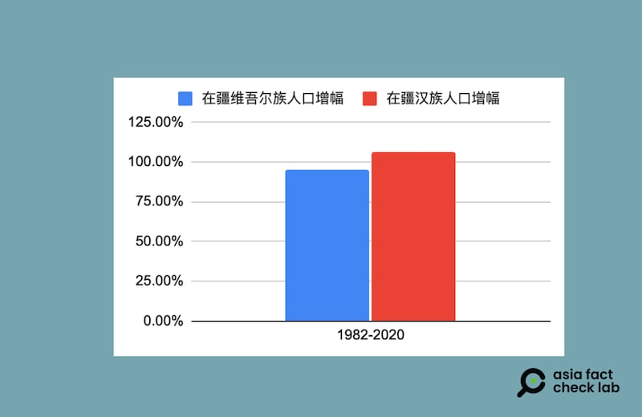
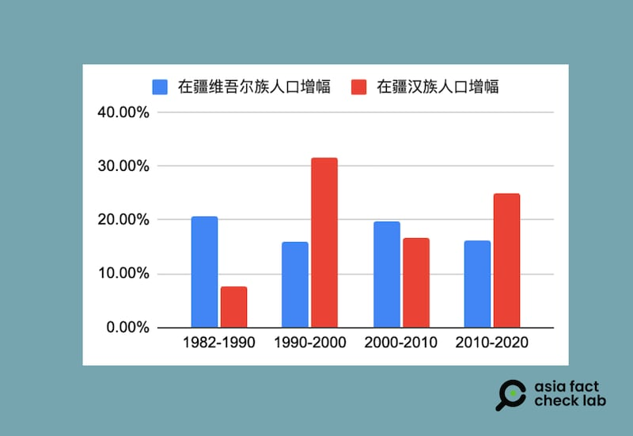
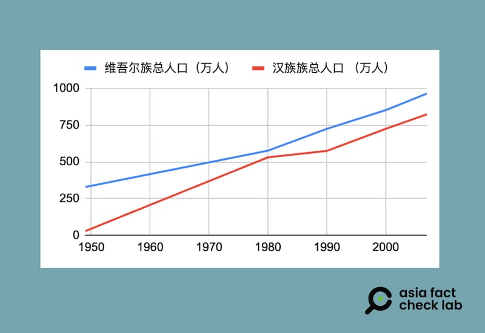

# 事實查覈 | 外交部發言人稱新疆維吾爾族人口增幅“明顯高於漢族？”

作者：沈軻

2024.07.25 16:07 EDT

## 標籤：錯誤

## 一分鐘完讀：

7月初，在評論一份美國國務院關於新疆的報告時，中國外交部發言人毛寧對新疆存在“種族滅絕”的說法表示否認，並稱，在新疆的維吾爾族人口的增長率“明顯高於當地漢族人口的增幅。”

亞洲事實查覈實驗室檢視多份中國官方的人口統計數據和媒體、學術研究報道，發現這個說法是錯誤的。多方資料顯示，無論是從1949年以來的總體變化，還是近年間（2010-2020年）的最新變化，新疆的漢族人口的增幅都超過了維吾爾族人口。

## 深度分析：

美國國務院在6月底發佈《2023年國際宗教自由報告》 [評價新疆現狀](https://www.state.gov/reports/2023-report-on-international-religious-freedom/china/xinjiang/),指出內容指控中國政府近年對維吾爾族實施鎮壓和種族滅絕。 7月1日, [中國外交部行例行記者會](https://archive.ph/q3USJ)上,日本NHK記者請發言人毛寧回應這份報告。

毛寧語氣嚴厲地批評了這份報告，稱“所謂‘種族滅絕’是美方編造的徹頭徹尾的謊言。”她接着表示：“從1953年第一次全國人口普查到2020年第七次全國人口普查，新疆維吾爾族人口從360.76萬增長到1162.43萬。維吾爾族人口的增幅不僅高於全疆人口的增幅，也高於全部少數民族人口的增幅，明顯高於當地漢族人口的增幅。”

毛寧所稱維吾爾族人口增幅“明顯高於當地漢族人口的增幅”，這個說法正確嗎？亞洲事實查覈實驗室（Asia Fact Check Lab，下簡稱AFCL）使用多個數據來源進行了查覈。

## “全國人口普查”中民族人口增長數據

毛寧在評述新疆維族人口時，引述的是“全國人口普查”。因此，AFCL首先檢視了中國官方公佈的全國人口普查相關數據。

從1953到2020年，中國共進行了七次全國性人口普查。 綜合網絡及圖書館收藏的紙本資料，AFCL可查到的新疆區域內維、漢人口的詳細數據只能追溯至1982年，也就是第三次到第七次人口普查。

根據普查數據，新疆的維族人口在1982到2020這38年中，淨增長566.84萬人，增長幅度爲95.17%。

至於漢族，全國人口普查數據顯示從1982年至2020年，新疆漢族人口淨增563.36萬，增長幅度爲106.57%。

1982年至2020年間在疆漢族、維族人口增長對比（數據來源：中國全國人口普查報告，AFCL製圖）

觀察在每次普查之間的人口增幅變化，可以發現在1982到1990年、以及2000到2010年兩個時間段中，維族人口的增長超過漢族人口；但1990到2000年，以及2010到2020兩個時間段，漢族人口的增長則明顯超過維族人口。尤其在1990到2000年間，漢族人口增幅達到維族人口的兩倍。

因此， 根據可以查到的全國人口普查數據，從1982年至2020年，在新疆的漢族人口總增長超過了維吾爾族的人口增長。

## 《  [新疆少數民族發展報告](https：//isbnsearch.org/isbn/9787228128259)  》記載的民族結構變化

爲了獲得更早期、更全面的新疆區域內人口結構變化的數據,AFCL還查閱了《 [1949-2009 新疆少數民族發展報告](https://isbnsearch.org/isbn/9787228128259)》(下簡稱《發展報告》)。這本專著由新疆人民出版社出版,作者吳福環曾任新疆社科院院長,是中國著名的新疆史專家,該書亦被中國官方刊物如 [《中共黨史研究》](https://m.fx361.com/news/2010/0216/17335846.html)等推薦。因此AFCL認爲,這一報告中的數據也具有官方權威性。

《發展報告》記載了從1949到2007年新疆人口的逐年統計，該書中稱，其數據來源於《新疆統計年鑑》，應是計算基礎不同的原因，書中數據與前述全國人口普查數據略有出入。AFCL將《發展報告》中不同年份的統計數據整理製圖如下

1949年至2007年間在疆漢族、維族人口統計（數據來源：《1949-2009 新疆少數民族發展報告》，AFCL製圖）

根據《發展報告》中的統計數字，從1949年到2007年，新疆維族人口從329.11萬增至965.06萬，成長了2.93倍；漢族人口則從29.1萬增至823.93萬，成長了28.31倍。

因此，根據《發展報告》，漢族人口在1949年到2007年期間的增速，更是遠遠超過維吾爾族人口。

## 媒體報道、學術論文記錄在疆漢族人口迅速增長

近年來,在新疆的漢族人口比維族人口增長的快,也是中國官方媒體曾經報道過的事實。《環球時報》英文版 [2021年的報道](https://www.globaltimes.cn/page/202106/1226080.shtml)稱,與第六次人口普查相比,第七次人口普查結果顯示,在疆漢族人口增長了24.86%,而維族人口增幅爲16.2%。這些數據也同時經 [中新網](https://www.chinanews.com.cn/gn/2021/06-14/9499364.shtml)、 [天山網](https://www.ts.cn/xwzx/szxw/202106/t20210614_6045418.shtml)等多個官方媒體報道,並一度引發國際社會關注。

新疆民族人口結構的經年變化一直也是學術界的研究課題。例如,德國弗萊堡大學教授嶽安歌(Agnieszka Joniak-Lüthi)曾於 [2013年發表論文](https://www.jstor.org/stable/24364952)表示,在1949年時,漢族人在新疆人口中僅佔百分之六多一點,而當時維吾爾族則佔新疆總人口的75%。該論文稱,到2000年中期,維吾爾族很可能已經成爲新疆地區的"少數民族"。該論文註釋,雖然中國官方統計中維吾爾族總人口依然高於漢族人口,但有學者表示,在新疆的真實漢族人口數據可能會比統計數據高很多,因爲很多漢族人移居新疆後,並不會很快把戶口遷移到新疆。

在這篇論文中，嶽安歌就不同時期漢族人口遷入新疆的特點給出瞭解釋，20世紀50年代，漢族人口通過新疆建設兵團遷入新疆、60年代，中國多地出現的饑荒進一步促進了漢族往新疆流動，而文革期間，知青“上山下鄉”活動中也有數十萬漢族人口被派往新疆。80年代，中國實施改革開放之後，在新疆的漢族人口的增長一度趨緩，但從90年代初起，在疆的漢族增幅重新高過維族，這段時間向新疆遷移的漢族人口，首要目標在於追求利潤，實現經濟，“主要由個人組織，而且大多自願。”

綜合以上數據,無論是人口普查、《 [新疆少數民族發展報告](https://isbnsearch.org/isbn/9787228128259)》還是媒體、學術研究,都顯示,在1949年之後的總體趨勢和大部分時期中,新疆的漢族人口增幅都超過了維吾爾族人口。

AFCL曾於在7月中致電中國外交部，希望進一步覈實毛寧的說法的數據來源，接電話的人員先表示“聽不太清楚”，之後建議記者聯繫中國駐美大使館。但直至本文截稿爲止，中國外交部和中國駐美大使館均未回答AFCL的詢問。

本文數據來源：

1. 1953與1964的數據 - 《 [1949-2009 新疆少數民族發展報告](https://isbnsearch.org/isbn/9787228128259)》
2. 1982至2020維族數據 - [《新疆的人口發展》白皮書](https://archive.ph/CZ2H5)
3. 1982年漢族數據 - 第三次全國人口普查,手工彙總資料彙編,第四冊:各民族人口
4. 1990年與2000年漢族數據 - [新疆第五次人口普查公報](https://archive.ph/EKEhw)
5. 2010與2020年漢族數據 [- 新疆第七次全國人口普查公報](https://archive.ph/CyXts#selection-111.0-111.19)

*亞洲事實查覈實驗室(Asia Fact Check Lab)針對當今複雜媒體環境以及新興傳播生態而成立。我們本於新聞專業主義,提供專業查覈報告及與信息環境相關的傳播觀察、深度報道,幫助讀者對公共議題獲得多元而全面的認識。讀者若對任何媒體及社交軟件傳播的信息有疑問,歡迎以電郵* *afcl@rfa.org* *寄給亞洲事實查覈實驗室,由我們爲您查證覈實。*

*亞洲事實查覈實驗室在X、臉書、IG開張了,歡迎讀者追蹤、分享、轉發。X這邊請進:中文*  [*@asiafactcheckcn*](https://twitter.com/asiafactcheckcn)  *;英文:*  [*@AFCL\_eng*](https://twitter.com/AFCL_eng)  *、*  [*FB在這裏*](https://www.facebook.com/asiafactchecklabcn)  *、*  [*IG也別忘了*](https://www.instagram.com/asiafactchecklab/)  *。*

[Original Source](https://www.rfa.org/mandarin/shishi-hecha/hc-birth-rate-han-ethnicity-07252024160648.html)