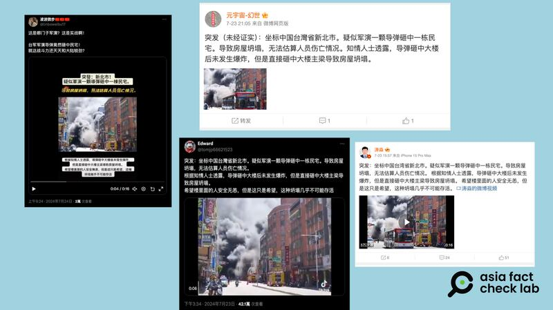
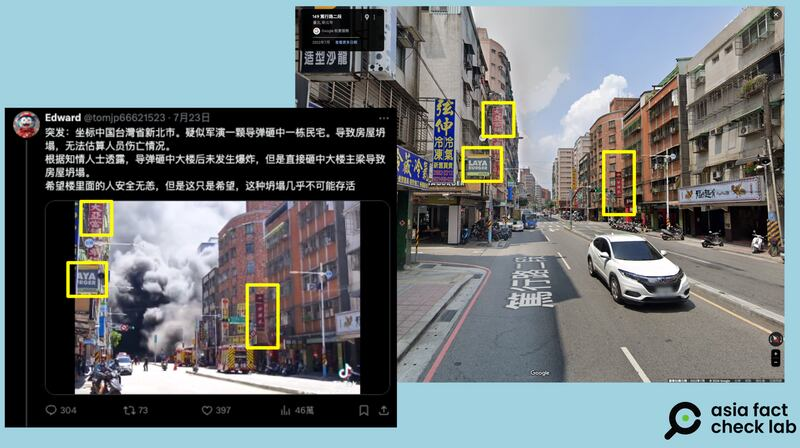

# 事實查覈｜臺灣軍演釀事故　導彈炸燬民宅？

作者：董喆

2024.07.26 12:17 EDT

## 查覈結果：錯誤

## 一分鐘完讀：

7月22日至25日，臺灣各地相繼開展 “萬安47號” 軍民聯合防空演習。演習期間，X（原推特）上流傳一則視頻，視頻中的街道濃煙密佈，發佈者稱這是演習導彈砸中民宅所致。亞洲事實查覈實驗室查證，視頻中的場景是臺灣新北市板橋7月22日發生的一場民宅火警，與導彈無關，且新北市的萬安演習安排在23日開展，該事故與演習沒有關係。

## 深度分析：

近日,臺灣依傳統展開年度軍民聯合萬安演習,社羣平臺上隨之出現有關演習的錯假資訊。多個簡體中文賬號發佈同一則視頻( [1](https://archive.ph/RhxOZ), [2](https://archive.ph/FvxC0)),畫面是一處街景,街道末端濃煙密佈,一旁還有消防車待命。這些賬號稱,"中國臺灣省新北市,疑似軍演一顆導彈砸中一棟民宅,導致房屋坍塌,無法估算人員傷亡情形"。同樣的貼文內容也出現在微博( [1](https://archive.ph/T8JGK), [2](https://archive.ph/1J5PX))。網友羣嘲,臺軍戰鬥力如此還想與中國較勁。

近日，中文互聯網廣傳一則影片，發佈者稱臺灣演習導彈砸毀民宅。（圖截取自X、新浪微博）

亞洲事實查覈實驗室以視頻中的顯著招牌大亞當鋪進行搜索，發現臺灣北部有兩間大亞當鋪，一間位於臺北市松山區，另一間確實位於新北市板橋區，以Google街景覈對，皆與網傳視頻中店鋪的相對位置相符，因此可以確定視頻事發地點爲新北市板橋區篤行路二段往篤行路三段方向。

視頻中的街景與新北市板橋區篤行路二段往篤行路三段方向街景比對。（圖取自X和谷歌地圖）

進一步在 [臺灣內政部消防署災情訊息網站](https://archive.ph/41YAU)查詢發現,7月22日中午12時54分,新北市消防局受理報案,板橋區篤行路三段現場一層連動鐵皮建物商店發生火災,燃燒面積合計約60平方公尺,波及路邊12輛機車及1貨車,無人員傷亡。

臺灣媒體亦有對此事進行報道( [1](https://archive.ph/BmtWp), [2](https://archive.ph/dOtyr)),且根據臺灣國防部全民防衛動員署 [公告](https://archive.ph/QRVjb),北部包括宜蘭縣、基隆市、臺北市、新北市、桃園市、新竹市、新竹縣的萬安演習時間爲7月23日,因此網傳視頻中的事故發生時,該地區的萬安演習尚未開始。

由於同一則視頻在臺灣社會也引發是否有大爆炸的討論,雖輿論未提到演習,但民衆質疑新北市政府"壓新聞",因此新北市政府亦在7月24日 [發表聲明](https://archive.ph/B8blQ),澄清該案爲早餐店及鄰接鐵皮屋倉庫發生的火災。由於倉庫堆放大量易燃物品,濃煙及火勢巨大,但消防局僅用了約20分鐘即撲滅火勢,無人員傷亡,"絕非網稱大爆炸"。

*亞洲事實查覈實驗室（Asia Fact Check Lab）針對當今複雜媒體環境以及新興傳播生態而成立。我們本於新聞專業主義，提供專業查覈報告及與信息環境相關的傳播觀察、深度報道，幫助讀者對公共議題獲得多元而全面的認識。讀者若對任何媒體及社交軟件傳播的信息有疑問，歡迎以電郵afcl@rfa.org寄給亞洲事實查覈實驗室，由我們爲您查證覈實。*

*亞洲事實查覈實驗室在X、臉書、IG開張了,歡迎讀者追蹤、分享、轉發。X這邊請進:中文*  [*@asiafactcheckcn*](https://twitter.com/asiafactcheckcn)  *;英文:*  [*@AFCL\_eng*](https://twitter.com/AFCL_eng)  *、*  [*FB在這裏*](https://www.facebook.com/asiafactchecklabcn)  *、*  [*IG也別忘了*](https://www.instagram.com/asiafactchecklab/)  *。*

[Original Source](https://www.rfa.org/mandarin/shishi-hecha/hc-taiwan-military-exercises-07262024121435.html)