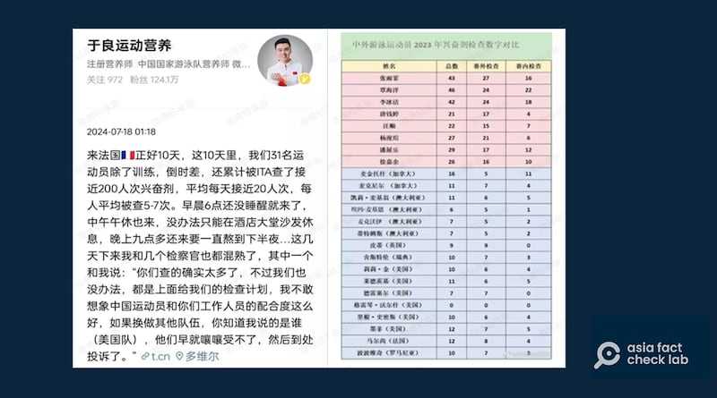
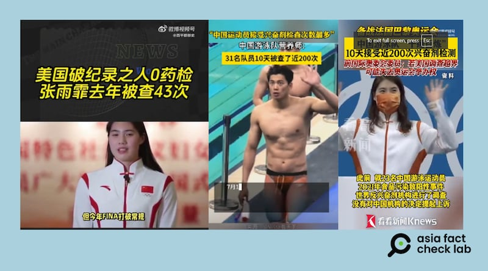
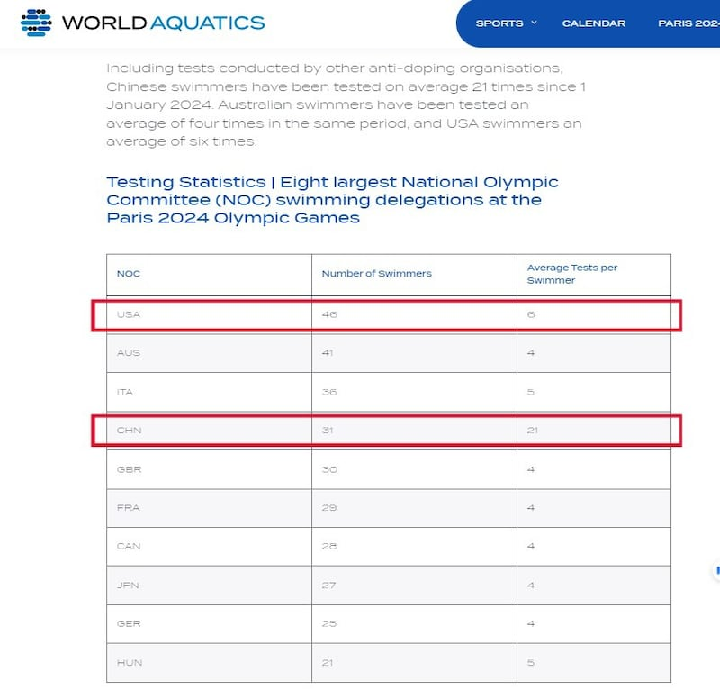

# 事實查覈｜反興奮劑檢測針對中國游泳隊，不查美國運動員？

作者：鄭崇生

2024.07.29 19:32 EDT

## 查覈結果：錯誤

## 一分鐘完讀：

巴黎奧運會前夕,中國游泳隊營養師 [於良在個人新浪微博發文](https://archive.ph/xus4x)並附上表格稱,中國游泳選手遭到頻繁的興奮劑檢測。他的發文還附了一張表格稱,中國蝶泳好手張雨霏2023年的興奮劑檢測次數高達43次,而美國選手葛雷琴∙威爾什(Gretchen Walsh)則是零檢測記錄。於良發佈的統計表格在中文互聯網上廣泛傳播,在中國游泳隊選手比賽失利後, [原中國跳水隊運動員高敏發文](https://www.guancha.cn/sports/2024_07_29_743083.shtml)稱頻繁的藥檢"成功干擾了中國游泳隊",引起網民熱議。

亞洲事實查覈實驗室詢問世界水上運動總會(World Aquatics),同時查閱美國反興奮劑中心(USADA)的 [數據庫](https://www.usada.org/news/athlete-test-history/),確定威爾什在2023年共接受9次檢測,今年截至目前爲止也有10次藥檢記錄,並非於良所指控的零記錄。而根據藥檢規範,成績好的運動員原本就會獲得更高的採樣檢測頻次,說中國游泳隊遭遇針對和干擾缺乏證據。

中國游泳隊營養師於良發文稱中國游泳運動隊遭遇藥檢"區別對待"（新浪微博截圖）

## 深度分析：

7月19日，中國游泳隊營養師於良在微博發言中說，中國31名運動員到巴黎10天，已經接受藥檢近200次，他還稱，就連檢測員都告訴他中國隊被查的“確實太多了”“如果換做其他隊伍，你知道我說的是誰，（美國隊），他們早就嚷嚷受不了，然後到處投訴了。”

目前, [於良的微博](https://archive.ph/xus4x)上已經看不到他19日發出的短文,但 [觀察者網](https://archive.ph/XSKjY)等媒體迅速對他的言論進行了報道評論,稱"比賽還沒開始,美國就把泳池搞髒了。"

28日，巴黎奧運會游泳比賽中，威爾什與張雨霏在100公尺蝶式項目中相遇，最終威爾什拿下銀牌，中國隊的張雨霏則拿下銅牌。

這場比賽後，於良當日的發言在媒體和社媒上又引發了一波傳播和討論。

中文互聯網上，中美運動員被"區別對待"抽檢興奮劑的報道和評論持續傳播。（網絡截圖）

## 美國隊威爾什全年"零檢測"？

亞洲事實查覈實驗室查覈發現,根據 [美國反興奮劑中心(USADA)的記錄](https://www.usada.org/news/athlete-test-history/),威爾什在2023年共接受9次檢測,今年截至目前爲止也有10次藥檢紀錄。

世界水上運動總會負責反興奮劑檢測的廉正小組（Aquatics Integrity Unit）回覆亞洲事實查覈實驗室的電郵中，並未證實或否認是否針對中國，但對於於良提出的數據，廉正小組告訴記者，威爾什在2023年與2024年至今，接受《世界反興奮劑條例》（World Anti-Doping Code）標準的檢測次數分別爲9次，而這些數據還未計算威爾什隸屬於美國全國大學體育協會（NCAA）體系下，接受NCAA標準的反性興奮劑檢測次數。

世界水上運動總會爲了強化公平性與透明度,今年特別在奧運前夕就開始委由國際檢測機構(International Testing Agency, ITA)執行 [更加全面的檢測計劃](https://www.worldaquatics.com/news/4065344/world-aquatics-comprehensive-rigorous-anti-doping-testing-programme-paris-2024-olympic-games)。

今年1月起到巴黎奧運會舉行前夕的統計顯示，中國游泳隊31名選手每人平均受檢次數是21次，換算成總檢測數已超過600人次；而美國隊總檢測數達276人次，46名選手平均每人檢測次數爲6次。

世界水上運動總會官方記錄的各國奧運代表團2024年被抽檢的記錄（世界水上運動總會官網截圖）

## 成績越好檢測越多是國際慣例

世界反興奮劑機構(World Anti-Doping Agency)是執行《世界反興奮劑條例》的最高獨立機構,除了針對不同運動項目、在比賽前後的不同時段,對各類興奮劑檢測的方法和標準有詳細的要求, [《檢測與調查國際標準》(](https://www.wada-ama.org/sites/default/files/2022-12/isti_2023_w_annex_k_final_clean.pdf)ISTI)最新修正版本中的第4·5項就明確指出:在各類單項運動中,經常參加最高級別國際賽事、例如奧運會或世界錦標賽,並且名列前茅的運動員,是"針對性檢測"(Target Testing)的主要目標,而針對性檢測也是隨機發生。

張雨霏2023年在世錦賽、世界大學生運動會、亞運會、世界盃參加了59個項目,共拿了 [23塊金牌](https://people.cctv.com/2024/04/10/ARTIbXmmi5ibUccecm4OvI7H240409.shtml)。她的參賽項目與獲獎次數都多,也接受了多達43次藥檢。

至於美國隊的 [威爾什](https://www.teamusa.com/profiles/gretchen-walsh),巴黎奧運會將是她首度在奧運比賽中登場,而她2023在世錦賽中拿下一金、一銀、一銅的成績,參加的比賽和獲得的獎牌數量都比張雨霏少很多。

對於威爾什在NCAA體系下的運動員時期接受多少次NCAA標準的反興奮劑檢測？至截稿，包括NCAA與USADA都沒有回覆亞洲事實查覈實驗室的查詢。

至於清晨6點就有檢驗員敲門要求驗尿，中國游泳選手的經驗也並不是獨一無二。

曾獲得28塊奧運獎牌的美國退役游泳選手,被稱爲"飛魚"的菲爾普斯(Michael Phelps)就曾在2017年的美國國會聽證會上指出,USADA的檢驗員會在凌晨6點來敲門吵醒他,要求驗血或驗尿——這是他16年選手生涯的日常。《今日美國報》(USA Today)在 [報道](https://www.usatoday.com/story/sports/columnist/brennan/2017/02/28/michael-phelps-usada-drug-testing-clean-sport/98548400/)中說,這類不定期的突擊檢查,是包括美國游泳、擊劍與花式滑冰選手都會面臨的檢測,美國選手若是拒絕,可能面臨禁賽4年的處分。菲爾普斯說,他2016年最後一次參加奧運會的前半年,光是美國反興奮劑中心就對他檢測過13次。

## 中國游泳隊的"興奮劑嫌疑"從東京延續到巴黎

張雨霏在決賽前受訪時,也爲自己頻繁遭藥檢抱屈。根據 [新華社報道](https://archive.ph/S0IuZ),她表示,希望外界"不要帶有色眼鏡看待中國游泳隊",並重申東京奧運前發生的中國游泳隊多名選手興奮劑檢測呈陽性事件,是"食品污染"造成的。

然而，這一說法並沒有得到輿論的廣泛認同，甚至一直在被質疑。

巴黎奧運會前, [《紐約時報》](https://www.nytimes.com/2024/04/20/world/asia/chinese-swimmers-doping-olympics.html)報道稱,世界反興奮劑機構(WADA)在2021年東京奧運會揭幕的7個月前,就已得知包括張雨霏在內的23名中國游泳隊選手藥檢呈陽性,但在沒有公佈數據和披露相關消息的情況下,決定採信 [中國反興奮劑中心](https://www.chinada.cn/index.html)的說詞,也就是運動員在不知情下喫下了酒店提供的受污染飲食,纔會有陽性結果。《紐約時報》認爲,世界反興奮劑機構沒有按照慣例要求二度檢測,或是暫緩陽性選手繼續參賽,而是直接採信中國反興奮劑中心的說法,有違反先例之嫌。

上述消息引起美國方面重視,美國國會甚至還爲此召開 [聽證會](https://energycommerce.house.gov/events/oversight-and-investigations-subcommittee-hearing-examining-anti-doping-measures-in-advance-of-the-2024-olympics),這也讓長期以來 [美國反興奮劑中心](https://www.usada.org/statement/tygart-wada-cottier-report/)和 [世界反興奮劑機構](https://www.wada-ama.org/en/news/statement-wada-president-politicization-anti-doping-united-states)之間的矛盾公開化,雙方負責人多次通過公開聲明互相指責。隨後,國際奧委會罕見地 [威脅](https://www.npr.org/2024/07/24/nx-s1-5050528/olympic-threaten-salt-lake-2034-winter-games-doping)可能取消2034年美國鹽湖城冬季奧運會的主辦權,並指控美國啓動針對世界反興奮劑機構的刑事調查是"不可接受的"。

*亞洲事實查覈實驗室（Asia Fact Check Lab）針對當今複雜媒體環境以及新興傳播生態而成立。我們本於新聞專業主義，提供專業查覈報告及與信息環境相關的傳播觀察、深度報道，幫助讀者對公共議題獲得多元而全面的認識。讀者若對任何媒體及社交軟件傳播的信息有疑問，歡迎以電郵afcl@rfa.org寄給亞洲事實查覈實驗室，由我們爲您查證覈實。*

*亞洲事實查覈實驗室在X、臉書、IG開張了,歡迎讀者追蹤、分享、轉發。X這邊請進:中文*  [*@asiafactcheckcn*](https://twitter.com/asiafactcheckcn)  *;英文:*  [*@AFCL\_eng*](https://twitter.com/AFCL_eng)  *、*  [*FB在這裏*](https://www.facebook.com/asiafactchecklabcn)  *、*  [*IG也別忘了*](https://www.instagram.com/asiafactchecklab/)  *。*

[Original Source](https://www.rfa.org/mandarin/shishi-hecha/hc-paris-olympics-anti-doping-07292024192453.html)