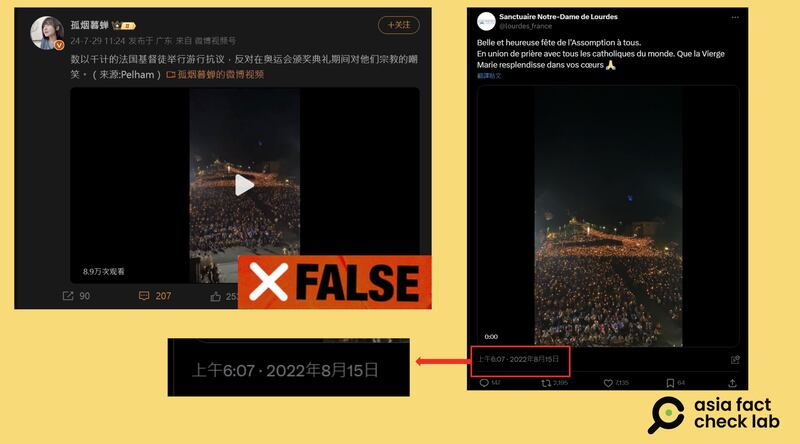
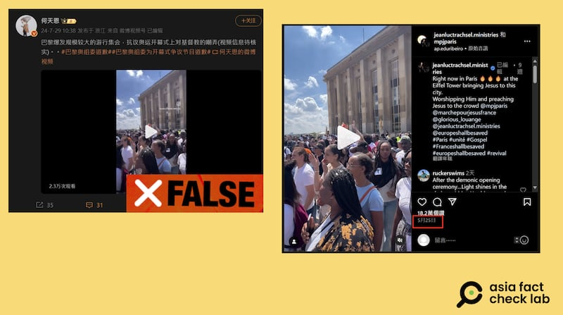
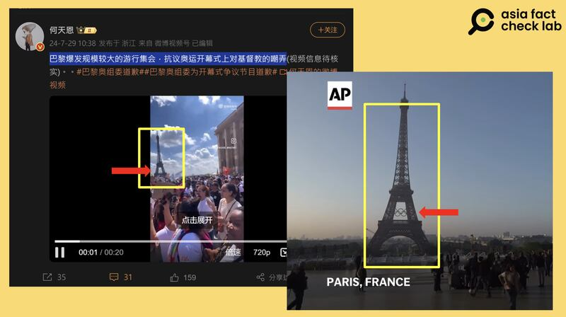
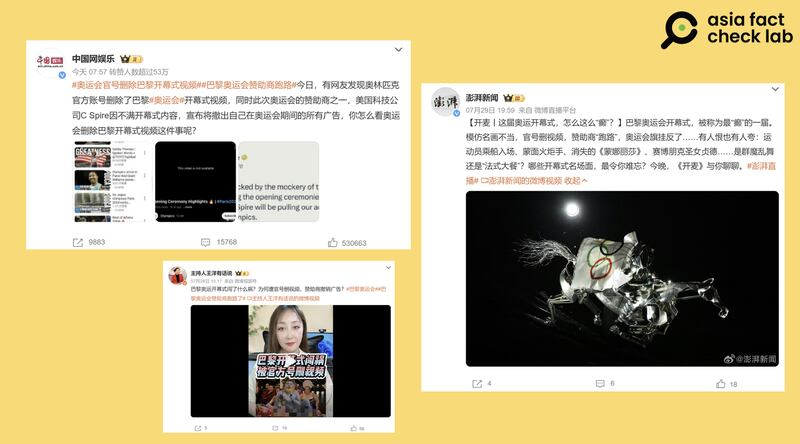

# 事實快查｜巴黎奧運開幕式惹怒宗教人士，這些資訊有問題

作者：董喆

2024.07.30 19:01 EDT

2024巴黎奧運會的開幕式表演中，變裝皇后、跨性別表演者模仿達芬奇著名作品《最後的晚餐》橋段引發部分宗教人士不滿。巴黎奧林匹克運動會組織委員會（COJO）發言人德尚普斯（Anne Descamps）28日在記者會中致歉，表示無意冒犯宗教團體，但爭議持續發酵。中文互聯網上出現了不少與此事件相關的錯誤資訊，亞洲事實查覈實驗室查覈了其中流傳較廣的幾條。

## 一、數以千計的法國基督徒遊行抗議奧運開幕式？

## 查覈結果：錯誤

微博大V"孤煙幕蟬"29日在微博貼出 [一則視頻](https://archive.ph/lz2gr),稱"數以千計的法國基督徒舉行遊行抗議,反對在奧運會頒獎典禮期間對他們宗教的嘲笑"。

亞洲事實查覈實驗室(以下簡稱AFCL)以圖反搜,可以找到該圖的原始出處爲法國露德聖母朝聖地的X賬號, [該視頻](https://x.com/lourdes_france/status/1558938399288991745)於2022年8月15日發佈,當天的集會是信徒在慶祝聖母蒙召昇天節。

因此，這是2022年聖母升天節活動畫面，並非抗議奧運的遊行。

"孤煙幕蟬"稱宗教團體"遊行抗議"的視頻是挪用法國露德聖母朝聖地的舊視頻 （微博、X截圖）

## 二、巴黎大規模遊行抗議開幕式？

## 查覈結果：錯誤

微博大V“何天恩”29日也在微博貼出一則視頻，稱“數以千計的法國基督徒舉行遊行抗議，反對在奧運會頒獎典禮期間對他們宗教的嘲笑”。

AFCL以視頻上的浮水印找到Instagram賬號"jeanluctrachsel.ministries",發現 [這則視頻](https://www.instagram.com/p/C7Y7ZJ0IJ9W/)早在2024年5月就已發佈,以日期搭配關鍵字Jesus、Paris搜尋,可以發現這是今年五月舉辦的" [法國2024年耶穌遊行](https://www.marchepourjesusfrance.fr/)"。

"何天恩"發佈的遊行視頻實則是今年五月法國的耶穌遊行舊視頻（微博、Instagram截圖）

且爲了迎接奧運,巴黎著名地標埃菲爾鐵塔於7月7日 [掛上奧運五環](https://www.youtube.com/watch?v=79dnKvOSudI),但該視頻中的埃菲爾鐵塔上沒有奧運五環,也可證明這並非近期奧運會期間的視頻。

“何天恩”發佈的視頻中的埃菲爾鐵塔與近期的實景對比（新浪、美聯社截圖）

## 三、奧運贊助商不滿開幕式表演跑路了？

## 查覈結果：誤導

微博賬號"中國網娛樂" [在微博發文](https://archive.is/3AVAB)討論巴黎奧運開幕式爭議,稱"同時此次奧運會的贊助商之一,美國科技公司C Spire因不滿開幕式內容,宣佈將撤出自己在奧運會期間的所有廣告",該帖文迄今已超過53萬人點贊。《澎湃新聞》也在微博發文稱"贊助商跑路",不少微博視頻號也都以贊助商撤廣告來凸顯巴黎奧運開幕式爭議之大。臺灣媒體中天新聞也跟進報道,稱奧運"贊助商"撤廣告。

多家媒體報道稱"贊助商跑路"（微博截圖）

AFCL查證,C Spire的確在X上 [發表聲明](https://archive.ph/NsKs8),宣佈 "我們對巴黎奧運會開幕式對《最後的晚餐》的嘲弄感到震驚。C Spire 將撤回我們在奧運會上的廣告。"

C Spire是一家總部位於美國密西西比州的電信供應商,但檢視奧運官方網站的 [贊助商列表](https://press.paris2024.org/partners.html),並不包含C Spire這家公司。若將範圍限縮至 [美國奧運代表隊贊助商](https://www.teamusa.com/sponsors),C Spire也不在其中。

因此，C Spire公司撤回廣告一事爲真，但並非“取消贊助”，且C Spire並非奧運官方贊助商。

*亞洲事實查覈實驗室（Asia Fact Check Lab）針對當今複雜媒體環境以及新興傳播生態而成立。我們本於新聞專業主義，提供專業查覈報告及與信息環境相關的傳播觀察、深度報道，幫助讀者對公共議題獲得多元而全面的認識。讀者若對任何媒體及社交軟件傳播的信息有疑問，歡迎以電郵afcl@rfa.org寄給亞洲事實查覈實驗室，由我們爲您查證覈實。*

*亞洲事實查覈實驗室在X、臉書、IG開張了,歡迎讀者追蹤、分享、轉發。X這邊請進:中文*  [*@asiafactcheckcn*](https://twitter.com/asiafactcheckcn)  *;英文:*  [*@AFCL\_eng*](https://twitter.com/AFCL_eng)  *、*  [*FB在這裏*](https://www.facebook.com/asiafactchecklabcn)  *、*  [*IG也別忘了*](https://www.instagram.com/asiafactchecklab/)  *。*

[Original Source](https://www.rfa.org/mandarin/shishi-hecha/hc-paris-olympics-07302024184946.html)