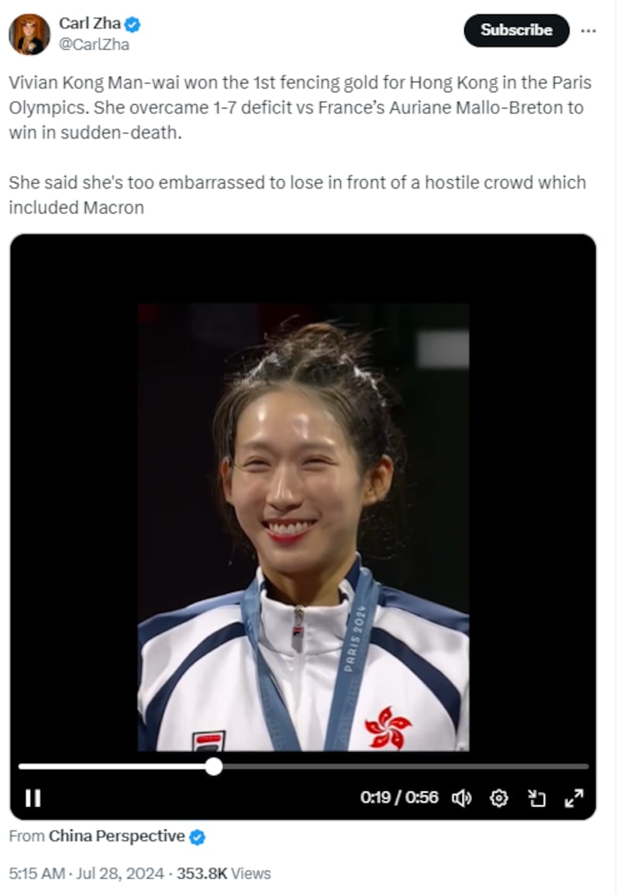
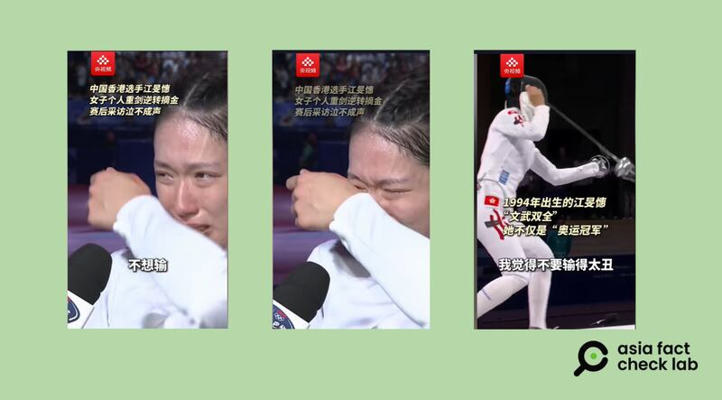

# 事實查覈｜奧運冠軍江旻憓稱包括馬克龍在內的觀衆充滿敵意？

作者：鄭崇生

2024.07.30 18:47 EDT

## 查覈結果：誤導

香港擊劍選手江旻憓(Vivian Kong)日前在巴黎奧運女子個人重劍項目(Epee)奪金。播客主查科嘉(Carl Zha)在其個人X賬號上 [發文稱](https://archive.ph/yyeAi),"江旻憓說,要是在包括馬克龍(法國總統Emmanuel Macron)在內的這羣滿是敵意的觀衆(hostile crowd)面前輸掉比賽,就太難堪了 "。

查科嘉"引述"江旻憓發言的截圖 （X平臺）

亞洲事實查覈實驗室查覈了江旻憓在賽後接受訪問的中、英文報道，發現她並沒有對現場觀衆的反應有所評論，也沒有說過觀衆對她不友好的話。

## 深度分析：

截至發稿, [查科嘉](https://youtube.com/playlist?list=PLaUg2PM1J5b3nc5KGZnTAiOJWJ7VilEH2&si=-LZ1sRQ71wEN88-s)上述有關江旻憓談話的發文,已經有超過35萬人次點閱。而在這則推文下,有不少人要求他說明消息來源,但查科嘉都沒有回覆。

查看查科嘉的這則推文,他是轉發中國國際廣播電臺在X上的相關賬號China Perspective的視頻,而在China Perspective的 [文章及視頻](https://x.com/China_Fact/status/1817386308572262592)內容中完全沒有提到江旻憓發表上述看法,只是在講述她最終以13比12、戲劇性地逆轉勝,擊敗法國的馬洛-佈雷東。

香港無線電視(TVB)播出的江旻憓在賽後接受訪問的 [視頻](https://youtu.be/-wwD0fws2Ts?si=M7Lv8D7T6_1kaTu2)中也能看到,她全程並沒有提到"現場觀衆有敵意"。另根據香港 [《明報》](https://news.mingpao.com/ins/%e9%ab%94%e8%82%b2/article/20240728/s00006/1722117182406),江旻憓以廣東話說"我唔想輸得咁肉酸,唔想無打出香港精神咁放棄。"(我不想輸得這麼難看,不想沒打出香港精神就放棄)

另外,根據央視旗下央視頻 [抖音賬號](https://v.douyin.com/iMbromgX/),她以普通話受訪時也只是說"不想輸,比賽之前很緊張,但是我對我的團隊很有信心,所以,我覺得輸了全是我的錯,所以我不想輸。我覺得不要輸得太醜,而且儘量享受可以打決賽,就很專注地打,就忘記了分數。"

央視頻抖音賬號播出的採訪視頻中江旻憓稱自己不想輸得太醜，但並沒有提到觀衆。（抖音截圖）

關於東道主賽場上觀衆的反應，多家英文媒體在報道中確有提及。

路透社報道的標題是 ["江旻憓重劍項目奪首金,讓法國人心碎"](https://www.reuters.com/sports/olympics/fencing-south-koreas-oh-wins-gold-individual-mens-sabre-2024-07-27/),內文有提到賽後受訪時的她淚流滿面說:"我以爲我會輸,但我不想輸得那麼難看,所以我後來就只想著好好享受舞臺。"

關於現場氣氛，文中有這麼一段描述：優雅的巴黎大皇宮距離馬克龍辦公室愛麗捨宮（Elysee Palace）只有幾步之遙，而一整天更像是個足球場般，一面倒的主場觀衆（partisan crowd）爲法國擊劍選手們高聲歡呼加油，江旻憓卻沒能讓他們如願以償。

[法新社的報道](https://www.france24.com/en/live-news/20240727-tearful-kong-spoils-french-party-with-olympic-epee-title)中則提到,奪冠後的江旻憓邊擦眼淚邊說,在比賽中1:7大幅落後時,面對包括法國總統馬克龍在內、爲法國主場選手馬洛-佈雷東加油的"熱情主場觀衆"(passionate home crowd),她仍維持鎮定,報道引述江旻憓的談話是:"'我想要是就這麼輸掉的話就太尷尬了'。她談到在落後6分的情況下奮起直追時說。"

由此可見，比賽時江旻憓確有可能面對主場觀衆“一面倒”爲對手助威的壓力，但並沒有證據證明現場觀衆對她充滿敵意，在主流媒體的報道中， 江旻憓也只是提到“不想輸得很醜”，但並沒有提到過觀衆甚至法國總統馬克龍。

*亞洲事實查覈實驗室（Asia Fact Check Lab）針對當今複雜媒體環境以及新興傳播生態而成立。我們本於新聞專業主義，提供專業查覈報告及與信息環境相關的傳播觀察、深度報道，幫助讀者對公共議題獲得多元而全面的認識。讀者若對任何媒體及社交軟件傳播的信息有疑問，歡迎以電郵afcl@rfa.org寄給亞洲事實查覈實驗室，由我們爲您查證覈實。*

*亞洲事實查覈實驗室在X、臉書、IG開張了,歡迎讀者追蹤、分享、轉發。X這邊請進:中文*  [*@asiafactcheckcn*](https://twitter.com/asiafactcheckcn)  *;英文:*  [*@AFCL\_eng*](https://twitter.com/AFCL_eng)  *、*  [*FB在這裏*](https://www.facebook.com/asiafactchecklabcn)  *、*  [*IG也別忘了*](https://www.instagram.com/asiafactchecklab/)  *。*

[Original Source](https://www.rfa.org/mandarin/shishi-hecha/hc-paris-olympics-07302024184158.html)