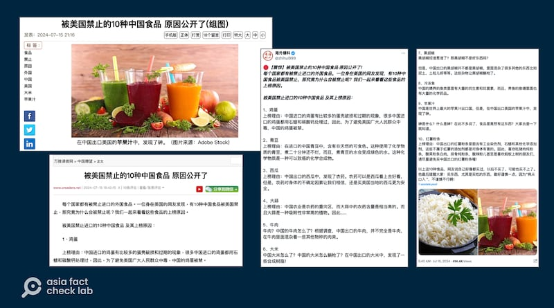
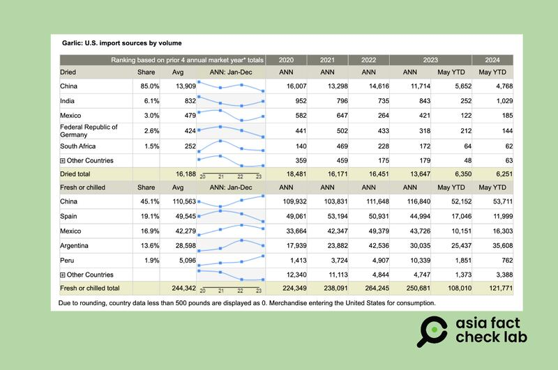

# 事實查覈｜大蒜、大米等中國食品遭美國禁止進口？

作者：莊敬

2024.07.31 14:22 EDT

## 查覈結果：錯誤

## 一分鐘完讀：

近期在社媒平臺、海外華人網站上流傳一則消息“被美國禁止的十種中國食品，原因公開了”，列出的食品包括：雞蛋、青豆、西瓜、大蒜等。經查美國農業部進口數據等公開資料，該表列出的大部分農產或是加工品並沒有被美國禁止進口，網傳信息錯誤。

## 深度分析：

近日,華文網站" [看中國新聞網](https://www.secretchina.com/news/gb/2024/07/15/1064959.html)"、" [萬維讀者網](https://news.creaders.net/china/2024/07/15/2752811.html)"、" [文學城](https://www.wenxuecity.com/blog/202406/1479/29342.html)",以及社媒平臺X上部分 [華文帳號](https://x.com/zhihui999/status/1812965387237052710)都發表同一篇文章,主題爲"被美國禁止的10種中國食品,原因公開了",列舉出10種中國農產或加工品遭美國禁止進口:雞蛋、青豆、西瓜、大蒜、牛肉、大米、黑胡椒、冷凍魚、蘋果汁、紅薯粉條。

其中,"文學城"的文章發佈較早,刊登日期爲6月30日,並附上 [出處](https://www.nguoinam.com/phpbb/viewtopic.php?t=5315),是一個越南語論壇於2022年6月發佈的英語文章,而這篇文章列出被美國禁止的中國食品不只10種,還有米粉、玉米等其它多種食品。進一步以英文標題與作者名稱查詢,發現文章出自一個字典與百科網站" [definition.org](http://definition.org)",但這篇文章並未提供信息來源。

華文網站與社媒平臺近日流傳"被美國禁止的十種中國食品"（看中國新聞網、按萬維讀者網、X截圖）

而近期在網上廣傳的“被美國禁止的10種中國食品”列表，提供了這些食品的“上榜理由”，例如大米的上榜原因則是“發現了一些合成樹脂”。大蒜的上榜理由是“中國農業是農藥的重災區，而大蒜中的農藥含量是非常高的。而且大蒜是一種吸附性非常高的植物。”

但美國禁止了中國大蒜進口嗎?英國媒體BBC在2023年12月的 [一則報道](https://www.bbc.com/news/business-67662779)指出,"中國是世界上最大的新鮮和冷藏大蒜出口國,美國是主要消費國。"中國對美國的大蒜出口曾引起美國共和黨參議員史考特(Rick Scott )的關切,他在2023年底 [致函](https://www.rickscott.senate.gov/2023/12/sen-rick-scott-to-commerce-sewage-garlic-grown-in-communist-china-has-no-place-in-american-grocery-stores)商務部長,要求調查中國大蒜的食品安全性,以及對美國國家安全的影響,並於今年1月提出相關 [法案](https://www.rickscott.senate.gov/2024/1/sen-rick-scott-introduces-bill-to-ban-u-s-import-of-communist-china-s-sewage-garlic),但目前該提案並沒有進展。

亞洲事實查覈實驗室(Asia Fact Check Lab)查閱美國農業部(USDA)進口 [數據庫](https://www.ers.usda.gov/data-products/u-s-food-imports/)發現,上述傳聞中的多個商品都有近期進口記錄,如 [大米](https://www.ers.usda.gov/data-products/chart-gallery/gallery/chart-detail/?chartId=104751)、 [大蒜](https://data.ers.usda.gov/reports.aspx?programArea=veg&top=5&HardCopy=True&RowsPerPage=25&groupName=Vegetables&commodityName=Garlic&ID=17858#P978acd98adf44c0aaf7c8e974426178a_2_1004)、 [青豆](https://data.ers.usda.gov/reports.aspx?programArea=veg&top=5&HardCopy=True&RowsPerPage=25&groupName=Vegetables&commodityName=Green%20peas&ID=17858#Pb5ee027477f74560b955b43af25e8d95_2_1004)、魚、雞蛋等。目前,中國依然是美國進口大蒜最多的國家。另外,雖然黑胡椒、西瓜、紅薯粉條等具體品類則未體現在進口數據中,但記錄顯示,美國也有從中國進口水果和水果製品、調味品和蔬菜等。

USDA數據顯示，中國是美國進口大蒜最多的國家。（USDA網站截圖）

AFCL也詢問現居美國的民衆,確認近期仍能在超市購買到來自中國的黑胡椒、紅薯粉條等"榜上有名"的食品。另根據中國商務部 [2020年的數據](https://data.mofcom.gov.cn/hwmy/zdncp.shtml?parnode=pingguoz_sub&subnode=pingguoz_country&flag_name=%E8%8B%B9%E6%9E%9C%E6%B1%81&flag_type=1)、中國前瞻研究院 [2022年的報告](https://www.qianzhan.com/analyst/detail/220/220919-5a4fb33b.html),中國也在持續向美國出口蘋果汁。

美國 [法律規定](https://www.fsis.usda.gov/sites/default/files/media_file/documents/PHA-03212024-01-Chinese_Translation.pdf),所有商業進口的肉類、家禽和蛋類產品,必須來自具備資格國家經認證的生產企業,且在進入美國市場前需提交給農業部食品安全檢驗局進行檢驗。AFCL就所謂"被禁食品列表"詢問美國農業部、美國食品藥物管理局(FDA)等相關單位,至截稿前未獲回覆。

AFCL還注意到,美國曾對部分源自中國的進口商品採取 [反傾銷](https://www.federalregister.gov/documents/2023/11/14/2023-24993/fresh-garlic-from-the-peoples-republic-of-china-preliminary-affirmative-determination-of)等措施,這是兩國之間存在的貿易摩擦,並不在查覈範圍。 AFCL僅針對網傳"被美國禁止的10種中國食品"進行查覈,而綜合上述官方資料與可靠報道,美國仍有從中國進口多項食品,因此網傳列表爲錯誤信息。

*亞洲事實查覈實驗室(Asia Fact Check Lab)針對當今複雜媒體環境以及新興傳播生態而成立。我們本於新聞專業主義,提供專業查覈報告及與信息環境相關的傳播觀察、深度報道,幫助讀者對公共議題獲得多元而全面的認識。讀者若對任何媒體及社交軟件傳播的信息有疑問,歡迎以電郵*  [*afcl@rfa.org*](mailto:afcl@rfa.org)  *寄給亞洲事實查覈實驗室,由我們爲您查證覈實。* *亞洲事實查覈實驗室在X、臉書、IG開張了,歡迎讀者追蹤、分享、轉發。X這邊請進:中文*  [*@asiafactcheckcn*](https://twitter.com/asiafactcheckcn)  *;英文:*  [*@AFCL\_eng*](https://twitter.com/AFCL_eng)  *、*  [*FB在這裏*](https://www.facebook.com/asiafactchecklabcn)  *、*  [*IG也別忘了*](https://www.instagram.com/asiafactchecklab/)  *。*

[Original Source](https://www.rfa.org/mandarin/shishi-hecha/hc-us-ban-chinese-food-07312024141528.html)