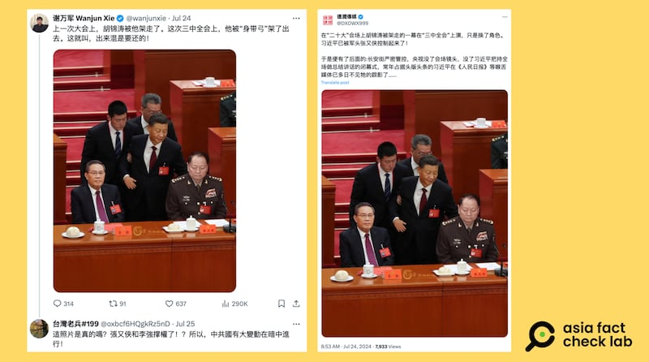
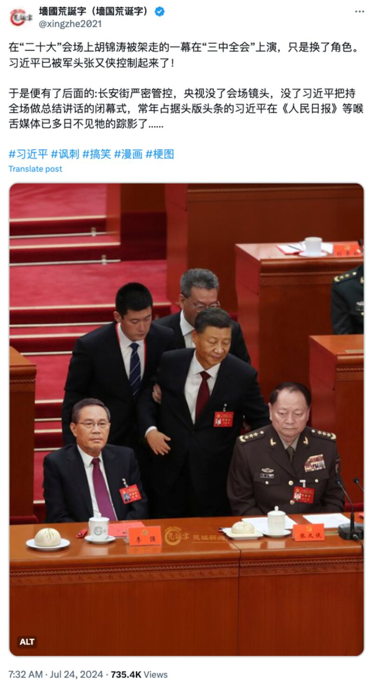

# 事實查覈｜網傳圖片顯示習近平在三中全會上"被架走"？

作者：莊敬

2024.07.31 14:29 EDT

## 查覈結果：錯誤

## 一分鐘完讀：

近日在社媒平臺X上，幾個獲認證的“藍勾勾”用戶發文，稱中國國家主席習近平在日前召開的三中全會上“被架走”，並附上一張圖片顯示習近平被兩名男子攙扶，前面則坐着國務院總理李強、中央軍委副主席張又俠。

經查，這張圖爲網友製作的搞笑圖片，來自社媒帳號“牆國荒誕字”，該賬號發圖時已標註“#諷刺”、“#搞笑”，並說明該圖不是真的。然而，一些具影響力的社媒用戶轉發時，並未註明爲諷刺搞笑圖，導致部分網民誤信。

## 深度分析：

在社媒平臺X上,獲認證的藍勾勾用戶" [謝萬軍](https://twitter.com/wanjunxie/status/1815902163291234434)"、" [德潤傳媒](https://x.com/DXDWX999/status/1815913058549784974)"等帳號近日發文,稱中國國家主席習近平在三中全會上"被架走了",並附上一張圖片,畫面中間的是站着的習近平,身旁有兩名黑衣男子攙扶,而在習近平面前坐着的,是國務院總理李強、中央軍委副主席張又俠。

“謝萬軍”7月24日發文，截至26日，觀看次數已超過29萬，並有300多則留言，雖然多數留言認爲“這是P圖”，但仍有網民留言詢問：“這照片是真的嗎？”、“張又俠和李強撐權了！？”

社媒平臺X上近日流傳一張中國國家主席習近平被架走的圖片（X截圖）

該網傳圖片的構圖與2022年發生的" [胡錦濤二十大離場事件](https://www.reuters.com/world/china/former-chinese-president-hu-jintao-escorted-out-party-congress-2022-10-22/)"的照片高度相似。不同的是,網傳圖片將胡錦濤的位置換成了習近平,原本習近平的位置換成了着軍服的張又俠,另有些特別的"細節":桌上除了茶杯,另外還放了包子,圖片中間的浮水印寫着"荒誕字"。

社媒帳號"牆國荒誕字"以發佈諷刺搞笑圖片爲主，該用戶曾發表文表示，這張圖片不是真的，只是搞笑圖。（X截圖）

浮水印說明這張圖片出自" [牆國荒誕字](https://twitter.com/xingzhe2021/status/1815892735926112450)",這是一個以發佈諷刺、搞笑圖片爲主的社媒帳號,該賬號在發佈這張圖片時,已標註"#諷刺"、"#搞笑";之後又發文表示,這則推文引起了很多圍攻、謾罵,但圖片"本來不是真的",很明顯是搞笑圖。

然而，“德潤傳媒”全文照貼“牆國荒誕字”的推文，卻刪除其推文結尾原本的標籤“#諷刺 #搞笑 #漫畫 #梗圖”。部分社媒用戶轉發“牆國荒誕字”圖片時，未註明內容爲諷刺搞笑，造成誤會。

*亞洲事實查覈實驗室(Asia Fact Check Lab)針對當今複雜媒體環境以及新興傳播生態而成立。我們本於新聞專業主義,提供專業查覈報告及與信息環境相關的傳播觀察、深度報道,幫助讀者對公共議題獲得多元而全面的認識。讀者若對任何媒體及社交軟件傳播的信息有疑問,歡迎以電郵*  [*afcl@rfa.org*](mailto:afcl@rfa.org)  *寄給亞洲事實查覈實驗室,由我們爲您查證覈實。* *亞洲事實查覈實驗室在X、臉書、IG開張了,歡迎讀者追蹤、分享、轉發。X這邊請進:中文*  [*@asiafactcheckcn*](https://twitter.com/asiafactcheckcn)  *;英文:*  [*@AFCL\_eng*](https://twitter.com/AFCL_eng)  *、*  [*FB在這裏*](https://www.facebook.com/asiafactchecklabcn)  *、*  [*IG也別忘了*](https://www.instagram.com/asiafactchecklab/)  *。*

[Original Source](https://www.rfa.org/mandarin/shishi-hecha/hc-thirdplenum-xi-jinping-07312024142420.html)