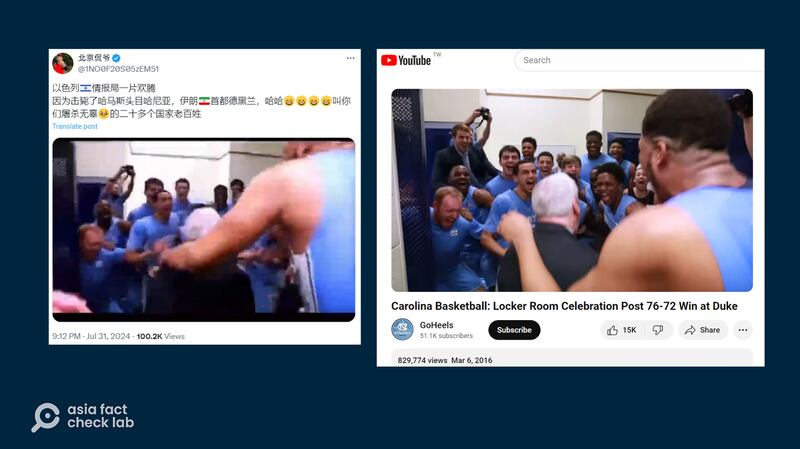

# 事實快查｜哈尼亞遇襲身亡 中文社媒流傳哪些錯誤信息？

作者：莊敬

2024.08.01 14:22 EDT

巴勒斯坦哈馬斯（Hamas）組織領袖伊斯梅爾·哈尼亞（Ismail Haniyeh）7月31日在伊朗遇襲身亡，截至本文發稿時，以色列並未對此發表評論。然而，哈尼亞身亡消息剛一傳出，中文輿論場上已流傳許多未經證實的消息。亞洲事實查覈實驗室（Asia Fact Check Lab，以下簡稱AFCL）查覈了以下兩則流傳較廣的信息。

## 一、以色列情報組織在社媒回應哈尼亞被殺？

## 查覈結果：錯誤

哈尼亞遇襲身亡的消息傳出後,一些在中國社交媒體平臺微博獲認證的"大V"用戶發文( [帖1](https://m.weibo.cn/detail/5062317802523619), [帖2](https://m.weibo.cn/detail/5062301631911179)),稱"以色列特工組織首次回應了哈尼亞的死亡。摩薩德在社交媒體上寫道:他像犬兒樣在淋浴時被殺。"這些貼文並附上X平臺上藍勾勾用戶"Mossad Commentary(@MOSSADil)"的 [推文](https://twitter.com/MOSSADil/status/1818485606231818468)截圖爲證,上面寫着"He was killed in the shower like the dog he is"。類似說法和截圖也出現在一篇 [網易號](https://m.163.com/dy/article/J8ERGFTG0532WA50.html)文章。

中國社交媒體如微博、網易等平臺，有用戶引述社媒用戶“Mossad Commentary”的帖子，聲稱是以色列特工組織回應哈馬斯領袖哈尼亞遇襲身亡。圖取自微博、網易］

經查,這個在X平臺上有40多萬追隨者,持藍勾勾認證的"Mossad Commentary",雖然使用以色列情報機構摩薩德(Mossad)的官方標誌,但並非摩薩德的官方社媒帳號。包括 [英國廣播公司](https://monitoring.bbc.co.uk/product/c204ogm0)(BBC)、 [美聯社](https://apnews.com/article/fact-check-israel-roadside-bomb-world-central-kitchen-096413602260)、 [歐洲新聞臺](https://www.euronews.com/my-europe/2023/11/07/israel-hamas-war-fake-mossad-account-creates-online-confusion)等媒體都曾查覈或報道過該賬號,指它僞裝成官方的社媒帳號,散佈虛假信息引起混淆。

綜合上述媒體報道，X帳號“@MOSSADil”原本的名稱爲“ISRAEL MOSSAD”(以色列摩薩德)，曾在2023年10月分享一段遊戲畫面，聲稱是以哈衝突的片段。該帳號被媒體揭露發佈虛假信息後，改名爲“Mossad Commentary”，仍持續發佈誤導性的信息。

## 二、以色列情報局歡慶哈尼亞被殺畫面流出？

查覈結果：錯誤

在X上獲認證的中文帳號" [北京侃爺](https://twitter.com/1NO0F20S05zEM51/status/1818635933232566407)"7月31日發佈一段7秒短視頻,配文寫着:"以色列情報局一片歡騰,因爲擊斃了哈馬斯頭目哈尼亞⋯⋯"。視頻畫面顯示一名穿西裝的男子進門,興奮地舞動身體並走向一羣身穿藍色運動服的男子。這則帖子發佈一天內,累積觀看次數已超過十萬,有多位藍勾勾用戶轉傳( [1,](https://twitter.com/israellim5/status/1818683882872750443)  [2](https://x.com/xczyuan/status/1818637276580032730))。

經查，這是與此事件無關的舊影像。

社媒平臺X上部分中文帳號發佈短視頻，配文寫着以色列情報局一片歡騰，因爲擊斃哈馬斯頭目哈尼亞（左圖），但經查這段畫面出自2016年美國大學男子籃球隊的慶祝影片（右）。（X、YouTube截圖）

AFCL基於畫面中人羣所穿着的運動服、背景場所等線索,以"籃球"、"藍色球衣"、"更衣室"、"慶祝"等英文關鍵字查詢,即在YouTube上找到相同片段,出自2016年美國北卡羅萊納州大學男子籃球隊贏得比賽的 [慶祝影片](https://www.youtube.com/watch?v=MYMlI0AYHwI)。在完整影片 [8秒](https://youtu.be/MYMlI0AYHwI?t=8)、 [27秒](https://youtu.be/MYMlI0AYHwI?t=27)等多處,明顯可見其中身着藍色衣服的球員,胸前印有"NORTH CAROLINA"(北卡萊羅納)字樣。

*亞洲事實查覈實驗室(Asia Fact Check Lab)針對當今複雜媒體環境以及新興傳播生態而成立。我們本於新聞專業主義,提供專業查覈報告及與信息環境相關的傳播觀察、深度報道,幫助讀者對公共議題獲得多元而全面的認識。讀者若對任何媒體及社交軟件傳播的信息有疑問,歡迎以電郵*  [*afcl@rfa.org*](mailto:afcl@rfa.org)  *寄給亞洲事實查覈實驗室,由我們爲您查證覈實。* *亞洲事實查覈實驗室在X、臉書、IG開張了,歡迎讀者追蹤、分享、轉發。X這邊請進:中文*  [*@asiafactcheckcn*](https://twitter.com/asiafactcheckcn)  *;英文:*  [*@AFCL\_eng*](https://twitter.com/AFCL_eng)  *、*  [*FB在這裏*](https://www.facebook.com/asiafactchecklabcn)  *、*  [*IG也別忘了*](https://www.instagram.com/asiafactchecklab/)  *。*

[Original Source](https://www.rfa.org/mandarin/shishi-hecha/hc-ismail-haniyeh-08012024142208.html)