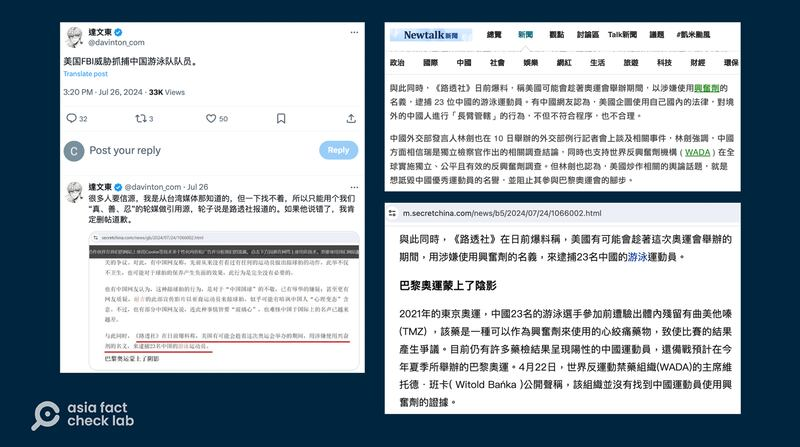
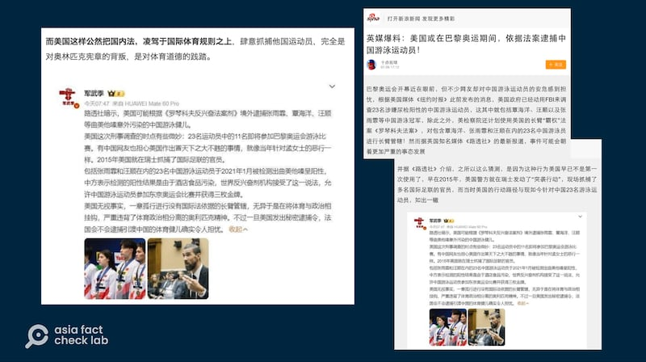

# 事實查覈｜路透社爆料“美國趁奧運會逮捕中國游泳運動員”？

作者：莊敬

2024.08.01 14:17 EDT

## 查覈結果：錯誤

## 一分鐘完讀：

近期在華文媒體與社媒平臺上流傳一則消息：路透社爆料，美國有可能會趁着這次奧運會舉辦的期間，用涉嫌使用興奮劑的名義，逮捕23名中國游泳運動員。經查，該消息是錯誤信息。路透社以及其他媒體近期確實對中國游泳隊此前藥檢陽性事件的後續進行了報道，其中提及FBI可能正在對涉事相關組織進行調查，但並沒有提到任何美國將“逮捕”中國運動員等網傳內容。

亞洲事實查覈實驗室（Asia Fact Check Lab，下簡稱AFCL）進一步查詢後發現，多篇網傳文章的源頭爲引用一位微博用戶的發帖，傳播其錯誤解讀內容。

## 深度分析：

近日在社媒平臺X上,有中文帳號 [發文](https://x.com/davinton_com/status/1816735358727356576)稱"美國FBI威脅抓捕中國游泳隊隊員",並附上一則報道截圖,是華文網站"看中國新聞網"7月24日刊登的 [文章](https://m.secretchina.com/news/b5/2024/07/24/1066002.html),文中指出:"路透社在日前爆料,稱美國有可能會趁着這次奧運會舉辦的期間,用涉嫌使用興奮劑的名義,來逮捕23名中國的游泳運動員。"

同樣一段話,也出現在臺灣《Newtalk新聞》7月23日的 [報道](https://tw.news.yahoo.com/%E5%BD%B1-nike-%E5%8F%88%E8%BE%B1%E8%8F%AF-%E8%88%94%E7%90%83%E6%8B%8D%E5%BD%B1%E7%89%87%E5%BC%95%E7%88%AD%E8%AD%B0-%E5%A4%96%E5%AA%92%E7%88%86%E7%BE%8E%E6%83%B3%E5%9C%A8%E5%A5%A7%E9%81%8B%E6%8A%9323%E4%B8%AD%E5%9C%8B%E9%81%8B%E5%8B%95%E5%93%A1-041955262.html#:~:text=%E8%88%87%E6%AD%A4%E5%90%8C%E6%99%82%EF%BC%8C%E3%80%8A%E8%B7%AF%E9%80%8F%E7%A4%BE,%E7%AC%A6%E5%90%88%E7%A8%8B%E5%BA%8F%EF%BC%8C%E4%B9%9F%E4%B8%8D%E5%90%88%E7%90%86%E3%80%82),以及" [阿波羅新聞網"](https://www.aboluowang.com/2024/0723/2082786.html#google_vignette)、" [禁聞網](https://www.bannedbook.org/bnews/zh-tw/topimagenews/20240723/2065741.html)"、" [中國網路電子報](http://www.echinanews.com.tw/news_detail.php?id=124831)"等華文平臺。

近日在華文媒體、社媒平臺上流傳，美國可能在奧運會期間逮捕中國游泳運動員。（X、Newtalk新聞、看中國新聞網截圖）

在中國網絡媒體上,自7月初起也有出現類似內容出現,包括"新浪網"7月9日刊登《 [英媒爆料:美國或在巴黎奧運期間,依據法案逮捕中國游泳運動員](https://k.sina.cn/article_1233597000_4987324802001dmne.html?cre=blogpagew&mod=f&loc=8&r=0&rfunc=8&tj=cx_blogpagew_f&from=sports&subch=osport)! 》、"網易"7月11日刊出的文章《 [巴黎奧運前夕,美國盯上23名中國游泳運動員,欲借興奮劑賽前逮捕](https://www.163.com/dy/article/J6QL2KNI05566R1T.html)》。

"新浪網"和"網易"文章都稱"據英國路透社報道",但沒有附報道原文,而是附上一位社媒用戶"軍武季"的發文截圖。在微博擁有近300萬粉絲的" [軍武季](https://m.weibo.cn/status/5054132060423439)"7月9日寫道:"路透社暗示,美國可能根據《羅琴科夫反興奮劑法案》境外逮捕張雨霏、覃海洋、汪順等曲美他嗪意外污染的中國游泳健兒。"

新浪網、網易文章引述微博用戶“軍武季”的帖子，稱路透社爆料，美國可能境外逮捕中國游泳選手。（新浪網、網易截圖］

## 路透社“爆料”美國將抓捕中國選手了嗎？

基於前述文章的刊登日期,推論該"爆料"所指的是 [路透社7月5日的報道](https://www.reuters.com/sports/us-investigating-chinese-swimmer-doping-case-2024-07-05/)。這篇報道指出,美國司法部和聯邦調查局(FBI)展開針對中國游泳運動員在2021年東京奧運會期間興奮劑檢測爭議的調查,世界水上運動總會(World Aquatics)的執行董事證實被傳喚。報道指出,FBI既不確認也不否認調查的存在;報道後段並介紹了《羅琴科夫反興奮劑法案》及過往案例,對於此事, [美聯社](https://apnews.com/article/china-doping-swimming-paris-olympics-world-aquatics-d55b6c2853e2d7a79cefa68afe51f9bf)、《 [紐約時報](https://www.nytimes.com/2024/07/04/world/asia/china-swimming-investigation-doping.html)》、《 [美國之音](https://www.voacantonese.com/a/world-swimming-federation-confirms-us-federal-investigation-into-chinese-swimmers-doping-tests-20240704/7686167.html)》亦有相關報道。

但路透社報道原文中，並沒有提及美國可能會對中國運動員實施“逮捕”或是任何行動。“軍武季”所寫的“路透社暗示，美國可能根據《羅琴科夫反興奮劑法案》境外逮捕張雨霏、覃海洋、汪順等曲美他嗪意外污染的中國游泳健兒”等細節，與路透社報道不符，也沒有其他公開資料支持。

這個微博賬號對路透社報道毫無依據的“解讀”，卻被多個平臺作者和網絡媒體當成信息來源，並誇大渲染爲“英媒爆料”、“路透社爆料”， 進一步傳播錯誤信息。

AFCL也向路透社發函詢問此事，至截稿前尚未獲回應。

## 依據最新法案， FBI可以逮捕運動員嗎？

路透社、美聯社等主流媒體所報道的興奮劑檢測事件，是指2021年東京奧運會前，23名中國游泳運動員被驗出對禁藥“曲美他嗪”（trimetazidine）呈陽性，中方機構判定是因選手誤食遭污染的食品所致，世界反興奮劑機構（World Anti-Doping Agency，WADA）其後採納了中方的說法，未處罰這些選手。

該事件今年4月由《 [紐約時報](https://cn.nytimes.com/china/20240422/chinese-swimmers-doping-olympics/)》等媒體披露,美國聯邦衆議院中國委員會5月 [要求](https://selectcommitteeontheccp.house.gov/sites/evo-subsites/selectcommitteeontheccp.house.gov/files/evo-media-document/SCC%20-%20Letter%20to%20DOJ.pdf)司法部和FBI根據《 [羅琴科夫反興奮劑法案](https://www.congress.gov/bill/116th-congress/house-bill/835#:~:text=This%20bill%20makes%20it%20unlawful,or%20both%E2%80%94and%20mandatory%20restitution.)》調查此案。據美聯社7月初的報道,司法部和FBI已針對此檢測結果的處理方式展開了刑事調查,世界水上運動總會的執行董事諾維茨基(Brent Nowicki)證實已收到傳票,要他在調查中作證。

這項消息在巴黎奧運會三週前發佈，而23名藥檢結果呈陽性的游泳運動員中，有11人是參加巴黎奧運會的中國隊成員。也正因爲此，中國游泳選手此前的的藥檢爭議成爲此屆奧運會的關注熱點之一。

* [事實查覈|反興奮劑檢測針對中國游泳隊,不查美國運動員?](2024-07-29_事實查覈｜反興奮劑檢測針對中國游泳隊，不查美國運動員？.md)
* [事實查覈|奧運冠軍江旻憓稱包括馬克龍在內的觀衆充滿敵意?](2024-07-30_事實查覈｜奧運冠軍江旻憓稱包括馬克龍在內的觀衆充滿敵意？.md)
* [事實快查|巴黎奧運開幕式惹怒宗教人士,這些資訊有問題](2024-07-30_事實快查｜巴黎奧運開幕式惹怒宗教人士，這些資訊有問題.md)
* [答讀者問 | 奧運開幕轉播,央視把中國運動員的露臉時間分給了韓正?](2024-07-30_答讀者問 ｜ 奧運開幕轉播，央視把中國運動員的露臉時間分給了韓正？.md)

“中國游泳選手的案件可能成爲一項美國聯邦法律迄今爲止最受關注的案例”，美聯社報道提及，2020年通過的《羅琴科夫反興奮劑法》（Rodchenkov Anti-Doping Act），以揭露俄羅斯政府支持興奮劑行爲的舉報人名字命名。

《羅琴科夫反興奮劑法》賦予美國聯邦當局調查體育用藥及其隱匿行爲的權力,凡涉及美國運動員或與美國有經濟聯繫的國際體育賽事皆適用這項立法,涉案者最高可罰100萬美元和10年有期徒刑。然而, [該法律](https://www.congress.gov/bill/116th-congress/house-bill/835/text)規定,使用興奮劑的個人運動員並不會被刑事起訴,其法條中指明,運動員並非該法案的適用對象。

AFCL在此提供該法案一般規定的參考翻譯如下：

*原文：In General.--It shall be unlawful for any person, other than an athlete, to knowingly carry into effect, attempt to carry into effect, or conspire with any other person to carry into effect a scheme in commerce to influence by use of a prohibited substance or prohibited method any major international sports competition.*

*參考翻譯：一般規定—除運動員以外，任何人故意實施、企圖實施或與他人合謀在商業活動中實施使用禁用物質或禁用方法來影響任何重大國際體育比賽的計劃，均屬違法行爲。*

有 [分析稱](https://burgess.house.gov/news/documentsingle.aspx?DocumentID=402972),該法律針對的是興奮劑案件中除運動員以外的策謀者。 例如,美國通過該法律以來的 [首樁起訴](https://www.justice.gov/usao-sdny/pr/first-defendant-ever-charged-violating-anti-doping-act-sentenced-prison),是針對涉嫌提供禁藥給兩名東京奧運會選手的美國德州的治療師里拉(Eric Lira)。

因此，網絡傳言中關於FBI將根據此法“逮捕”運動員的說法，也並沒有依據。

## 反興奮劑法案相關爭議持續

儘管不針對運動員,《羅琴科夫反興奮劑法》還是引發了不少爭議。據 [報道](https://www.voacantonese.com/a/world-anti-doping-agency-disappointed-at-us-investigation-into-chinese-doping-case-20240705/7687483.html),世界反興奮劑機構曾批評這一法律,認爲這帶來了美國聯邦機構"域外"管轄權過度擴張的風險,國際奧委會也表示了關切。而媒體報道美國聯邦機構對中國游泳選手涉興奮劑問題展開調查後,包括世界反興奮劑機構、世界水上運動總會、美國反興奮劑中心(USADA)等相關單位各有 [說法](https://cn.nytimes.com/sports/20240710/wada-report-china-doping-swimming/zh-hant/)與 [行動](https://www.reuters.com/sports/wada-put-us-anti-doping-agency-under-compliance-review-2024-07-24/)。中國反興奮劑中心近日亦 [發佈聲明](https://www.chinada.cn/contents/6/6795.html),訴求美方"停止以所謂的法律手段搞威脅施壓和濫施長臂管轄"。

目前，美國FBI並未確認或否認正在執行此項調查，但根據路透社等媒體，報道中所稱的

FBI調查是關於對中國游泳隊藥檢陽性事件的處理方式，而並非針對任何一位中國游泳運動員。

*亞洲事實查覈實驗室(Asia Fact Check Lab)針對當今複雜媒體環境以及新興傳播生態而成立。我們本於新聞專業主義,提供專業查覈報告及與信息環境相關的傳播觀察、深度報道,幫助讀者對公共議題獲得多元而全面的認識。讀者若對任何媒體及社交軟件傳播的信息有疑問,歡迎以電郵*  [*afcl@rfa.org*](mailto:afcl@rfa.org)  *寄給亞洲事實查覈實驗室,由我們爲您查證覈實。* *亞洲事實查覈實驗室在X、臉書、IG開張了,歡迎讀者追蹤、分享、轉發。X這邊請進:中文*  [*@asiafactcheckcn*](https://twitter.com/asiafactcheckcn)  *;英文:*  [*@AFCL\_eng*](https://twitter.com/AFCL_eng)  *、*  [*FB在這裏*](https://www.facebook.com/asiafactchecklabcn)  *、*  [*IG也別忘了*](https://www.instagram.com/asiafactchecklab/)  *。*

[Original Source](https://www.rfa.org/mandarin/shishi-hecha/hc-reuters-rumor-olympic-swimmers-08012024141701.html)