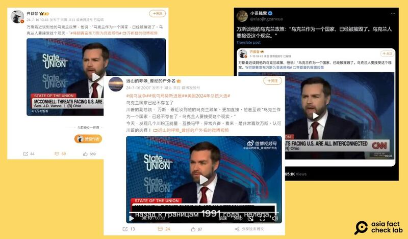

# 事實查覈｜J.D.萬斯要烏克蘭人“接受國家被摧毀”的事實？

作者：艾倫

2024.08.05 15:00 EDT

## 查覈結果：斷章取義

## 一分鐘完讀：

近期，微博和X上出現傳言，稱美國共和黨副總統候選人J.D萬斯（J.D. Vance）在CNN去年的一場訪問中說：“烏克蘭作爲一個國家，已經被摧毀了。烏克蘭人要接受這個現實”。

經查，萬斯確實有評論烏克蘭現狀，提到烏克蘭“實質上被摧毀”，但並未提及烏克蘭人“要接受這個事實”。並且原訪談視頻共11分鐘，但網傳影音卻只剩33秒，是經網民斷章取義的誤導信息。

## 深度分析：

7月26日,X認證帳號"小徑殘雪"轉發一張 [截圖](https://x.com/xiaojingcanxue/status/1816526495906750669),內容爲萬斯接受美國有線電視新聞網(CNN)的訪問畫面,並附上貼文稱,萬斯曾在談烏克蘭政策時說:"烏克蘭作爲一個國家,已經被摧毀了。烏克蘭人要接受這個現實。"

消息在五天內獲得將近70萬的瀏覽及上百次轉發，網民紛紛評論抨擊：“這是人說出來的話嗎”、“川普選了萬斯可能是他最錯誤的決定”。

亞洲事實查覈實驗室(Asia Fact Check Lab, AFCL)以圖反搜,找到一開始流傳此信息的來源爲微博。大V博主"齊都督"於7月16日 [發佈](https://weibo.com/5139830665/OnNmKwkWM)萬斯接受訪問的短視頻,文字和小徑殘雪在X上所發完全一樣。微博帳號"遠山的呼喚\_曾經的戶外名"也直接 [轉發](https://weibo.com/5705716403/OnR3OrAbU)相同視頻和文字,並加上個人看法,表示特朗普及其副手面對烏克蘭時的"孤立主義"政策越來越"直接"。

近期社媒上出現多個帳號轉發萬斯的烏克蘭立場時對其發言斷章取義，引用的視頻剪接自萬斯接受CNN訪問時的畫面。(X、微博截圖）

這些網絡賬號轉發的視頻內容中，確實有萬斯評論“烏克蘭實質上已被摧毀”（functionally destroyed）的部分，但卻並沒有要烏克蘭人“接受事實”的說法。另外，這段網傳視頻中有被剪接的痕跡，共33秒。 AFCL在此提供萬斯原話和參考翻譯如下：

33秒版剪接視頻原文：

“Everybody knows, everybody with a brain in their head,Jake, knows that this was always going to end in negotiation. The idea that Ukraine was gonna throw Russia back to 1991 borders was preposterous. Nobody actually believed it. Ukraine is functionally destroyed as a country. The average age of a soldier in the Ukrainian army right now is 43…”

（AFCL注：此處被剪，並接一段視頻片段）

“What's in America's best interest is to accept Ukraine is gonna have to cede some territory to the Russians, and we need to bring this war to a close. We need to bring the killing to a stop, and that's what American leadership should be doing, not writing more blank checks to the… ”

參考翻譯：

“每個人都知道，每個有頭腦的人都知道，傑克，這一切最終都會以談判收場。烏克蘭能將俄羅斯逼回到1991年邊界的想法是荒謬的。沒有人真正相信這一點。烏克蘭作爲一個國家已經被實質性摧毀。烏克蘭軍隊中士兵的平均年齡現在是43歲……”

​​（AFCL注：此處被剪，並接一段視頻片段）

"對美國最有利的做法是接受烏克蘭必須讓出一些領土給俄羅斯，我們需要結束這場戰爭。我們需要停止殺戮，這纔是美國領導層應該做的事情，而不是不斷地給烏克蘭開空頭支票……"

由上文可以看出,萬斯並沒有在視頻中勸"烏克蘭人要接受現實"。以關鍵字在YouTube反搜,會找到這段視頻剪切自萬斯在去年12月長達11分鐘的 [CNN訪談](https://www.youtube.com/watch?v=fXTSQYw3J44)。

視頻中，萬斯回答主持人傑克塔珀（Jake Tapper）針對共和黨在俄烏戰爭上的立場提問，他認爲俄烏終將以談判方式結束戰爭，而非期待烏克蘭能收回1991年時的國土，所以美國不應該無止盡的花錢提供“空白支票”（blank check），但整個採訪中都無提及要烏克蘭人“接受國家已被摧毀毀的事實”。

因此，網傳萬斯的說法爲斷章取義的誤導信息。

*亞洲事實查覈實驗室(Asia Fact Check Lab)針對當今複雜媒體環境以及新興傳播生態而成立。我們本於新聞專業主義,提供專業查覈報告及與信息環境相關的傳播觀察、深度報道,幫助讀者對公共議題獲得多元而全面的認識。讀者若對任何媒體及社交軟件傳播的信息有疑問,歡迎以電郵*  [*afcl@rfa.org*](mailto:afcl@rfa.org)  *寄給亞洲事實查覈實驗室,由我們爲您查證覈實。* *亞洲事實查覈實驗室在X、臉書、IG開張了,歡迎讀者追蹤、分享、轉發。X這邊請進:中文*  [*@asiafactcheckcn*](https://twitter.com/asiafactcheckcn)  *;英文:*  [*@AFCL\_eng*](https://twitter.com/AFCL_eng)  *、*  [*FB在這裏*](https://www.facebook.com/asiafactchecklabcn)  *、*  [*IG也別忘了*](https://www.instagram.com/asiafactchecklab/)  *。*

[Original Source](https://www.rfa.org/mandarin/shishi-hecha/hc-jd-ukraine-comments-08052024150003.html)