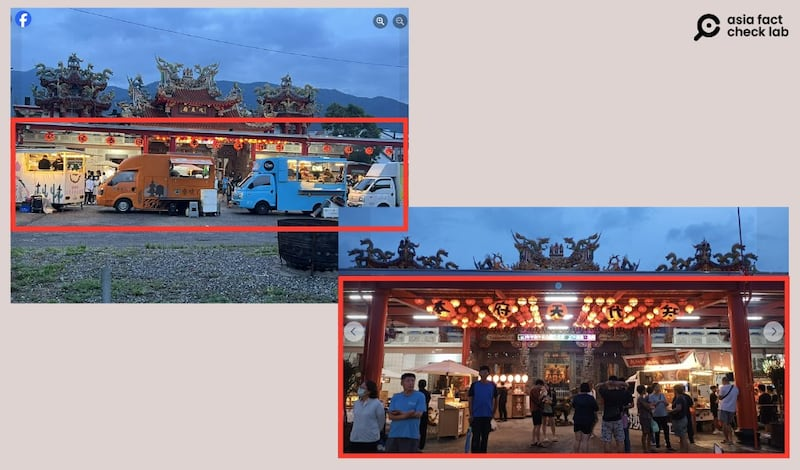

# 事實查覈｜網傳圖片顯示臺灣"用寺廟藏坦克"？

作者：艾倫

2024.08.06 16:01 EDT

## 查覈結果：錯誤

## 一分鐘完讀：

近期，臺灣和中國社交媒體盛傳臺灣軍方使用民用宗教場所存放軍備的說法，七月底，中文社媒帳號廣傳一張臺灣“廟宇存放坦克”的照片，並稱臺灣軍方已在民間大量儲備武器，隨時準備戰爭爆發時犧牲人民當“墊背”。

經查證，這張照片中場景爲位於臺東的知本代天府，是網友攝於2022年的舊照片。亞洲事實查覈實驗室從臺灣軍方瞭解到，當時臺灣因軍演曾向寺廟暫借空地停車，但之後並無在該處長期存放軍備。另外，通過採訪知本代天府和查看最近造訪該地的遊客照片可以得知，目前並沒有坦克存放在該寺廟。

## 深度分析：

7月22、23日,X及微博上流傳一張照片,內容爲一座臺灣寺廟裏存放兩臺坦克車,轉發消息的博主包括認證帳號 " [磊哥聊正經](https://x.com/leige88888/status/1815351248805126203)"、英文帳號Shanghai Panda及 [新浪新聞](https://k.sina.cn/article_2199841250_m831ee9e2033016zld.html?from=tech)。

傳播此消息的網絡賬號也分別爲該圖下了不同註解，包含：“模仿烏克蘭？臺灣用廟宇掩藏坦克”、“臺灣正在寺廟、教堂和其他宗教場所儲備武器”、“臺灣蛙兵的作戰策略非常清晰，用老百姓當墊背的”。貼文都指向臺灣政府已在廟宇派駐軍力，準備在戰時“犧牲人民”。

中文社媒近期流傳"臺灣寺廟存放坦克車的照片"，稱臺灣政府將在戰時犧牲人民。（微博、X截圖）

亞洲事實查覈實驗室(Asia Fact Check Lab, AFCL)將網傳照片反搜,找到這張照片曾在2002年出現在臺灣媒體ETtoday [報道](https://www.ettoday.net/news/20220527/2260540.htm)中。當時,一名網友在臉書《爆廢公社公開版》轉發這張照片,並開玩笑稱,這是坦克兵奉命去寺廟"擲茭",因該網傳照片充滿娛樂色彩,媒體亦有報道當時的網友熱議、開玩笑稱這是"王爺"(代天府供奉的臺灣民間信仰中的神明)的"新座駕"等等。

AFCL以該照片問詢臺灣國防部和位於臺東的知本代天府，國防部軍事新聞處向亞洲事實查覈實驗室表示，這張照片是2022年間部隊演習時，借用臺東知本代天府寺廟放置裝備的場景。臺東知本代天府也回應表示，該圖爲多年前網友上傳的照片，當時是臺灣軍方爲了演習臨時使用場地。

AFCL在知本代天府的臉書地標上搜尋,發現7月27日有遊客上傳該景點照片( [1](https://www.facebook.com/photo/?fbid=1939626566480146&set=pcb.1939626633146806), [2](https://www.facebook.com/photo?fbid=9201311779899090&set=a.692910374072649https://www.facebook.com/photo?fbid=9201311779899090&set=a.692910374072649))。照片顯示,網傳圖中停放坦克的空地上聚集着遊玩的人羣和做生意的餐車,可見之處並無坦克或是疑似其他軍事設施。另外,將關鍵字"戰車"、"坦克",以及照片裏的"知本代天府"在以關鍵字搜尋,並未找到任何近期的相關報道。

從臺東"知本代天府"臉書地標頁上網友上傳的近期照片可以看出，圖中該寺廟曾暫停坦克的地方有衆多遊客和餐車，可見之處並無存放軍備。（臉書截圖）

中國、臺灣最近均盛傳臺灣在民間儲藏軍備的說法，起因是中央社近期報道，6月時有臺灣宮廟收到政府公文，請求使用空間存放彈藥。對於該說法，AFCL還在進一步查覈中。但綜合以上資料，網絡熱傳爲“宮廟藏坦克”的知本代天府圖片是兩年前的舊圖，與最近的“民間藏軍備”傳言無關，是錯誤信息。

*亞洲事實查覈實驗室(Asia Fact Check Lab)針對當今複雜媒體環境以及新興傳播生態而成立。我們本於新聞專業主義,提供專業查覈報告及與信息環境相關的傳播觀察、深度報道,幫助讀者對公共議題獲得多元而全面的認識。讀者若對任何媒體及社交軟件傳播的信息有疑問,歡迎以電郵*  [*afcl@rfa.org*](mailto:afcl@rfa.org)  *寄給亞洲事實查覈實驗室,由我們爲您查證覈實。* *亞洲事實查覈實驗室在X、臉書、IG開張了,歡迎讀者追蹤、分享、轉發。X這邊請進:中文*  [*@asiafactcheckcn*](https://twitter.com/asiafactcheckcn)  *;英文:*  [*@AFCL\_eng*](https://twitter.com/AFCL_eng)  *、*  [*FB在這裏*](https://www.facebook.com/asiafactchecklabcn)  *、*  [*IG也別忘了*](https://www.instagram.com/asiafactchecklab/)  *。*

[Original Source](https://www.rfa.org/mandarin/shishi-hecha/hc-taiwan-hide-tanks-fact-check-08062024155401.html)