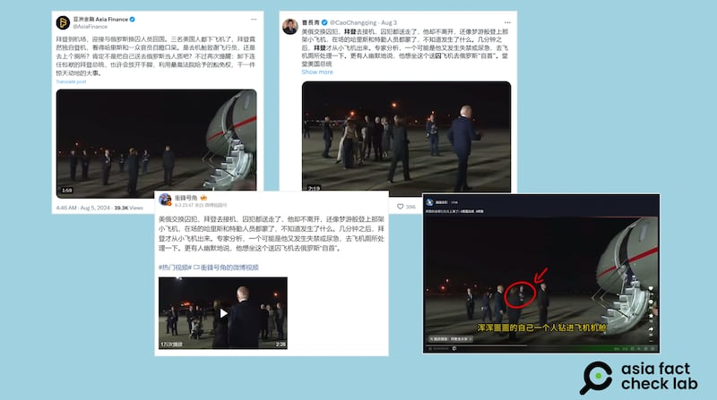
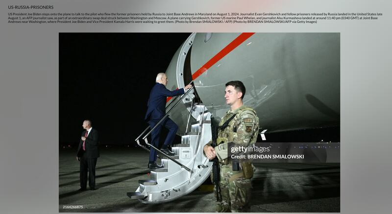

# 事實查覈｜美俄換囚後 拜登"夢遊"登上飛機？

作者：莊敬

2024.08.07 18:50 EDT

## 查覈結果：錯誤

## 一分鐘完讀：

近日，微博、抖音等社交媒體流傳一段影片，是日前美俄交換囚犯時美國總統拜登與副總統哈里斯前往接機的場景。在囚犯陸續下機後，拜登獨自登上飛機，他此舉被視頻傳播者解讀爲“迷惑行爲”“徹底糊塗”“夢遊”等，甚至有人評論說他想飛去俄羅斯“自首”“當人質”。

經查，這段影像和類似說法先是在英文社媒傳播，白宮發言人已針對傳言說明，拜登上機是爲了向機組人員致謝；另據法新社的新聞證實，拜登當時上機是與機組人員交談。因此，拜登是有明確目的而上機，所謂“迷惑”“糊塗”的傳言是錯誤的。

## 深度分析：

美國和俄羅斯在經過一年多的談判後達成協議換囚，這被認爲是兩國自冷戰後最大規模的換囚行動。8月1日晚間，美國總統拜登（Joe Biden）與副總統哈里斯（Kamala Harris）親自到馬里蘭州的美軍安德魯聯合基地，迎接獲釋的《華爾街日報》記者伊凡·格什科維奇（Evan Gershkovich）等美方人士。

亞洲事實查覈實驗室(Asia Fact Check Lab,以下簡稱AFCL)注意到,X上的中文認證賬號( [1](https://x.com/CaoChangqing/status/1819748631303290938), [2](https://x.com/AsiaFinance/status/1820199588516782571))、微博"大V"( [1](https://m.weibo.cn/status/5063433295495183), [2](https://m.weibo.cn/detail/5063296210175303))、抖音用戶( [1](https://v.douyin.com/irJq7VL3/), [2](https://v.douyin.com/irJbUUkp/))等集體轉傳一段視頻,是拜登迎接囚犯後獨自走上飛機的畫面。一些帖子的配文寫著:"囚犯都送走了,拜登還像夢遊般登上那架小飛機,在場的哈里斯和特勤人員都蒙了,不知道發生了什麼⋯⋯",還有網民稱"拜登莫名其妙走上了囚犯下來的飛機,他大概不知道自己想要做什麼"。

近日在微博、抖音、X等平臺上，有用戶轉傳一段美國總統拜登在迎接返美囚犯後，獨自走上機的畫面。（自微博、抖音、X截圖）

經查,質疑拜登上機是"犯糊塗"的說法,先是在 [英文社媒傳播](https://twitter.com/RNCResearch/status/1819421224298017186),而白宮發言人貝茨(Andrew Bates)日前已在社媒上 [說明](https://twitter.com/AndrewJBates46/status/1819429974773813278?ref_src=twsrc%5Etfw%7Ctwcamp%5Etweetembed%7Ctwterm%5E1819429974773813278%7Ctwgr%5E19432d864cc21d0176a1f8b24c46fda9ba9fdd99%7Ctwcon%5Es1_&ref_url=https%3A%2F%2Ffactcheck.afp.com%2Fdoc.afp.com.36AH7QQ),表示拜登當時是爲了向機組人員致謝。另外,根據"Getty Images"圖庫上的 [照片說明](https://www.gettyimages.hk/detail/%E6%96%B0%E8%81%9E%E7%85%A7%E7%89%87/president-joe-biden-steps-onto-the-plane-to-talk-to-the-pilot-who-%E6%96%B0%E8%81%9E%E7%85%A7%E7%89%87/2164266875),拜登登上飛機與機組人員交談。這些證據表明,拜登當時是有明確目的而上機,網民所謂的"迷惑""糊塗""大概不知道自己想要做什麼"等說法,都是具有誤導性的描述。

根據Getty Images圖庫照片的說明，美國總統拜登在迎接返美囚犯後，獨自登機是爲了與機組人員對話。（Getty Images官網截圖）

法新社(AFP)8月6日針對相關傳言發佈了 [查覈報告](https://factcheck.afp.com/doc.afp.com.36AH7QQ),查覈結果爲誤導。

AFCL亦曾發佈多則針對拜登"迷惑"和"糊塗"行爲的查覈報告,包括 [《拜登試圖坐在空氣上?》](2024-06-13_事實查覈｜拜登試圖坐在空氣上？.md) [《拜登競選演講後再次試圖"與鬼魂握手"?》《](2024-05-01_事實查覈 ｜ 拜登競選演講後再次試圖"與鬼魂握手"？.md) [拜登又和"看不見的人"打招呼?》](2023-07-28_事實查覈｜美國總統拜登又和"看不見的人"打招呼"？.md)等,另外,AFCL也就該話題發表過 [傳播觀察](2024-06-27_傳播觀察｜媒體“放大鏡”下的拜登是如何“走神”的.md)。

*亞洲事實查覈實驗室（Asia Fact Check Lab）針對當今複雜媒體環境以及新興傳播生態而成立。我們本於新聞專業主義，提供專業查覈報告及與信息環境相關的傳播觀察、深度報道，幫助讀者對公共議題獲得多元而全面的認識。讀者若對任何媒體及社交軟件傳播的信息有疑問，歡迎以電郵afcl@rfa.org寄給亞洲事實查覈實驗室，由我們爲您查證覈實。*

*亞洲事實查覈實驗室在X、臉書、IG開張了,歡迎讀者追蹤、分享、轉發。X這邊請進:中文*  [*@asiafactcheckcn*](https://twitter.com/asiafactcheckcn)  *;英文:*  [*@AFCL\_eng*](https://twitter.com/AFCL_eng)  *、*  [*FB在這裏*](https://www.facebook.com/asiafactchecklabcn)  *、*  [*IG也別忘了*](https://www.instagram.com/asiafactchecklab/)  *。*

[Original Source](https://www.rfa.org/mandarin/shishi-hecha/hc-biden-sleepwalk-after-prisoners-swap-08072024184205.html)