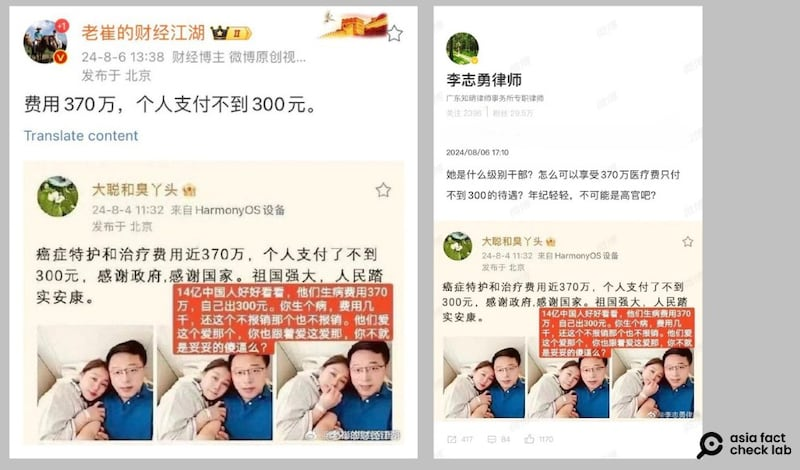
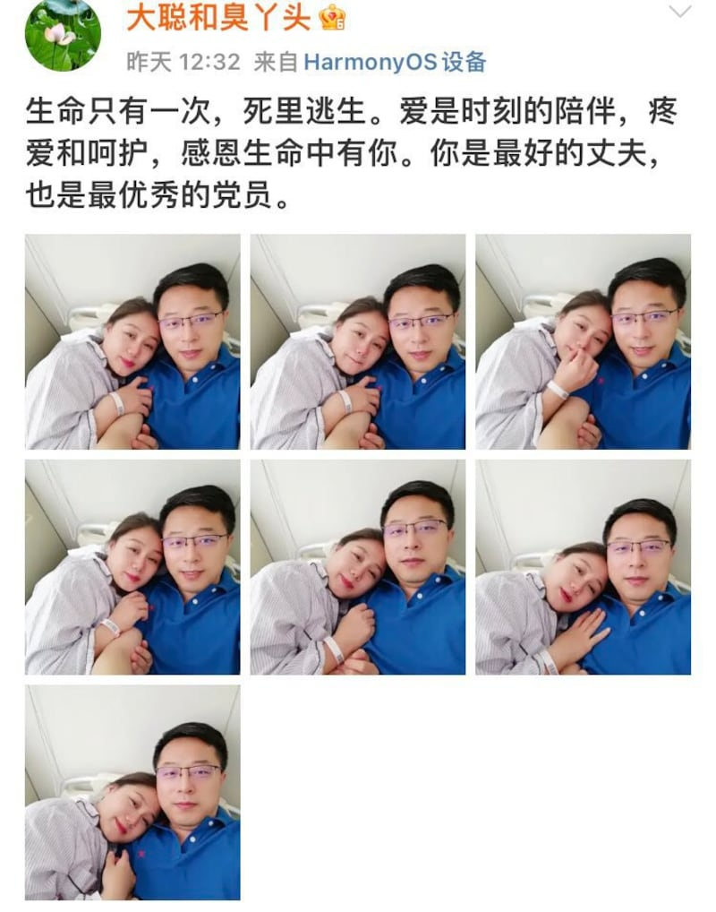

# 事實查覈｜趙立堅妻子"自曝"治病花掉三百萬公款？

作者：艾倫

2024.08.08 18:18 EDT

## 查覈結果：錯誤

## 一分鐘完讀：

八月初，X賬號“新聞調查”轉發一則消息稱，中國外交部邊界與海洋事務司副司長趙立堅的妻子湯天如在微博發文，“炫耀”自己370萬的癌症醫療費只需自付300元，文末並附上數張宣稱是湯天如微博賬號“大聰和臭丫頭”的發文截圖。

經查，該傳言源自於微博多個“大V”用戶，使用的截圖遭加工變造，是錯誤信息。

## 深度分析：

8月6日，微博大V賬號 “老崔的財經江湖” “李志勇律師” 等轉發一張微博截圖，顯示趙立堅的妻子湯天如（微博名 “大聰和臭丫頭” ）在8月4日12點32分發文： “癌症特護和治療費用金370萬，個人支付不到300元，感謝政府，感謝國家。祖國強大，人民踏實安康” 。

“老崔的財經江湖”及“李志勇律師”兩賬號在轉發該圖後附上文案，稱湯天如濫用國家公款，質疑“是什麼級別幹部”才能享受這樣的待遇。

網絡流傳流截圖顯示，中國外交官趙立堅的妻子"自曝"其公費醫療金額。（新浪微博截圖）

亞洲事實查覈實驗室(下稱AFCL)在微博上搜索"大聰與臭丫頭"原文,發現該賬號的確在8月4日12點32分發表了配圖與網傳截圖一致的 [帖文](https://archive.ph/XVWXB#selection-1235.0-1235.55),但文字內容卻完全不同。

該賬號發佈的原文是： “生命只有一次，死裏逃生。愛是時刻的陪伴，疼愛和呵護，感恩生命中有你。你是最好的丈夫，也是最優秀的黨員。” 文末並附有7張趙立堅夫婦的合影。

微博賬號"大聰與臭丫頭"8月4日12:32發佈的原文（新浪微博截圖）

儘管傳聞中的照片、網頁背景和發文時間和“大聰與臭丫頭”所發帖子都相同，但文字內容並不是“370萬治療費只花300元”，且原文也未顯示有編輯記錄。

此外，AFCL比對截圖內的文字和一般微博貼文，發現網傳截圖中的文字字距較寬，且標點符號和單字之間的距離也不一，例如“感謝政府”和“感謝國家”之間的逗號，與標準的微博文字不同。

綜合"大聰與臭丫頭"的原發文及比對微博字體,可判斷網傳截圖爲假信息。消息傳出一天後,趙立堅已於個人微博回應 [闢謠](https://weibo.com/7286955267/5064677174285093)。

*亞洲事實查覈實驗室(Asia Fact Check Lab* *)針對當今複雜媒體環境以及新興傳播生態而成立。我們本於新聞專業主義,提供專業查覈報告及與信息環境相關的傳播觀察、深度報道,幫助讀者對公共議題獲得多元而全面的認識。讀者若對任何媒體及社交軟件傳播的信息有疑問,歡迎以電郵afcl@rfa.org* *寄給亞洲事實查覈實驗室,由我們爲您查證覈實。*

*亞洲事實查覈實驗室在X* *、臉書、IG* *開張了,歡迎讀者追蹤、分享、轉發。X* *這邊請進:中文 [@asiafactcheckcn](https://twitter.com/asiafactcheckcn)*  *;英文: [@AFCL\_eng](https://twitter.com/AFCL_eng)*  *、*  [*FB* *在這裏*](https://www.facebook.com/asiafactchecklabcn)  *、*  [*IG* *也別忘了*](https://www.instagram.com/asiafactchecklab/)  *。*

[Original Source](https://www.rfa.org/mandarin/shishi-hecha/hc-former-foreign-ministry-spokesperson-08082024181238.html)