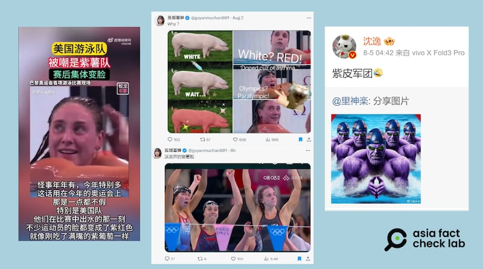
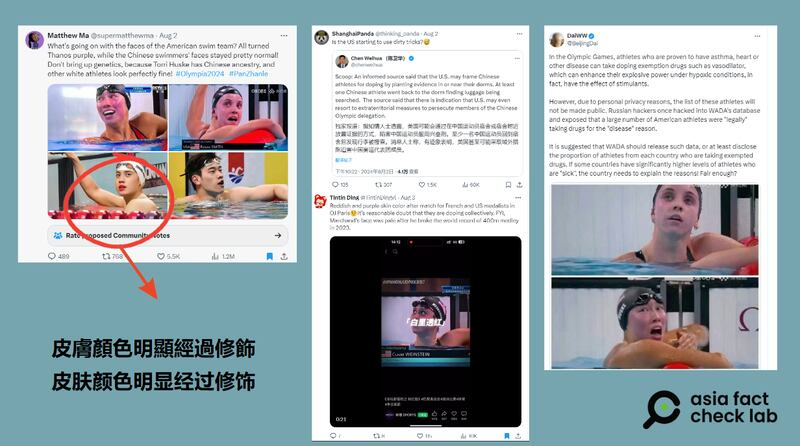
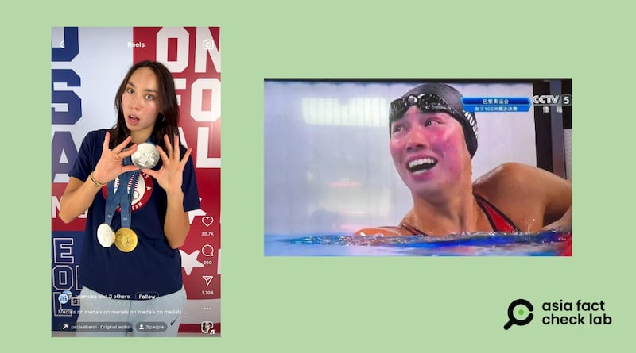

# 傳播觀察｜美國游泳"紫薯隊"爭議始末

作者：鄭崇生、董喆

2024.08.08 18:41 EDT

最近，中文社交媒體平臺上出現了奧運會游泳比賽結束後部分美國選手臉色泛紅甚至發紫的帖子。網民們戲稱這些選手爲“紫薯隊”或“紫皮人軍團”，許多網民將其視爲美國隊使用禁藥的證據。

8月4日， “#美國隊臉紫” 的標籤衝上了微博熱搜榜第2名。網民羣情激憤譴責美國，而一位試圖以不同角度解釋此事的中國專家袁昊然，還遭到了網暴和官方調查。

## 運動員因“臉紫”被網民質疑使用禁藥

“臉紫=使用禁藥”的說法，8月初開始在中國網絡世界掀起輿論浪潮。亞洲事實查覈實驗室發現，最早有人質疑美國泳將臉色異常的時間是7月31日。當日，中國選手潘展樂拿下100米自由式金牌。他在打破世界紀錄後，形容自己是“一雪前恥”。

賬號"正直的磊哥"在微博 [發文](https://archive.is/UsnWQ)爲潘展樂的談話叫好,聲稱"這是中國運動員再次向世界證明了:老美你們嗑藥嗑成紫茄子,你們也贏不了我們!" ​​​ 接着多位網紅和意見領袖開始跟進。 8月5日, "孤煙暮蟬" 把焦點對準了美國女子4x100米混合泳接力隊四位選手史密斯(Regan Smith)、金恩 (Lilly King)、威爾什(Gretchen Walsh)以及簡愛 (Torri Huske), [她稱美國選手在賽後出現 "詭異的紫薯臉"](https://archive.ph/UG8DH) ,而她更早之前的 [另一則帖文](https://archive.ph/OhZGc)還將美國選手與豬做對照,合成針頭注射的圖案,以豬變紅的皮膚質疑美國隊用藥。

近日社交媒體出現質疑美國游泳運動員皮膚紫紅疑似用藥的帖子（新浪、抖音、X截圖）

相關議題也在一些 [英文社交媒體](https://www.reddit.com/r/olympics/comments/1ei6ryj/just_curiouswhy_are_the_swimmers_faces_so/)上傳播開來。X賬號 [Matthew Ma](https://archive.ph/HRcSS)比較了美國和中國選手賽後的膚色,質疑 "美國隊怎麼了?游完臉色都成了 "滅霸紫'(Thanos purple)" 。

英文社交媒體上也出現類似質疑（X截圖）

## ITA ：網傳質疑沒有科學依據

亞洲事實查覈實驗室詢問負責所有運動員興奮劑檢測及審覈與管理選手用藥豁免的 [國際檢測機構(ITA),](https://ita.sport/)受到質疑的美國游泳選手賽後的興奮劑檢測結果如何。ITA告訴記者:"你提到的所有運動員,目前都沒有受到臨時制裁或發現他們有涉及違背反興奮劑規則的行爲。"

這名發言人解釋，如果一名運動員有潛在的反興奮劑違規行爲（ADRV），會受到臨時性的制裁，除了暫不允許參加比賽之外，“相關信息的公開披露也是強制性的”。

ITA發言人說，他們已經注意到了網上流傳的這些 “臉色紅紫疑似用藥” 的說法。這名發言人在電子郵件中指出，儘管 ITA 歡迎各界檢舉任何有關潛在違規或使用興奮劑嫌疑的信息，也會進行徹底審查，但 “一些信息沒有科學依據，仍是謠言” 。發言人強調， “謠言出於各種原因生成和傳播，但爲了所有運動員的誠信和公平競爭環境，我們有責任從客觀事實中辨別這類謠言。”

## 可能造成選手賽後臉色紅紫的原因

爲什麼有的選手在賽後臉色看起來特別紅?美國喬治華盛頓大學(GW University)醫學系皮膚科教授 [費德曼(Adam Friedman)](https://gwdocs.com/profile/adam-friedman)告訴亞洲事實查覈實驗室,人們在劇烈運動後臉色變紅,是正常現象。他解釋,這是因爲運動期間血管擴張,增加血流量,爲肌肉輸送更多的氧氣和營養,而有些人刺激血管擴張的神經系統可能更敏感,才導致臨牀上出現明顯的血管舒張,就會顯得臉色特別紅。另外,有一些臉上本來就有紅斑或痤瘡的人,隨着體溫升高臉部會更紅。

他還提到膚色與皮膚厚度的不同，可能是有些人更容易臉紅的因素。費德曼說，膚色較淺和皮膚層較薄的人，都更容易出現發紅現象，雖然在膚色較深的人在激烈運動後血管擴張的現象並不明顯，肉眼不易見，但它仍是存在的。“另外，游泳選手比起一般人更容易染上氯過敏疹（chlorine rash）。”他補充說。

遭到質疑的選手之一簡愛,她自己發佈的 [生活照](https://www.instagram.com/torri_huske/?hl=en)中也可以看到她額頭與臉頰處有深淺不一的斑塊,她在完成比賽後的臉色出現更爲明顯的紅紫色。

簡愛的膚色在賽後呈現明顯的紫紅色（央視官網、Instagram截圖）

膚色和皮膚的厚度，是專家認爲造成選手在激烈比賽之後臉色紅紫的原因之一。但有沒有可能，臉色紅紫也是用藥的結果？對此，費德曼告訴記者，如果長期使用類固醇，是會導致持續的臉部泛紅。

需要說明的是，對運動員來說，使用類固醇並不等於就是使用禁藥，如果有按照國際規則申請並或許可使用治療用藥豁免（TUE），是允許使用的。

## 中國專家遭舉報調查

在一片質疑美國隊使用禁藥的聲浪中，中國國家體育總局自行車擊劍運動管理中心副主任袁昊然由於看法和“風向”不同，立即遭到了網暴和調查。

袁昊然現任中國國家體育總局自行車擊劍運動管理中心副主任,過去曾任游泳運動管理中心遊泳部主任。據 [報道](https://www.hk01.com/%E5%8D%B3%E6%99%82%E4%B8%AD%E5%9C%8B/1045356/%E5%9C%8B%E9%AB%94%E5%B1%80%E9%AB%98%E5%B1%A4%E5%B9%AB%E7%BE%8E%E5%9C%8B-%E7%B4%AB%E8%87%89-%E9%81%B8%E6%89%8B%E8%AA%AA%E8%A9%B1-%E8%A2%AB%E8%B5%B7%E5%BA%95%E6%9B%BE%E7%99%BC%E8%A1%A8%E6%81%A8%E5%9C%8B%E8%AB%96-%E5%AE%98%E6%96%B9%E8%A6%81%E6%9F%A5),他日前在巴黎現場觀看比賽。8月2日,他在個人微博賬號"混合泳"發文分析可能影響美國臉色發紫的原因。根據媒體保留的 [截圖](https://www.secretchina.com/news/b5/2024/08/05/1066887.html),袁昊然認爲選手的紅、紫臉色可能來自:

1、會場的氣氛燈光。

2、運動員皮膚充血。

3、白人運動員的膚色淺。

4、轉播影像的色差。

但他的微博後來遭舉報,即使他刪光發文、刪除賬號,仍被批爲"精美(精神美國人)份子",網上批評袁昊然的 [文章](https://archive.is/B6yLj)還出現 "人民羣衆不答應"等口吻,更稱他的"恨國言論"已涉及污辱英烈,可能觸法。最後 [中國國家體育總局](https://weibo.com/3693128121/Or0Pa5hg6)出面表示要介入調查,理由是"網絡空間不是法外之地"。

## 戴口罩是爲了遮住紫臉？

被網民提起的美國隊涉嫌使用禁藥的另一"證據"是他們戴口罩來"遮蓋紫臉"。X賬號 [蘆葦漾漾](https://archive.ph/Di8aR)稱,美國人在疫情期間都不戴口罩,但在這次巴黎奧運卻突然戴起N95口罩,是爲了遮掩"紫薯臉"。但這樣的說法並沒有依據。

美國游泳運動行業媒體《SwimSwam》7月30日 [報道](https://swimswam.com/u-s-olympic-swimmers-david-johnston-luke-whitlock-test-positive-for-covid-19-in-paris/)稱,美國奧運游泳隊選手江斯頓(David Johnston)和 惠特勒(Luke Whitlock)被檢出新冠肺炎陽性。而在此前,英國、澳大利亞游泳隊也有選手確診。

英國《衛報》亦 [報道](https://www.theguardian.com/sport/article/2024/jul/30/olympic-swimmers-wear-masks-as-concerns-over-covid-rise-across-camps),多個國家的教練在看臺上也開始戴上口罩,證明新冠疫情對奧運游泳賽事的影響。報道引述奧運美國隊發言人說法,"我們不會與公衆分享運動員的健康資訊。我們沒有強制佩戴口罩或進行檢測。我們鼓勵我們的運動員做任何讓他們感到舒服的事情"。《SwimSwam》在8月5日的 [報道](https://swimswam.com/at-least-7-australian-swimmers-tested-positive-for-covid-19-at-the-paris-2024-olympics/)中還提到,越來越多運動員在賽前準備室裏配戴口罩。

## 紫臉事件，中美興奮劑爭議延長加賽

關於中美兩國游泳隊的禁藥爭議,早在本屆奧運會之前就議經開始。中國社媒平臺也陸續傳出" [藥檢只查中國,不查美國](https://www.rfa.org/cantonese/news/factcheck/drug-test-07302024150226.html)",或者" [美國可能逮捕中國運動員](https://www.rfa.org/cantonese/news/factcheck/doping-08022024172530.html)"等虛假信息,亞洲事實查覈實驗室此前已發表過查覈報告。

但中國網民針對美國運動員的這一波指控，有另有一項背景：2016年，俄國駭客“奇異熊”（Fancy Bear）入侵世界反興奮劑組織的數據庫，將部分國際知名運動選手的個人健康情況公諸於世。人們發現，有些運動員爲了治療疾病，必須服用含有禁藥成分的藥品，這樣的情況下，是可以報備獲准的。

而中國網民的這一波攻擊，則是順著報備獲准的規定，暗示美國隊濫用這項規定。

例如復旦大學教授沈毅就錄製 [視頻](https://archive.is/Gnhwy)並 [發文](https://archive.is/5vR7J),質疑"美國游泳隊的含藥量是多少?"要求應公開美國申請治療用藥豁免(TUE)的選手名單,宣稱這是要在國際體系中"給美國立規矩",給出"中國的解決方案"。

至於究竟美國游泳隊有哪些選手獲得批准，可以使用特定的治療用途藥物？ITA與美國反興奮劑中心（USADA）都向亞洲事實查覈實驗室說明，根據WADA的相關規範及隱私保護國際標準，他們無法公佈這類個人資訊，但詳細解釋從選手提出治療用藥豁免申請後，有一套嚴謹的審覈流程。ITA強調，外界質疑“通過合法用藥提高表現”的聲音，但事實上，在審理過程中，任何出於提高績效的“潛在操控”行爲也都會受到審查，這個程序適用任何國籍的任何運動員，“如果非醫學上必要，不會授予治療用藥豁免。”

*亞洲事實查覈實驗室（Asia Fact Check Lab）針對當今複雜媒體環境以及新興傳播生態而成立。我們本於新聞專業主義，提供專業查覈報告及與信息環境相關的傳播觀察、深度報道，幫助讀者對公共議題獲得多元而全面的認識。讀者若對任何媒體及社交軟件傳播的信息有疑問，歡迎以電郵afcl@rfa.org寄給亞洲事實查覈實驗室，由我們爲您查證覈實。*

*亞洲事實查覈實驗室在X、臉書、IG開張了,歡迎讀者追蹤、分享、轉發。X這邊請進:中文*  [*@asiafactcheckcn*](https://twitter.com/asiafactcheckcn)  *;英文:*  [*@AFCL\_eng*](https://twitter.com/AFCL_eng)  *、*  [*FB在這裏*](https://www.facebook.com/asiafactchecklabcn)  *、*  [*IG也別忘了*](https://www.instagram.com/asiafactchecklab/)  *。*

[Original Source](https://www.rfa.org/mandarin/shishi-hecha/hc-paris-olympics-us-swimming-team-08082024182210.html)