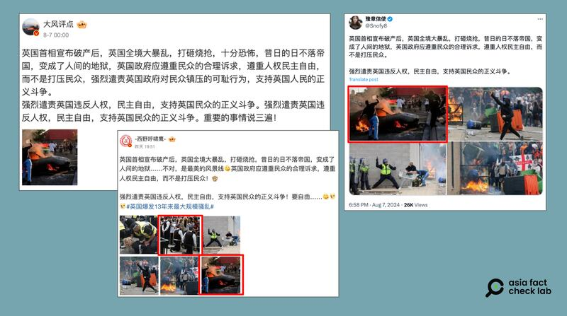

# 事實快查｜英國爆發騷亂 中文社媒流傳哪些錯假信息？

作者：艾倫、莊敬

2024.08.09 15:29 EDT

英國各地爆發示威騷亂。事件源起是在7月底，一名17歲青少年持刀襲擊一個兒童舞蹈班，造成3名兒童死亡、多人受傷，網路謠傳此案是穆斯林非法移民所爲，引燃英國社會的反穆斯林、反移民情緒。

亞洲事實查覈實驗室（Asia Fact Check Lab，下簡稱AFCL）注意到，中文輿論場有部分中文網民傳播錯假信息或影像，我們查覈了三則最近流傳較廣的信息。

## 一、英國出現騷亂是因爲“穆斯林非法移民”殺害了英國公民？

## 查覈結果：錯誤

8月初,中文社媒上出現消息( [1](https://x.com/Rumoreconomy/status/1821055255507038506), [2](https://x.com/trumperhawk/status/1820075878677959136))稱,英國出現騷亂是因爲"穆斯林的非法移民"、"穆斯林的犯罪團伙"殘忍殺害英國當地人,將此前出現的惡性事件歸因於非法移民問題。

近期中文輿論圈流傳一則消息，稱英國的騷亂起源於“穆斯林非法移民”砍殺英國公民。(X截圖)

然而這是一則錯誤信息。

根據 [美聯社](https://apnews.com/article/uk-southport-stabbing-online-misinformation-1dcd23b803401416ac94ae458e5c9c06)的報導,英格蘭西北部的一起刺殺事件造成三名年輕女孩喪生及多名孩童受傷。襲擊發生後,英國本地確實出現不少虛假信息,有人稱此案嫌疑人爲2023年來到英國的尋求庇護者(asylum seeker)、是穆斯林,還有一個隨後被證僞的嫌疑人姓名流傳。這些謠言已經被英國警方和主流媒體澄清。

英國警方已於8月1日確認兇手身份，名爲阿克塞爾·魯達庫巴納（Axel Rudakubana），生於英國，父母爲盧旺達人。因此網傳兇案嫌疑人爲“穆斯林”、“非法移民”的說法，是沒有根據的信息。

事實上，這些中文社媒帳號轉發的正是在英國盛行一時、引發騷亂，並被官方和媒體反覆澄清的假消息。

## 二、網傳照片是英國騷亂的影像嗎？

## 查覈結果：挪用無關舊影像

微博大V用戶" [大風評點](https://m.weibo.cn/detail/5064523683464653)"8月7日發文:"英國首相宣佈破產後,英國全境大暴亂,打砸燒搶,十分恐怖,昔日的日不落帝國,變成了人間的地獄⋯⋯ ",並搭配一張車輛起火的照片。

其他社媒用戶也分享了這張照片,像是微博大V" [西野呼嘯鷹](https://m.weibo.cn/detail/5064823409475692)"、X上的藍勾勾" [豫章信使](https://twitter.com/Snofy8/status/1821138931280499046)"都是一次發佈多張照片,包含上述的車輛起火照。

部分中文網民在社媒發文討論英國騷亂，但配圖挪用無關事件的影像。（微博、X截圖）

AFCL以Google圖片反搜，查詢到路透社、《美國之音》等媒體在2020年5月的新聞報道中使用這張車輛起火的照片。根據照片圖說，這是當時在美國明尼蘇達州爆發的“黑人的命也是命”（Black Lives Matter）示威抗議，由路透社記者拍攝。

也就是說，這張車輛起火照與此次英國騷亂無關，部分中文網民挪用無關事件的舊影像，傳播了錯誤信息。而上述幾個微博、X用戶，除了發佈同一張舊照，其發文內容也高度相似。

此外,"西野呼嘯鷹"所發佈的多張照片之中,還有一張警察下跪照是出自 [2020年的事件](https://www.alamy.com/london-britain-3rd-june-2020-two-policemen-kneel-down-in-front-of-protesters-outside-downing-street-in-london-britain-on-june-3-2020-thousands-of-people-gathered-in-london-on-wednesday-to-protest-over-the-death-of-george-floyd-an-unarmed-black-man-suffocated-to-death-by-a-white-police-officer-in-the-mid-western-us-state-of-minnesota-last-week-credit-ray-tangxinhuaalamy-live-news-image360181447.html),也與此次英國騷亂無關。

## 三，騷亂原因和英國政府“宣告破產”有關？

## 查覈結果：誤導

與上述" [大風評點](https://m.weibo.cn/detail/5064523683464653)"等貼文類似,還有不少社媒消息將此次騷亂和英國首相"宣告破產"聯繫起來。近期也有大量中文媒體、社媒消息稱,英國政府已經"宣佈破產"、甚至有一些 [評論文章](http://hsb.hspress.net/system/2024/0731/222014.shtml)分析英國爲何走向"國家破產"和其 [可能影響](https://www.sohu.com/a/797849092_121739944#:~:text=%E6%94%BF%E5%BA%9C%E7%A0%B4%E4%BA%A7%E5%AF%BC%E8%87%B4%E7%9A%84%E5%85%AC%E5%85%B1,%E4%B8%BA%E9%9A%BE%E4%BB%A5%E8%A7%A3%E5%86%B3%E7%9A%84%E5%8E%8B%E5%8A%9B%E3%80%82), 稱英國破產可能會引發政府服務停擺、社會動亂。

經查覈,英國已經"破產"的說法的來源是對於英國新任首相基爾·斯塔默(Keir Starmer)7月28日 [對國家財政狀況的聲明](https://www.reuters.com/world/uk/britain-is-broke-broken-new-government-declares-2024-07-27/),其原話是

“The assessment will show that Britain is broke and broken- revealing the mess that populist politics has made of the economy and public services。”

AFCL提供參考翻譯如下：“評估將會顯示，英國現在窮困而分裂——這揭示了民粹主義政治在經濟和公共服務方面造成的混亂。”

對於其中的"broke and broken"(窮困而分裂)的說法,不少中文媒體將"broke"翻譯成"破產"。在中文中,"破產"一詞確實在非正式場合、帶有玩笑性質時用於表示窮困、沒錢的意思,對應" [broke](https://dictionary.cambridge.org/us/dictionary/english/broke)"的意思,但在正式法律、財政用語中," [破產](https://www.zdic.net/hans/%E7%A0%B4%E4%BA%A7)"對應的則是英文詞彙" [bankrupcy](https://dictionary.cambridge.org/us/dictionary/english/bankruptcy)",意思是按照法律程序、宣告無力償還債務,並由司法部門接收財產、走破產清償程序。

此前,確實有一些英國地方城鎮政府 [面臨財務危機](https://www.theguardian.com/society/2023/dec/06/english-town-halls-face-unprecedented-rise-in-bankruptcies-council-leaders-warn),甚至有些城鎮如諾丁漢已經發出了"Section 114通知",即地方政府認爲即將無法平衡預算或面臨嚴重的財政問題時,發佈的警告通知。該通知的發佈意味着地方政府必須暫停所有非必要的支出,並公示討論解決財政問題的方案。雖然這種過程並非實際的破產程序,這種動作有時也會 [被媒體稱爲地方政府"宣告破產"](https://www.theguardian.com/uk-news/2023/nov/29/nottingham-city-council-issues-114-notice-in-effect-declaring-itself-bankrupt)(declare bankrupcy)。

而英國政府此次稱國家“窮困而分裂”（broke and broken)，只是評論目前英國困難的財政狀況， 並未正式通告任何具體的財務危機，更沒有關閉政府、停擺服務的“宣告破產”計劃。 不少中文媒體評論英國“已經破產”，屬於誤導信息，而將英國發生的騷亂和抗議與“政府破產”聯繫起來，更是錯誤信息。

*亞洲事實查覈實驗室(Asia Fact Check Lab)針對當今複雜媒體環境以及新興傳播生態而成立。我們本於新聞專業主義,提供專業查覈報告及與信息環境相關的傳播觀察、深度報道,幫助讀者對公共議題獲得多元而全面的認識。讀者若對任何媒體及社交軟件傳播的信息有疑問,歡迎以電郵*  [*afcl@rfa.org*](mailto:afcl@rfa.org)  *寄給亞洲事實查覈實驗室,由我們爲您查證覈實。* *亞洲事實查覈實驗室在X、臉書、IG開張了,歡迎讀者追蹤、分享、轉發。X這邊請進:中文*  [*@asiafactcheckcn*](https://twitter.com/asiafactcheckcn)  *;英文:*  [*@AFCL\_eng*](https://twitter.com/AFCL_eng)  *、*  [*FB在這裏*](https://www.facebook.com/asiafactchecklabcn)  *、*  [*IG也別忘了*](https://www.instagram.com/asiafactchecklab/)  *。*

[Original Source](https://www.rfa.org/mandarin/shishi-hecha/hc-uk-anti-immigrants-riot-08092024152935.html)