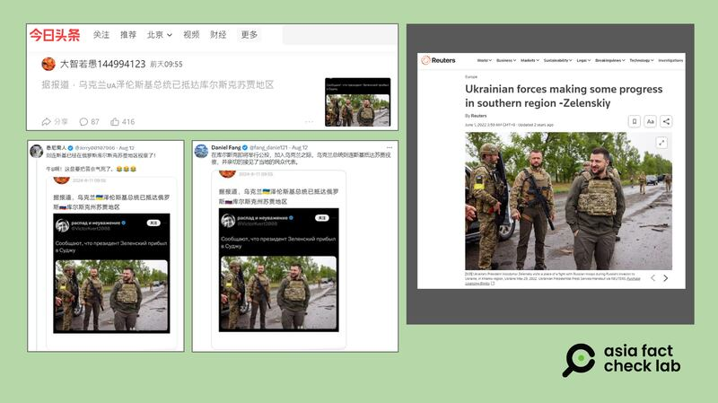

# 事實查覈｜澤連斯基進入俄羅斯視察照片流出？

作者：莊敬

2024.08.13 13:09 EDT

## 查覈結果：錯誤

## 一分鐘完讀：

烏克蘭軍隊近期對俄羅斯發起跨境反攻，已攻入俄羅斯庫爾克斯州。中文社媒最近盛傳一張烏克蘭總統澤連斯基視察軍隊的照片，配文寫著：“烏克蘭總統澤連斯基已抵達庫爾斯克蘇賈地區”。但經查，這張照片是2022年澤連斯基視察烏克蘭城市哈爾科夫（Kharkiv）所拍攝，發帖者是用舊照片傳播錯誤信息。

## 深度分析：

據英國廣播電臺(BBC)等媒體 [報道](https://www.bbc.com/zhongwen/trad/world-69263550),烏克蘭軍隊推進俄羅斯境內,目前已深入庫爾斯克(Kursk)邊境地區,這是自2022年2月俄羅斯入侵烏克蘭以來,烏方重要的反攻行動。

亞洲事實查覈實驗室(Asia Fact Check Lab,下簡稱AFCL)注意到,近日在今日頭條等中文平臺,有用戶發佈一張烏克蘭總統澤連斯基(Volodymyr Zelenskyy)視察軍隊的照片,配文寫著:"烏克蘭總統澤連斯基已抵達庫爾斯克蘇賈地區"。消息經多位X"藍勾勾"用戶( [1](https://x.com/Jerry00107966/status/1822818950088183952), [2](https://twitter.com/fang_danie121/status/1822758928025055330))、 [網易作者](https://www.163.com/dy/article/J9DBTTEO0528N3L3.html)轉發,在社媒用戶之間迅速傳播。

有中文網民近日發文，聲稱烏克蘭總統澤連斯基已抵達俄羅斯庫爾斯克，並附上一張澤連斯基視察的照片爲證（左圖），但經查，該照片曾出現在2022年路透社的報道（右圖），並非近期事件。（今日頭條、Ｘ、路透社截圖）

AFCL用Google反搜,發現網傳照片曾出現在路透社2022年的 [報道](https://www.reuters.com/world/europe/ukrainian-forces-making-some-progress-southern-region-zelenskiy-2022-05-31/)中,根據其圖說,當時澤連斯基到烏克蘭城市哈爾科夫視察,照片是由烏克蘭總統辦公室提供。

另以英文關鍵字查詢,並未找到國際主流媒體報道澤連斯基跨境進入俄羅斯庫爾斯克的消息。根據澤連斯基的 [社媒發文](https://x.com/ZelenskyyUa)、 [烏克蘭總統府新聞稿](https://www.president.gov.ua/en)等公開資訊,澤連斯基近日行程包括聽取簡報、會見美國議員訪團等。AFCL也正向烏克蘭外交部查證。

*亞洲事實查覈實驗室（Asia Fact Check Lab）針對當今複雜媒體環境以及新興傳播生態而成立。我們本於新聞專業主義，提供專業查覈報告及與信息環境相關的傳播觀察、深度報道，幫助讀者對公共議題獲得多元而全面的認識。讀者若對任何媒體及社交軟件傳播的信息有疑問，歡迎以電郵afcl@rfa.org寄給亞洲事實查覈實驗室，由我們爲您查證覈實。*

*亞洲事實查覈實驗室在X、臉書、IG開張了,歡迎讀者追蹤、分享、轉發。X這邊請進:中文*  [*@asiafactcheckcn*](https://twitter.com/asiafactcheckcn)  *;英文:*  [*@AFCL\_eng*](https://twitter.com/AFCL_eng)  *、*  [*FB在這裏*](https://www.facebook.com/asiafactchecklabcn)  *、*  [*IG也別忘了*](https://www.instagram.com/asiafactchecklab/)  *。*

[Original Source](https://www.rfa.org/mandarin/shishi-hecha/hc-zelensky-enters-russia-fact-check-08132024130636.html)