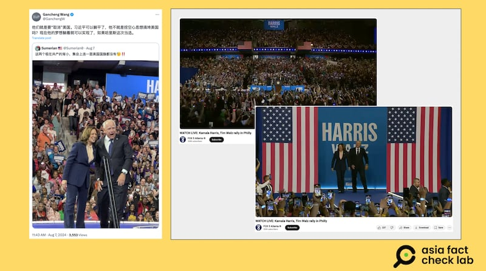
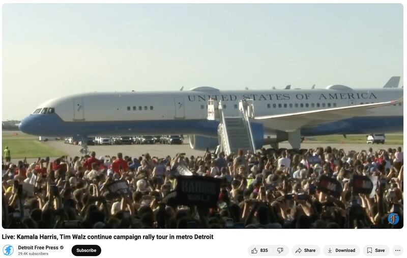

# 事實快查｜哈里斯-沃爾茲組合登場美國大選，哪些相關假信息正在流行？

作者：莊敬

2024.08.14 12:53 EDT

2024年美國總統大選的民主黨候選人哈里斯（Kamala Harris，又譯賀錦麗），8月6日宣佈副手人選爲明尼蘇達州州長沃爾茲（Tim Walz，又譯華茲），兩人隨即在多個競爭激烈的“搖擺州”舉辦造勢活動。

亞洲事實查覈實驗室（Asia Fact Check Lab，下簡稱AFCL）注意到，中文輿論場近日流傳多則有關哈里斯、沃爾茲的可疑信息和影像，我們查覈了以下幾則。

## 一、哈里斯-沃爾茲集會“連一面美國國旗都沒有”？

## 查覈結果：錯誤

近日在社媒X上,有部分 [中文帳號](https://twitter.com/GanchengW/status/1821029482234274196)傳播一張哈里斯、沃爾茲在造勢活動舞臺上的照片,配文稱"集會上連一面美國國旗都沒有"。

X上的中文帳號傳播哈里斯、沃爾茲集會上一面美國國旗都沒有（左圖），但新聞頻道拍攝的遠景畫面顯示，現場有美國國旗（右圖）。（X、YouTube截圖）

AFCL以Google圖片搜尋,確認影像出自哈里斯、沃爾茲8月6日在美國賓州的第一場造勢活動。進一步檢視美國媒體,如 [福克斯新聞](https://www.youtube.com/watch?v=deAOPOXjncc)拍攝的當天造勢活動完整視頻,可以看到候選人和來賓出場的佈置有大號美國國旗,遠景畫面也可看到看臺上方的美國國旗。

網傳照片僅擷取未拍攝到美國國旗的部分，以局部畫面傳播“集會上連一面美國國旗都沒有”的錯誤信息。

## 二、哈里斯、沃爾茲在底特律造勢“沒有人去接機”？

## 查覈結果：錯誤

在中國平臺微博上,有 [賬號](https://m.weibo.cn/detail/5066101866105706)分享哈里斯、沃爾茲日前在密西根州底特律的造勢活動照片,配文寫着:"沒有人去接機,結果用AI/PS編輯圖片,增加人數來顯示有人氣";另有 [微博賬號](https://m.weibo.cn/detail/5066121960754808)不僅懷疑照片真實性,還質疑"事件是否真的"、"爲何沒有現場錄像?"

中國網民發文稱哈里斯、沃爾茲在底特律的造勢活動上沒有人接機，並質疑畫面中人羣是AI生成。(微博截圖）

哈里斯、沃爾茲8月7日在底特律舉辦造勢活動後,網路上流傳幾張大批人羣歡迎哈里斯飛機抵達的照片,在英文媒體與社媒上也引起相當大討論。 [美聯社](https://apnews.com/article/trump-harris-detroit-crowd-size-photo-ff54a66d8e3197c90068ba94847297cf)、 [美國有線電視新聞網(CNN)](https://edition.cnn.com/2024/08/11/politics/trump-harris-crowd-size-conspiracy-theory/index.html)等多家媒體報道,共和黨總統候選人特朗普(Donald Trump) [質疑](https://truthsocial.com/@realDonaldTrump/posts/112944255426268462)哈里斯造假參與造勢的支持者人數,而哈里斯團隊已在社媒上 [回應](https://x.com/KamalaHQ/status/1822679561353535600),表示這是真實照片。

多家美國新聞媒體拍攝的畫面顯示，哈里斯飛機抵達底特律造勢活動現場時，有許多支持民衆。（《底特律自由新聞》Youtube賬號截圖）

AFCL檢視 [美國公共廣播電視網(PBS)](https://www.youtube.com/watch?v=AvVbLW6Xfbc)、 [《底特律自由新聞》(Detroit Free Press)](https://www.youtube.com/watch?v=j9DdAsQkghk)、 [《福斯新聞》(FOX News](https://www.foxnews.com/video/6360312188112))等多家媒體拍攝的造勢活動畫面,確認哈里斯飛機抵達時,有許多支持羣衆在現場等候。這些影像證據表明,中國網民所稱"沒有人去接機"、"沒有現場錄像"等說法爲錯誤信息。

AFCL僅針對上述中國網民說法進行查覈,至於照片是否經修飾、調整,並非查覈範圍。針對照片的真實性,路透社等媒體已發佈 [查覈報告](https://www.reuters.com/fact-check/photo-harris-walz-rally-michigan-was-not-ai-generated-2024-08-12/),查覈結果爲"照片並非AI生成";此外,加州大學伯克利分校教授、數位媒體鑑識專家法裏德(Hany Farid)也在社媒 [發表評論](https://www.linkedin.com/posts/hany-farid-40a97935_i-am-fielding-questions-about-this-image-activity-7227793775702503424-0_Qy/),表示他運用兩種工具檢測,都沒有證據顯示照片爲AI生成。

## 三、針對兩黨競選人副手的虛假信息攻擊

AFCL還注意到中文輿論場上流傳其他針對沃爾茲的虛假信息,像是在英文社媒流傳有關沃爾茲早期曾因一次不尋常的攝入事件而被緊急送醫,但經 [PolitiFact](https://www.politifact.com/factchecks/2024/aug/09/viral-image/story-about-gov-tim-walz-getting-his-stomach-pumpe/)查覈,網傳內容提到的報紙、醫院、醫生、時間軸都不符現實,其查覈結果爲"虛構情節"。但在事實查覈機構闢謠後,此謠言還是傳進中國平臺,有 [大V博主](https://m.weibo.cn/detail/5066509481151783)轉傳。

共和黨副總統候選人萬斯(J.D. Vance)也是遭虛假信息攻擊的政治人物之一, [路透社](https://www.reuters.com/fact-check/video-young-boy-preaching-oprah-show-does-not-show-jd-vance-2024-08-12/)、 [CNN](https://edition.cnn.com/2024/07/30/politics/fact-check-harris-vance-project-2025/index.html)等媒體都曾發佈有關萬斯的查覈報告,AFCL亦曾 [查覈](2024-08-05_事實查覈｜J.D.萬斯要烏克蘭人“接受國家被摧毀”的事實？.md)中文輿論場上有關萬斯的言論。

*亞洲事實查覈實驗室(Asia Fact Check Lab)針對當今複雜媒體環境以及新興傳播生態而成立。我們本於新聞專業主義,提供專業查覈報告及與信息環境相關的傳播觀察、深度報道,幫助讀者對公共議題獲得多元而全面的認識。讀者若對任何媒體及社交軟件傳播的信息有疑問,歡迎以電郵*  [*afcl@rfa.org*](mailto:afcl@rfa.org)  *寄給亞洲事實查覈實驗室,由我們爲您查證覈實。* *亞洲事實查覈實驗室在X、臉書、IG開張了,歡迎讀者追蹤、分享、轉發。X這邊請進:中文*  [*@asiafactcheckcn*](https://twitter.com/asiafactcheckcn)  *;英文:*  [*@AFCL\_eng*](https://twitter.com/AFCL_eng)  *、*  [*FB在這裏*](https://www.facebook.com/asiafactchecklabcn)  *、*  [*IG也別忘了*](https://www.instagram.com/asiafactchecklab/)  *。*

[Original Source](https://www.rfa.org/mandarin/shishi-hecha/hc-harris-walz-us-election-08142024125020.html)