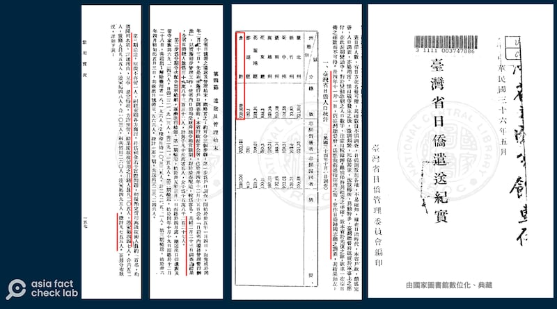

# 事實查覈 | 臺灣百分之十的人口是日裔？

作者：董喆

2024.08.15 18:05 EDT

## 查覈結果：缺乏證據

## 一分鐘完讀：

近日，中國“全球化智庫”副主任高志凱在半島電視臺的節目中聲稱，二次大戰結束後，許多日本人留在臺灣沒有回國，如今臺灣10％的人口都是這些日本人的後裔。

亞洲事實查覈實驗室採訪了高志凱，他並沒有給出該數據來源的證據。另據政府人口普查數據、歷史人口增長率及族裔統計史料，可以判斷高志凱的說法缺乏證據。

## 深度分析：

8月10日,半島電視臺在YouTube英文頻道發佈了高志凱的 [訪談視頻](https://www.youtube.com/watch?v=kmYdpHtOv_E),英國籍記者哈桑(Mehdi Raza Hasan)與高志凱進行了50分鐘的對話,談話內容除了臺海關係,也涉及北京政府與西藏、維吾爾民族的關係,以及中國政情等敏感議題。

訪談節目的8分鐘位置，高志凱提出了“10%的臺灣人是日本人後裔”說法，當時兩人對話內容如下：

高志凱和哈桑對話的內容（AFCL製圖）

## 高志凱的立論基礎爲何？

高志凱曾經是外交官，曾任鄧小平的英文翻譯，他近年頻頻在國外媒體上接受訪問，爲中國的對外政策辯護。但在半島電視臺的訪問裏，他並沒有說明“日裔臺灣人”的計算依據是什麼。

亞洲事實查覈實驗室(Asia Fact Check Lab,AFCL)在8月14日致電高志凱，詢問他數據的來源。高志凱稱其在疫情前三次到臺灣來訪問，說：“我跟臺灣的政府部門和民進黨官員、國民黨官員和其他的政黨官員，和工商界的很多人是都有聯繫，做了詳細的調查，這個消息是他們非常認真負責的告訴我的。”

訪談中，高志凱認定有相當多日本人在戰後隱姓埋名待在臺灣，AFCL進一步詢問是否能提供具體數據出處，高志凱回答：“中華民國1945年接管臺灣以後，確實有非常詳細的戶籍系統的，所以應該去找臺灣民政部戶政事務所去詳細的瞭解這些日裔臺灣人在臺灣的具體的情況。”

## 戰後多少日本人被遣回？多少人留下？

查覈高志凱的說法是否爲真，關鍵問題有二：

一、在二次世界大戰結束後，有多少日本人被遣送回國？

二、有多少日本人留在臺灣。

關於第一個問題, 1947年由"臺灣省日僑管理委員會"編印的 [《臺灣省日僑遣送紀實》](https://taiwanebook.ncl.edu.tw/zh-tw/book/NCL-002822626/reader)是權威的政府檔案,當中記載了兩筆日本投降後在臺的日僑人數,一是日本臺灣總督府1945年的調查,在臺灣日僑人數爲32萬3269人;二是1946年國民政府行政長官公署的戶口調查,在臺灣日僑人數爲32萬8332人。

日僑管理委員會自1946年3月1日起至1947年5月3日共分三期運送共送出32萬3246人。《臺灣省日僑遣送紀實》第157頁寫道，第三期原本預計全數遣送，不留下任何人，但經各方商討留用高級技術人員，最終留下日籍人員205人，連同家屬447人，合計652人；琉籍人員55人，家屬48人，合計103人，將兩者合併計算共留下了755名日本人。

《臺灣省日僑遣送紀實》記錄了二十世紀四十年代日僑遣送和留臺的數據統計（臺灣華文電子書庫截圖）

國史館學者歐素瑛2010年發表的論文 [《戰後初期在臺日人之遣返與留用:兼論臺灣高等教育的復員》](https://www.th.gov.tw/new_site/05publish/03publishquery/02journal/01download.php?COLLECNUM=401061308),也提到了相同的歷史背景。

## 戶口普查統計出多少日本人？

對於第二個問題：日後有多少日本人留在臺灣？高志凱認爲臺灣有非常翔實的戶口統計資料，因此可以向相關部門查詢日裔臺灣人的具體的情況。

對於這個說法，臺灣內政部人員接受AFCL採訪時表示，臺灣目前只有移民署統計現在居留在臺灣的日本外僑數量。但1945年戰後，有多少人具有日本血統但續留臺灣，他們的後人有多少，內政部戶政資料中並沒有這項統計。

AFCL查閱了臺灣歷次戶口普查資料,發現在1956年,也就是戰後第一次臺閩地區戶口普查,當中僅 [顯示](https://sgp.ncl.edu.tw/hypage.cgi?HYPAGE=search/merge_pdf.hpg&sysid=00000023&jid=00373101&dt=48100201&pages=321-608&cdno=SGP001) "本省籍族係爲外國者" 有1233人 (見所連結檔案第13、14頁) ,但並未註明具體是哪些國家。

所謂"本省籍族係爲外國者",也就是"有外國人血緣的臺灣人",雖然普查報告中沒有列明國籍,但臺灣中山大學社會學系教授葉高華曾 [撰文](https://mapstalk.blogspot.com/2017/01/blog-post.html)推估這1233人有極大部分都可能是戰後歸化爲臺灣人的日本人。

因此，無論是以《臺灣省日僑遣送紀實》中記載數量推算，或是以1956年臺灣戰後第一次人口普查資料推測，二次大戰後留在臺灣的日本人，應該在1000人上下。

## 1000人有可能能在77年內繁衍出200萬人嗎？

如果合理推估戰後留在臺灣，以及歸化臺籍的日本人，約在1000人上下，那麼要在77年後的今天，如高志凱稱佔臺灣十分之一，也就是230萬的“日裔臺灣人”，那麼根據成長率公式：

最終人口數＝初始人口數Ｘ（1+年成長率）^年數

日裔人口的平均增長率大約高達10.5%。但根據臺灣內政部 [人口成長率統計](https://www.ris.gov.tw/app/portal/346),臺灣人口成長率平均在2%到3%之間,最高峯的1969年,也僅爲4.998%,由此估算出目前的日裔臺灣人大約爲數千人至上萬人,最多可能到4萬人左右,與兩百萬的數字相去甚遠。

*亞洲事實查覈實驗室（Asia Fact Check Lab）針對當今複雜媒體環境以及新興傳播生態而成立。我們本於新聞專業主義，提供專業查覈報告及與信息環境相關的傳播觀察、深度報道，幫助讀者對公共議題獲得多元而全面的認識。讀者若對任何媒體及社交軟件傳播的信息有疑問，歡迎以電郵afcl@rfa.org寄給亞洲事實查覈實驗室，由我們爲您查證覈實。*

*亞洲事實查覈實驗室在X、臉書、IG開張了,歡迎讀者追蹤、分享、轉發。X這邊請進:中文*  [*@asiafactcheckcn*](https://twitter.com/asiafactcheckcn)  *;英文:*  [*@AFCL\_eng*](https://twitter.com/AFCL_eng)  *、*  [*FB在這裏*](https://www.facebook.com/asiafactchecklabcn)  *、*  [*IG也別忘了*](https://www.instagram.com/asiafactchecklab/)  *。*

[Original Source](https://www.rfa.org/mandarin/shishi-hecha/hc-ten-percent-taiwanese-are-japanese-descendants-fact-check-08152024172450.html)