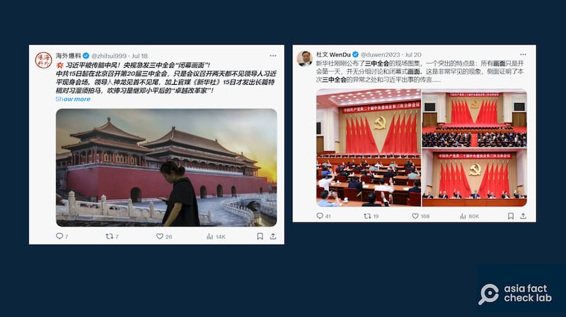
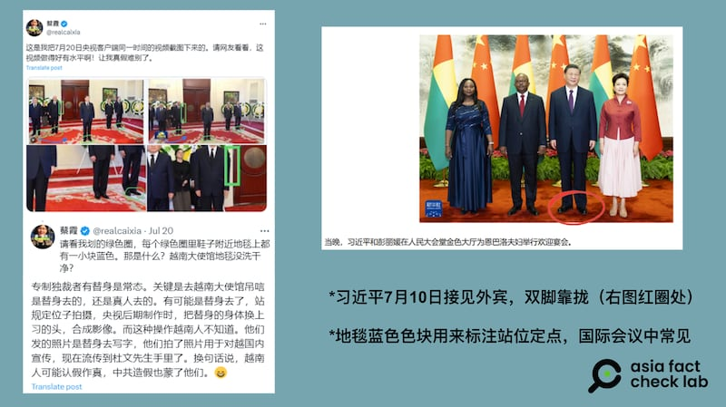
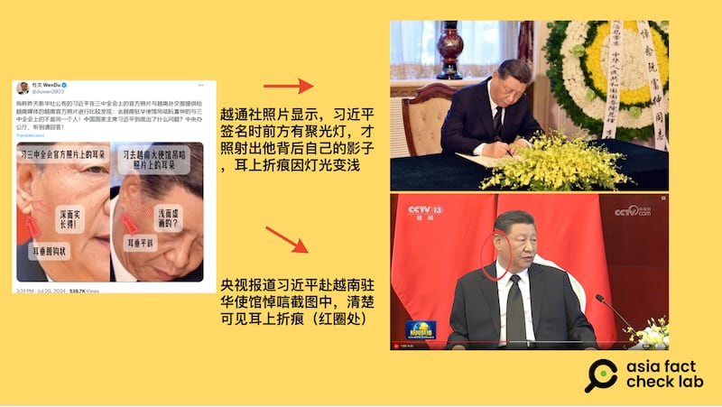
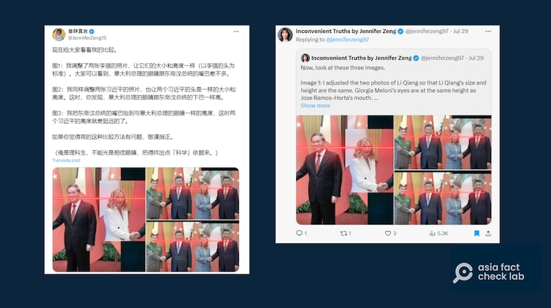
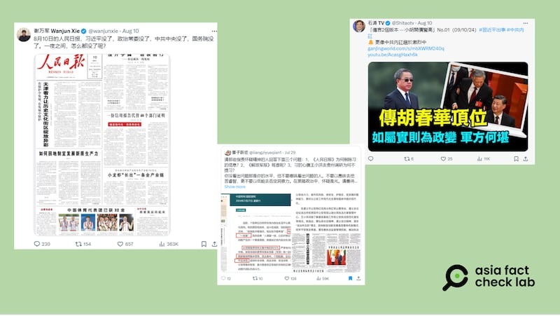
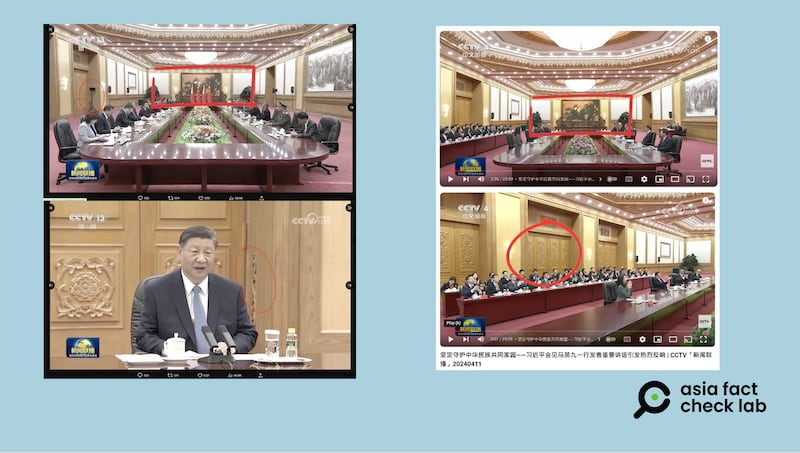

# 傳播觀察|“生重病”、“用替身”？關於習近平健康的謠言二重奏

作者：鄭崇生

2024.08.16 15:41 EDT

7月31日,中央電視臺報道習近平30日主持 [中央政治局集體學習會議](https://www.youtube.com/watch?v=kW1NV7H7Xr8&list=PL0eGJygpmOH5xQuy8fpaOvKrenoCsWrKh&index=16&t=634s),在那之後的半個多月,各媒體再無習公開露面的報道。

近幾年來，每當習近平持續一段時間沒有公開活動，社交媒體和一些海外中文媒體總會流傳有一些關於他健康情況的說法。最近一輪關於習近平健康的討論從7月中旬的三中全會期間開始，發展出習近平已經“生重病”不出現在公開場合的說法；更有傳言稱，這之後數次露面的習近平是“用替身”。

然而，這些傳言並無可靠證據支撐。另有觀察中國政壇多年的專家指出，中國一直對領導人健康狀況祕而不宣，高層政治的信息黑箱爲謠言提供溫牀，但大部分的傳聞都不符合邏輯，可能性極低。

## 三中全會開始，“習近平中風”傳言不斷

"習近平中風"的話題自中共20屆三中全會開會之前開始,至今仍在傳播。此次三中全會延至7月15日召開,已經引發不少猜疑,會議召開之際,在網絡傳言風行之下,"中風"一詞一度成 [爲百度禁搜關鍵詞](https://x.com/whyyoutouzhele/status/1813881685529747690),更是讓不少人認爲,習近平有健康問題。

7月18日全會閉幕後，有網路意見領袖質疑央視播出的閉幕式視頻是剪接造假的版本。傳言認爲，習近平因爲已經臥病在牀，根本沒有出席閉幕式，因此央視必須剪接一條假視頻以爲掩護。

X等社交媒體上，習近平被傳“中風”。（X截圖）

7月20日，習近平前往越南駐華大使館悼念越共中央已故總書記阮富仲，他的現身回擊了此前關於他“重病不起”的傳言。然而，傳言開始進一步演變爲他在出席公開活動時在“用替身”。

一些頗有影響力的中國意見領袖及流亡海外的異議人士，認爲央視報道中的習近平畫面是替身，或是質疑央視公佈的視頻造假，他們在社媒帳號上公佈許多“論證”，例如質疑地毯上藍色色塊是爲央視後製合成提供便利、習近平站姿與平常不同，還有說法稱，畫面上的習近平耳朵上的摺痕變淺等等。

習近平現身後，網絡傳言進一步稱他“用替身”。（X，外交部網站截圖）

X上流傳的消息（左圖）對照越通社、央視的畫面（右圖）可發現，習近平耳上摺痕是因現場環境條件不同，清晰程度纔會不一。（X、越通社、央視節目截圖）

不但習近平弔唁阮富仲的現場被稱爲是"用替身",7月29日和30日,官媒報道習近平連續接見東帝汶總理奧爾塔和意大利總理梅洛尼後,再度有人以 [中](https://archive.is/tclld)、 [英文](https://archive.is/wXxY6)發文稱出席會見的"習近平"是替身。這些傳言以總理李強與奧爾塔及梅洛尼分別會見時握手照片的身高差距,去對照習近平與這兩位外國元首會見時照片的差異,稱"不只一個習近平",即習近平用分身會見外國元首。

網絡傳言稱，會見外國政要的習近平是替身，但並沒提供切實依據。（X截圖）

隔天,同一位意見領袖把焦點轉到央視新聞報導畫面造假的質疑上, [聲稱](https://archive.is/B3Nab)習近平與奧爾塔會面的視頻有諸多疑點,包括拍攝習近平特寫時爲何背後的三腳架消失了。

同時，還有其他社媒賬號列舉各種“旁證”，稱習近平已經不能理事，強調政協副主席胡春華突然露面、總理李強出面慰問洪災受災羣衆；也有人用《人民日報》頭條多久沒有提及習近平作爲“政局異常”、“將有鉅變”的證據。

亦有網絡傳言用其他常委動態、人民日報頭版等“旁證”傳播未經證實的習近平相關信息。（X截圖）

## 系列傳聞並無切實依據

上述關於習近平健康狀況的謠言，主要分爲兩類，一類稱習近平久未露面是因爲“生重病”，而一旦新聞媒體出現他的畫面，另一類習近平“用替身”的說法就開始流傳，這些貼文吸引了大量批評中共統治的異議人士跟進、轉帖。

然而，這些傳聞並無可靠依據支撐。

亞洲事實查覈實驗室（Asia Fact Check Lab, 下簡稱AFCL）針對前述“習近平失蹤”的部分傳聞進行查覈。例如指控央視變造習近平弔唁阮富仲的視頻，AFCL使用法新社開發的InVID影像查覈工具顯示，央視這段視頻經過AI工具編輯修改的機率極低。

針對質疑習近平與奧爾塔會面時畫面背景出現變化的 [相關說法](https://archive.is/B3Nab)。亞洲事實查覈實驗室對照習近平今年4月與前國民黨主席馬英九會面的場地,可以確定習近平與奧爾塔會面的地點和會見馬英九時相同,都使用人民大會堂東廳。

對照當時央視的轉播視頻可以發現，該會議室在習近平會見奧爾塔時坐的這一側，有三道外形類似的門（下圖右紅圈處），而不同機位拍攝角度不同，是有可能拍攝到留作出入口、未擺設腳架的門爲背景，以“三腳架消失”指控央視轉播視頻有造假，證據並不充足。

對照網絡傳言（左圖）與央視轉播馬習會截圖（右圖），可以確認會見會場有多扇外形相似的門。（X曾錚賬號、央視節目截圖）

同時,"習近平中風"的說法也在英文社交媒體廣傳,但"替身論"並不多見。有一些英文社交媒體賬號傳播一張習近平緊皺眉頭的照片,作爲他公開場合暴露健康問題的證據。然而,路透社事實查覈 [發佈報告](https://www.reuters.com/fact-check/months-old-photos-chinas-xi-jinping-shared-july-2024-2024-07-18/),稱這張照片來自於幾個月前的兩會期間,並不能作爲近期健康狀況的證明,並且,那張照片捕捉的是習近平的瞬間表情,有在場的記者,在那張照片拍攝之後,習近平恢復了正常神情,並與大會代表一起微笑、鼓掌。

對於" [習近平面露痛苦表情](2024-03-18_事實查覈｜網路瘋傳的習近平皺眉閉眼照是真的嗎？.md)"和" [在三中全會上被架走](2024-07-31_事實查覈｜網傳圖片顯示習近平在三中全會上"被架走"？.md)"的傳言,亞洲事實查覈實驗室近期也做過查覈。

## 健康傳聞反覆出現、專家稱是“一廂情願的念想”

在中國、朝鮮與俄羅斯等國，領導人的健康狀況屬國家機密，沒有公示制度。因此習近平的“健康傳聞”並不始於這一次。

例如,2020年底一些臺灣媒體( [1](https://archive.ph/54trQ)、 [2](https://archive.is/UJF7Q))把當時推特上反共立場鮮明的簡體中文用戶當成消息來源,報導稱習近平罹患腦瘤,僅僅以習近平在鏡頭前出現咳嗽、走路姿態緩慢的情況作爲依據。

在2022年,習近平尋求連任第三個任期、媒體聚焦中國政壇的時刻,也有關於他的健康傳聞被熱炒,並延伸至權力鬥爭的陰謀論。例如,當時英國 [《每日郵報》](https://archive.ph/mctWQ)引述不具公信力的媒體及社交媒體用戶消息指出,習近平罹患腦動脈瘤,但他不同意手術治療,只接受傳統中醫療法,在當年二十大召開前,X等社交媒體上的討論上更言之鑿鑿聲稱黨內已形成"習下李上"共識的傳聞。

曾長期在北京報道中國新聞的日本前產經新聞社特派員矢板明夫在X上 [發文](https://x.com/Yaita_Akio/status/1818058284617842827)分析,近期"習近平病了"或是"習近平權力不穩"的說法,是"不符合邏輯"的傳言。

他 [舉"習近平中風"](https://x.com/Yaita_Akio/status/1813946909247316364)的傳聞爲例表示,就他自己在中國採訪的經驗,"大事初報無細節"。也就是說,如果有人稱發生了一件大事。同時又透露出很多細節的話,"基本上就可以判斷這個消息是假的"。他指出,如果習近平真的在三中全會上中風了的話,中央辦公廳爲了防止有人趁機作亂,一定會嚴密封鎖消息。所以第一天,很難有詳細的消息傳出來。但目前所見的傳聞,情節鉅細靡疑,因此很難讓人相信真有其事。

此前，習近平“得腦瘤”、“要下臺”等一度廣傳謠言最後都隨着他隨後的露面、講話和各種活動而破滅，然而，在中國的政治信息黑箱之下，習近平“生重病”、“有替身”的說法也許還將繼續反覆流傳。

*亞洲事實查覈實驗室(Asia Fact Check Lab)針對當今複雜媒體環境以及新興傳播生態而成立。我們本於新聞專業主義,提供專業查覈報告及與信息環境相關的傳播觀察、深度報道,幫助讀者對公共議題獲得多元而全面的認識。讀者若對任何媒體及社交軟件傳播的信息有疑問,歡迎以電郵*  [*afcl@rfa.org*](mailto:afcl@rfa.org)  *寄給亞洲事實查覈實驗室,由我們爲您查證覈實。* *亞洲事實查覈實驗室在X、臉書、IG開張了,歡迎讀者追蹤、分享、轉發。X這邊請進:中文*  [*@asiafactcheckcn*](https://twitter.com/asiafactcheckcn)  *;英文:*  [*@AFCL\_eng*](https://twitter.com/AFCL_eng)  *、*  [*FB在這裏*](https://www.facebook.com/asiafactchecklabcn)  *、*  [*IG也別忘了*](https://www.instagram.com/asiafactchecklab/)  *。*

[Original Source](https://www.rfa.org/mandarin/shishi-hecha/hc-is-xi-jinping-really-sick-08162024154108.html)