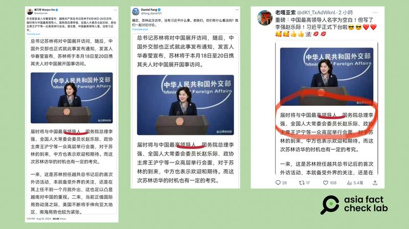

# 事實查覈｜越南國家主席訪華 官方會見名單中“沒有習近平”？

作者：莊敬

2024.08.19 12:33 EDT

## 查覈結果：錯誤

## 一分鐘完讀：

越共中央總書記、越南國家主席蘇林8月18日至20日對中國進行國事訪問。蘇林抵達前，中文社媒上開始流傳一則中國外交部發言人華春瑩宣佈蘇林訪中的信息截圖，內文顯示，與蘇林會談的“中國最高領導人裏，沒有習近平”，引發部分網民據此解讀、推測“習近平已下臺”。

但這與實際情況並不相符。多箇中國官方信息和媒體報道都提到了習近平邀請蘇林訪華、兩人舉行會談的消息。經查，網傳內容來自“搜狐”平臺作者發佈的文章，被部分網民誤傳成華春瑩宣佈的官方信息。

## 深度分析：

蘇林8月18日至20日對中國進行國事訪問,這是他8月初就任越共中央總書記後首次出訪,也是中國國家主席習近平在7月29日分別會見 [東帝汶總統奧爾塔](https://www.fmprc.gov.cn/zyxw/202407/t20240729_11462309.shtml)、 [意大利總理梅洛尼](https://www.fmprc.gov.cn/zyxw/202407/t20240729_11462559.shtml)後,時隔三週首度現身。過去一段時間以來,有關習近平身體欠佳的傳聞不斷,這次是否會見蘇林,引起外界關注。

## 網傳習近平“消失”於高層會談名單

在社媒X上獲認證的藍勾勾用戶" [謝萬軍](https://x.com/wanjunxie/status/1825037427624313283)"8月18日發文:"外交部發言人華春瑩宣佈:越南共產黨總書記蘇林8月18日-20日訪華,屆時將與中國最高領導人,國務院總理李強、全國人大委員長趙樂際、政協主席王滬寧等一衆高層舉行會談。請注意,中國最高領導人裏,沒有習近平。"配圖是一張看起來像新聞報道的截圖,其中有張華春瑩在外交部舉行記者會的照片。

其他X用戶( [1](https://twitter.com/fang_danie121/status/1825026661060125067), [2](https://twitter.com/dK1_TxAdWknl/status/1825031266812772844))也轉傳同一張截圖,稱"蘇林此次訪華,沒有習近平什麼事"、"中國最高領導人名字爲空白!但寫了李強趙樂際!習近平正式下臺啦" 。

網傳中國外交部發言人華春瑩宣佈，越共中央總書記蘇林國事訪問中國期間會見的中國高官，未包括中國國家主席習近平。（圖取自X）

## 華春瑩宣佈的信息是什麼？

亞洲事實查覈實驗室(Asia Fact Check Lab,下簡稱AFCL)注意到,前述X中文帳號所分享的截圖上,華春瑩照片的右下角有註明一個帳號"慄姚校尉"。進一步查詢,發現網傳截圖上的內容,高度符合"慄姚校尉"8月15日在搜狐網發佈的 [文章](https://m.sohu.com/a/801112869_121355949?scm=10001.325_13-109000.0.10140.5_32&spm=smwp.channel_247.block2_307_epwR4p_1_fd.2.17240337101333DMtsTT_324)。

“慄姚校尉”寫道：“（蘇林）屆時將與中國最高領導人，國務院總理李強、全國人大委員長趙樂際、政協主席王滬寧等一衆高層舉行會談⋯⋯”，這段話沒有寫到蘇林將會見習近平，但這是個創作者帳號，並無證據顯示可以代表中國官方。

而根據中國外交部官網,習近平和蘇林的會見有公開記載。華春瑩於8月15日 [宣佈](https://www.mfa.gov.cn/web/wjdt_674879/wsrc_674883/202408/t20240815_11473721.shtml)蘇林是應習近平邀請,到中國進行國事訪問。另以"外交部發言人答記者問"的方式,說明蘇林訪問期間將與習近平進行會談,李強、趙樂際、王滬寧分別與蘇林會見。

8月19日,中國的 [中央電視臺](https://www.youtube.com/watch?v=iwGUXzkSrj0)、越南的 [越通社](https://zh.vietnamplus.vn/%E4%B8%AD%E5%85%B1%E4%B8%AD%E5%A4%AE%E6%80%BB%E4%B9%A6%E8%AE%B0%E5%9B%BD%E5%AE%B6%E4%B8%BB%E5%B8%AD%E4%B9%A0%E8%BF%91%E5%B9%B3%E4%B8%BE%E8%A1%8C%E4%BB%AA%E5%BC%8F-%E6%AC%A2%E8%BF%8E%E8%B6%8A%E5%85%B1%E4%B8%AD%E5%A4%AE%E6%80%BB%E4%B9%A6%E8%AE%B0%E5%9B%BD%E5%AE%B6%E4%B8%BB%E5%B8%AD%E8%8B%8F%E6%9E%97%E8%AE%BF%E5%8D%8E-post221729.vnp)等媒體發佈習近平與蘇林舉行會談的報道與畫面, [華春瑩](https://x.com/SpokespersonCHN/status/1825412345654591715)則在X上發佈習近平與蘇林的合照,中國 [外交部](https://www.fmprc.gov.cn/zyxw/202408/t20240819_11475706.shtml)也發佈了兩人會談的新聞稿與多張照片。因此,習近平沒有出現在會見名單一說,是錯誤信息。

近期有關習近平健康問題的相關傳言,AFCL曾發佈 [傳播觀察](2024-08-16_傳播觀察｜“生重病”、“用替身”？關於習近平健康的謠言二重奏.md)專文,以及 [事實查覈報告](2024-07-31_事實查覈｜網傳圖片顯示習近平在三中全會上"被架走"？.md)。

*亞洲事實查覈實驗室(Asia Fact Check Lab)針對當今複雜媒體環境以及新興傳播生態而成立。我們本於新聞專業主義,提供專業查覈報告及與信息環境相關的傳播觀察、深度報道,幫助讀者對公共議題獲得多元而全面的認識。讀者若對任何媒體及社交軟件傳播的信息有疑問,歡迎以電郵*  [*afcl@rfa.org*](mailto:afcl@rfa.org)  *寄給亞洲事實查覈實驗室,由我們爲您查證覈實。* *亞洲事實查覈實驗室在X、臉書、IG開張了,歡迎讀者追蹤、分享、轉發。X這邊請進:中文*  [*@asiafactcheckcn*](https://twitter.com/asiafactcheckcn)  *;英文:*  [*@AFCL\_eng*](https://twitter.com/AFCL_eng)  *、*  [*FB在這裏*](https://www.facebook.com/asiafactchecklabcn)  *、*  [*IG也別忘了*](https://www.instagram.com/asiafactchecklab/)  *。*

[Original Source](https://www.rfa.org/mandarin/shishi-hecha/hc-vietnam-communist-visits-beijing-xi-jinping-08192024123133.html)