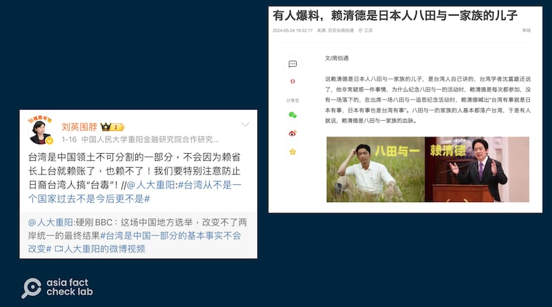
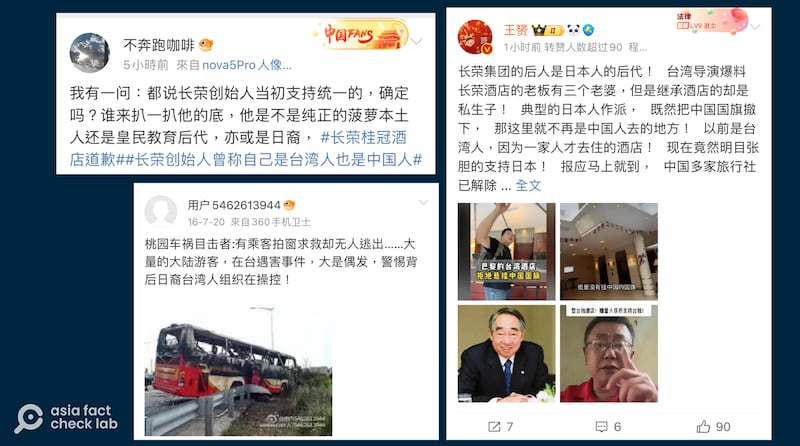
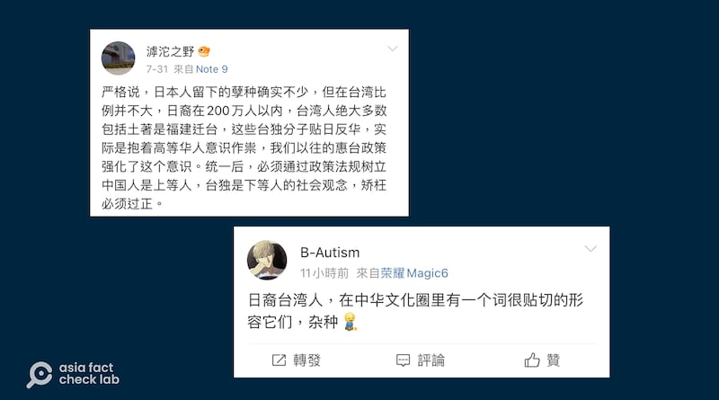

# 傳播觀察 | 流傳近十年，"10%臺灣人是日本裔"說法的來龍去脈

作者：董喆

2024.08.20 16:56 EDT

曾任鄧小平翻譯官的中國全球化智庫副主任高志凱近期在接受半島電視臺專訪時提及，臺灣有10%的人口爲日裔臺灣人，這些人在中共“拿回”臺灣後，必須宣誓效忠中共，否則將被驅逐。半島電視臺記者哈桑(Mehdi Raza Hasan)質疑：“你基本上是在呼籲，對在臺灣的230萬人進行種族清洗(ethnic cleansing)。”

亞洲事實查覈實驗室(Asia Fact Check Lab,下簡稱AFCL)在撰寫 [查覈報告](2024-08-15_事實查覈 ｜ 臺灣百分之十的人口是日裔？.md)時,曾經進一步訪問高志凱,詢問"10%的臺灣人口爲日裔"的依據是什麼,但高志凱並沒有提出明確的消息源。

## 相同論述最早出現於近十年前

但在查覈的過程中，AFCL發現，自“10%的臺灣人口爲日裔”的論述出現已有近十年。

AFCL追溯，相關論述最早出現於2014至2015年，作者是一位叫做“楊振明”的人士。高志凱是否從此取材我們不得而知，但他們的論點高度雷同，亦即“臺灣有200多萬日本後裔，臺獨就是滯臺日本人的陰謀”。 AFCL也注意到這樣的論點，亦是中國網民在兩岸爆發爭議事件時，用以操作話題的手法之一。

例如《風傳媒》刊出的的一篇文章" [陳扶余觀點:戰後『30萬日本人轉爲臺籍』謠言分化兩岸同胞情感](https://www.storm.mg/article/403878)",當中提到2014年太陽花期間,臺灣某報社收到一封署名"楊振明"的投書稱:"'約有30多萬日人歸順爲中華民國國民,繁衍至今有一百萬餘人,是臺獨份子的根源',但因無法追溯作者真實身份,未能刊登,但這篇文章後來仍在網路傳開。"

* [事實查覈 | 臺灣百分之十的人口是日裔?](2024-08-15_事實查覈 ｜ 臺灣百分之十的人口是日裔？.md)

再者,一篇刊登在"香港抗戰歷史研究會"的 [文章](https://archive.ph/ElOIY)中提到:"二戰結束後,有30萬的日本人留在臺灣,變更姓氏爲臺灣人,臺獨就是滯臺日本人的陰謀…現在其在臺灣後代有將近200萬人之多,不可不防… 臺灣人裏的日本人…"

這篇文章在文末記載是引用“楊振明教授記述”，但從文中提到發生在民國103年(2014年)的臺灣“高中歷史教科書微調案”爭議，可以推估這篇文章應發表於2015年前後。

“楊振明”的論述，之後成爲許多類似言論引述的源起。

又例如《臺灣公論報》在2023年5月刊出記者王精誠署名的評論文章《 [讓臺灣第五大族羣的日本遺民"華麗"現身](https://web.archive.org/web/20240819092015/https://tprn.news/2022/10/15/37469/)》,除了同樣引用"楊振明教授"的說法外,又加上了更多沒有證據、沒有引述來源的情節:

“日本臺灣總督府利用日本投降至臺灣光復四十一天的空檔，把卅萬多日本移民，改變成臺灣籍居民。加上臺灣省行政公署長官陳儀的日籍妻子陳月芳（日名古月好子）爲同胞求情，准許他們留在臺灣，歸化爲臺灣人，於是睜一隻眼閉一隻眼，未認真執行遣返令。”

既然“楊振明”的論述是目前可查考的最早來源，但這位作者究竟是誰？

根據事實查覈平臺" [Cofacts真的假的](https://cofacts.tw/article/AV20tb2jyCdS-nWhuduo)"檔案紀錄,2017年至2021年就有至少6篇讀者投稿與本題相關,且都是"楊振明"撰寫的文章,不過其身份從臺灣老人、教授一直傳到"臺灣大學教授",內容也被加油添醋,甚至出現臺灣民進黨政治人物蔡英文、蘇貞昌、謝長廷都是日本人的說法,並毫無根據地羅列他們的日本姓名與日本籍貫。

AFCL以“臺灣大學”以及“楊振明”進行搜索，並無此人的學術紀錄與著作，臺灣教育部大專院校教師資料查詢系統，也未登載“楊振明”此人。但值得注意的是，前述《臺灣公論報》的文章中提出了“楊振明”的本名是“楊建成”，是一位大學教授，但也沒有舉出任何證據。

## "日裔臺灣人"說法進入中國輿論場

2016年,中國抗日戰爭紀念網就曾刊登一篇題爲" [你以爲鬧臺獨的是臺灣人?你真的錯了!](https://archive.ph/cPQ3V)"的文章,當中提到30萬駐臺日軍,在日本投降後全部脫下軍裝入籍臺灣,而臺獨就是混在臺灣內部的日本人之陰謀。此篇文章亦獲得官媒"環球新軍事" [轉載](https://archive.ph/eAcDK)。香港建制派立法會議員也曾在臉書粉絲專頁轉貼" [楊振明教授告訴臺獨的真諦](https://archive.ph/hOHSB)"一文,當中也提到了百萬日裔臺灣人的說法。

不止中國官媒經常將臺獨與日本統治臺灣掛鉤，中國社羣在遭遇兩岸爭議或是政治事件時，亦經常拿日裔臺灣人來操作輿論。

臺灣年初總統大選甫落幕,就有中國學者在微博提醒慎防日裔臺灣人"搞臺毒";新任總統賴清德就任後沒幾天,網易出現了"有人爆料,賴清德是日本人八田與一家族的兒子"的 [文章](https://archive.ph/mJXTA),直指臺灣成爲民進黨反動派和日本反動派把持的淪陷區,亦是同一語境下的產物。

中國互聯網上流傳賴清德"是日裔臺灣人"，因此會搞"臺毒"的說法。(微博、網易截圖)

近期，中國網絡上再出現針對巴黎長榮桂冠酒店的一些說法，起因酒店在奧運期間不掛五星旗。微博亦有旅遊博主發貼文開始揚言要“扒一扒”長榮集團是“純正”臺灣人亦或是日裔後代，也有微博大Ｖ宣稱已經確定長榮集團的後代“有日本血統”。

對於"日裔臺灣人"的指控，也出現在最近對長榮酒店是否"愛國"的討論中。（微博截圖）

甚至早在2016年中國旅遊團遊覽車起火案，也有微博用戶警告中國遊客在臺遇害，是日裔臺灣人組織操控。

## 中國學者、臺灣"統派"媒體也曾質疑"日裔臺灣人"說法

不過值得留意的是,即使在中國輿論場,或者部分在臺灣立場偏向統派的媒體,亦有質疑這類論述的聲音。中評社刊登"歷史發展進程中的臺灣社會羣體結構演變與特殊羣體現象" [一文中](https://archive.ph/E8cah),也發現了中國學者分析臺獨問題時,經常強調戰後日本後裔的影響力,當中甚至有消息來源是"臺灣導遊在中正紀念堂講解時表示,日本人在臺後裔有200萬人",該文作者,中國社科院臺研所研究員王建民認爲這些都沒有證據,僅僅是部分人的一種主觀推論。

此外,一般認爲立場傾向"左翼、統一"的《兩岸奔報》,也曾經刊出署名"鄭鴻生"的 [評論文章](https://web.archive.org/web/20240819110920/https://chaiwanbenpost.net/article/%E9%84%AD%E9%B4%BB%E7%94%9F%EF%BC%9A%E8%AA%B0%E6%9C%83%E6%98%AF%E5%B9%95%E5%BE%8C%E8%97%8F%E9%8F%A1%E4%BA%BA%EF%BC%9F%E3%80%8C%E6%97%A5%E8%A3%94%E5%8F%B0%E7%81%A3%E4%BA%BA%E3%80%8D%E5%82%B3%E8%A8%80%E8%A7%A3%E8%AC%8E/2720),爬梳傳言的來龍去脈,不僅批評這樣的傳言是"假事件、假歷史",更強調這樣的"謠傳背後隱藏着'種族清洗'的危險情緒......如果不適時加以澄清,不但海峽兩岸恐無寧日,就連長居島內的各個族羣和新移民,也無法在臺灣這一塊土地上和睦共處,長居久安。"

## 當"日裔臺灣人"從人口問題成爲政治問題

觀察中國輿論場如何談論“日裔臺灣人”，便可以發現當談及到兩岸問題時，學者或是網路大Ｖ特意提出“日裔臺灣人”或是要追查主事者是否有日人背景，其實正是在進行種族劃分。許多帳號定義“反華人士”都是“日人餘孽”、“雜種”等違反普世人權的種族歧視言論，並強調兩岸統一後要透過法規建立中國是上等人、臺獨是下等人的階級，亦有“驅逐日裔臺灣人”這一與高志凱相同的輿論。

中國互聯網上部分與日裔臺灣人相關歧視性言論（微博截圖）

AFCL在與高志凱的對談中，始終無法明白高志凱對“日裔臺灣人”的定義爲何。日裔臺灣人普遍被認爲是具有日本血統但國籍爲臺灣者，而高志凱則對“日裔臺灣人”有四種不同的說法。

首先，他說“日裔臺灣人”是皇民體系後代。不過皇民一詞起緣於皇民化運動，亦指臣服於日本天皇的臺灣人，因此記者進一步追問，其所稱“日裔”指的是自我認同亦或是血統？高志凱答：“最準確的口徑就應該是有日本血統的臺灣人”，但他又補充，“如果你打死他（日本統治時期臺灣人），他都說他是日本人，那他也應該算是日裔臺灣人，至於你怎麼去做基因檢測，那是另外一個科學的方面的問題了”。最後他告訴記者“Japanese Taiwanese”的定義不嚴謹，嚴格來說是“ Japanese Taiwanese related to the big event in 1945（與1945年重大事件相關的日裔臺灣人）”。

因此，無論是高志凱或是中國社羣平臺上的愛國網紅，“日裔臺灣人”的定義早已從人口問題轉變爲政治問題，高志凱混亂的論述也顯示“日裔臺灣人”的標準是可變動的，且“日裔”不是科學問題，但10%是具體目標。這也難怪高志凱承認自己曾主張“統一後”日裔臺灣人簽署效忠同意書否則驅逐時，受西方教育的哈桑會警覺並質疑高志凱的倡議已經踩到“種族清洗”這塊普世價值的紅線禁區。

*亞洲事實查覈實驗室(Asia Fact Check Lab)針對當今複雜媒體環境以及新興傳播生態而成立。我們本於新聞專業主義,提供專業查覈報告及與信息環境相關的傳播觀察、深度報道,幫助讀者對公共議題獲得多元而全面的認識。讀者若對任何媒體及社交軟件傳播的信息有疑問,歡迎以電郵*  [*afcl@rfa.org*](mailto:afcl@rfa.org)  *寄給亞洲事實查覈實驗室,由我們爲您查證覈實。* *亞洲事實查覈實驗室在X、臉書、IG開張了,歡迎讀者追蹤、分享、轉發。X這邊請進:中文*  [*@asiafactcheckcn*](https://twitter.com/asiafactcheckcn)  *;英文:*  [*@AFCL\_eng*](https://twitter.com/AFCL_eng)  *、*  [*FB在這裏*](https://www.facebook.com/asiafactchecklabcn)  *、*  [*IG也別忘了*](https://www.instagram.com/asiafactchecklab/)  *。*

[Original Source](https://www.rfa.org/mandarin/shishi-hecha/hc-ten-percent-taiwanese-are-japan-descendants-fact-check-08202024164735.html)